# Admin panel guide

## Login

- Login to Github account
  - Ask for login and password esh@anadeainc.com

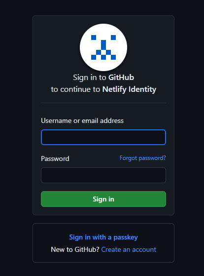
- Enter the verify code (Ask esh@anadeainc.com )

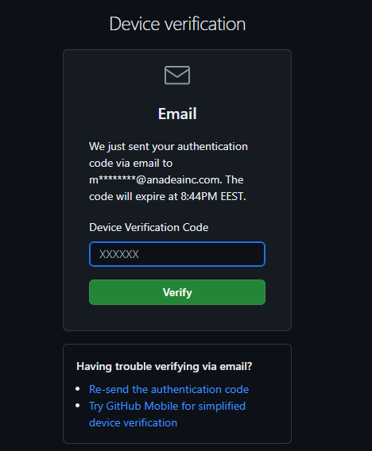

- Go to the [admin page](https://tubular-dasik-29e83a.netlify.app/admin)
- Click "Login with Netlify Identity"

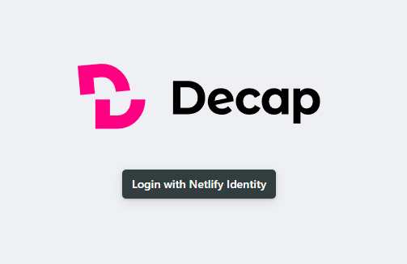
- Click "Continue with GitHub"

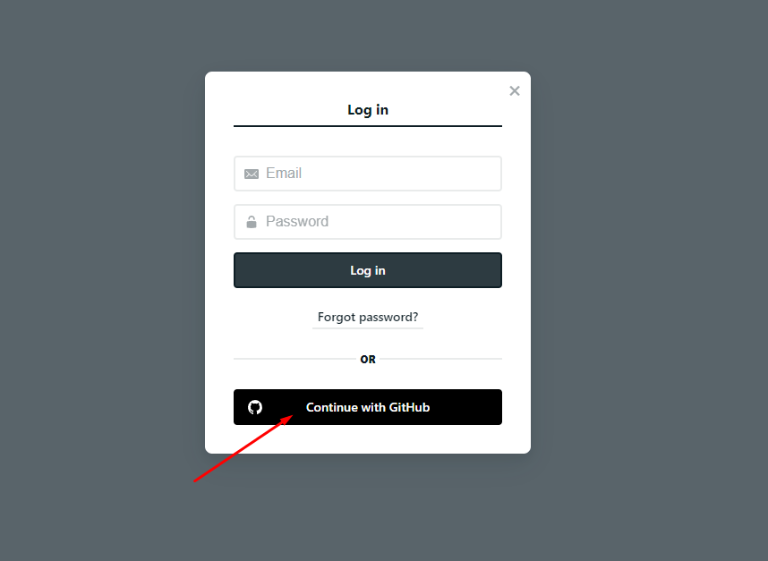

## Create new entries

- Click "New post"

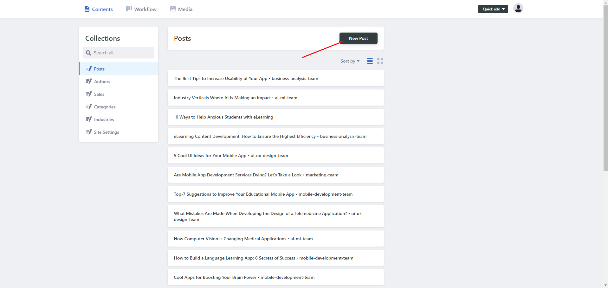

- Enter data in the left panel
- Data fields:
  - **Title**: Meta title of the page.
  - **Name**: Title displayed on the page. (Required)
  - **Breadcrumbs**: Text displayed in breadcrumbs.
  - **Slug**: Post slug.
  - **Draft**: Posts marked as draft will not be published on the blog.
  - **Publish** date: Post publication date.
  - **Image**: Post image on page.
  - **OG Image**:  Image in message for sharing.
  - **Description**: Short description for the post card.

  
  - **Promote post**: Add a post to the list of posts from a third-party resource.
  - **Top**: Add the post to the list of top posts displayed on the home page.
  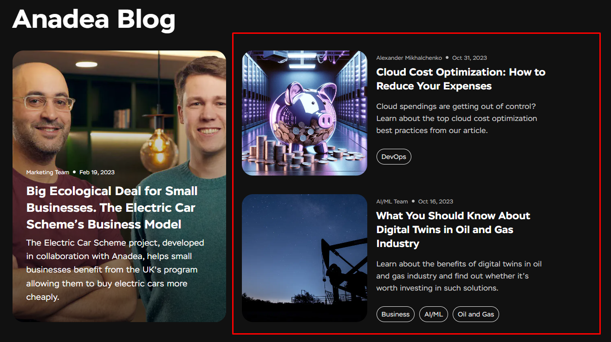
  - **Authors, categories, industries**: Data from other collections.
  - **Body**: Main blog content. You can switch between two text formats: rich text and markdown.
    - ToC is built on the basis of H2 tags in the post markdown.
    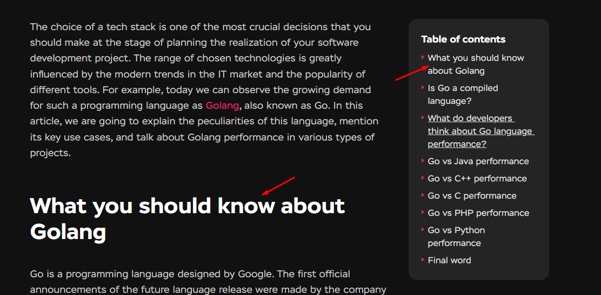
  - **Questionary**: Adds a block with a questionary to the page.
  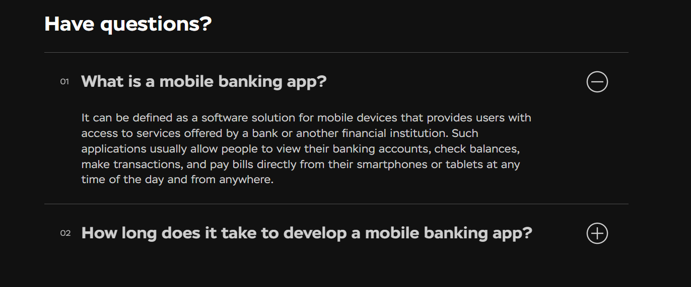
- We have the ability to add custom shortcodes to the body of the post.
  - In the rich text editor, you need to click on + and select the desired one from the list.
  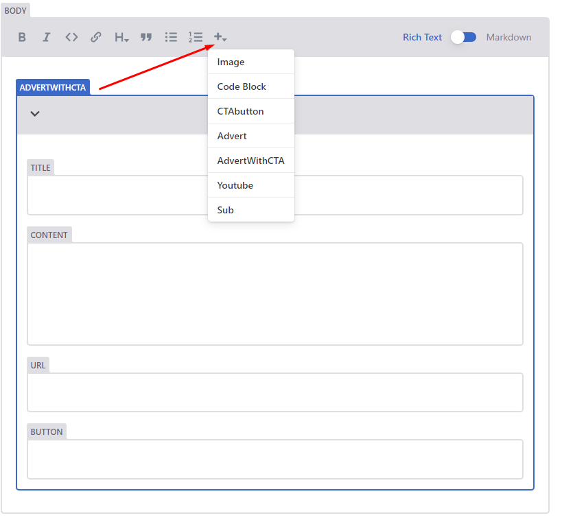
  - The markdown editor uses snippets. Page with examples of all shortcodes [here](https://tubular-dasik-29e83a.netlify.app/admin/shortcodes/) or click "Shortcodes preview" button.
  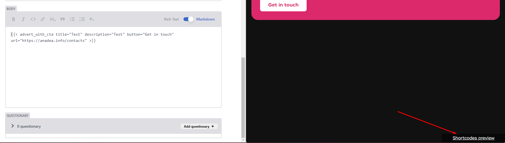
- When we have finished filling the post with content, we need to click on the "Save" button.
- To publish a post, you need to change the status to "Ready" and click "Publish now"
  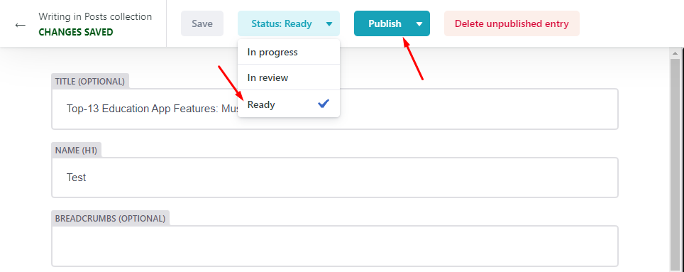
- After publication, the post will appear on the site after 30-60 seconds.

- In addition to posts, we can also create: authors, sales, categories, industries.
  - You can add sales to the industry
    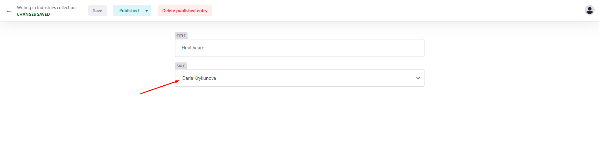
  - This is necessary to display the correct sales with a specific industry in the “keep in touch” block.
    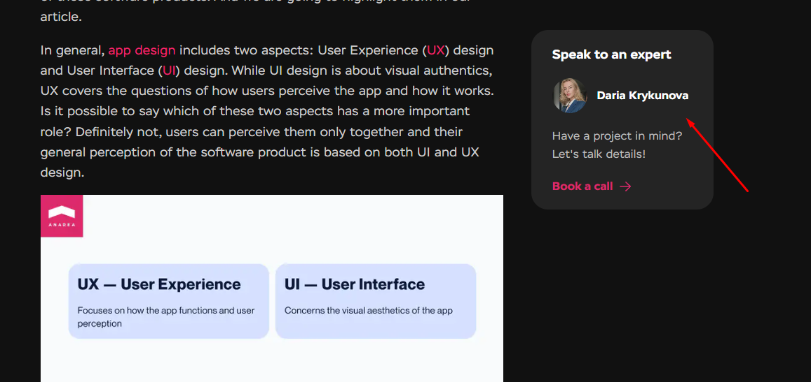
  
- You can create an author as a team.
  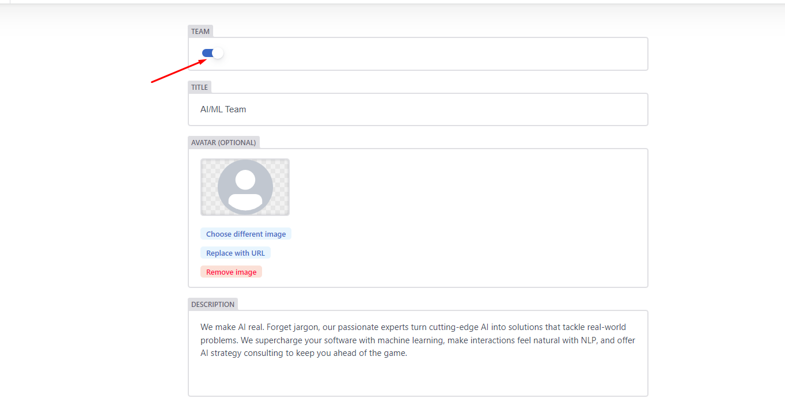

- The "Read next" block displays the next post by creation date.
  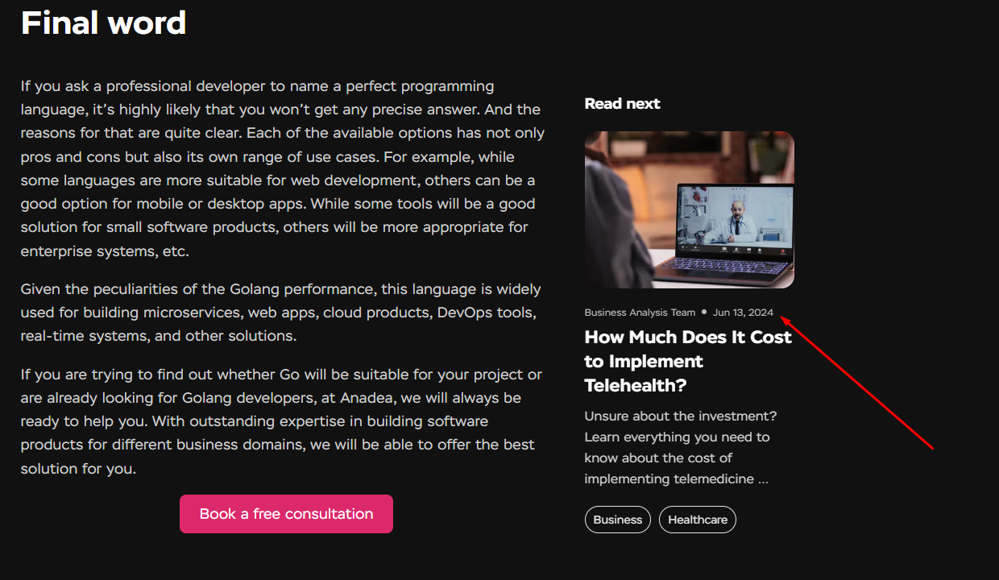

- In the "Keep reading" block, posts are displayed with the same taxonomy
  

- **Important!** If you change the title of existing authors, categories, industries, sales, its slug will not change.
- **Сolor marking**:
  

## Site settings
- On the "Hugo Params" tab we can manage site indexing
  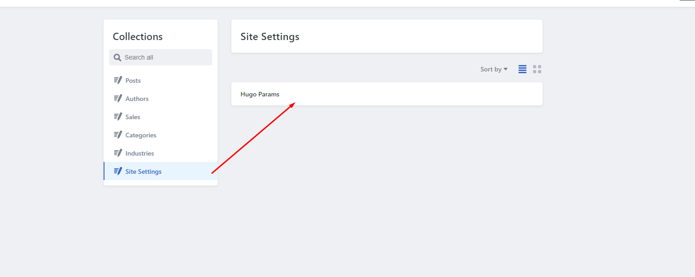
  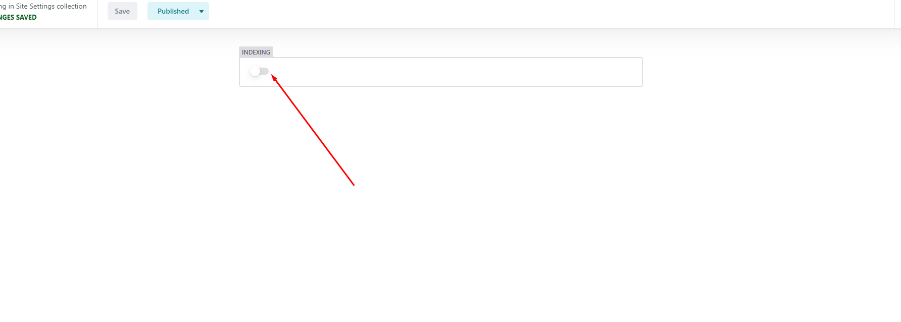

## Search
- It is possible to search on collections.
- On the main page, click on the search field and select a collection.
  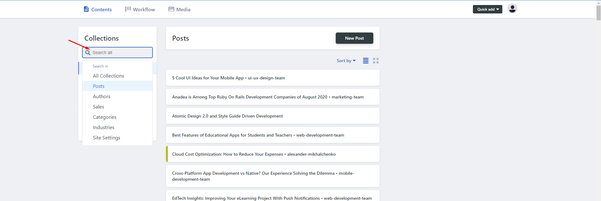
- Enter your request in the field and press the "Enter" button
- After which we see the search result.
  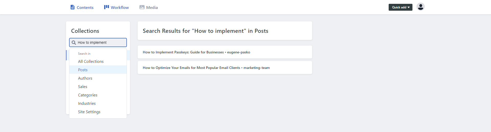

## Workflow
- On the Workflow tab, you can track the status of created posts. In total we have 3 statuses: In progress, In review, Ready
  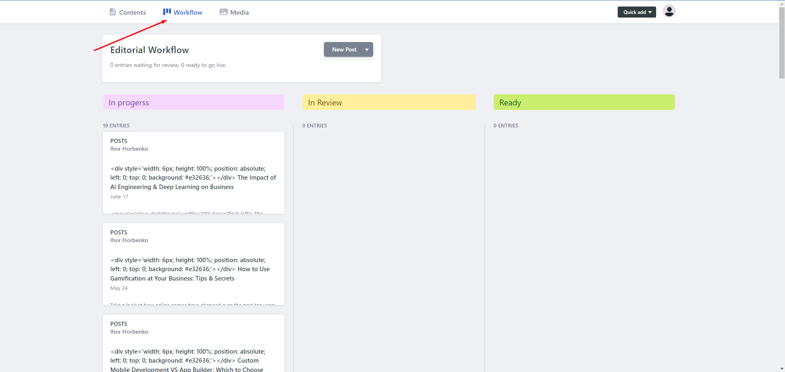
- It is possible to control the process of publishing posts.
- You can move post cards by changing their status.
  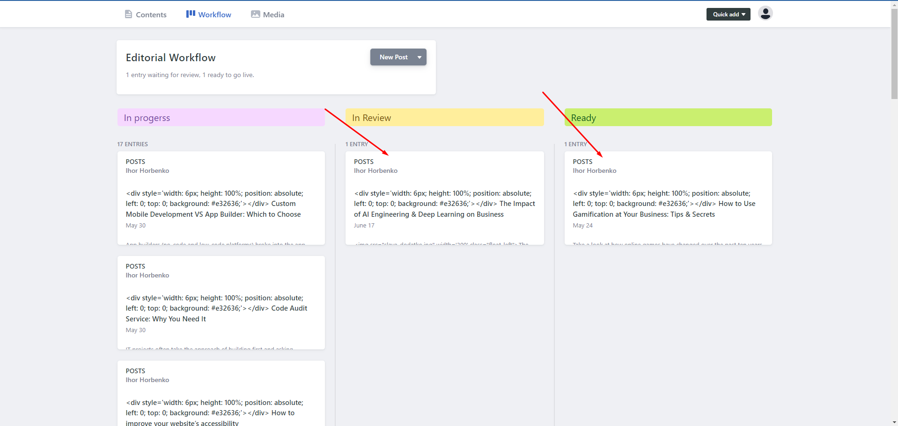
- Posts that are in read status can be published.
  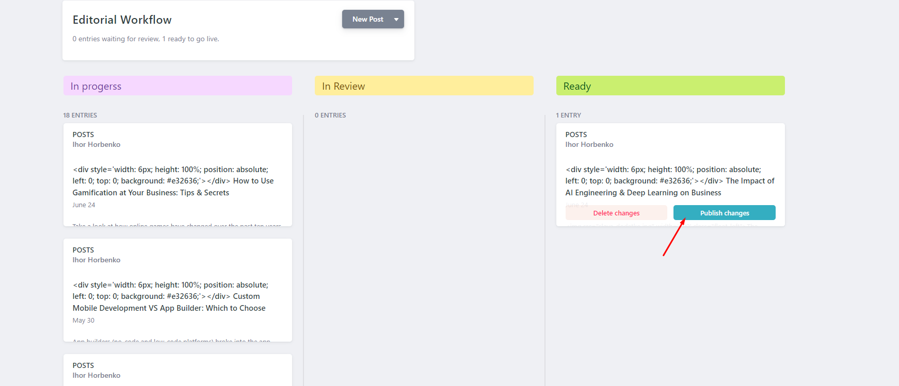
## Media
- The Media tab allows you to download images for later use.
  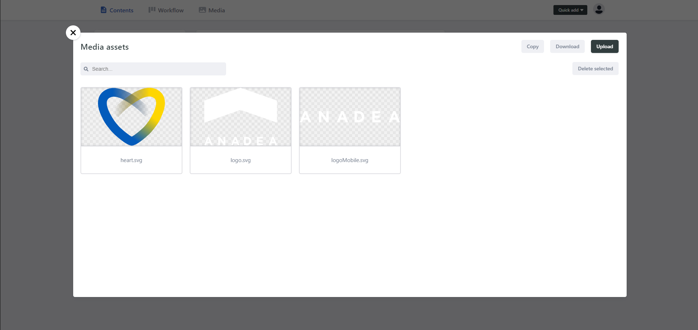