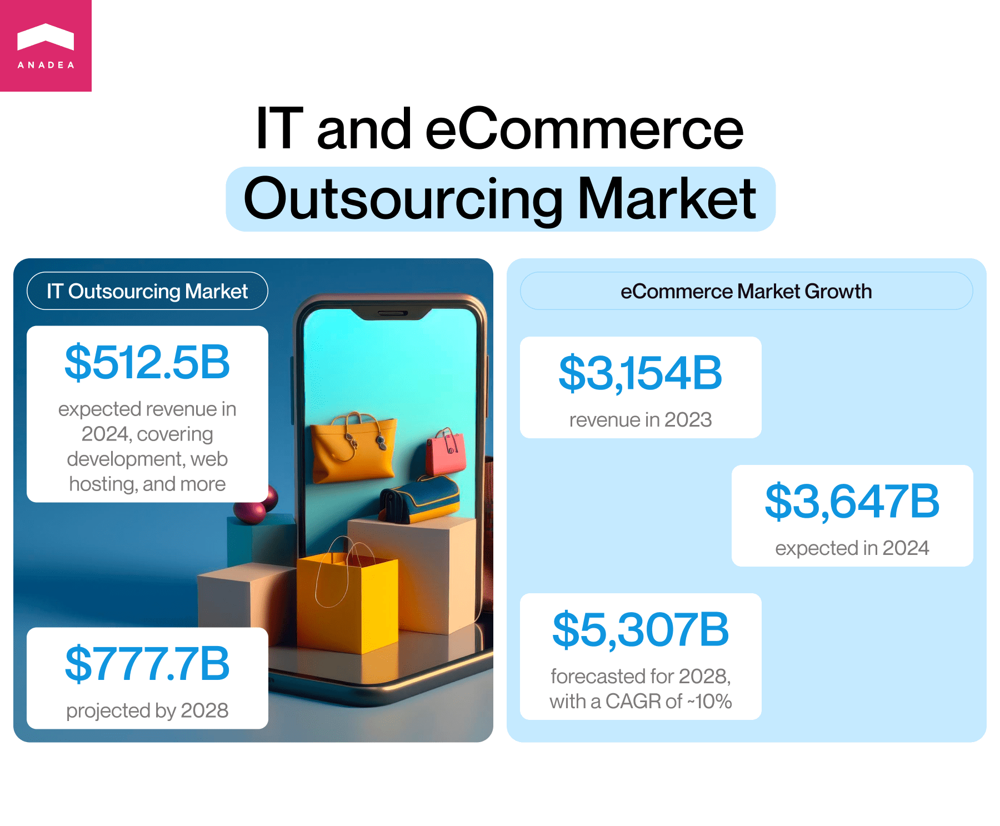
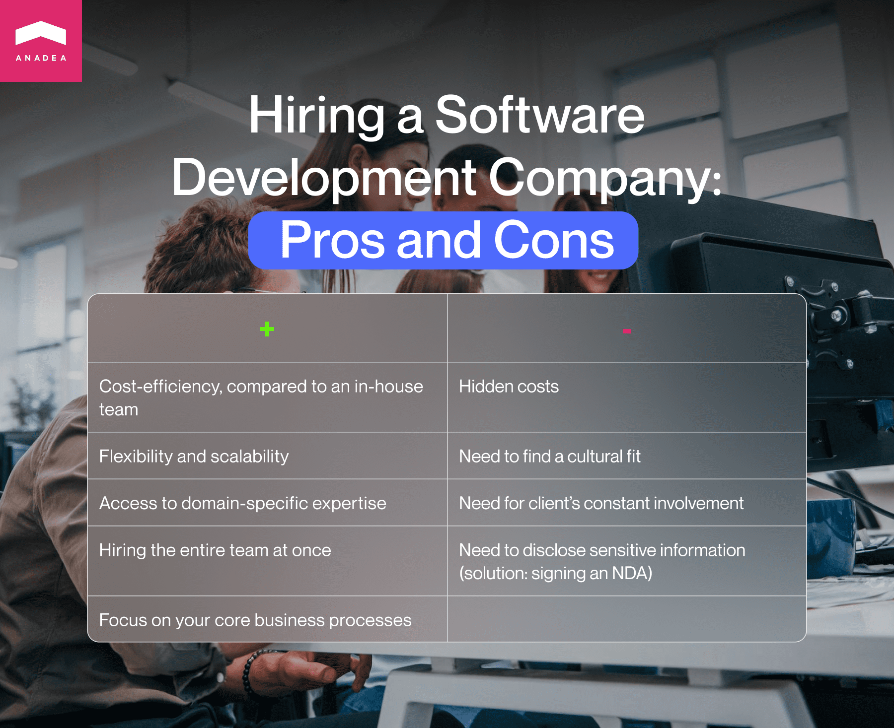
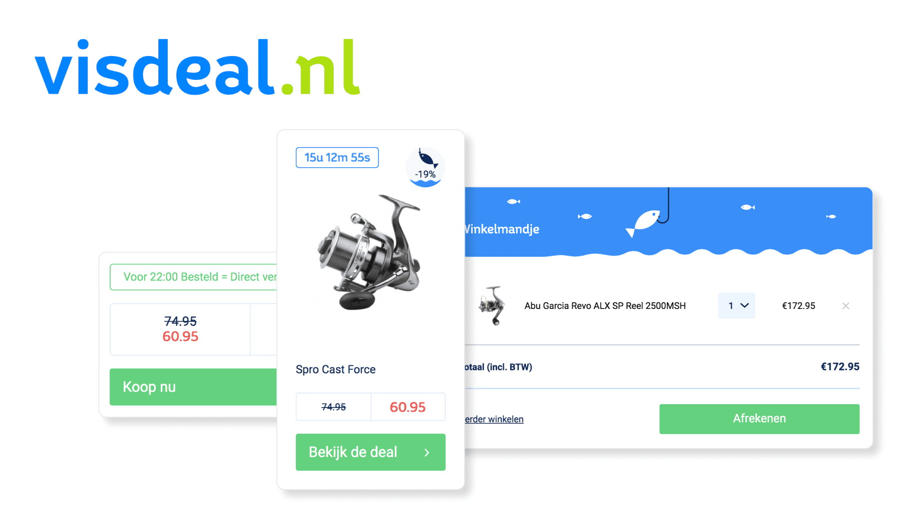

Today the eCommerce industry is actively expanding. And there are no signs that may indicate that is going to start losing momentum any time soon. The revenue of the eCommerce market was over $3,154 billion in 2023 and in 2024, it is expected to be around $3,647 billion. Though these figures already seem to be rather impressive, analysts have even more positive forecasts for 2028, when the revenue of the indicated market will reach the mark of $5,307 billion. It means that the CAGR for this period will be close to 10%. And given such sentiments in the industry, it is not surprising that the number of [eCommerce projects](https://anadea.info/blog/outsourcing-e-commerce-website-development#:~:text=the%20number%20of-,eCommerce%20projects,-is%20growing%20as) is growing as well which boosts the demand for eCommerce outsourcing services.

In this blog post, we are going to talk about the reasons behind the popularity of outsourcing eCommerce website development and the key peculiarities of this approach to project realization.

## What is eCommerce outsourcing?

Ecommerce full outsourcing presupposes hiring an external provider to deal with all tasks related to creating, managing, and running an online store. These projects typically include such tasks as website development, product sourcing, customer service, etc. However, very often businesses rely on an eCommerce outsourcing company only in tech aspects. In other words, in such cases, a service provider is responsible for building, maintaining, and updating an outsourced eCommerce solution.

In the IT industry, outsourcing is quite a popular approach to building, supporting, and modernizing solutions as the option to create an in-house development team is not feasible for many companies. In 2024, the revenue in the IT outsourcing market (including not only development services but also web hosting, administration outsourcing and other related tasks) is expected to be at the level of around $512.5 billion. According to forecasts, by 2028, it will reach $777.7 billion.

But what are the main drivers for this market in general, and the outsourced eCommerce projects in particular?

## Benefits of outsourcing eCommerce web development

To understand why so many companies worldwide are ready to invest in eCommerce outsourcing it will be helpful to analyze the new opportunities that such services can bring to them.

### Cost-efficiency

ith smart planning, companies can greatly reduce their expenses on software development when they turn to a professional eCommerce outsourcing company like Anadea. While working with a vendor, you need to pay only for the provided service. But in the case of hiring in-house developers, you will have a lot of additional administrative expenses.

### Flexibility and scalability

Modern outsourcing models allow businesses to introduce changes in the composition of their project teams even after the beginning of the project realization. You can always ask a service provider to expand your team or reduce the number of team members when there is such a need. In the case of in-house hiring, such tasks are much more time-consuming. Moreover, they are often associated with additional expenses.

### Access to domain-specific expertise

For your outsourced eCommerce project, you can find a team that has rich experience and deep knowledge in the chosen business domain. Thanks to access to the global labor market, you also have the possibility of hiring experts even with the rarest skills, if they are required for your project.

### Hiring the entire team at once

It is very convenient that you can just turn to an eCommerce outsourcing service provider with a list of your requirements and get a perfect composition of the team that will be working on your solution.

### Focus on your core business processes

While your outsourcing eCommerce team will be building your solution, you can allocate more time to addressing the issues related to your core business activities.

<button>Tell us about your idea</button>

In general, all the mentioned benefits are united by a common idea. All of them ensure the required convenience for businesses. But speaking about outsourcing eCommerce projects, we also should mention its **possible drawbacks**.

## Possible risks related to outsourcing eCommerce solution development

Based on our experience, we see that quite often customers come to us with a row of fears. However, we can't say that their fears are groundless. Mainly, such concerns appear as a result of cooperation with unscrupulous vendors who decided to get quick money instead of building a well-established reputation that will guarantee stability and financial prosperity in the long term.

So, what are the possible issues that companies can face today?

### Hidden costs

As we have stated above, the possibility of reducing costs is one of the benefits of eCommerce outsourcing. But at the same time, there is a risk of unforeseen expenses that may be a result of miscommunication. It can happen that your service provider will understand your requirements in the wrong way and the introduction of adjustments will lead to additional costs. Moreover, similar unpleasant surprises may appear in those cases when financial terms haven't been properly discussed at the very beginning.

To mitigate this risk, we recommend you talk to your eCommerce outsourcing service provider about all the requirements, scope, and expectations in advance and then regularly monitor the process of the project realization. Transparency is the main condition for eliminating any possible hidden costs.

### Need to find a cultural fit

As the eCommerce outsourcing model presupposes that you can work with a development team from any corner of the world, the mother tongue of programmers will likely differ from yours, as well as the time zone where they are based. However, reliable software development companies try to hire developers not only with excellent tech skills but also with a good command of English. What's more, they are often very flexible and can shift their schedules to have the possibility of communicating with you in real time. To minimize any issues of this kind, it is always necessary to discuss such things with the chosen software development partner before signing a contract.

### Need for client's constant involvement

Poor timing and overall poorly managed projects are frequent issues with outsourced teams. However, in most cases, the client's constant involvement doesn't allow this to happen. It is always difficult to predict whether you won't face timing issues if you have never worked with the chosen team before. However, you can at least study the reviews written by the company's customers in order to find out what areas for improvement they have indicated.

### Need to disclose sensitive information

Data-related concerns are quite common when it comes to software development outsourcing as in this case, you will need to provide external specialists with sensitive information. However, a signed NDA in combination with robust data security measures taken by the company that you work with, will help to avoid data breaches and unauthorized access to it.

## eCommerce web development services: What do they usually include?

The set of services that you can get at an eCommerce outsourcing company is usually rather wide. But it doesn't mean that you can't opt only for some of them. Everything should depend on the needs of your project and the scope of work that you can do with the help of your in-house team.

Traditionally eCommerce web development services include

* Custom software development;
* UI/UX design;
* Cloud migration services;
* Modernization services;
* Custom feature development;
* Payment system/CRM/ERP integration;
* Tech support and maintenance, etc.

On our website, you can read about one of the eCommerce projects that our team worked on. It was the creation of a specialized eCommerce store for people who like fishing and spending time in nature - Visdeal. As it originated from an already existing project, the main challenge was to develop a new solution while making sure that the first project would continue functioning. That's why our work included not only custom development but also scaling and modernization of an existing solution. For more details on this project, please <a href="https://anadea.info/projects/visdeal" target="_blank">follow the link</a>.

Such an example demonstrates that quite often eCommerce web development may go much beyond the creation of a new platform from scratch.

<a href="https://anadea.info/contacts">Build my project</a>

## Models of outsourced eCommerce development

It is possible to define three key models of outsourced eCommerce software development services. The choice should depend on your ongoing business needs and goals.

## Freelancers or eCommerce outsourcing company?

Let's be honest, today there are a lot of prejudices against freelancers that make a lot of managers think that they should avoid cooperation with such specialists. But is it really so?

### Pros of working with freelancers
#### Access to global talent
Engaging freelancers provides access to a broad and diverse talent pool across the globe. This access enables organizations to find highly specialized skills and niche expertise that may not be readily available in their local labor markets.

#### Quick hiring
The streamlined and flexible process of hiring freelancers reduces the time and administrative overhead typically associated with the traditional employment hiring process. This efficiency facilitates rapid project initiation and allows businesses to respond swiftly to market demands or project needs.

#### Lower costs
Opting to work with freelancers can lead to substantial savings on operational costs for businesses. This model eliminates the financial burden of continuous salaries, health benefits, and other related expenses that are typically required for full-time employees.

