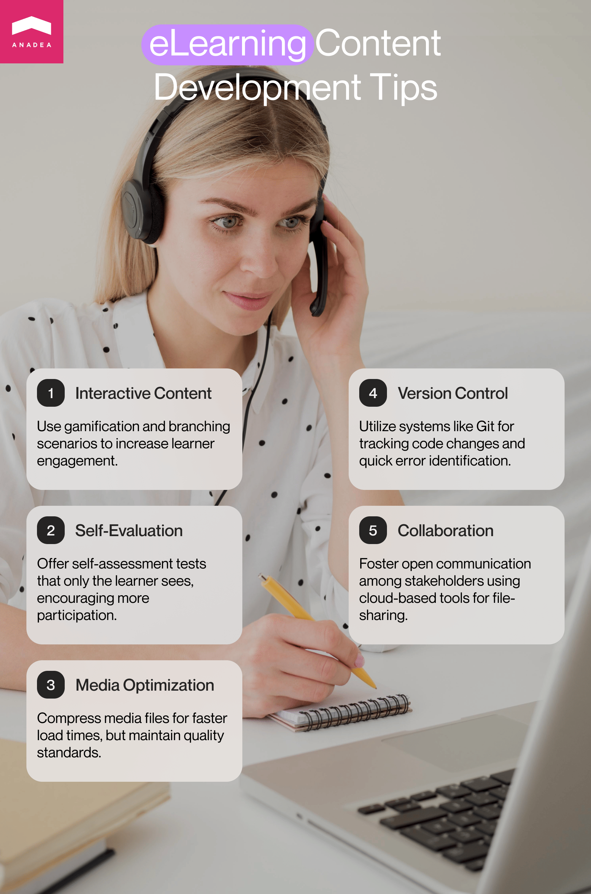

When you are planning to build an eLearning solution, its tech part is crucial but you shouldn't concentrate only on this aspect. The content also matters (and in some cases can be even more important than some advanced features that can be built to enrich your solution). On our blog, you can find a lot of useful tips on how to create software solutions of various types, including [eLearning websites](https://anadea.info/blog/e-learning-website-development-tips). But in this article, we'd like to have a look at building edtech products from another perspective and explain the peculiarities of the eLearning course development process.

## Why does eLearning content development matter?

Never judge a book by its cover. We all have definitely heard this saying many times. But of course, we still do it. Quite often we make a decision to start reading a book only because it looks attractive.

However, a nice cover has never convinced anybody to continue reading if the plot is boring or stupid. The same principle works with learning (and eLearning) courses. If your website or mobile app has a fantastic design, it will attract the attention of learners and make the interaction with it very pleasant but without excellent content and a well-thought-out program, your project will fail.

The eLearning market received a strong boost amid the coronavirus pandemic and since then, it has been actively expanding. It is [expected](https://www.statista.com/outlook/dmo/eservices/online-education/online-learning-platforms/worldwide) that the revenue in the online learning platforms market will achieve the level of over $57 billion in 2023 and by 2027, it may reach $65 billion. As for users of online learning products, their number is also increasing. In 2023, the user penetration rate is around 9.6% worldwide and by 2027, it is projected to be 11.6%.

The demand for eLearning is growing not only in the sphere of school or university education but also in the sector of corporate training. According to the [results](https://www.prosperityforamerica.org/elearning-statistics/) of studies and surveys, eLearning helps companies save up to 45% of the time that was traditionally required for in-person corporate learning.

All the mentioned figures demonstrate that there is a stable demand for eLearning courses which can be excellent information for you if you are planning to offer your own solution and are going to start education content development. However, the market activity that can be observed today also shows that the competition is already rather tough (and can get even tougher in the near future). Nevertheless, it shouldn't discourage you. Vice versa it's a good motivator to get better prepared for the e-Learning development process and deliver a high-quality platform with outstanding courses.

## Step 1 of the eLearning course development process: Planning

Every project should start with a planning stage which will include gathering market information and defining the ways you will address the existing issue with your solution. When you have a project devoted to eLearning content development, you also can't skip this step. While studying the industry landscape and the needs of the sector your course will be intended for, you will be able to adjust your content to the ongoing learners' requirements which will greatly increase the value of your materials (and your online learning platform in general) for users.

What should you do at this step?

- **Define your target audience.** The first question that you need to answer is "Who will study the materials provided in my course?". In other words, you will need to clearly understand who are the people who will be potentially interested in learning the provided materials and what goals they will have when they turn to your course. Depending on the target audience, you will choose the approach to composing the materials and building a learning path. Let's admit that a course for school children will seriously differ from the material prepared for corporate learners.

- **Set goals.** You should set goals for the training content development process. It is necessary to identify what result you want to achieve at the end. For example, it can be a full-scale training program for the company's newcomers or a learning program for teenagers who want to boost their Spanish skills up to the B1 level. After setting goals and objectives, you will be able to define what exact tasks your eLearning content development will include.

- **Determine the project scope.** When you know what you want to get as a result, you can estimate what you need to have and do to achieve the set goals. It means that you will be able to estimate the volume of work to be done and the required resources.

- **Estimate budget and set timelines.** It is important to understand in advance how much money you will need to invest in education content development and how much time will be required. It is vital to set realistic figures and deadlines in order to avoid unpleasant situations such as budget overruns or project delays.

- **Assign roles and tasks.** As a rule, when you are creating an eLearning course, you need the help of your team as it is practically impossible to perform all the tasks fully on your own. Your team should include people who will be responsible for text content, visual elements, instructional design, project management, etc. For delivering high-quality content, it is also important to find excellent subject matter experts.

- **Choose communication channels for the team**. It is crucial to establish efficient communication and data exchange between all the team members, even if all of them work remotely. As a rule, remote teams use such apps as Skype or Slack for their communication. For conducting daily meetings, you can rely on Zoom or Google Meet, and for task management, we recommend you consider such platforms as Asana or Trello.

## Step 2: Design

When you accomplish planning, you can proceed to more creative work and, namely, instructional design. What is it? This term can be explained as the process of creating learning materials and experiences that will directly address the needs of learners and help them to fill in their knowledge gaps. To make your course valuable for learners, it is vital to focus on this process.

Instructional design best practices:

- Concentrate on users' goals;
- Explain to learners the objectives of your course;
- Offer guidelines;
- Create engaging formats of learning;
- Support interaction;
- Ensure simple navigation;
- Include various formats of learning materials;
- Add visual elements;
- Assess performance;
- Provide feedback;
- Reward good results.

Quite often when you create edtech solutions you need to deal with eLearning content development for adults. The way adults learn new information seriously differs from the way that children do it. And that's the core idea of adult learning theory. The theory is rooted in andragogy which is opposed to pedagogy.

To stay motivated, adult learners should clearly see how they can apply the gained knowledge in real life. People should realize the precise goals of their learning process and see that the received information can be helpful in problem-solving. While creating your learning course, you need to take these tips into account:

- Concentrate on real-life goals;
- Provide users with practical tasks that can allow them to use new knowledge;
- Demonstrate real-life examples;
- Let users get the information on their own from real cases;
- Evaluate learners' knowledge on a regular basis (people should see their progress).

There is one more important point to think about at this stage. It is a necessity to choose the most appropriate eLearning delivery method. Let us focus on two that are the most widely used today.

- **SCORM** (Shareable Content Object Reference Model) is an eLearning standard that provides a framework for developing, delivering, and monitoring the performance of eLearning content. This model presupposes that the created learning materials can be fully functional on various [LMSs](https://anadea.info/blog/how-to-build-your-own-lms) (learning management systems). In other words, those projects that rely on this model have the key aim of ensuring smooth integration of eLearning content into various LMSs.

- **xAPI** (Experience API) is another popular eLearning standard that allows companies that stand behind eLearning courses to collect and track data related to users' interactions with the provided materials, their achievements, and progress. It is important that in this case, you can get information about user experiences from different devices and platforms. This model provides you with deep insights into user needs and enables you to make the learning process more flexible and personalized.

On one hand, it may seem that given today's requirements in the eLearning industry, xAPI is a much more beneficial option than traditional SCORM. On the other hand, you also should bear in mind some challenges and limitations related to its usage. First of all, its implementation can be rather complex and may require additional expertise and resources. Secondly, not all learning management systems can support it. And thirdly, to start using a solution powered by this eLearning standard, learners, and administrators may need some time to familiarize themselves with it.

## Step 3: Education content development

Now, when all the preparatory work is done, it's time to proceed to the content development. And to begin with, it is necessary to choose the authoring tools or platforms that you will use. Let us share just a couple of variants with you.

- **Articulate Storyline.** It is one of the popular options among creators of interactive eLearning content. The offered tools are rather simple to use which helps to reduce the time that is typically needed for the creation of videos and simulations. Users praise this set of tools for mobile compatibility, compatibility with different learning management systems, and support of SCORM standards and xAPI development.

- **Adobe Captivate.** With this software, you can create responsive courses, an eLearning virtual reality, and interactive videos. Thanks to this tool, everyone can deliver fully responsive eLearning content, even if he or she doesn't have any coding skills. Adobe Captivate has all the required functionality not only for rapid content creation but also for quick formatting.

- **iSpring Suite.** It is an all-in-one software solution for creating learning content of different types. No design or programming skills are required from users. The suite offers a full authoring toolkit and a rich content library that includes not only icons or characters but also course templates. This solution also ensures very comfortable conditions for collaboration and teamwork via iSpring Space.

### Practical tips for eLearning content development

1. **Offer immersive and interactive content.** It may be absolutely boring just to read articles with a view of memorizing some information. To do that, learners do not need to have any software solutions. However, eLearning provides us with the possibility to leverage the advantages of modern technologies. That's why you can enrich your course with various **gamification** elements that have a positive impact on learner engagement. Various quizzes, bonuses, rewards, leadership boards, and the spirit of competition can become excellent motivators to study more and to demonstrate better results.  Another option to boost engagement is to introduce a **branching scenario** which is known to be a highly interactive model. It enables a user to deal with the learning module, make decisions on the path that will be taken, and see the effect of the decisions.  It will be always a good idea to provide users with the possibility to pass **self-evaluation tests**. From school times, various tests that could be checked and seen by teachers make people nervous but when learners know that only they will be able to view the results they are more eager to participate in such activities.

2. **Optimize the used media**. While building your eLearning course you should always bear in mind the importance of user experience. The interaction with your eLearning solution should be seamless and pleasant which means that you should also think about loading time and the general performance of your app. First of all, it is necessary to optimize the visual content that you are going to offer. Videos and images can be too heavy. In this case, we recommend you compress and optimize the files (but please, make sure that after the compression the quality still corresponds to the modern standards).

3. **Implement version control systems.** Version control solutions will allow you to monitor and manage all the changes introduced into the code of your software. Thanks to such systems as Git, Apache Subversion, or AzureDevOps Server, your team will be able to easily find the place where the mistake was made by comparing earlier versions of the code. As a result, you will be able to fix all the issues faster and avoid serious downtimes or failures in your system's functioning. In the e-Learning development process, such systems will also let you back up and restore previous versions of files, edit files, experiment, and then throw away your changes if the previous variant turns out to be more efficient.

4. **Support and manage collaborative development.** It is vital to build regular and result-oriented cooperation and communication between all the stakeholders and all the people involved in the eLearning course development process. All the participants should be allowed to express ideas, view the progress, and control the tasks that are assigned to them or can be assigned by them. To make it possible we recommend you use cloud-based tools and file-sharing systems.

## Step 4: Conduct eLearning content review

Every training content development process should include review cycles. Why are they needed? Four eyes see more than two. By conducting reviews and inviting new people to analyze your content, you will be able to make sure that the goals of your course are clear for learners and that the offered content is insufficient, correct, and presented in a logical form.

There are different types of reviews:

- **Peer review**. It is an assessment of the created eLearning content by experts in the relevant field. It means that in this case, the attention of reviewers is concentrated on the quality of the offered materials.

- **User experience review.** This procedure includes an in-depth analysis of your course by a UX expert with a special focus on enhancing user experiences.

Who can become a reviewer? It depends on the exact goals of your review cycle. As a rule, companies turn to experts in the chosen field (if you are building a language course, you can cooperate with linguists), specialists in software development and design, potential learners, and project stakeholders.

Tips for highly efficient review cycles:

- Define the nature and number of review cycles;
- Create a review checklist;
- Set realistic deadlines;
- Explain to reviewers how to share their feedback;
- Support reviewers during all the cycles.

When you receive feedback from reviewers, you will have a very important task to analyze it, evaluate its importance and correctness, and prepare changes based on it. After all the changes are incorporated, it's time for final quality assurance that will demonstrate whether your course is ready for launch.

## Step 5 of the eLearning development process: Launch and evaluation

When the content is ready and all the stakeholders are satisfied with the results, it's necessary to think about some tech aspects like a domain name, hosting, bandwidth, etc. Sometimes companies prefer to launch a pilot version of their websites first in order to gather the feedback of early users and to enhance the materials based on it.

The course is launched. What's next? How will potential learners find out that your course exists and is available for them? Here is when various marketing and promotional tools and strategies will be of great use. Of course, when the course is intended for the employees of one company, no promotion is required but if your course is targeted at a wide audience, the right marketing can be a challenge. What are the most widely applied strategies and tools?

- Context advertising;
- Cooperation with influencers;
- Advertising on various education portals;
- Social media promotion;
- Creation of a landing page.

To make sure that your advertising will bring the desired results, you need to take into account the peculiarities and interests of your target audience. As you can guess, it won't be the best idea to cooperate with a blogger who is popular among teenagers if you have an eLearning course intended for people 35+.

You also need to evaluate your course effectiveness. There are several ways to do it. For example, you can conduct surveys or just ask users to share their feedback via a special form. We also advise you to use different analytics tools that will help you understand how users interact with your product, how much time is spent in different sections and on different pages, and what content attracts the biggest attention.

Do your best to regularly analyze feedback from learners in order to see whether your course fully meets their expectations and helps to reach the set goals.

When the course is successfully being used, you still have to continue working on its improvements and regular updates. You can also add new topics and levels that can be helpful for those users who have already finished the first version of your educational program.

## Conclusion

As you can see, eLearning content development is an effort- and time-consuming process that requires specific knowledge and skills. It is important to allocate enough resources for planning and studying the expectations of your target audience. The main task for you will be to understand what knowledge gaps potential learners have and how you can help them reach their goals. By providing relevant, high-quality materials in the framework of your eLearning course you can not only retail your existing learners but also attract the attention of new ones.

If you need any assistance in building your custom eLearning software solutions and you are looking for a reliable partner, just contact us. At Anadea, we have rich expertise in building edtech products of different types and complexity and we will be able to deliver an app or website that will be fully tailored to your needs. Share your ideas with us to get project estimates!

Get a free quote
