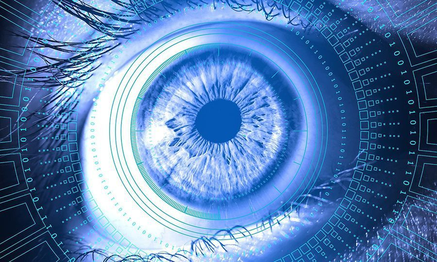

Computer Vision is an exciting field within Artificial Intelligence (AI) that can read scans, videos and images, then generate actionable information from them.

In the last few months, as Coronavirus (COVID-19) has swept the world, changing how we live and work, Computer Vision technology has taken on a new level of importance. Coronavirus has infected over a million around the world, so far killing over 40,000, according to daily updates from the World Health Organization (WHO).

It’s a deadly and highly transmissible virus. Consequently, lockdowns and quarantines are in-force across dozens of the most affected countries and regions. People are working from home, or furloughed, or even out of work as a result. Schools and educational establishments are closed. Travel is dramatically reduced. All non-essential businesses are closed, with social distancing actively encouraged and enforced.

## Impact on the healthcare sector

Healthcare services around the world are scrambling to look after patients and keep functioning. Everything that can be done to make detection, testing and tracing easier and more effective is being done.

Coronavirus is an unprecedented global pandemic. At this point, the aim is to reduce the spread, until a vaccine is developed and life can return to some kind of normal. We will overcome this. But it will take us working together, in healthcare, government, and business, in completely new ways.

The frontline of this fight is the healthcare sector. Some countries are handling detection of cases in different ways. In Wuhan, China, where the outbreak started, radiological AI solutions from a company known as Infervision, that were installed in 2015, are now part of the fight to detect this deadly virus, and therefore reduce the spread.

## Computer Vision as a Coronavirus detection solution

Infervision’s AI-powered Computer Vision devices are now being used in China to “detect possible coronavirus lesions in the CT scan, and to measure their volume, shape and density”, <a href="https://www.imveurope.com/news/ai-aids-doctors-assess-covid-19-ct-scans" target="_blank">according to several reports from Wuhan</a>.

With the AI power of the computer vision systems, a chest Computed tomography (CT) scan can be analyzed in 50 seconds. Quickly detecting whether or not a patient has COVID-19, depending on whether there are lesions on the lungs. As more CT images of lungs are fed into the AI-powered system, it’s becoming more accurate at detecting the relevant symptoms.
In another study, AI and Computer Vision technology is being used to create a deep learning model to differentiate Coronavirus from pneumonia and other lung diseases. Doctors and scientists collaborated across China, using it to identify cases in comparison to other chest problems that exhibit similar symptoms.

Beyond these immediate and valuable examples, Computer Vision in health industry was already making an impact across the healthcare sector. Let’s look at a few other ways this technology was already proving its worth in the medical world.

## 4 other examples of Computer Vision in healthcare

Before this virus emerged, there were already other applications of Computer Vision in the medical field and AI was proving useful in healthcare.

### 1. Medical imagery and precision medicine

Medical imagery was a long-established field in healthcare before Computer Vision became mainstream. Now with the integration of Computer Vision technology, it strengthens personalized medical plans, decision making, and care assistance. Computer vision projects in healthcare are numerous and varied in their applications.

Medical vision technology is already helping doctors, across a range of specialisms, with image annotation, image segmentation, multimodal image fusion, and other possibilities that didn't exist until recently. A wide range of specialist systems are being evaluated as part of FDA trials. Some that have already been approved are playing a role in the diagnosis of patients, supporting decision making and helping doctors create more accurate and effective treatment plans.

### 2. Medical startups using Computer Vision solutions

Many of the largest tech companies in the world have already got actively involved in this sector. Google, IBM, and other giants have; although where we are seeing the most exciting advancements are coming directly from startups developing niche solutions.

One custom Сomputer Vision development company, Zebra Medical Vision, has developed a Computer Vision solution to identify coronary calcium scores. Another firm, Artery, has developed something similar to detect the flow of blood through the body without an MRI. Bay Labs are using another solution based on the same principles to detect cardiovascular disease using ultrasounds.

It takes years of training for doctors and lab technicians to detect health conditions. Especially the rarer, more difficult to diagnose ones, which means mistakes can be made. Whereas, with a <a href="https://anadea.info/services/machine-learning-software-development" target="_blank">machine learning services</a> and cloud-based solutions, the number of images being analyzed in the system will increase accurate diagnosis.

### 3. Making healthcare applications more accessible

Continuous improvements in hardware and smartphones are making a scientific future more possible in the here and now. When it comes to Computer Vision technology, this means however images - either videos or pictures - are taken, they can be fed into <a href="https://anadea.info/blog/machine-learning-in-healthcare" target="_blank">AI and ML-powered systems</a> and used to diagnose diseases outside of a medical environment.

### 4. Detect diseases at an earlier stage

Another machine vision medical application for this technology is the detection of disease at earlier stages. With more data points, more images and videos being processed, it should make it easier for AI-powered systems to help doctors diagnose what is going on sooner. When diseases are identified at an earlier stage, outcomes improve for patients.

Medical professionals can introduce the right treatments at the right time. None of that is possible without the right technology backing-up the insights and training of medics.

Right now, Computer Vision is playing a role in the fight against Coronavirus. But in the last 5 or more years, it was already playing a key role in a wide range of medical environments.
