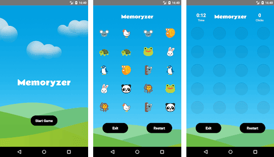
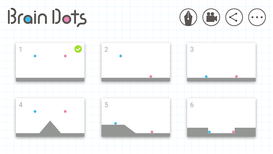
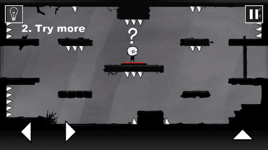

Are you aware that the speed of our brain depends on the number of active networks - axons connecting neurons that actively conduct nerve impulses? The brain works through a network of <a href="https://en.wikipedia.org/wiki/Human_brain" rel="nofollow" target="_blank">90 billion neurons</a>, which to date have not been fully understood by neuroscientists so that they can tell us with confidence how this relates to what is commonly called mind. If I try to explain by one sentence, then the more we train our brains with different exercises, the more different areas of the brain become involved, which leads to an increase in our mental abilities.

As they say, all's fair in love... and the same is true for improving your brain abilities. <a href="https://www.sciencedaily.com/releases/2014/06/140624092528.htm" rel="nofollow" target="_blank">Mind stimulating games</a> for smartphones are perfect for this purpose. Even good old-fashioned Snake game may do well for sharpening your mind.

I like apps that relate to the genre of "logical", and I have tried many of them. And still, I'm not tired of trying new ones. This article is not a rating, it simply lists the successful and worthwhile memory apps that I used, along with well-known sudoku, chess and math puzzles. And here we go.

## Memoryzer

Memoryzer is one of the mind strengthening games for training photographic memory. Its undoubted advantage is that it is implemented simply, and at the same time it is suitable for adults and children. At the beginning you see a set of various pets on a game board, after a few seconds they are hidden.

This small game will help you to improve the concentration ability it is required to find a pair for a little pet by memory. If the wrong pair is opened, then you need to remember the pictures of these cute pets and the places where they are located, so that you can then find them a pair. You can give this training any amount of time, you can do it whenever you want, and if you do it regularly the effect will surpass your wildest expectations.

## VOI

A simple but challenging game for your brain. It is all about negative and spaces. Two-color mode gives the game a uniqueness - white is black, and black is white. The goal is to create a certain figure on each level, the original of which is at the top of the screen. There is a set of diverse figures in front of you. It is necessary to impose them on each other, and in the area where the contact occurs, the color will change. And in this way you need to arrange all the figures to form the original picture.

At the moment, the game has about 88 levels. Of course, the higher the level, the more difficult it is to pass.

Try it: **<a href="https://itunes.apple.com/us/app/voi/id1110376793?mt=8" rel="nofollow" target="_blank">iOS</a>**

## Mekorama

There are lots of logical games in the Play Market, for players of all ages, as they say - for every taste and color. Mekorama in this regard will please everyone. The essence of this brain puzzle is to get a small robotic miracle from point A to point B. Well, as always, with obstacles. And it is not always possible to pass the level on the first try. Somewhere it is necessary to move the box and pass, somewhere to rotate the mill. Perhaps the most common element of each location is moving platforms. They will make you to burnish your brain in trying to rotate them correctly or move so that the "puzzle" is formed the way you need. In general, the levels are not the same. The graphics please the eye. There is nothing superfluous, just the design you need to move on, and the cute robot you need to control.

If you miraculously passed all 50 levels, then there is the build in QR scanner for downloading user levels from social media or the official game site. If you do not want to download custom maps, then you can create an unlimited number of your own levels. If you like puzzles for straining your brains, then this game is for you.

Try it: **<a href="https://itunes.apple.com/us/app/mekorama/id1079464948?mt=8" rel="nofollow" target="_blank">iOS</a>**

## Brain Dots

Brain Dots is an unusual puzzle game. All you have to do to complete the level is to push two balls of pink and blue color together. To do this, draw lines, circles, squiggles - everything you can think of just to beat the level. Balls obey the laws of physics and will act as they should. Your drawing turns into a physical object and well, that's where it starts… Passed 10 levels? Do not rush to say that it's easy. With the rise of the level, there are various obstacles that are sometimes quite problematic to bypass.

Gradually open markers, crayons and pens, which not only change the color of the lines, but also the width and weight. Another good thing is that you can understand how to pass the level, however, you will try to draw the correct line - sort of training fine motor skills. Time for Brain Dots flies imperceptibly.

Try it: **<a href="https://play.google.com/store/apps/details?id=jp.co.translimit.braindots" rel="nofollow" target="_blank">Android</a> | <a href="https://itunes.apple.com/us/app/brain-dots-draw-and-solve/id1004227662?mt=8" rel="nofollow" target="_blank">iOS</a>**

## That Level Again

I consider such games just a masterpiece. I have rarely met games which interact with the phone so closely. It's pretty simple. You are given the same level throughout the game in which you need to open the door. And the ways to complete each level will be totally different. In the left upper corner you see the name of the location, that is also a hint of how to pass the level. The only thing they have in common is that it is needed to pass from the left side of the screen to the right. And the rest, including even controlling is constantly changing. Sometimes you need to shake your smartphone, sometimes to press with a character the "Pause" button, and sometimes you need even to "die" to pass the level.

Try it: **<a href="https://play.google.com/store/apps/details?id=ru.iamtagir.game.android" rel="nofollow" target="_blank">Android</a> | <a href="https://itunes.apple.com/us/app/that-level-again/id1015720340?mt=8" rel="nofollow" target="_blank">iOS</a>**

## <a href="https://play.google.com/store/apps/details?id=com.wonder" rel="nofollow" target="_blank">Elevate</a>, <a href="https://play.google.com/store/apps/details?id=com.lumoslabs.lumosity" rel="nofollow" target="_blank">Lumosity</a>, <a href="https://play.google.com/store/apps/details?id=air.nn.mobile.app.main" rel="nofollow" target="_blank">Neuronation</a>

These brain training apps fall into one category as they are all somewhat similar. They include a set of small cognitive games to improve your skills: attention, perception, multitasking, problem-solving, logical thinking. All of these applications form a special training program based on user priorities and provide detailed statistics on the results. Apps have free and paid versions.

All these apps are free to download. Some of them also provide paid content. You can find them on App Store or Play Market. Of course, such apps to improve memory and to exercise your gray matter are unlikely to make you Einstein. However, this effective pocket method to support your brain in a tone should not be underestimated. Help the brain, and the brain will say thank you.
Happy brain training!
