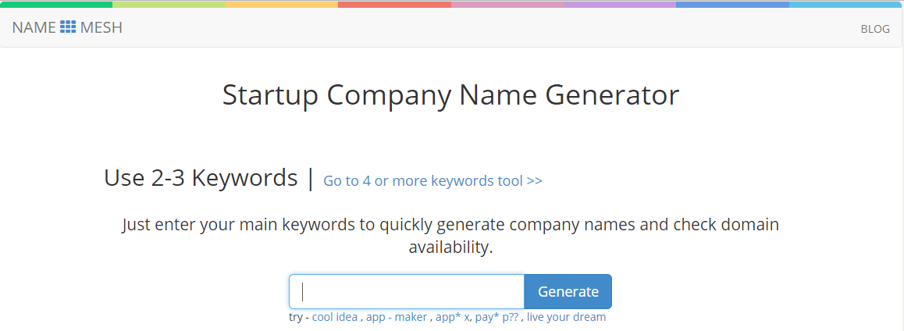

Choosing a business name is often a challenging and demanding process. It's not easy to find the name that perfectly aligns with the nature of your product, its concept and functionality. Ideally, your business name should be clear, imposing and easily associable with your app or service.

To help you spark creativity and come up with a great name for your business, we have developed a [free business name generator](https://businessnameguide.com/). Besides, as there are loads of other online naming tools, we explored them and selected the most interesting ones. But first, an important question must be addressed:

## Why use business name generators?

Business name generators can provide several benefits to entrepreneurs who are starting a new business. Here are just a few benefits:

1. __Save time and effort:__ Coming up with a business name can be time-consuming and challenging. A business name generator can help you generate multiple name options quickly and easily, saving you time and effort in the naming process.

2. __Provide creative inspiration:__ Business name generators use algorithms and AI to generate unique and creative names that you may not have thought of on your own. These names can provide inspiration and help you think outside the box.

3. __Generate domain name availability:__ Many business name generators also check for domain name availability, so you can see which names are available for your website and social media handles.

4. __Help with branding:__ A good business name is an important part of branding. A business name generator can provide names that align with your brand's values, goals, and personality.

Finally, here is our list of the best business name generators, with a summary of their strengths and weaknesses.

## Top best business name generators

### Wordlab's Business Name Generator

<a href="http://www.wordlab.com/name-generators/business-name-generator/" rel="nofollow" target="_blank">Wordlab</a> is a straightforward tool that generates random business names without organizing them by industry or giving you an option to input keywords related to your business. As a separate feature, it provides a domain name availability checker.

Even though this business names generator produces occasional word combinations like Tool Inc., Inkslinger Global or Amadeus Enterprises, it still deserves attention. In a random phrase you may accidentally find a word or exact name that you will love. However, be ready to dedicate quite a lot of time to finding a good name through this site - Wordlab may hit the mark in a few minutes or next month. The magic of random rules the game here.

### Anadea's Business Name Generator

This [business name generator](https://businessnameguide.com/) allows you to choose your industry and put as many keywords as you want into the search box. It adds words to what you have typed and generates business name ideas relevant to the selected category. Although it doesn't merge words into new names, there are more than enough features to find an awesome name for your business. Instead of trying to invent new words by shifting letters, the tool is aimed at creating an engaging and meaningful name.

The tool delivers a comprehensive list of business name suggestions. One more pleasant thing is that each name idea appears only once in the list and you will not see the same names again and again.

### BizNameWiz

From the very first glance, <a href="https://businessnamegenerator.com/" rel="nofollow" target="_blank">BizNameWiz</a> strikes the eye with a yellow bee & honey design and a suggestion to enter keywords (max. 2 words). This name generator creates a set of business naming options and tells you which domain names are available. You can switch between two views of search results: a detailed view that shows available domains and a view with name ideas only (200 words per page which is actually very handy). In addition, you can filter the search results to see popular, strange, cool, technical or corporate names.

The main disadvantage of this name maker is the limit of 2 words per request. It often generates search results without connecting these two words with each other, provides options for the first or second word but doesn't make longer names. Besides, it can simply swap the word order and list this as two different names.

### Dot-o-mator

A pretty simple <a href="https://www.dotomator.com/" rel="nofollow" target="_blank">name generator</a> with an intuitive interface. You can either type in your own words for "beginnings" and "endings" of the business name being generated or choose from two drop-down lists of words categorized by topic (e.g. games, tech, etc.). Dot-o-mator combines words and parts of words to make single-word naming options, generates a list of domain name suggestions and shows whether domains are available or taken.

The key benefit of this approach is a chance to find a unique word (a la Instagram) and one-of-a-kind business name. The drawbacks are the same as most of name generators have: everything depends on your luck and it doesn't creates long business names.

### NameMesh

<a href="https://www.namemesh.com/company-name-generator" rel="nofollow" target="_blank">NameMesh</a> can process up to 3 keywords. This business naming tool provides only company name ideas. Domain availability check is performed through third-party service GoDaddy (just like in other name generators listed above).

The website generates business names based on categories like:
 * Short,
 * Fun,
 * Synonyms.

You will certainly find some suitable names for your business here. However, the choice is quite limited - search results are displayed all on one page. It also happens that the same name appears in several categories.

### Names4Brands

<a href="http://www.names4brands.com/" rel="nofollow" target="_blank">Names4Brands</a> operates quite similar to Dot-o-mator but has some specific features. First of all, you can opt for different language combinations and create, let's say, Slovak-Chinese or Spanish-Swedish business names. The tool provides a translation into English from other languages and explains the meaning of exotic words. Secondly, you can choose the first letter for starting and ending words, set a limit to the length of each word. There is also an option to search for words or names, as well as a range of other naming tools, e.g. a random word generator and numerology calculator.

In this brand name generator, you can find something really fascinating, creative and elegant. Unfortunately you are not given an option to select your industry. You can only choose which word to use as a basis and, in any case, the ultimate result will consist of two words merged together. If you are looking for business names ideas like Audioslave or Sevendust, this tool will work well. But if your goal is something similar to Three Days Grace, Rage Against The Machine or Red Hot Chili Peppers, you'd better find another one.

### Panabee

An all-in-one <a href="http://www.panabee.com/" rel="nofollow" target="_blank">domain name generator</a>, developed by Chinese engineers. This business name creator and domain search tool allows you to put in any number of keywords (I tried it with 10 and even 15 words) and applies several patterns, including combining words, back-to-front writing and synonyms. Sadly, the longer strings of words you enter, the simpler naming algorithms are used. With long names, Panabee simply adds prefixes, suffixes, articles or throw away a couple of letters. The same is about creating a name from a single keyword - without merging words, the remaining methods are rather mean and may fail to offer many good ideas. E.g., it suggests the following naming options for "Witcher": iWitcher, WitcherApp, Witcherly, onWitcher, goWitcher, getWitcher, WitcherIt and stuff like this.

Another useful feature is that Panabee will search the App Store and Google Play to make sure that your app name is not already taken. If you want a long name it's worth to give it a try. Two or four keywords may return some cool name ideas.

## Conclusion

Hopefully, one of these business name generators will help you pick an excellent name for your company or app. Check out each of them to find the tool that best suits your needs and tastes. And follow these [tips for naming your business](https://anadea.info/blog/nomen-est-omen-how-to-choose-a-name-for-your-app) to make the right choice.
