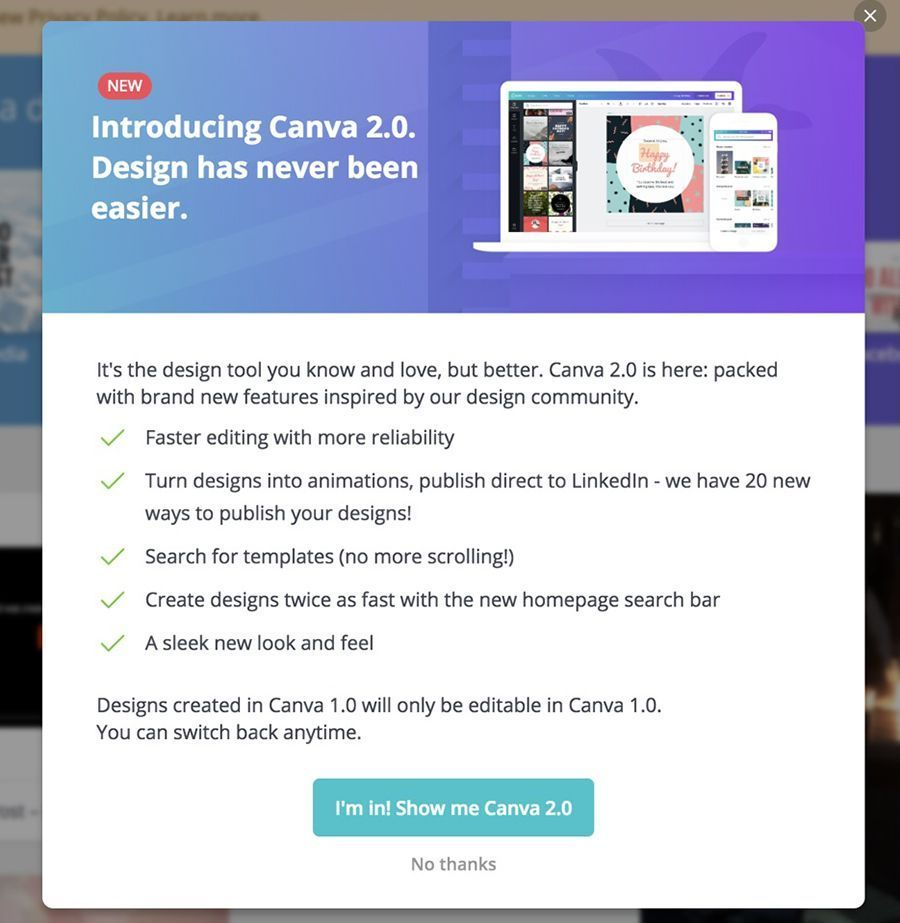
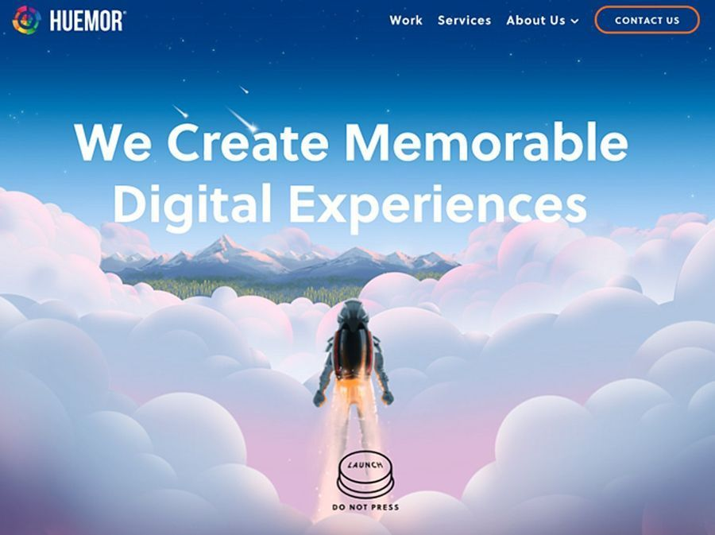

In the game of web design and online marketing where getting noticed by customers matter most, CTA buttons are one of the biggest players. Their role is very important - to subtly but effectively drive website users to do what you need them to do, whether that’s to <a href="https://www.webmastered.com/email-marketing-beginners-guide/#Newsletters" target="_blank">sign up for newsletters</a>, purchase products, fill out forms, and more.

Additionally, call-to-action buttons can also greatly help in increasing a website’s click-through-rate. So if you are looking for ways to strengthen your SEO, having well-thought and well-designed CTA buttons may be the thing to help your website get a higher click-through rate and appear more reputable to Google and other search engines.

An effective call-to-action button may be one of the differences between a good website and a great website. But for a CTA button to be effective, it has to appeal to the new gens of online audiences.

## Introducing the new generation audiences

While there are still Baby Boomers and Gen-Xs who are very much active online, web designers, marketers, and entrepreneurs are more concerned about appealing to younger generations - Millennials (born from 1980 to 1995) and Gen-Zs (born from 1996 -2016).

Some of the cultural trends that these two generations share include:

* Openness to conversations about gender, positive body image, mental health, and other similar issues that had been considered ‘sensitive’ by previous generations.
* A penchant for anything you can subscribe to - streaming services, music, beauty and skincare products, organic goods, snacks, you name it - if you can get it sent to you on a monthly basis, these generations will get it.
* FOMO (Fear of missing out) and the need to be in the know and in the now.
* Preference for social entrepreneurship and freedom in their careers.

These are just some of the things that marketers and <a href="https://www.seoreseller.com/blog/selling-web-design" target="_blank">web designers need to consider</a> when coming up with a web design that resonates with their present audience. Gone are the traditional websites of the past.

User psychology does affect and influence web design. And if you want to improve your conversions, you have to make sure that every element of your website performs well, including your CTA buttons.

## Recent CTA stats you should be aware of

* Personalized smart CTAs perform 202% better than generic or default ones. These especially work if you are targeting your audience by location. Check out the chart below.

Image source: <a href="https://blog.hubspot.com/marketing/personalized-calls-to-action-convert-better-data" rel="nofollow" target="_blank">HubSpot</a>

* <a href="https://unbounce.com/landing-pages/threats-to-your-conversion-rate/" target="_blank">90% of web visitors</a> who read your headline goes through your CTA copy as well. That said, if you want your audience to be enticed by your CTA button, you should also provide them with a meaty and inspiring copy that will guide them to the end where your CTA can do its work.

* Anchor text plays a huge part in boosting conversion rate as <a href="https://blog.hubspot.com/marketing/blog-anchor-text-call-to-action-study" target="_blank">47% to 93% of the leads</a> of a post come from anchor text calls-to-action.

* Keeping web design clean and the area around the CTAs clutter-free makes CTAs stand out. One site saw a <a href="https://vwo.com/blog/call-to-action-buttons-ultimate-guide/" target="_blank">232% conversion increase</a> after cleaning up its web design.

At this point, you already know that you are going to need to pay extra attention to your CTAs. To help you out, here are some tips that you can follow to make sure that your <a href="https://www.websiterating.com/online-marketing/retargeting-beginners-guide/" target="_blank">calls-to-action buttons deliver results</a>.

### Tip #1. Make use of power words

It is a no-brainer that you should opt for words that are a clear representation of what action you want your audience to make. While personalized CTA buttons work significantly better, there are also some “power” words that simply work. For instance, “Get Started” is an effective actionable phrase that can direct your visitors to move forward with using your service or product. Look at how Slack makes use of their “Get Started” CTA.

Other words you might want to consider are “Sign Up Free,” “Join Free,” “Download for Free,” and “Learn More”.

### Tip #2. Optimize “personality” to appeal to new generation audiences

While using the right color and making sure your web design is amazing are really important, so does your content. Remember that your CTAs are more like an exclamation point at the end of a stimulating statement. Do not forget who your audience is and speak to them with the voice and personality of someone they will not just listen to but relate to.

### Tip #3. Make sure there are visible CTA buttons for videos, social media links, and more

Many of your younger audiences prefer visual content - videos, photos, GIFs, emojis, and yes, memes. There’s a reason <a href="https://blog.sharelov.com/ultimate-list-of-youtube-statistics/" target="_blank">YouTube can boast 5 billion video views per day</a>. It’s, therefore, a smart move to provide a visible CTA button after your visual content.

### Tip #4. Ensure that your CTA buttons work across all devices

It’s just frustrating for web visitors or app users to click or tap on a CTA button that doesn’t work or lead to an error. You want your app to be <a href="https://anadea.info/blog/10-tips-to-improve-usability-of-your-app" target="_blank">100% usable</a>. If an element, especially something as important as a CTA button fails to work, that’s not going to reflect well on you. Additionally, you should <a href="https://redstagfulfillment.com/online-store-work-across-all-devices/" target="_blank">optimize for mobile and all other devices</a>. Consider the placement and color, as well as factors like white space and the “thumb zone” when deciding how and where to place your CTA button.

### Tip #5. Always go for a straightforward CTA

Gen-Zs and Millennials have shorter attention spans compared to older generations of audiences. That’s why when it comes to CTAs, there’s no beating around the bush. Be direct and clear or your audience will tap that ‘x’ button. Sweet, short, and striking with a sense of urgency - that’s what your CTA should be. It also wouldn’t hurt that you emphasize the lack of risk on your audience’s part, just like how Amazon Prime Video did it.

### Tip #6. Consult Google for keywords for your CTA buttons

While many of the keywords that can be used for CTA buttons are considered ‘classics’ for a reason, it wouldn’t hurt to get Google’s help, if only to ensure that you are still updated and that your CTA words are still on-trend and effective.

### Tip #7. Use FOMO to increase your conversions

Nothing strikes greater fear on your audience’s heart than the thought of missing out on anything, be it a good deal, a limited edition offering, exclusive membership, or some neat freebies. You might as well get something positive from your audience’s FOMO and add urgent (but not spammy) CTAs.

### Tip #8. Get inspiration from brands that have proven success with their CTAs

While there are websites with CTAs that don’t do anything much, there are those that nailed it. Here are some examples of excellent CTAs.

Netflix’ “TRY 30 DAYS FREE”

Netflix has a no-nonsense approach with its CTA button - it’s direct, reassuring, and oh so striking with their choice of the red button on a black background. With a CTA this strong, it’s no wonder their subscribers grew to millions!

Canva’s “I’m In! Show me Canva 2.0”

Anyone seeing this CTA used by Canva can probably hear their voice (and the excitement, too) as they read those words on the button. What really makes it work is not just the use of the pronouns “I” and “me” but also the detailed yet easy to digest copy that leads to the CTA button.

Spotify’s “GET SPOTIFY FREE”

You have probably seen this CTA since Spotify started and you might be thinking they hardly changed anything with their approach. The thing is, there’s no need to because it works. Seeing such an enticing CTA placed just in the right spot, you really can’t help but do get Spotify for free.

Trello’s “Sign Up - It’s Free!”

With the addition of those two magic words “It’s Free!”, Trello is able to instantly erase doubts in the minds of its prospective users. They no longer need to wonder whether they’d end up being charged for signing up. Plus, the simple yet striking design just works.

Huemor’s “LAUNCH (DO NOT PRESS)”

Playing to their audience’s curiosity and applying the concept of reverse psychology on their CTA worked to Huemor’s advantage. It’s brilliant because, honestly, who wouldn’t itch to hit that ‘launch’ button?

## Final thoughts

Do not make the mistake of dealing with your CTAs like an afterthought because they’re far too important not to be taken seriously. Like with the rest of <a href="https://anadea.info/services/web-and-ui-design" target="_blank">web design elements</a>, your CTA needs careful consideration. It should go well with the brand image and resonate with the audience. It should be compelling enough that they wouldn’t risk not hitting the button but also reassuring so they won’t feel like they’re taking a risk. A lot depends on those CTA buttons, and if you want to reap the rewards, dedicate time and effort in creating them, too.

Do you have any CTA design ideas you’d like to share? Tell us all about them!
