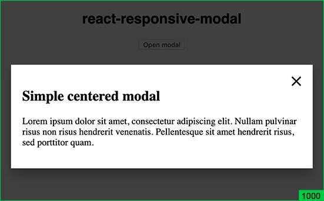
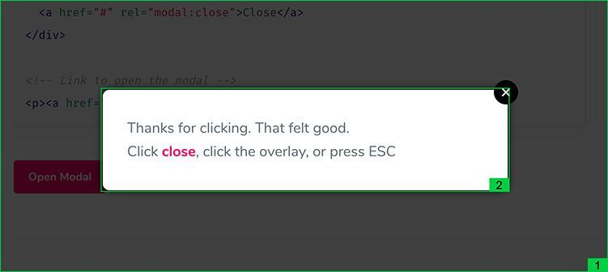
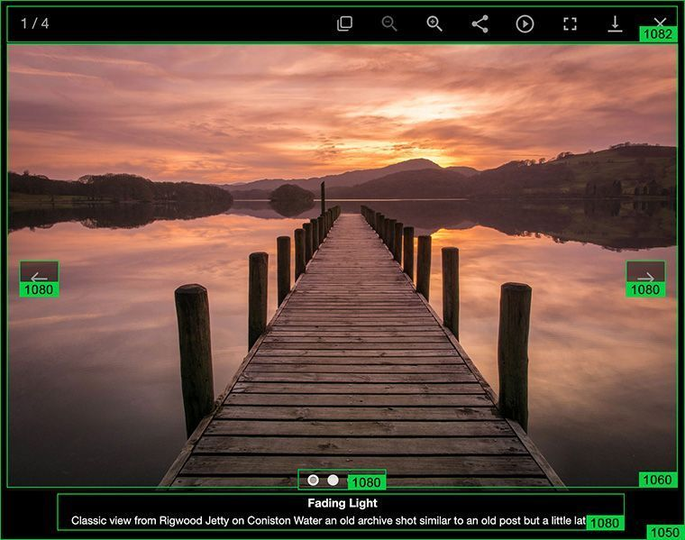

## What is z-index?

Z-index is a CSS property of an element that determines its position relative to other elements on the Z-axis. It applies only to elements with `absolute`, `fixed`, `sticky` or `relative` position (respectively, if the position property is not set to one of these values, adding z-index doesn’t affect the position of an element).

There is the common order of overlapping elements, when the next one overlaps the previous one according to parent-child nesting. However, with the help of z-index we can change it. This is so simple that many developers use it without even thinking about how important it is to structure z-indexes so that they do not spoil the project in the future.

### Example

Consider a standard project with jQuery. Just kidding, let it be a project with React. Generally, it doesn’t matter. Let’s assume we have a modal window, a gallery and flash messages.

Let’s start with the modal window. Choose a couple of libraries for modals, randomly, the first ones in the search results, assuming they are the most popular. And let’s see what z-indexes they set by default.

1. The <a href="https://www.npmjs.com/package/react-responsive-modal" target="_blank">react-responsive-modal</a> library provides one z-index: 1000 for the overlapping layer, the rest is "self" positioned inside:



2. The <a href="https://jquerymodal.com/" target="_blank">jQuery Modal</a> plugin sets the z-index: 1 for the background and z-index: 2 for the modal window:



As you can see from the example, there is no unified approach to determining z-indexes for modal windows. There is no single universal way to say that 1000 is the only true value for the Z-axis. Since 1 and 2 are definitely bad options, as we can have a slider on the page, animation, placeholder, which can also have a value of 1, 2 and even 3. And they will overlap modal windows.

Can we conclude that 1000 is a sufficient value for modals? Large enough to satisfy all our wants? Of course, when we use third-party libraries, we can easily redefine the properties according to our design. But how often do we change z-indexes? And which values should we set to them?

Let’s first add a gallery to our project. Take a standard, solid and loved by everyone [lightGallery](https://www.lightgalleryjs.com/){: target: '_blank' :}
and take a look at the z-indexes that it sets by default.

z-index: <br />
1050 - outer div overlap <br />
1060 - for a slide item <br />
1080 - left-right navigation buttons, captions and pagination <br />
1081 - overlay <br />
1082 - top navigation <br />
1083 - download progress bar



It looks a bit weird. Some values increase by tens, and some - by single digits. Yet the most important thing is that it starts at 1050. This means that it overlaps our modal window with z-index: 1000. Excellent!

It sounds cool. But what if we need to add a slide with a button that calls a modal to our gallery? This is not just an assumption, it was in a project I was working on. What value should the modal have? z-index: 1090 or 1100? May be we should set it to 2000 to prevent possible collisions?

Okay, now let’s add flash messages to the project. At this point you are starting to understand that you no longer control the z-indexes. It is they who impose their structure on you. You wander through various files with a gallery, modals, flash messages, animations in attempts to put all this mess in order. And each time you clench your fists and hope that no new issues pop up somewhere else. But the values like 1100, 10000, 10100 begin to appear…

## A homeopathic remedy


You still think you can control something when you have [Sass](https://sass-lang.com/). You define a variable for the common overlapping layer and the indoor unit in the file with modals:

```css
$modal-overlay: 1000;
$modal-under-overlay: $modal-overlay - 1;
$modal-content: $modal-overlay + 1;
```

Though this is treating symptoms, not the disease. It helps only for one coherent block - a modal window block. And does not reflect the attitude towards other modules.

It also represents a source of invasion by tens. What does it mean? To define another variable in another module, you need to add a margin of 10 or 20 to both sides from the `$modal-overlay` variable. You can clearly see this in the example with lightSlider. In their case, the mythical number 1050 comes from the assumption that 1000 is used for modals and, generally, as the largest number. A relative fluctuation within its range is 10-20 and they have indented 50 as an additional precaution. It totals to 1050.

As for me, it’s not the mythical nature of this number that scares me, as I know its origin - it’s large numbers. 100 is already a lot. I can’t imagine that there will be 100 instances of overlapping elements!

## My tiny silver bullet


I've found a solution for z-index handling which I use myself: to abstract all the z-indexes in a separate file as variables. It is similar to how you store basic colors, typographics, sizes. Why not do the same for z-indexes?

In total, my "_z-index.scss" file in one of the projects looks like this:

```css
$ zIndexSubzero: -1;
$ zIndexZero: 0;
$ zIndexMin: 1;
$ zIndexInputValue: 2;
$ zIndexInputAbove: 3;
$ zIndexFormCover: 4;
$ zIndexStickyTop: 5;
$ zIndexNavigation: 6;
$ zIndexInfoBar: 7;
$ zIndexPopupOverlay: 8;
$ zIndexPopup: 9;
$ zIndexConsentedCookie: 10;
```

Why it is convenient:

1. **Control.** All the z-index variables are in one file, so the hierarchy is clearly visible.
2. **Easy changes.** Need to position flash messages over modals? Just swap the related lines with keeping the ascending order of numbers from top to bottom.
3. **Transparency.** All z-indexes are stored here. There are no any local variables in other files.
4. **Short z-indexes.** No need to create values of 100s and 1000s. Everything fits within 10-20 depending on the project.
5. **Naming.** You can see from the name where each variable is used. The exceptions are the first three; they are general in nature and are usually applied to position an element relative to base element or 0.

## Conclusions

In fact, z-index is such a trifle that it may take some time to realize its true value. Only when the project increases in size and new layers of overlapping elements appear, you begin to think that something is wrong with them. It often happens that even this doesn’t become a reason for refactoring.

I came up with this system in a very large project, the one with the gallery, pop-ups, tooltips and flash messages. However, that time I retained the decimal grading for variables. Now I understand that it’s not necessary, single ones are sufficient. You do not need to leave loopholes to bypass this system, you just need to know how to use it.

In the current project, everything works perfectly :) The example above confirms this. And every time I look at this file I feel satisfied, because I see what a huge headache with z-indexes it allows me to avoid.

The ingenious is simple! I hope you enjoy using it.
