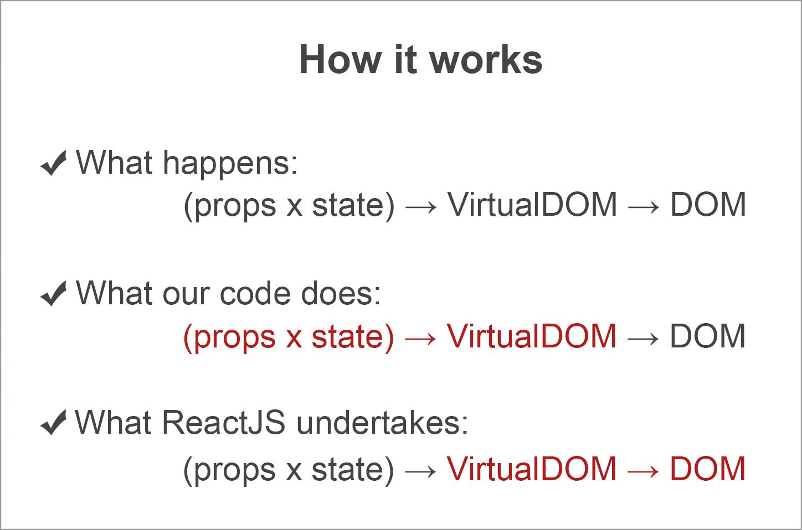

Due to the growing popularity of reactive approaches to software development, programmers are now turning with more and more interest to React JS - open-source JavaScript library that solves problem of fast visualization of a big dataflow and simplifies creation of interactive user interfaces.
When it is needed to display dynamic content, template engines are used. They work pretty simple: to the existing template a specific set of data is applied and some of dataset representation is obtained. If data is changed, it has to be displayed in a representation. A programmer needs to write the code which alters representation and synchronizes data changes in one. But, if we already have a template, why don’t use it? The idea to use a template not just at initial rendering but after every data change is fundamental in React JS.
However, for displaying data changes, programmers have to manipulate the DOM tree and write code which displays all updates in different specific cases. React JS library is aimed at solving this problem.

## React JS: getting started

Let’s take a look at the example of the simplest app written in JavaScript:

```html
<!DOCTYPE html>
<div id="app"></div>
<script>
 // create DOM-node
 var a = document.createElement("a");
 a.setAttribute("href", "https://anadea.info/");
 a.value = "Click me";

 // mounting into document
 document.getElementById("app").appendChild(a);
</script>
```

There is a page which includes one element **`div`**, and with the help of usual DOM API, element `a` is created, with attribute **`href`** and some link, with the text «Click me» to display link. Such construction is inserted into the document by **`appendChild`**. Consequently, we get a page with the link to our site.
We do the same when we use React – construct elements using syntax: create a unit as **"a"** with an appropriate set of attributes and definitions that is inside the element.

```js
ReactDOM.render(
 React.createElement('a', {href: 'https://anadea.info/'}, 'Click me'),
 document.getElementById('app')
)
```

Inserting into the page is very similar – in this case we render our element.
A basic function that creates all elements is a **`React.createElement`**. There are standard elements available such as **`div`**, **`span`**, **`p`**, **`strong`**, etc. With React syntax we can create complex constructions by simple nesting functions instead of using **`appendChild`** and **`insertBefore`** in DOM API. It makes code more declarative.

## JSX

In addition to React, there are transpilers (JSXTransform, Babel) that provide syntax constructions for a more concise code. This language is called **JSX**. A render looks like this:

```js
const App = (items, onDeleteItem, onAddClicked) =>
 <div>
  <List onDeleteItem={onDeleteItem}>
   {items}
  </List>
  <input ref='new_item'/>
  <button onClick={onAddClicked}>Add</button>
 </div>
```

The code of our components can run out of browser, because it’s not connected to DOM directly. It can be used for a server-side as a template engine, which makes writing isomorphic apps possible (apps which can run both on the server and the client). It means that we can use all the beauty of NodeJS speed while writing tests. If the components don’t have State, then they reduce to simple functions. In other words, we pass on sample qualities to the element when we create it, run render and get DOM – this is one of the simplest forms of tests. Transformation of data to virtual DOM always goes one way. That’s why tests are very simple even for the most difficult components.

## Creating components

One of the main features of React is the possibility to create own components from others easily. At the same time, it can be used as standard components created earlier. For instance, the component that contains a picture, a tag **"a"** and a text looks as following:

```html
const Link = () =>
 <a href='https://anadea.info/' title='Click me!'>
  
 </a>
```

In React we have a possibility to combine simple or complex elements. It looks like getting bigger partials from the small ones and then combining them into the entire application.
We can create custom elements that adapt to our needs. Every element attains a dictionary of properties at the creation. It is available in the form of group code as props. For example, this is how the element **`Link`** gets the properties **`url`**, **`imageUrl`**, and **`title`**:

```js
const Link = ({url, imageUrl, title, children}) =>
 <a href={url} title={title}>
  
  {children}
 </a>
```

Inserted elements are available as **`children`**. In the example above this property contains two definitions: text "Click" and element **`strong`** with text "me!".

```js
const App = () =>
 <div>
  <Link url=`https://anadea.info/` imageUrl='/assets/logo.png' title='Click' >
   <Strong> Me </Strong>
  </Link>
 </div>
```

## Component's lifecycle

The lifecycle of a component consists of three phases: mounting into a DOM tree, updating and unmounting.

```js
useEffect(
 () => {
  // executed on mount and updated watched values
  loadUserProfile(id)

  return () => {
   // executing on unmount
   saveUserProfile(id)
  }
 }
 ,[id] // watched values.
)
```

## Virtual DOM

Each component displays its properties and state in a VirtualDOM structure. React translates virtual Dom to the real DOM. New virtual DOM is built every time any properties or component’s states are changed. It compares them with what we have in the browser, reckons a minimal set of necessary alters and applies them. React isolates us not only from DOM, but also from events which happen in it, and introduces synthetic events instead of the latter. Objects of those events don’t depend on a current browser since React reveals distinctions between browsers and fills in missing attributes.



## Sample ToDo Application

Let’s look at a simple example how to use React:

```js
const App = () => {
 const [tasks, setTasks] = useState([])
 const [task, setTask] = useState('')

 const deleteTask = index => {
  setTasks(tasks.filter((_, i) => i !== index))
 }

 const createTask = () => {
  setTasks([...tasks, task])
  setTask('')
 }

 return <>
  {tasks.map((t, i) =>
   <Task key={i} text={t} onDelete={() => deleteTask(i)}/>
  )}
  <div>
   <input value={task} onChange={event => setTask(event.target.value)}/>
   <button onClick={createTask} disabled={!task}> Add Task </button>
  </div>
 </>
}

const Task = ({text, onDelete}) =>
 <div> {text} <button onClick={onDelete}> X </button> </div>
```

The code represents an edit list with an option to delete or add a line. It consists of two components – "Task" and "App". The App represents Tasks elements and arranges the "Remove button" next to each of them (lettered "x") and input box and a button to add a new element to the list. A data of the list is kept in a state of the App’s component when the list is stateless. Initially the list is empty, what is noticeable **`useState([])`**. Moreover, there are two additional functions, which add and remove elements from the list.

## Why React is a right choice?

It offers a simple model which works well with a big dataset, displays it quickly and allows fast editing. It can be tested easily. State is always changeable at certain places. That’s why it is easy to see how HTML will look like. If we combine React with Redux we’ll get a full app architecture. You can use React Native library, it is alternative to ReactDOM for mobile development.

React JS and Rails are the technologies which well go together, so for us it was obvious that we should have React JS on our skillset. We hope our tutorial, along with other existing React JS documentation and guides, will help you to decide if you should give it a shot in your project.
