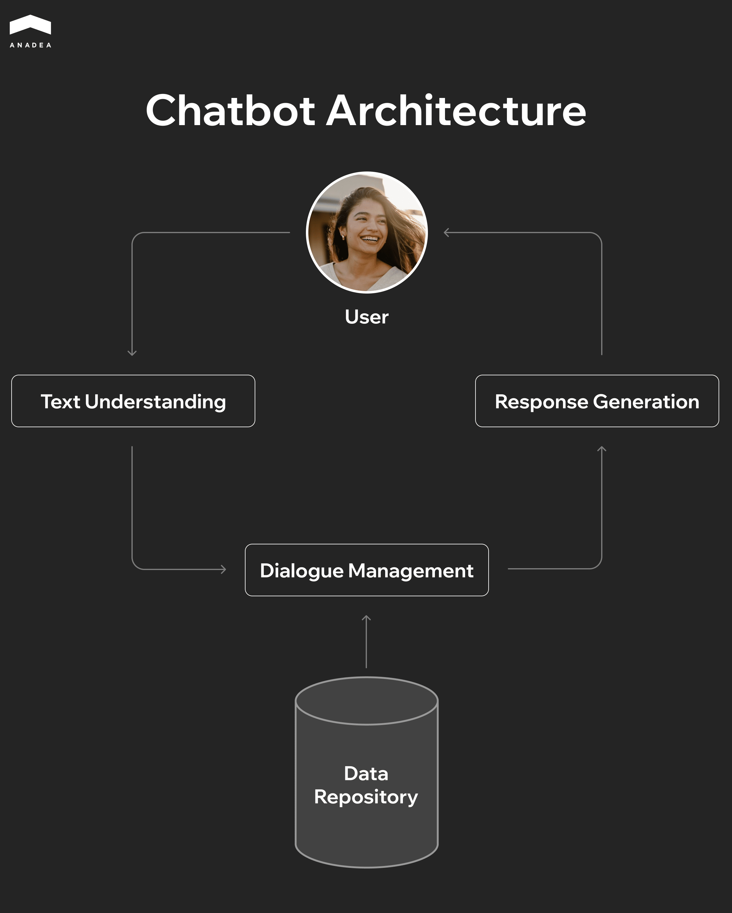
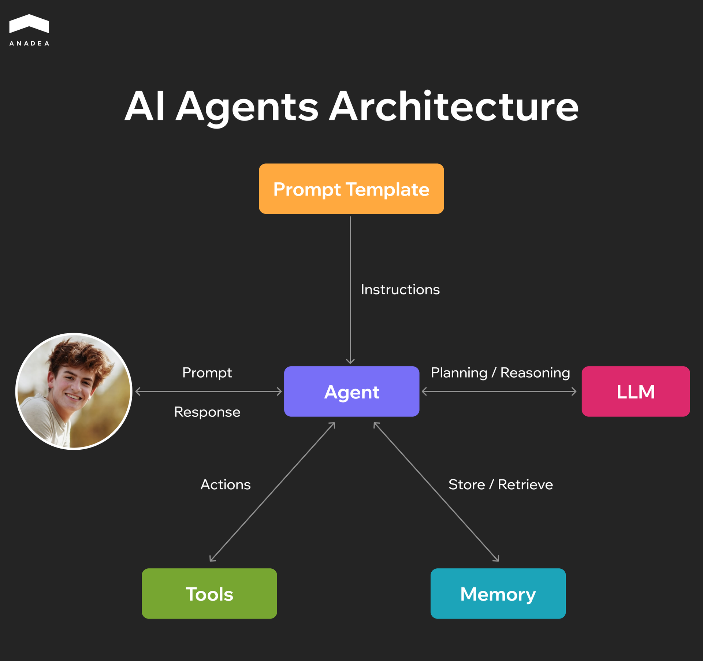

Today, many businesses face high labor costs and workflow inefficiencies due to large volumes of repetitive tasks. Instead of concentrating on strategic planning and creative processes, employees need to answer routine questions, prepare typical invoices, track orders, and perform other time-consuming tasks that can be automated. Gradually, AI-powered solutions are being adopted to increase productivity. 

[According to Gartner](https://www.gartner.com/en/newsroom/press-releases/2025-03-05-gartner-predicts-agentic-ai-will-autonomously-resolve-80-percent-of-common-customer-service-issues-without-human-intervention-by-20290), by 2029, 80% of common customer service issues will be handled by AI agents without human intervention. As a result, operational costs may decrease by as much as 30%.

However, AI agents are not the only type of solution that can be applied to revolutionize your processes. Your business transformation can start with simpler tools, such as chatbots.

But how to make the right choice? And how to understand which AI tool is required in your case? In this article, we are going to share our AI agents vs chatbots comparison and explain how to make sure that AI will bring you the highest value.

## Chatbots, AI Assistants, and AI Agents: Quick Overview

Sometimes, terms like AI assistants, agents, and chatbots are used as synonyms. Nevertheless, it’s far from being true. These are three types of solutions designed to perform different tasks. If you are considering AI implementation, you should have a clear understanding of the similarities and differences of these tools.

### What Is a Chatbot?

A chatbot is an application that can simulate human conversation through text or voice. Its key role is to respond to user queries within a defined scope.

There are several types of chatbots that are currently applied across various domains,

**Rule-based chatbots** rely on decision trees and scripted flows, which limits the range of scenarios they can handle. An example of this type of solution is a bank chatbot that gives the account balance only when a user writes exact requests.

**AI-driven chatbots** are powered by natural language processing and machine learning. These technologies allow them to interpret queries more flexibly. They can understand intents and respond to a wider range of inputs. Customer service chatbots are often AI-powered. Thanks to this, they can efficiently process different inputs and quickly react to them in a human-like manner.

* Intent-based chatbots map user input to pre-defined “intents” (like check balance or reset password).
* LLM-based chatbots use large language models to generate answers dynamically. Such tools can handle open-ended queries.

### What Is an AI Assistant?

An AI assistant is a digital helper. Such tools can assist users in completing tasks, accessing information, or interacting with software systems in a human-like manner. Unlike a basic chatbot, an AI assistant is often context-aware. Moreover, it integrates across multiple services (like calendars, CRM, and other systems) to streamline the process of task performance for users.

Siri or Google Assistant are good examples of such apps. Among other things, they can dial a number to make a call, type a message, or set a reminder based on users’ requests. 

### What Is an AI Agent?

An AI agent is a more advanced system compared with a chatbot or a virtual assistant.

This tool can not only respond to inputs but also act autonomously (or semi-autonomously) to achieve particular goals. Apart from understanding and content generation capabilities, it also combines reasoning, planning, and execution functionality.

Here is what sets AI agents apart:

* They can operate without constant human direction.
* They work toward defined objectives.
* They can break down complex tasks into steps and perform them.
* To accomplish tasks, they can incorporate external tools, APIs, and databases.

For example, an AI agent can book a flight based on the user’s criteria. To do it, an agent will search airline APIs, compare prices, match the parameters, and make a reservation.

The table below demonstrates the key similarities and differences between these types of solutions.

<table>

<thead>

<tr>

<th>

<strong>Aspect</strong>

</th>

<th>

<strong>AI chatbot</strong>

</th>

<th>

<strong>AI assistant</strong>

</th>

<th>

<strong>AI agent</strong>

</th>

</tr>

</thead>

<tbody>

<tr>

<td>

Purpose

</td>

<td>

Text-based interaction, conversation

</td>

<td>

Helps users accomplish their tasks.

</td>

<td>

Autonomous (semi-autonomous) actions on behalf of a user toward a set goal

</td>

</tr>

<tr>

<td>

Complexity

</td>

<td>

Simple to moderate

</td>

<td>

Moderate to advanced

</td>

<td>

Advanced

</td>

</tr>

<tr>

<td>

Context awareness

</td>

<td>

Limited

</td>

<td>

Keeping context across tasks and sessions

</td>

<td>

Long-term memory and adaptability

</td>

</tr>

<tr>

<td>

Autonomy

</td>

<td>

Low (reactive only)

</td>

<td>

Medium (task execution with prompts)

</td>

<td>

High (can initiate actions without explicit prompt)

</td>

</tr>

<tr>

<td>

Capabilities

</td>

<td>

FAQ answers, small talk, scripted dialogs

</td>

<td>

Scheduling, reminders, search, productivity support

</td>

<td>

Environment monitoring, action execution, and collaboration with other systems

</td>

</tr>

<tr>

<td>

Examples

</td>

<td>

Customer support bots, website chat widgets

</td>

<td>

Siri, Alexa, Google Assistant

</td>

<td>

AutoGPT, AI copilots that execute workflows, and trading bots

</td>

</tr>

</tbody>

</table>

As you can see, while chatbots and agents differ significantly from each other, AI assistants can be viewed as a transitional stage between them. In our article, we decided to focus on the AI agent vs chatbot comparison as these solutions represent very different AI capabilities, which will make our blog post more illustrative and representative. 

## Chatbot vs AI Agent Architecture

To better understand the functionality of such tools, let’s take a closer look at how they are built.

### Chatbot Architecture

As a rule, chatbots follow a layered architecture that is designed for conversation flow and information retrieval. It is easy to deploy and maintain them when interaction patterns are predictable.

Here are the key levels:

#### Natural Language Understanding (NLU)/Intent Detection or LLM Q&A

The core of each chatbot is its ability to understand user input. This can be ensured through NLU (it converts inputs to predefined intents) or an LLM Q&A system (it can handle free-form queries).

#### Knowledge Base and Retrieval-Augmented Generation (RAG)

Many chatbots leverage a knowledge base combined with RAG. 

Retrieval-augmented generation allows bots to process relevant documents and generate responses grounded in factual content. In other words, for generating their outputs, chatbots don’t use only the data they were trained on. They also have access to bigger datasets with more relevant information. This is a vital functionality for customer support, FAQs, or policy guidance.

#### Dialogue Management and Channel Integration

Dialogue management maintains context and conversation state. Integration with multiple channels (like email or messaging apps) enables the chatbot to operate seamlessly across platforms.

The diagram below shows a simplified architecture of a chatbot.

### AI Agent Architecture

AI agents extend beyond static responses. They are built to support interactions that require action, cross-system coordination, and reasoning over multiple steps. To ensure this, they have a more advanced architecture that includes the following components:

#### Planner and Reasoner

Modern agents often use frameworks, like ReAct, that help combine reasoning with action. Agents can call external tools or APIs, access databases, and perform multi-step operations to achieve user goals.

#### Memory and State, Goal Decomposition, Feedback Loop

What makes agents different from traditional chatbots is the fact that they can maintain persistent memory and decompose complex tasks into significantly smaller sub-tasks. 

Moreover, feedback loops allow them to adjust actions dynamically. As a result, their performance can improve over the course of interaction.

#### Guardrails, Evaluator, and Human-in-the-Loop

AI agents include guardrails and evaluation mechanisms to ensure safety and reliability. Critical or high-stakes tasks may also incorporate human oversight.

In the picture below, you can see the basic elements of the AI agent architecture.

## Chatbot vs AI Agent: How to Make the Right Choice

If you haven’t used solutions of these types before, the decision-making process can be rather frustrating for you. That’s why you should have a clear vision of how you can come to the right choice.

Here’s a list of the key criteria that you should bear in mind.

<table>

<tbody>

<tr>

<td>

<strong>Criteria</strong>

</td>

<td>

<strong>Choose a chatbot if</strong>

</td>

<td>

<strong>Choose an AI agent if</strong>

</td>

</tr>

<tr>

<td>

Task type

</td>

<td>

Your solution needs to answer FAQs and provide information

</td>

<td>

Your solution needs to perform actions, transactions, and trigger workflows

</td>

</tr>

<tr>

<td>

Workflow complexity

</td>

<td>

You have single-step processes (like answering a question &ldquo;What is my current balance?&rdquo;)

</td>

<td>

You have multi-step processes (&ldquo;Make a transaction, update records, notify an accountant&rdquo;)

</td>

</tr>

<tr>

<td>

Risks included

</td>

<td>

Your processes presuppose minimal compliance risks

</td>

<td>

Your tasks require compliance, security, and approvals

</td>

</tr>

<tr>

<td>

User input

</td>

<td>

User input is well-structured and predictable

</td>

<td>

User input can be unstructured and highly variable

</td>

</tr>

<tr>

<td>

Latency requirements

</td>

<td>

You need real-time, instant responses

</td>

<td>

Your solutions will handle async tasks

</td>

</tr>

</tbody>

</table>

### The Maturity Path for AI Solutions

The AI solutions discussed in our article differ based on their complexity and, consequently, functionality. Very often, it doesn’t make sense to invest in the most powerful AI system at once, as this step may introduce unnecessary risks if your business isn’t ready in terms of data quality, integrations, and governance. 

Given this, we invite you to consider this maturity path that can help your organization plan AI adoption effectively.

#### Stage 1. FAQ / Flow Bot

The journey often starts with basic chatbots. Such bots can answer frequently asked questions and guide users through decision trees or forms. They are typically lightweight and easy to deploy. Due to their simplicity, they require minimal training data. As a result, they can become an excellent entry point for those who are just starting their experiments with AI.

At this stage, AI is mainly reactive. It provides static responses without reasoning or external actions.

#### Stage 2. LLM + RAG

The next step is to integrate large language models with retrieval-augmented generation. Bots with this functionality can fetch and summarize relevant documents from a knowledge base. As a result, they can handle open-ended questions as their responses are powered by real-time data.

#### Stage 3. Tool-Using Assistant

The third stage introduces action capabilities. AI can now act as an assistant that interacts with systems. For example, it can call APIs and interact with databases. Thanks to this, it is possible to rely on it in multi-step tasks, like booking meetings or managing resources.

The implementation of such solutions requires careful planning of system integration, including access controls and permissions management.

#### Stage 4. Autonomous AI Agent

The final stage is the autonomous AI agent. It will already be capable of reasoning, planning, and acting with minimal human intervention. At this stage, AI can handle cross-system orchestration, automate workflows, and make intelligent decisions based on context.



## AI Agent/Chatbot in Different Use Cases

Though the difference between AI agent and chatbot is quite significant, it doesn't mean that these two types of solutions don’t share some use cases. However, the purposes of their application won’t be the same. Here are a couple of examples.

### Customer Service Automation

Chatbots can handle routine queries such as “What’s my order status?” or “What’s your refund policy?”. Though the interaction with chatbots may lack human touch, according to the survey performed by [Uberall](https://uberall.com/en-us/company/press-releases/study-80-of-consumers-report-chatbot-experiences-as-positive-yet-nearly-60-still-lack-strong-enthusiasm-for-the-technology-according-to-new-uberall-study), 80% of people who have experience in communicating with chatbots describe it as generally positive.

AI agents can perform much more complicated tasks than chatbots. They can be trained to initiate refunds within policy limits or reschedule deliveries by connecting to logistics APIs.

AI customer support agents have proven highly efficient in practice. For example, [H&M implemented an AI-powered chatbot](https://www.crescendo.ai/blog/automated-customer-service-examples) to handle repetitive queries. The range of its tasks includes order tracking and return policies. The system resolves 80% of queries without human help. Apart from this, it cuts response times from minutes to seconds and supports customers 24/7 in 15+ languages. The escalation of only complex cases reduces reliance on regional teams and lowered customer service costs by approximately 30% annually.

### IT Helpdesk

Chatbots help to reduce the workload for tech support specialists. While human employees are busy with standard issues that require their intervention, AI chatbots can provide instant answers to password policy or device setup questions.

In this domain, AI agents are implemented to automate such processes as password resets, support ticket triage, and ticket status updates.

For instance, a US city managed to [save over 3,000 IT Helpdesk hours](https://www.moveworks.com/us/en/customers/municipal-ai-savings-case-study) annually by automating repetitive requests with the help of agentic AI.

### HR

The introduction of a simple chatbot can significantly improve employee satisfaction. With such solutions at hand, people do not need to wait for long hours (or days) before HR staff are free to answer their standard questions. A chatbot can provide answers to such requests as “What are my healthcare benefits?” or “How many PTO days do I have left?” just within seconds.

AI agents are built for multi-step tasks, which require interaction with different systems. They can be trained to update PTO balances, process adjustments, and complete onboarding tasks (like creating accounts, assigning training, etc.).

### Sales and Revenue Operations (RevOps)

Chatbot can handle top-of-funnel requests such as product details, pricing tiers, or feature explanations.

Meanwhile, AI agents can qualify leads and update CRM entries. Moreover, they can schedule sales meetings by syncing with calendars.

### Operations and Back Office

You can implement a chatbot to get quick access to standard operating procedure guidelines or policies.

If you need intelligent automation for checking and adjusting inventory levels or for triggering alerts when some particular criteria are met, your choice should be an AI agent.



## Custom AI Agent Development by Anadea

Our company has been working with AI technologies since 2019. Over this period, we have gained solid expertise in this sphere. Now, we use the power of AI technologies to help organizations address their core business challenges:

* Operational friction
* Limited scalability
* Slow decision-making
* Costly customer service

Our AI development team includes 20+ seasoned experts who have deep knowledge across various domains. We have successfully delivered 16+ AI projects for global expertise and built 9+ custom AI agents for various industries, including but not limited to education, retail, energy, logistics, and healthcare. 

Our team manages every stage of [custom AI agent development](https://anadea.info/services/custom-ai-agent-development), from aligning the technology to your business objectives to maintenance of solutions amid your evolving needs.



## Conclusion: Chatbot vs AI Agent

Chatbots and AI agents are not competitors. They serve different goals.

Chatbots are intended for fast coverage of common queries. They often become an excellent AI starting point for organizations. AI agents, on the other hand, unlock the advanced capabilities. They can act across systems and automate complex workflows.

At Anadea, we deeply understand the peculiarities of different AI use cases and can help you detect the most efficient application of AI tools across your workflows. When our clients turn to us for consultation, we often recommend that they start small and gradually move to more advanced intelligent technologies.

If you are looking for a reliable partner to guide you through the entire AI transformation journey, [book a call](https://anadea.info/free-project-estimate) with our team to discuss the details.
