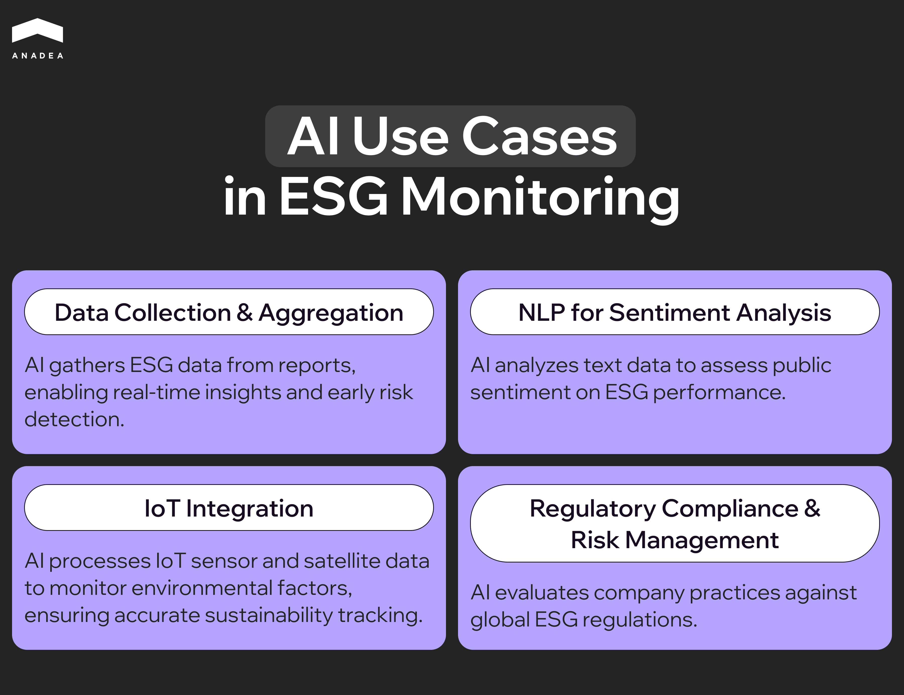
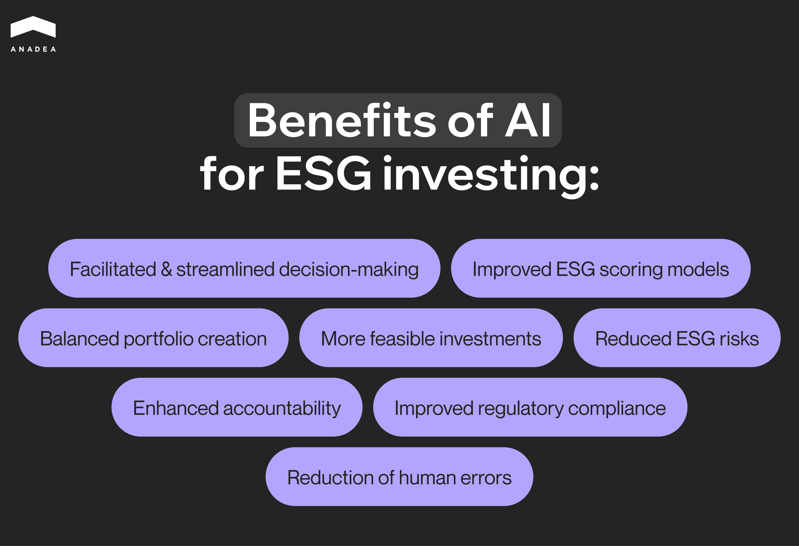

Over the past decades, the approach of businesses to their operations and investments has changed significantly. More and more leaders across all regions of the world recognize the importance of long-term planning, social responsibility, and sustainable development. These aspects are becoming primary priorities, pushing short-term gains to the background. Amid such shifts, we can observe the widespread implementation of Environmental, Social, and Governance (ESG) principles.

Today a growing number of investors evaluate ESG criteria before making their decisions. According to Governance & Accountability Institute’s “2024 Sustainability Reporting in Focus” research, [93%](https://www.ga-institute.com/research/ga-research-directory/sustainability-reporting-trends/2024-sustainability-reporting-in-focus/) of Russell 1000 companies published a sustainability report in 2023. That’s a new record level that brightly demonstrates the importance of this factor in the business world.

In our article, we are going to talk about the AI and ESG intersection in investing. Recent studies show that it can be a very promising area of AI application. In its ESG Global Study 2024, Capital Group revealed that nearly [two-thirds of investors](https://www.capitalgroup.com/advisor/pdf/shareholder/ITGEOT-073-1043294.pdf#page=23) either plan to use (53%) or already use (10%) this technology to work with ESG data.

Will artificial intelligence be able to strengthen this field in the long run and enhance the efficiency of ESG investing? To find an answer to this question, just keep reading.

## ESG and AI: Is it a good duo?

According to the latest [research](https://www.grandviewresearch.com/horizon/outlook/esg-investing-market-size/global), the revenue of the global ESG investing market reached $28,362.1 million in 2024. By 2030, it is projected to hit the mark of $79,707.0 million. If the market growth is not affected by any external factors and takes place based on these forecasts, the CAGR for the period from 2025 to 2030 will be 19.7%.

The role of ESG principles and goals in the corporate reputation can’t be underestimated. Given this, the implementation of ESG programs has become a standard across various industries already. Such programs are typically aimed at:

* safeguarding natural resources (environmental aspect); 
* building relationships with employees, suppliers, customers, and communities (social aspect); 
* protecting shareholders’ rights, conducting audits and internal controls, and establishing transparency (governance aspect).

The implementation and execution of such programs are closely linked to the processing and analysis of vast amounts of data. It is gradually becoming more time- and resource-consuming to gather, store, and manage these increasingly large amounts of information.

Apart from this, it is crucial to consider the growing requirements introduced by regulators. Companies must continuously monitor whether their activities comply with evolving laws and rules. This is also a quite challenging task when performed only manually without any supportive tools.

Here is when AI can join the game and facilitate a lot of tasks for teams working with ESG programs and investments.

But that’s far not the only area where AI and ESG can be related. Artificial intelligence can offer much more than just working with huge volumes of data. It can be of great help in every element or stage of the realization of ESG approaches. From AI-driven hiring platforms for bias elimination in recruitment to smart energy consumption, artificial intelligence can bring real value to businesses and the whole world. 

In the further sections of our article, we offer you to have a closer look at the AI use cases in the implementation of ESG principles and investing.

## How is AI used in ESG monitoring and reporting?

Artificial intelligence can greatly enhance accuracy and efficiency in both ESG monitoring and reporting. Here is how.

### AI use cases in ESG monitoring

* ***Data collection and aggregation***. ESG-related data should be gathered from various sources, including corporate reports, news articles, social media, and government databases. As it is quite obvious this task is very challenging to be performed manually. Nevertheless, AI-powered tools can be successfully applied to gather this info. Such tools help companies maintain real-time insights and identify emerging risks before they become a real threat.
* ***NLP for sentiment analysis***. Natural language processing algorithms can efficiently process textual data. Thanks to this, they can gauge public sentiment around companies’ ESG performance. This enables organizations to detect reputational risks and adjust strategies accordingly. At the same time, investors interested in allocating their funds to some companies can also use this data in making their decisions.
* ***IoT integration***. ESG goals are closely related to various environmental factors, including but not limited to carbon emissions, deforestation, and water usage. The related data is often collected from IoT sensors and satellite images, which can be processed by AI. Such tools and the provided insights help businesses track their sustainability goals more accurately.
* ***Regulatory compliance and risk management***. AI-powered compliance platforms can assess ESG-related risks by analyzing company practices in the context of global regulatory frameworks. These solutions play an important role in enhancing the ESG credibility of businesses. Moreover, thanks to such insights businesses can avoid incompliance-related penalties in the future.

### AI in ESG reporting

* ***Automated report generation***. AI tools can compile comprehensive ESG reports. For composing such documents, they extract and structure relevant data. This can be a rather time-consuming routine task. As a result, human workers have more time for more important strategic processes.
* ***Predictive analytics***. AI can accurately analyze historical ESG data to forecast future trends. By having such info at hand, companies’ teams can proactively address potential challenges and avoid missing valuable opportunities. Want to learn more about the power of predictive analytics? You can read one of our previously published [blog posts](https://anadea.info/blog/real-estate-investments-driving-revenue-with-predictive-analytics/) dedicated to the use of such tools in real estate investing.
* ***Customizable ESG metrics and dashboards***. Artificial intelligence allows organizations to tailor their ESG dashboards based on industry-specific requirements. As a result, they can leverage more targeted reporting and performance measurement.

## How AI tools can change ESG integration

ESG integration is a term used to describe the inclusion of ESG factors in investment analysis and investment decisions. Given the growing interest from the side of society in ensuring a sustainable future, such criteria play an increasingly important role in investment-related decisions. 

When choosing businesses with strong ESG policies, investors not only support the growth of such companies but also ensure higher ROI for themselves. Sustainable development has already become a top priority in the business world. And those organizations that ignore it have very low chances to thrive in the long run.

ESG-focused investing decision-making process includes:

* Analysis of financial information and ESG data;
* Definition of material financial factors and ESG criteria;
* Evaluation of the potential impact of all the above-mentioned factors on economic and social sectors, as well as the company’s performance.

At the same time, this approach doesn’t presuppose that:

* There are certain sectors, regions, or organizations that are not worth investing in;
* Traditional financial factors should be fully ignored;
* All ESG factors should be assessed for each company (it’s vital to apply tailored principles in relation to every business);
* All investment decisions must be impacted by ESG factors.

It means that even despite the undisputable importance of ESG criteria, there aren’t one-size-fits-all solutions and approaches. Each case should be viewed individually. As a result, it is not possible to introduce a single algorithm for ESG-focused investing decision-making that will work equally well in absolutely all situations. 

ESG investing is based on analyzing huge volumes of data which is traditionally a very time-consuming and meticulous process. 

And it is exactly a good example of a case when AI tools can come into play and demonstrate their power.

### Different types of AI tools in ESG integration

***ESG portfolio management and investment tools***. They are designed to integrate ESG factors into investment decisions and portfolio management. The list of their features traditionally includes AI tools for ESG performance tracking, risk identification, and providing recommendations for portfolio optimization based on sustainability criteria.

***Carbon and environmental footprint calculators***. These tools are able to measure and manage environmental impacts, including carbon emissions, energy usage, and waste. Such solutions can provide sustainability ratings, as well as collect and analyze environmental metrics from different sources.

***Social impact measurement tools***. These solutions have the required functionality for measuring and managing social impact metrics. For example, they help to track labor practices, community engagement, as well as diversity, equity, and inclusion (DEI) score. Artificial intelligence can not only analyze social impact data but also offer recommendations for improvement.

***Visualization tools and dashboards***. Tools from this category can present ESG data in an accessible and actionable format.

***Real-time monitoring and alerts***. Systems of this type can provide their users with real-time updates and alerts on ESG risks and opportunities. It is possible thanks to continuous monitoring of various data sources like media and other public data.

***Governance and ethical tools***. They can track governance-related risks. The range of such risks includes board diversity, executive compensation, and ethical practices.

***Climate risk and scenario analysis systems***. These systems are trained to evaluate climate-related risks and create potential scenarios (like heatwaves or floods). Based on such scenarios, investors can better realize the financial impact of climate risks on businesses and their investments.

***AI ESG compliance tools***. The key idea behind the introduction of such tools is the facilitation of ESG reporting and compliance with regulatory standards. Such platforms traditionally can collect and integrate data from multiple sources, generate reports, and issue compliance-related notifications.

## AI for ESG investing: What are the key benefits?

When it comes directly to any type of investing (and ESG is not an exception here), AI tools are applied quite commonly these days. And here's why:

1. AI ESG investment tools can analyze vast amounts of data. The provided insights help investors make more informed decisions based on sustainability performance.
2. AI-powered investment platforms can efficiently analyze the performance and activities of a huge number of companies to detect leaders in environmental responsibility, social impact, and ethical governance. 
3. Artificial intelligence in ESG can also find and evaluate various related risks like regulatory changes, environmental violations, and social controversies. Thanks to this, investors can minimize their financial risks and make sure that their portfolios align with ESG principles.

Based on these potential areas of application of this technology, we can formulate the following benefits of AI for ESG investing:

* ***Facilitated and streamlined decision-making***. AI can analyze vast ESG datasets and provide valuable insights. This allows investors to make better data-driven decisions faster than in those cases when they need to process all data on their own. Moreover, AI can uncover trends that may be overlooked through traditional analysis.
* ***Improved ESG scoring models***. Artificial intelligence can refine ESG ratings and scores by analyzing a wide range of data points. Here, it is vital to highlight that this technology can do it more accurately than traditional methods. Machine learning models can assess the performance of companies based on patterns in historical data to improve the precision of ESG metrics.
* ***Balanced portfolio creation***. Today investors can integrate traditional financial metrics with ESG factors to build their portfolios. AI-powered portfolio management enables the development of more diversified and resilient investment strategies based on ongoing and future market trends.
* ***Enhanced accountability***. AI-powered analytics can identify discrepancies in ESG reports and ensure companies adhere to their sustainability commitments.
* ***More feasible investments***. Those businesses that successfully implement ESG practices often demonstrate better financial results than their market rivals. With AI tools at their disposal, investors can find such high-performing sustainable businesses with less effort. As a result, such investments can bring better profits.
* ***Reduced ESG risks***. Tools powered by artificial intelligence are good at detecting ESG-related risks. With a comprehensive understanding of risks, investors can mitigate potential losses and enhance portfolio resilience.
* ***Improved regulatory compliance***. With AI, not only businesses but also investors themselves can automate compliance tracking. This helps investors to ensure their portfolios align with evolving ESG regulations and industry standards.
* ***Reduction of human errors***. As AI can automate data collection and interpretation, the participation of people in such processes is minimized. Thanks to this, it is possible to reduce risks of subjectivity and potential human error. Moreover, ESG and Generative AI can be also a good combination. Artificial intelligence can be used for creating ESG and investment reports. Such reports are traditionally prone to errors when composed manually. And AI can efficiently address this issue.

## AI in ESG: The most common challenges

The implementation of tools powered by artificial intelligence in this sphere looks like a very promising initiative. Nevertheless, this technology still has a row of limitations. Such limitations, to one extent or another, affect the efficiency of these tools and, in general, sometimes even the feasibility of their use.

If you are interested in using AI for ESG criteria, you should stay aware of possible pitfalls to be ready to address them in the smartest way.

### Challenge 1. Data availability and its quality

The term “ESG” was officially [mentioned](https://en.wikipedia.org/wiki/Environmental,_social,_and_governance) for the first time in 2004 in the report titled “Who Cares Wins” prepared by financial institutions under the initiative of the UN. Given this comparatively short history of the ESG notion, the related data is often limited in scope and historical depth. Moreover, not all companies disclose their ESG data. As a result, there aren’t enough large datasets for training AI models.

Apart from this, even available ESG data is often fragmented and non-standardized. The reports are usually prepared by companies on their own without any strict, widely applied rules. AI systems may have serious difficulties in analyzing such reports effectively.

### Challenge 2. Subjectivity and dynamic nature of ESG criteria

Very often (if not always) ESG metrics involve subjective judgments. For example, they can be observed in the descriptions of governance quality and transparency, or social impact on particular communities. The processing of such data is traditionally very challenging to automate as the data itself is difficult to analyze and quantify.

Moreover, ESG goals and priorities may be updated over time. It usually happens due to changing regulations, societal expectations, and environmental conditions. It means that AI models should be continuously adjusted to such shifts.

### Challenge 3. Transparency and ethical concerns

One of the key concerns is related to the fact that users often can’t get an explanation of how AI models work. This is especially true in relation to deep learning systems. As users can’t fully understand why this or that ESG-related decision is made, this may lead to a lack of trust.

Moreover, the question of accountability still hasn't been answered. Who should bear responsibility for AI-driven ESG decisions? In the case of errors, there may be a lot of disputes in these regards.

### Challenge 4. Required resources

If you are planning the implementation of AI ESG tools, you should know that this initiative requires a lot of different resources. 

First of all, the development and maintenance of AI systems for ESG analysis can be rather expensive. Even the use of off-the-shelf solutions will require investments in model training, customization, and licensing fees.

Secondly, to work with tools equipped with AI in this sphere, teams need to have interdisciplinary expertise in several fields, such as data science, sustainability, and governance.

And finally, it’s crucial to mention that AI systems require robust computational infrastructure, which is also associated with significant upfront and ongoing costs. Apart from this, the use of such systems may have its own environmental impact. Let’s take a closer look at it in the next sub-section.

### Challenge 5. Environmental impact

The application of large-scale AI models can contribute to carbon emissions. As a result, from an ethical point of view, the use of such systems conflicts with ESG goals.

Moreover, the hardware used for running such systems can be associated with extra e-waste, which also poses environmental challenges.

### Ways to address such AI and ESG challenges

Unfortunately, there isn’t a magic solution that can help to overcome all the issues. However, we’ve prepared some tips that will help to mitigate or even fully eliminate their impact.

1. Do not ignore the necessity to invest in high-quality ESG data collection and sharing. Just remember the principle “Garbage in, garbage out”. When your system relies on fragmented, unstructured, and insufficient data, the results of its work will leave much to desire.
2. Introduce transparent and explainable AI models. This will increase trust and help to avoid misunderstandings.
3. Make sure that interdisciplinary teams are engaged in AI development, training, and maintenance. ESG is a field that requires specific knowledge.
4. Try to balance the environmental impact of your AI systems. To achieve this goal, you can use energy-efficient algorithms and infrastructure.



## AI and ESG in investing: Do they have a common future?

Today we can see that the use of AI for ESG investing is rapidly gaining momentum. But what will it look like in the future? Here are a couple of trends that are expected to be observed in the near future.

***Data standardization***. The performance of AI systems heavily depends on the use of data. The better data we can use for training our models, the better results we can get. Given the benefits of the AI ESG systems, AI will play a key role in harmonizing disparate ESG datasets. That’s why the introduction of global standards for ESG reporting and analysis is viewed as a highly realistic scenario.

***More advanced predictive analytics***. Predictive analytics systems are used already today. Nevertheless, tech achievements can make such systems even more powerful and valuable for businesses. It is projected that AI models will be widely used to predict the financial impact of climate-related risks, such as extreme weather conditions on investments. This will help not only to make the right ESG-related decisions but also to enable proactive risk management.

Moreover, having AI tools at their disposal, investors will be able to simulate various ESG scenarios (like social instability). Based on various scenarios, they will be able to evaluate the impact of different factors on their portfolio performance.

***Personalized investing***. This trend is among the major ones for the entire investing space. It is predicted that AI will help investors to create portfolios tailored to their preferences, needs, and current goals. In the ESG context, investors will have the possibility to indicate their priorities like reduced water consumption or clean energy. And AI will let them easily focus their investing in such areas.

AI-powered robo-advisors are also expected to fully revolutionize investment in the near future. They can provide ESG-focused investment recommendations to make sustainable investing accessible to a wide audience of investors.

***Transparency and ethical AI***. As we highlighted in the previous section, one of the main challenges of using AI in ESG is the lack of transparency. This problem can be solved with the introduction of explainable AI. Such systems can not only make ESG-related decisions but also clearly explain all of them.

It is also expected that in the near future, [AI developers ](https://anadea.info/services/ai-software-development)will focus more on reducing biases in AI models. Such efforts are of great importance as they will help to ensure fairness and inclusivity in the investment space.

***Democratization of ESG and AI***. As we explained in this article, the use of AI for ESG investing can be quite costly, especially for small companies and individual investors. Nevertheless, the situation may change in the future. With less expensive approaches to AI development, such as low-code and no-code, AI-powered platforms will become more affordable to retail investors. As a result, the entire ESG investing will be more accessible to a wider audience. 

Apart from this, we can expect that the awareness in this sphere will increase. AI platforms can be also used to inform investors about the importance of ESG factors and their impact on long-term returns.

## Wrapping up

The combination of ESG and AI is able to revolutionize sustainable investing and corporate responsibility. AI-driven tools can make ESG data more accessible, while its processing becomes more accurate and efficient. 

Today AI is applied in different aspects from report generating to ESG scoring and portfolio optimization. As the capabilities of artificial intelligence continue to evolve, the adoption of AI tools, as well as the range of their use cases, will grow.

However, to fully leverage all the available opportunities, responsible and ethical use of AI is a must for both businesses and investors. The implementation of such an approach is one of the key tasks for the near future.

If you want to learn more about the power of AI for investing or any other [financial solutions](https://anadea.info/solutions/fintech-software-development), do not hesitate to contact us. At Anadea, our experts deeply understand the needs and trends of such domains, as well as the real capabilities of this technology.

And if you already have an idea for your custom AI software tool, just [share your requirements](https://anadea.info/free-project-estimate-b2b)! We will provide estimates for free and offer the best approach for your project realization.
