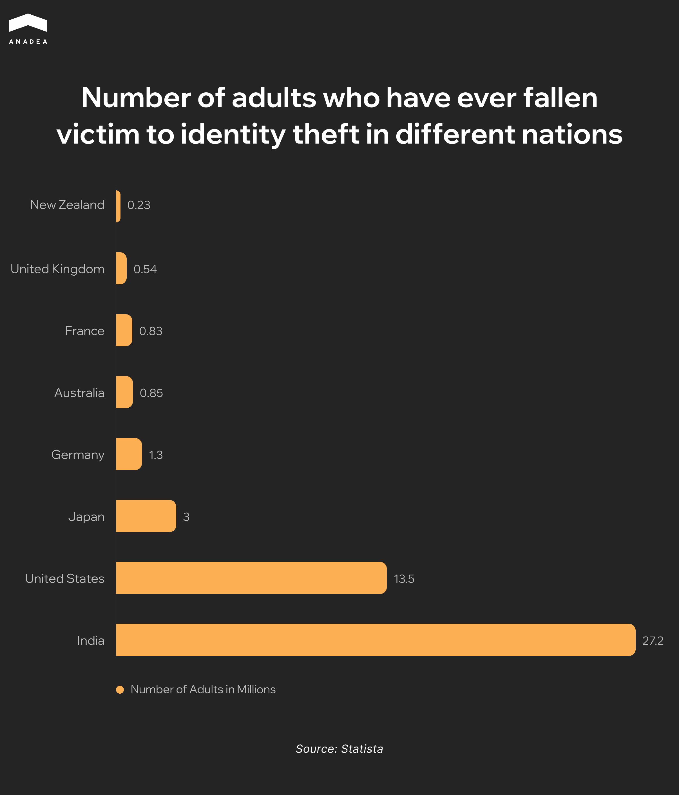
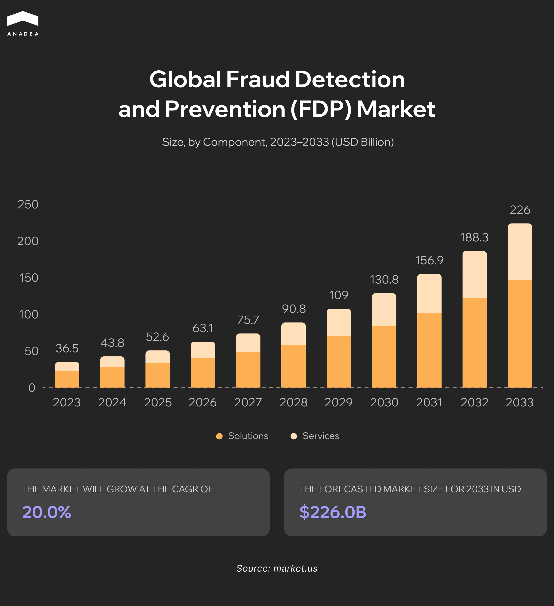
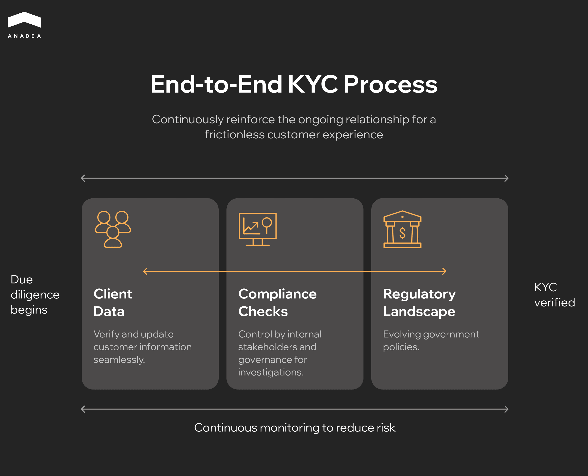

In a world where financial services are becoming fully digitalized, platforms like [Revolut](https://www.revolut.com/about/) are growing at an unprecedented pace. As of June 2025, this service is already used by over 60 million people worldwide. Fintech is becoming an integral part of our daily lives: we pay for purchases via Apple Pay or Google Pay, use mobile apps to track expenses, open deposits or invest through digital platforms, and companies integrate modern online solutions for business operations.

But alongside the development of fintech, the ingenuity of fraudsters is also growing. If in the past it was enough to trick someone out of a PIN code or "borrow" money from under the mattress, today malicious actors are much more sophisticated and can attempt to penetrate your wallet at any moment. According to the [2025 AFP Payments Fraud and Control Survey Report](https://www.financialprofessionals.org/about/learn-more/press-releases/Details/survey-79-percent-of-organizations-were-victims-of-attempted-or-actual-payments-fraud-activity-in-2024), in 2024, 79% of companies faced attempts or instances of payments fraud, a significant increase compared to just 65% two years earlier. This trend underscores the urgent need for new approaches to protecting data and funds.

So today, we will talk about two hot topics: artificial intelligence and money. This article will be useful both for regular users of financial services and for those who work on creating and supporting [fintech development](https://anadea.info/solutions/fintech-software-development). You will learn how AI transforms fraud management in banking, helping to detect fraudulent transactions and protect finances in a world where threats are becoming increasingly ingenious.

## What Makes Banking Fraud Prevention So Challenging?

Modern financial institutions face a series of critical challenges in countering fraud, which demand advanced technological solutions. The increasing volume and complexity of attacks significantly surpass the capabilities of traditional security systems.

### Volume and Speed of Operations

The online payment system generates millions of transactions daily. Manually analyzing each transaction is impossible. Security systems must process these massive datasets in real-time, making decisions within milliseconds to avoid disrupting legitimate financial flows.

### Evolution of Attacks

Malicious actors not only refine their methods but also actively leverage cutting-edge technologies. [Over 50% of modern fraud](https://www.feedzai.com/pressrelease/ai-fraud-trends-2025/) utilizes artificial intelligence. This creates a new level of threats:

* **Deepfake attacks**. In the US alone, [Q1 2024 saw over 105,000 recorded cases ](https://www.wsj.com/articles/ai-drives-rise-in-ceo-impersonator-scams-2bd675c4)with losses exceeding $200 million. A stolen voice (just a few seconds of recording) is sufficient for authentication in banking systems, making traditional biometrics vulnerable.
* **APP fraud (Authorized Push Payment)**. Deepfakes make these attacks extremely convincing, where a client is manipulated, under the guise of a manager or bank representative, into legitimately initiating a fund transfer to fraudsters themselves.
* **Latest schemes**. Malicious actors massively use methods like "pig butchering" (scamming money under the guise of investments through relationships) or "quishing" (QR-phishing).

### Demanding User Experience Requirements

Any interruption in the payment process (additional verification steps, blocking transactions for manual review) creates operational friction. This directly impacts customer loyalty, as users expect instant transactions. Thus, one of the key challenges for modern security systems is to strike a balance between the level of protection and minimizing disruptions to legitimate operations. An ideal system should be as invisible as possible to the genuine user, blocking only genuinely suspicious activities.

### High Cost of False Positives

When a system mistakenly blocks a legitimate transaction (false positive), it leads to:

* Customer frustration and damage to their trust in the bank.
* Increased operational costs for handling contact center calls and investigating incidents.

### Biometrics No Longer Protects

[OpenAI CEO Sam Altman](https://www.barrons.com/articles/openai-ceo-sam-altman-bank-fraud-crisis-57be8709) states directly: voice samples and facial scans are now forged using AI. This means that even the most advanced identification systems are becoming vulnerable. Malicious actors create deepfakes in real time, bypassing protections even in stringent fintech services. Banks urgently need to transition from static verification to analyzing behavior and patterns in real time.

## Why Traditional Banking Fraud Detection Systems Are Failing

Modern fraud has evolved much faster than outdated protection mechanisms. Here are the key shortcomings of classical approaches:

<table>

<thead>

<tr>

<th>

<strong>Limitation</strong>

</th>

<th>

<strong>Impact on business and customers</strong>

</th>

</tr>

</thead>

<tbody>

<tr>

<td>

Rigid rule-based systems

</td>

<td>

Only reacts to known patterns, unable to detect new, sophisticated fraud schemes.

</td>

</tr>

<tr>

<td>

Reliance on manual reviews

</td>

<td>

Slow response times, high operational costs, and human errors in analysis.

</td>

</tr>

<tr>

<td>

Low adaptability

</td>

<td>

Cannot learn from emerging threats in real-time, making it vulnerable to AI-powered attacks.

</td>

</tr>

<tr>

<td>

High false positive rate

</td>

<td>

Frequent blocking of legitimate transactions leads to customer frustration and increased support costs.

</td>

</tr>

<tr>

<td>

Inability to detect cross-channel attacks

</td>

<td>

Fails to connect suspicious activities across mobile apps, online banking fraud, and call centers.

</td>

</tr>

</tbody>

</table>

These systems create an illusion of security while fraudsters use AI for large-scale targeted attacks. The only solution is transitioning to proactive machine learning-based solutions that analyze behavior rather than just pattern matching.



## AI Based Fraud Detection in Banking

The fight against financial fraud has entered a new dimension. While traditional rule-based systems are falling short, artificial intelligence and machine learning technologies offer not just an improvement, but a radical new approach. Market dynamics are the ultimate proof: the global Fraud Detection and Prevention (FDP) market is projected to grow from $36.5 billion in 2023 to $226.0 billion by 2033 (a 20.0% CAGR). 

This effectiveness is built on four core principles:

### Large-Scale Pattern Recognition 

The power of AI lies in its ability to analyze immense volumes of structured and unstructured data simultaneously (transaction history and behavioral patterns or device metadata and geolocation). This enables the detection of complex inter-transactional links and hidden schemes completely invisible to legacy systems.

### Real-Time Anomaly Detection

Instead of relying on pre-defined rules, ML models build a dynamic behavioral profile for each user. The system learns their normal activity and instantly flags the slightest deviations, even if the transaction technically violates no rules. This represents a shift from reactive blocking to proactive prevention.

### Continuous Adaptation to New Threats

The most critical advantage of an ML approach is the models' ability to self-improve continuously. They automatically retrain on new data from confirmed fraud cases and feedback loops, without the need for manual intervention. When fraudsters change their tactics, the system adapts its algorithms within hours, leaving them at a permanent disadvantage.

### Dynamic Risk Scoring

Modern AI-driven systems move beyond binary decision-making. Instead, each transaction is assigned a real-time risk score based on hundreds of analyzed parameters. This provides banks with the flexibility to implement tiered response scenarios: from seamless processing for low-risk transactions to requiring step-up authentication or outright blocking for high-risk operations.

Adopting these technologies is no longer optional but a competitive necessity for any financial institution. Investing in AI-powered security is a direct investment in financial stability and customer trust.

## Fraud Detection in Banking Using Machine Learning and Artificial Intelligence

Modern artificial intelligence systems in banking security have evolved from auxiliary tools to strategic architectural solutions. They form a multi-layered protection system capable of analyzing and interpreting thousands of parameters in real time. Let's examine the key application areas.

### Transaction Monitoring

Classic rule-based systems cannot keep pace with the dynamics of fraudulent schemes. Modern ML models use an anomaly-based approach. They build a dynamic behavioral profile for each account, considering seasonality, day of the week, transaction type, and even client psychographic characteristics.

For instance, a model might detect that a client typically makes large transfers only after an extended period of small transactions, indicating fund accumulation. An attempt to execute a large operation without such a "preparatory" period triggers a series of verifications. This utilizes algorithms like Isolation Forest for outlier detection and Recurrent Neural Networks (RNNs), which effectively work with data sequences (time series).

Read this article: “[The Rise of Embedded Finance and BaaS: API-first Approach](https://anadea.info/blog/embedded-finance-baas-api-first/)” to learn how the API-first model is transforming embedded financial services in modern products.

### Behavioral Biometrics

This method is based on the principle that a person's behavior when interacting with a device is unique and difficult to imitate. The system analyzes hundreds of parameters:

* **Keystroke dynamics**: key press and release speed, rhythm, pressure force (on touchscreens).
* **Cursor dynamics**: acceleration, movement trajectory, pointing accuracy.
* **Behavioral patterns**: sequence of actions in the application, scrolling characteristics, device grip.

These data points form a behavioral template. During each session, the ML model compares real-time behavior against this template in the background. Even minor deviations (e.g., a change in the device tilt angle or typing rhythm) can indicate an impersonation attempt or credential use by a third party.

### Countering Synthetic Identity Fraud

A synthetic identity is an artificially created digital profile combining real (partially stolen) and fabricated data. Countermeasures involve network analysis and consistency checks.

The AI system verifies the digital footprint:

* Analyzes presence on social networks and the consistency of activity dates.
* Looks for impossible combinations: e.g., a 20-year-old person with a 15-year credit history.
* Checks addresses and phone numbers for belonging to "bulk pools" – data mass-used for creating fake profiles.

Models trained on large datasets detect statistical anomalies inherent to artificial constructs, allowing the identification of a "ghost" before services are rendered.

### Account Takeover Prevention

Account takeover (ATO) often occurs not through brute-force hacking but by using stolen data for login. Traditional methods are ineffective here. Modern systems analyze session context:

* **Device attributes**: digital fingerprint match, presence of dangerous applications.
* **Network parameters**: use of VPN/Tor, discrepancy between IP geolocation and device GPS.
* **Behavioral patterns**: differences in navigation paths, speed of action execution.

Each factor contributes to the overall risk score. The system can automatically increase the verification level for suspicious sessions by requiring multi-factor authentication, even if the username and password were entered correctly.

### KYC Automation

AI-powered KYC automation has transformed the "Know Your Customer" procedure from an operational cost into an analytical tool, creating an end-to-end process that continuously reinforces the client relationship.

The AI-driven workflow encompasses:

* **Seamless data verification & update**: The process begins with client data intake. AI, powered by computer vision and NLP, automatically verifies documents for authenticity (detecting font manipulations, hologram irregularities, microprint mismatches) and seamlessly updates customer information, ensuring data remains current without customer friction.
* **Integrated compliance oversight**: Following data verification, the system conducts automated compliance checks against internal policies and continuously monitors the evolving regulatory landscape. This is not an isolated step but an integrated process, controlled by internal stakeholders and governance bodies for any necessary investigations.
* **Continuous risk monitoring**: The final, crucial phase is continuous monitoring. The system doesn't stop after onboarding. It perpetually analyzes transaction patterns and updates client profiles, significantly reducing long-term risk by identifying deviations and potential red flags throughout the entire customer lifecycle.

This end-to-end automation ensures not only a faster and more accurate onboarding experience but also builds a sustainable, low-risk, and frictionless customer relationship, transforming compliance from a gatekeeping function into a continuous value-driven process.

Thus, modern AI solutions in banking have transformed from fraud detection tools in banking into proactive prevention systems capable of adapting to new threats in real time. This ensures not only security but also a competitive advantage through enhanced customer convenience and service speed.



## AI Solutions in Combating Banking Fraud

The financial sector faces a dual challenge: on one hand, digital banking continues to break growth records, while on the other, fraud is becoming more technologically sophisticated, widespread, and difficult to detect. More than [two-thirds of financial institutions](https://www.alloy.com/state-of-fraud-benchmark-report-2024) reported an increase in consumer account fraud attempts over the past 12 months. Traditional fraud-fighting methods, based on static rules and manual monitoring, can no longer cope with new attack scenarios. Below, we examine three illustrative examples.

### IBM: Large-Scale Protection with AI

IBM is known as a provider of solutions for large banking systems, and its latest advancements in artificial intelligence open a new level in the fight against fraud. The company has integrated [Telum AI](https://www.macro4.com/blog/ai-on-the-mainframe-how-the-ibm-z17-transforms-fraud-detection/) accelerators directly into its z16 and z17 series mainframes, enabling machine learning algorithms to run right "on the spot," where transactions are processed. This eliminates delays associated with transferring data to external analytical environments and allows banks to make decisions within milliseconds.

[IBM Safer Payments](https://www.ibm.com/products/safer-payments) plays a distinct role. This platform uses machine learning to analyze customer behavioral patterns, detect anomalies in real time, and adapt to new fraud scenarios. According to industry experts, the use of such technologies could help banks and payment systems reduce global fraud losses by tens or even hundreds of billions of dollars annually.

### U.S. Bank: AI in Banking Fraud Detection

[U.S. Bank ](https://www.usbank.com/corporate-and-commercial-banking/insights/payments-hub/trends/treasury-management-ai.html)demonstrates that the scope of artificial intelligence fraud detection in banking extends far beyond card operations. The greatest risks are often concentrated in corporate payments and treasury processes, where large sums are involved and where malicious actors attempt attacks using business emails, fake invoices, or social engineering.

To counter these threats, the bank established an AI Center of Excellence, which focuses on integrating artificial intelligence into treasury management. Systems analyze SWIFT transfers, intra-bank payments, API requests, and detect suspicious patterns. They are capable of identifying BEC attacks, as well as other anomalies in user or corporate client behavior. On a global scale, similar solutions have already proven their effectiveness: according to U.S. Treasury authorities, AI and machine learning alone helped stop and recover [over $4 billion in fraudulent payments in 2024](https://home.treasury.gov/news/press-releases/jy2650).

### Infosys BPM: Fraud Detection Using Machine Learning in Banking

For retail banks, the main challenge is the volume of customer transactions and the need to quickly assess risks. This is where solutions from Infosys BPM come into play, combining business process automation (RPA) and ML risk-scoring models.

Their systems generate a risk score in real time, enabling banks to make quick decisions on loan approvals, blocking suspicious transactions, or conducting additional checks. Additionally, automation covers [KYC/AML processes](https://www.infosysbpm.com/blogs/financial-services/fintech-in-retail-banking-customer-engagement-and-efficiency.html), account opening, payment processing, and data reconciliation, reducing reliance on manual operations and cutting operational costs.

## Our Approach to AI-Powered Fraud Prevention

We know how to work with AI. We established a department for developing [AI solutions](https://anadea.info/services/ai-software-development) back in 2019, and since then we have delivered up to a hundred projects of various scales. Our expertise covers work with digital banks, payment systems, brokerage platforms, and fintech startups.

Key principles of our work:

* Adapting models to new types of fraud in banking
* Integration with clients' existing infrastructure
* Balancing security with user convenience
* Continuous improvement of algorithms

Among our most significant projects is the development of [Admirals Market](https://anadea.info/projects/admirals), which has been downloaded by over 500,000 users. This experience confirms our ability to create effective and scalable solutions.

Our clients note, particularly in reviews on [Clutch](https://clutch.co/profile/anadea), our ability to find non-standard approaches to complex tasks and our deep understanding of financial product specifics. 

Our [technical stack ](https://anadea.info/technologies)includes Python-based machine learning frameworks (TensorFlow, PyTorch), cloud infrastructure (AWS, Azure), real-time data processing systems (Apache Kafka, Spark), and advanced behavioral analytics tools. We develop containerized solutions (Docker, Kubernetes) that ensure seamless deployment and scalability across different banking environments.

## Conclusion

In today's digital landscape where financial fraud grows increasingly sophisticated, traditional static rule-based protection systems can no longer effectively counter emerging threats – this is why implementing AI in banking interactions for fraud detection has transformed from an option into a necessity for any financial institution. Modern AI solutions analyze not only transactions but behavioral patterns, adapt in real-time, and significantly reduce false positives while ensuring both robust security and seamless customer experience. If you're ready to upgrade your financial security – [contact our specialist](https://anadea.info/contacts) for a personalized consultation and development of an AI protection implementation strategy for your business.
