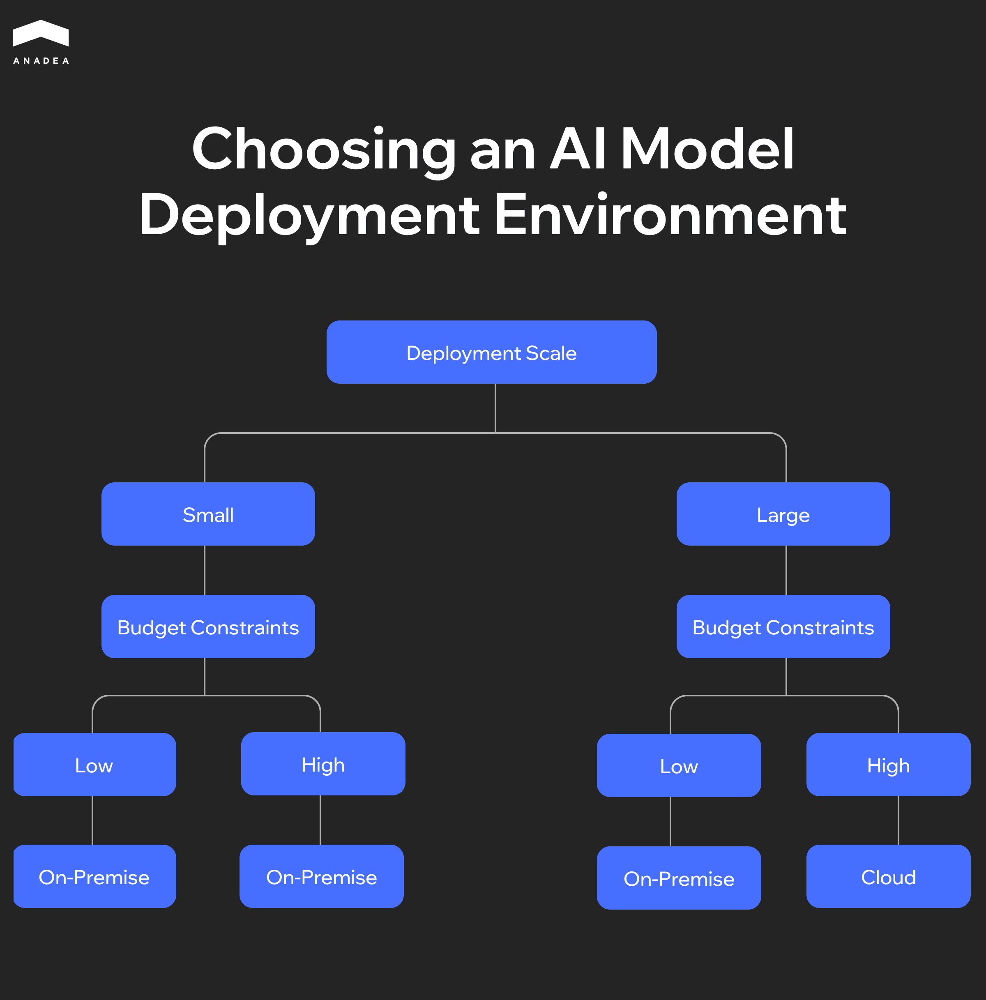

When businesses are beginning to integrate AI, the selection of the deployment approach is one of the most serious strategic decisions to be made. Anaconda’s [“State of Data Science” report ](https://www.anaconda.com/resources/report/state-of-data-science-report-2024)revealed that approximately 27% of organizations run most of their AI models on-premises servers in 2024. It is a notable decline from [41% in 2022](https://thenewstack.io/cloud-deployment-of-ai-models-jumps-says-data-science-study/). However, it doesn’t mean that on-premises deployment does not meet the modern needs of businesses.

According to the data provided by Gitnux,[ 68% of AI workloads that run in the cloud rely on hybrid architectures](https://gitnux.org/ai-in-the-cloud-computing-industry-statistics/) (they combine both on-premises and cloud resources).

Given the wide range of options, how can you determine which approach best aligns with your systems and workflows? You can find an answer in our article, where we will take a closer look at the available options and explain their benefits and potential challenges.

## AI Deployment: Key Terms You Should Know

Before we start discussing different AI deployment approaches, we should define the most important terms related to this topic. 

**On premise AI** deployment means that AI infrastructure and applications are hosted within an organization’s own servers or data centers. Hardware, software, and data remain under direct control of the enterprise.

**Cloud-based AI deployment** involves hosting and running artificial intelligence models and applications on cloud infrastructure. With an AI cloud platform, organizations can avoid heavy upfront investment in physical infrastructure.

There are several types of cloud that are often chosen for deploying AI systems.

* **Private cloud**. This cloud environment is dedicated to a single organization. Such an approach offers great scalability and cloud-native features. But at the same time, it allows businesses to maintain greater control and leverage the isolation of their AI models.
* **Public cloud**. In this case, resources in a cloud environment are shared across multiple customers but are isolated. It provides on-demand scalability and global availability.
* **Multi-cloud**. This approach is based on using the services of multiple public or private cloud providers simultaneously. Organizations that rely on this method avoid vendor lock-in and increase the resilience of their AI systems.
* **Hybrid cloud**. This option represents a combination of on-premise infrastructure with one or more cloud environments. It means that data and AI models can be moved between these two types of infrastructure to ensure higher flexibility and cost efficiency.

Traditionally, AI infrastructure was hosted on-premises. However, the introduction of cloud computing in 1997 paved the way for cloud-based AI solutions. Cloud AI relies on several key elements. Distributed processing divides large datasets across multiple machines. This boosts computation speed and efficiency, but it requires fast networks and careful coordination.

Since 2020, edge AI has emerged. It makes it possible to move AI inference closer to users on local devices or nearby systems. Thanks to this, organizations can minimize latency in dynamic operations. Nevertheless, model training is still usually done centrally as it has no direct impact on real-time user experience.

In our article, we will consider the most common models that represent the foundation of AI architectures. On-premises and cloud AI deployment types are two extremes. In complex AI systems, they are rarely used in their pure form. However, their comparison will help us illustrate the available options.

<table>

<tbody>

<tr>

<td> 

<strong>Parameters&nbsp;</strong>

</td>

<td>

<strong>On-premises AI deployment&nbsp;</strong>

</td>

<td>

<strong>Cloud AI deployment&nbsp;</strong>

</td>

</tr>

<tr>

<td>

Control

</td>

<td>

Full control over hardware, software, and data

</td>

<td>

Limited control; resources managed by the provider

</td>

</tr>

<tr>

<td>

Data security and compliance

</td>

<td>

Strong fit for sensitive/regulated data (PII, PHI, GDPR, HIPAA, and others)

</td>

<td>

Cloud providers offer certifications and compliance frameworks, but data sovereignty and cross-border restrictions can still pose limitations.

</td>

</tr>

<tr>

<td>

Latency

</td>

<td>

Low latency for local, real-time applications

</td>

<td>

May introduce latency depending on the internet connection

</td>

</tr>

<tr>

<td>

Scalability&nbsp;

</td>

<td>

Limited by local hardware; scaling requires new procurement

</td>

<td>

Virtually unlimited scalability with autoscaling features

</td>

</tr>

<tr>

<td>

Cost model

</td>

<td>

High upfront investments (hardware, licenses, setup) but lower ongoing operational costs

</td>

<td>

Pay-as-you-go model; costs tied to usage, but storage fees can add up

</td>

</tr>

<tr>

<td>

Required skills

</td>

<td>

Requires in-house expertise to manage GPUs, networking, storage, and security

</td>

<td>

Lower operational burden, managed services handle infrastructure

</td>

</tr>

<tr>

<td>

Portability

</td>

<td>

High (when open standards are used), but tied to local infrastructure

</td>

<td>

Depends on provider; risk of vendor lock-in unless portable frameworks (K8s, MLflow, Terraform) are used

</td>

</tr>

<tr>

<td>

Time-to-value

</td>

<td>

Longer (procurement, installation, configuration)

</td>

<td>

Fast (instant provisioning of compute and storage)

</td>

</tr>

</tbody>

</table>

## On-Premise vs. Cloud AI Deployment: How to Choose the Right Approach

At Anadea, we have been delivering[ custom AI development services ](https://anadea.info/services/ai-software-development)for more than 6 years. Over this time, we have accumulated solid expertise in building and deploying AI models and solutions of different types.

When we establish cooperation with our clients, we always attentively study their existing tech infrastructure and all their requirements for AI implementation. There are multiple parameters that must be analyzed before finding the right option. 

Now, based on our practical experience, we would like to offer you the following eight criteria that you should consider for evaluating the best fit for your organization.

### Data Sensitivity and Residency

Highly regulated data, such as PII, PHI, or workloads subject to GDPR/HIPAA or cross-border restrictions, may not be suitable for cloud deployment.

You should conduct a data classification workshop to determine which datasets require on-premise or hybrid handling.

### Latency and Performance

Real-time control systems demand low-latency and local processing. Meanwhile, batch analytics can tolerate higher latency.

To make the right decision, you need to estimate and compare latency from user regions to both cloud endpoints and local data centers.

### Scalability and Elasticity

The process of training workloads often spikes. At the same time, inference tends to be more stable. In this case, the elasticity provided by an AI cloud platform can reduce overprovisioning.

For evaluating these parameters, we recommend you try to forecast peak and average compute requirements. Based on them, it will be possible to define an autoscaling policy.

### Security and Isolation

Some deployments, especially in those domains that work with highly sensitive data, require strict isolation and advanced encryption controls.

You need to consider all available options and choose the one that can address your needs better than the others. To do it, it will be necessary to perform a threat-modeling exercise tailored to different deployment environments.

### Vendor Lock-In and Portability

Proprietary managed services may appear convenient and reliable. Moreover, their use can accelerate time-to-value. Nevertheless, AI cloud solutions may lack flexibility.

We recommend you opt for open standards and portable systems and tools such as Kubernetes or Terraform. For them, long-term portability is a priority.

### Total Cost of Ownership (TCO) and FinOps

On premise AI deployment requires long-term investments in your own infrastructure. Meanwhile, the use of cloud platforms is associated with recurring costs that are flexible and often unpredictable.

To analyze this parameter, you should develop a three-year TCO model comparing both approaches.

The following schema provides a quick reference for aligning your decision with your needs and resources. It can help you understand which option is more preferable in your case without a deep analysis.

### Talent and Operational Maturity

Running on-premise GPUs, storage, and networking requires specialized expertise, including such roles as DevOps engineers, MLOps specialists, and security engineers. These professionals ensure that infrastructure is optimized and secure.

Cloud deployment can reduce the operational burden. Cloud providers often offer managed services, automated scaling, and built-in security. This can help your team focus more directly on developing and deploying AI models, not on the tasks related to hardware maintenance.

You should conduct a skills gap assessment and determine whether your team can and is ready to manage on-prem operations.



### Time-to-Value

When you choose to run your AI services and models on the cloud, you can get the expected outcomes instantly. Running an on premise AI platform requires procurement and setup lead times.

To make up your mind, you need to compare deployment timelines and check whether they align with business objectives and project deadlines.

## Additional Options: Hybrid, Multi-Cloud, and Edge Patterns

When it comes to AI deployment, there are no one-size-fits-all solutions. To balance the performance, organizations are increasingly adopting hybrid, multi-cloud, and edge strategies. Each of these strategies follows distinct patterns that address different business and technical needs.

We’ve described the most popular strategies with their common use cases in the table below.

<table>

<tbody>

<tr>

<td>

<strong>Aspect for comparison</strong>

</td>

<td>

<strong>Hybrid</strong>

</td>

<td>

<strong>Multi-cloud</strong>

</td>

<td>

<strong>Edge AI</strong>

</td>

</tr>

<tr>

<td>

Key characteristics

</td>

<td>

Mix of on-premise and cloud infrastructure; sensitive data is often stored on-premises.

</td>

<td>

Workloads are distributed across multiple cloud providers.

</td>

<td>

AI is deployed close to data sources on devices or local servers.

</td>

</tr>

<tr>

<td>

Common use cases

</td>

<td>

Training in the cloud, inference is conducted on-premises. Often used for compliance-driven workloads.

</td>

<td>

Used for critical workloads requiring high resilience;

helps avoid vendor lock-in

</td>

<td>

Low-latency inference: used for autonomous vehicles, industrial robotics, AR/VR solutions

</td>

</tr>

<tr>

<td>

Advantages

</td>

<td>

Balance between control, performance, and scalability; compliance with regulatory requirements

</td>

<td>

Resilience, reduced provider dependency

</td>

<td>

Ultra-low latency; compatibility with intermittent connectivity; improved privacy via federated learning

</td>

</tr>

<tr>

<td>

Challenges

</td>

<td>

Complexity in integration; requires robust networking and security

</td>

<td>

Higher operational complexity; requires portability tools (like K8s, IaC, etc.)

</td>

<td>

Limited compute resources; model updates and management can be complex; risk of fragmented infrastructure

</td>

</tr>

<tr>

<td>

Use case examples

</td>

<td>

Sensitive patient data on-premises, analytics in the cloud;&nbsp;

financial data processing on-premises, fraud detection in the cloud

</td>

<td>

E-commerce personalization across AWS, Azure, Google Cloud;&nbsp;

global logistics optimization using multiple providers

</td>

<td>

Predictive maintenance on factory equipment;&nbsp;

autonomous vehicles processing sensor data on-device;&nbsp;

smart cameras for real-time security alerts

</td>

</tr>

</tbody>

</table>

## Recommendations for AI Deployment: Real-life Scenarios

The choice of an AI deployment model heavily depends on the industry context and workload characteristics. Let’s consider a couple of practical scenarios with recommended strategies.

### Highly Regulated Bank with Data Sovereignty Needs

In this case, we recommend you consider deployment on-premises or on a sovereign cloud, combined with a hybrid AI pattern.

Retrieval-augmented generation (RAG) pipelines should run on-premises to keep sensitive data within the organization.

Meanwhile, for some non-sensitive workloads like model experimentation, you can leverage the benefits of cloud environments.

### Fast-Scaling SaaS Provider with Bursty Demand

The cloud-first approach with elasticity at the core can become the best option. Cloud-native services fully align with the agility needs of SaaS platforms. In addition to this, they reduce overhead and can efficiently support unpredictable workload spikes.

You can also rely on multi-region cloud inference to ensure low latency for global users.

### Manufacturing Firm with Edge Constraints

Our experts recommend opting for an edge-centric deployment model with cloud training.

Real-time inference on local devices will be a very good choice for robotics, quality control, and predictive maintenance. On-premise servers can be used for aggregating factory-level data securely.

Moreover, you can conduct centralized cloud training. This option will allow you to build global models that benefit from aggregated insights across facilities.

### Research Institution Collaborating Internationally

Institutions can leverage the benefits of hybrid cloud with federated learning.

In such a case, local data stays within each partner’s jurisdiction. At the same time, model updates are shared across institutions without exposing raw data.

This approach balances privacy and sovereignty requirements. That’s exactly what is needed for collaborative, large-scale research.

### E-Commerce Platform Driving Personalization

For an e-commerce business, it is crucial to ensure both resilience and flexibility. To achieve this goal, the multi-cloud deployment model will be the best solution.

The processing of customer data should take place in a compliant primary cloud. For redundancy, it will be vital to deploy recommendation models and personalization engines across multiple providers.

This approach will reduce the risk of outages during peak shopping periods and provide negotiation leverage with providers.



## Final Word

The importance of the right AI deployment strategy shouldn’t be underestimated. It is a strategic step that will predefine the performance and success of your AI systems.

There is no universal winner between on-premise and cloud AI platforms. Each model has its strengths and weaknesses. For example, the on-premise approach ensures better control and compliance. Meanwhile, the cloud is a recommended option for scalability and speed. The right choice should always depend on your data sensitivity and long-term strategy. 

It doesn’t matter whether you already have a good vision of your project and the deployment approach, or you are just at the very beginning of your AI journey. At Anadea, we can provide you with our professional help. Our expertise covers a full range of services from AI consulting to model deployment and maintenance of AI systems. [Contact us](https://anadea.info/free-project-estimate) to learn more about our cross-domain expertise and to receive project estimates from our specialists.
