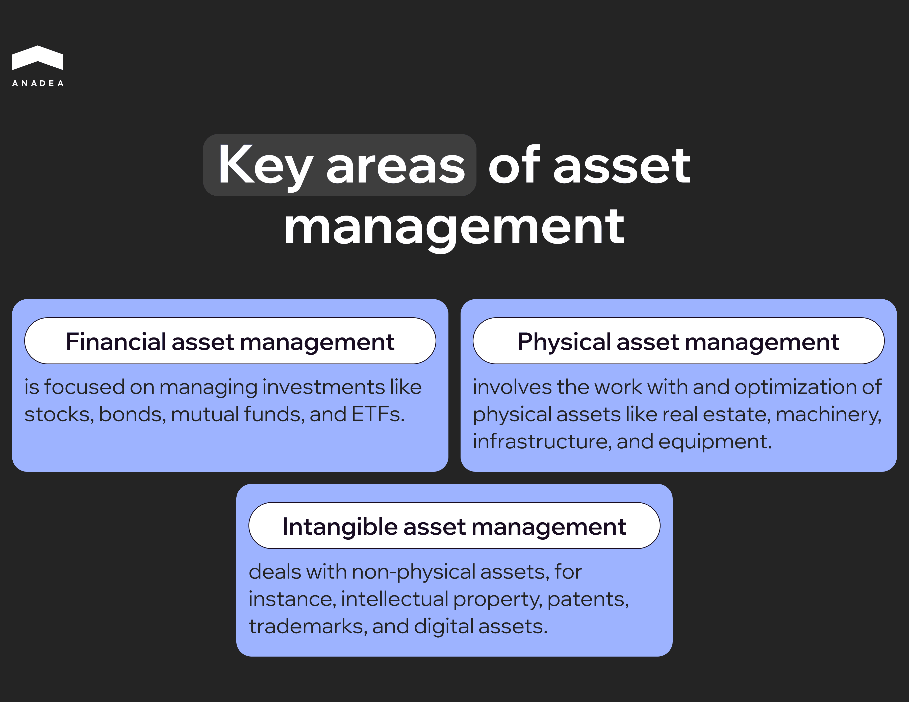
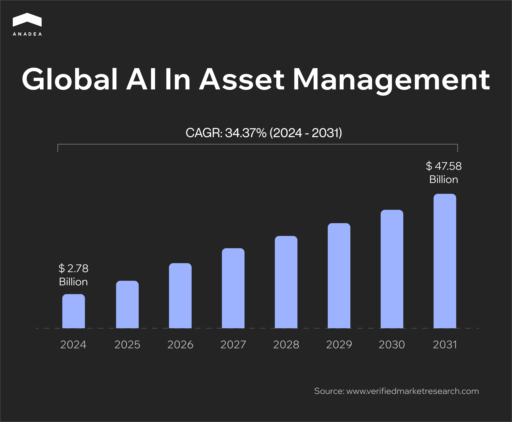
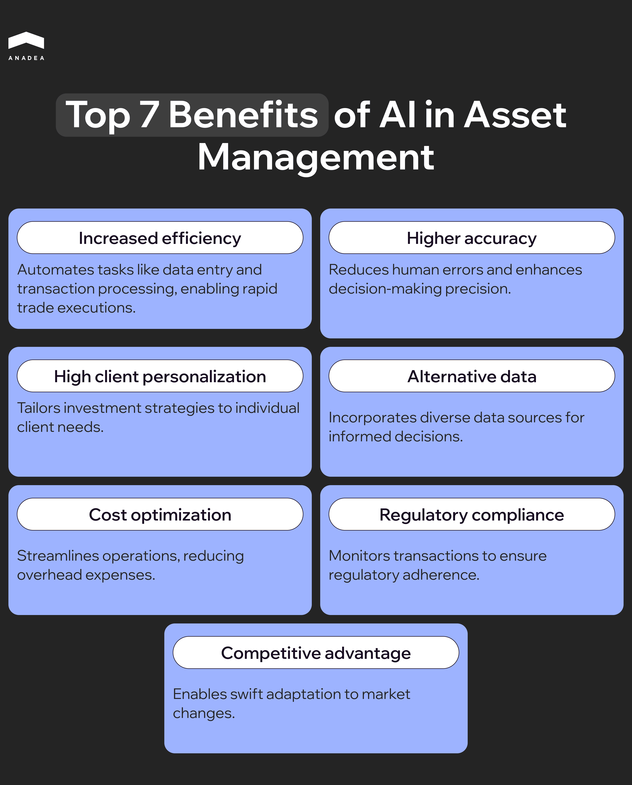

Today we can observe how the AI revolution is gaining momentum. Yes, we should admit that there are still some people who demonize artificial intelligence. Nevertheless, the general sentiments have changed. Fears that AI will take all our jobs are being gradually replaced by the idea that AI can become a powerful tool in the hands of skillful experts. AI-powered solutions definitely can make a lot of processes much more efficient and result-oriented across multiple industries and domains. This can be brightly demonstrated by the [AI use cases in business](https://anadea.info/blog/how-to-implement-ai-in-business/) and the financial industry in general, as well as asset management in particular.

In this article, we’d like to talk about the application of AI in asset management, the benefits of this technology, and the trends that have a direct impact on industry development.

## Asset management: Basic info

Before we proceed to discuss tools powered by AI for asset management, it’s worth diving deeper into the basics.

Asset management is the term used to describe the systematic process of developing, operating, and maintaining assets, including financial, physical, and/or intangible ones. All the related efforts are aimed at maximizing the value of these assets, optimizing returns, and reducing associated risks.

Such processes are widely applied in such areas as finance, investments, real estate, and business operations. 

### Key areas of asset management

* ***Financial asset management*** is focused on managing investments like stocks, bonds, mutual funds, and ETFs. It includes portfolio management, market analysis, and asset allocation. The main idea behind these efforts is to help businesses and individuals achieve their financial goals.
* ***Physical asset management*** involves the work with and optimization of physical assets like real estate, machinery, infrastructure, and equipment. Correctly organized efforts in this domain ensure the extension of the lifecycle of the relevant assets and the reduction of costs associated with their maintenance and downtime.
* ***Intangible asset management*** deals with non-physical assets, for instance, intellectual property, patents, trademarks, and digital assets. Thanks to this, it is possible to efficiently use these resources to generate revenue or maintain a competitive advantage.

### Who can be responsible for asset management?

In the context of using AI in asset management market, it’s crucial to mention those parties that will deal with this technology in the first turn. It will be a group of entities and specialists who are directly involved in the asset management processes.

* ***Asset management companies.*** Today there are a lot of organizations that manage portfolios for clients to maximize investment returns. The most prominent names include BlackRock, Vanguard, and Fidelity.
* ***Financial advisors.*** These are professionals who offer personalized strategies for managing individual or institutional portfolios.
* ***Corporate asset managers.*** These can be internal specialists. Their key task is to optimize companies’ tangible and intangible assets.
* ***Government agencies.*** They can be assigned to oversee public infrastructure, utilities, and other national or regional assets.

The size of this industry that can be greatly affected by the introduction of AI looks quite impressive. In 2023, the global asset management market [was valued at $371.62 billion](https://finance.yahoo.com/news/global-asset-management-market-size-070000569.html). By 2033, it is projected to reach the mark of $7124.41 billion. These figures indicate that the CAGR during the projected period will be over 34%.

## AI in asset management: Quick overview

It would be wrong to say that the combination of AI and asset management is something absolutely new. This duo entered the game several decades ago when the development of the first AI software tools began. 

However, significant progress was achieved not so long ago. For example, at the beginning of the 21st century, hedge funds started applying simple AI algorithms to streamline and automate their operations. But of course, these were not the algorithms that are created today. Since that time, the technology has greatly evolved and AI models have become much more sophisticated.

Over the past few years, the adoption of artificial intelligence in asset management has definitely skyrocketed. Now AI and ML models can process vast datasets, which helps to ensure much more precise predictions. 

Nowadays, the use of AI is not limited to [fintech](https://anadea.info/blog/ai-in-fintech/) startups and technology-oriented companies. Even market behemoths with a long history like BlackRock and Vanguard use [AI tools](https://www.forbes.com/sites/randybean/2024/09/24/how-vanguard-is-innovating-with-data--ai-in-the-money-management-business/) to help their customers achieve financial goals and enhance their experience.

In 2024, the [size of AI in asset management market is around $2.78 billion](https://www.verifiedmarketresearch.com/product/ai-in-asset-management-market/#:~:text=AI%20In%20Asset%20Management%20Market%20size%20was%20valued%20at%20USD,manage%20and%20optimize%20financial%20assets.). According to experts, the market can grow up to $47.58 billion by 2031, with a CAGR of over 34% during the period from 2024 to 2031.

What factors boost the market growth? Analysts name a group of them.

* ***Financial markets’ complexity.*** The financial markets, their products, and processes are gradually becoming more and more complicated. It is becoming more difficult to deal with all the related information without the help of digital tools in order to make correct decisions. Here’s when AI can enter the game. AI technologies can provide insights into diverse asset classes and analyze the performance of numerous digital instruments at the same time. Given this, it could be sensible to presuppose that the demand for AI systems in this domain will continue growing.
* ***Access to huge volumes of data.*** Today there are a lot of data sources that can be taken into account to ensure more precise risk assessments and predictions. AI can be of great use when working with big data.
* ***Adoption of and the need for personalized investment solutions.*** Artificial intelligence can also be applied to create investment strategies for individuals and businesses tailored to their requirements. Such solutions can provide investment recommendations based on specific preferences and risk profiles. This helps to achieve better portfolio performance and higher client satisfaction. 
* ***Progress in the AI space.*** These days we can observe amazing achievements in the [development of AI solutions](https://anadea.info/services/ai-software-development). These innovations can (and should) be efficiently used in the asset management industry. To stay afloat, companies working in this sphere need to be open to experimenting with new tools. That’s why it comes as no surprise, that the growing number of businesses are interested in building and implementing AI systems.

In 2024, the BCG consulting firm published its [report](https://www.bcg.com/publications/2024/ai-next-wave-of-transformation) on the AI transformation in asset management. For preparing this report, they communicated with asset managers to collect their opinions on the importance and potential use of AI in their activities. 

The majority of respondents believe that in the short term, we will observe significant transformative changes in their industry. At the same time, two-thirds of survey respondents were planning to implement at least one generative AI tool within a year or were already relying on one or more GenAI use cases.

## AI asset management use cases

To better understand why the interest in AI solutions from the side of asset managers is growing, it is vital to consider their use cases in this domain.

### Data analysis and insights

This is one of the main AI use cases in asset management today. AI can process vast amounts of structured and unstructured data. This helps to uncover trends and make predictions. Already today, companies apply machine learning and natural language processing tools to solve their tasks related to market forecasting, risk assessment, and sentiment analysis. Moreover, NLP is one of the core technologies for detecting market sentiment. It can analyze news articles, tweets, and other text sources to provide actionable insights.

### Portfolio management

AI can identify key market drivers and factors that influence portfolio performance. AI-powered systems can also adjust portfolios in real time to respond to market changes and help in achieving strategic time-sensitive objectives.

### Risk management

ML models are used to predict potential market downturns or asset-specific risks. To do this, models need to work with both historical and real-time data. Apart from this, AI can be applied to simulate extreme market scenarios. This can be helpful to assess how portfolios might perform under stress.

### Fraud detection

ML and AI solutions are expected to play the most crucial role in enhancing the security of financial transactions and protecting personal data in the near future. However, even today a lot of companies rely on such technologies in this aspect. These models are extremely good at detecting patterns and identifying even the slightest signs of deviation. If any anomalies or suspicious activity are noticed, AI tools can immediately take the required measures. For example, they can block a transaction or close access to the system. 

### Algorithmic trading

Thanks to AI-driven systems, it is possible to achieve a new level of efficiency in trading. High-frequency trading solutions are built to execute trades in milliseconds. This allows businesses and individuals to capitalize on short-term opportunities. Sophisticated algorithms can successfully detect price trends or recurring patterns to make profitable trades. Apart from this, AI can react to market changes instantly. That’s why even if some unforeseen changes occur, AI systems can ensure optimal trade execution.

### Decision-making support

AI models can simulate potential market conditions based on different source data. This helps managers prepare for a range of outcomes and take proactive measures if it is required. AI systems can also send real-time alerts in case of market shifts or portfolio performance issues. Such notifications are usually sent much more quickly than managers can notice any alarming situations on their own.

### Client support

This use case is not unique to asset management. However, in this domain, it can also play a very important role. AI-driven chatbots and virtual advisors provide round-the-clock assistance and updates. Thanks to 24/7 support, customers can get answers to their questions at any moment just within a couple of seconds. At the same time, companies don’t need to expand their customer support departments and increase their expenses. 

You can read more about various chatbot types and their role in the business world [here](https://anadea.info/blog/different-types-of-chatbots/).

## Top 7 benefits of AI in asset management

Based on the above-mentioned AI use cases in asset management, we can define the key benefits of artificial technology for this domain.

1. ***Increased efficiency.*** AI can make the work of asset managers much more productive. Automation of time-consuming tasks such as data entry, reporting, and transaction processing, helps to free up resources for strategic activities. Moreover, AI tools help to execute trades really fast, just in milliseconds. Such speed is not possible in those cases when all the processes should be performed and managed manually.
2. ***Higher accuracy.*** This benefit is relevant practically to all the tasks associated with asset management. The use of tools powered by artificial intelligence minimizes the number of errors caused by the human factor. Another point that contributes to the accuracy of predictions and decisions is the possibility of AI to take into account all the data that is available. A person physically can’t do that.
3. ***High client personalization.*** By using AI systems, asset managers can offer clients investment strategies that are fully tailored to their needs. AI can customize portfolios to individual client preferences, risk tolerance, and objectives. Moreover, such systems can automatically analyze client behavior to predict needs and enhance engagement.
4. ***Use of alternative data for better decision-making.*** AI can rely not only on standard market data and reports. It can also integrate non-traditional data sources like social media and even weather patterns. Such sources provide additional layers of context beyond traditional financial metrics. As a result, businesses and individual clients can leverage unique investment opportunities.
5. ***Cost optimization.*** Thanks to automating back-office tasks, companies can achieve better operational efficiency and reduce overhead costs. With feature-rich systems at their disposal, asset managers can deal with larger portfolios with fewer resources. This allows them to reduce the need for additional staff and improve profitability.
6. ***Regulatory compliance.*** AI can continuously monitor all transactions and processes. This automated monitoring can play a very important role in ensuring adherence to complex regulatory requirements. These requirements can be updated quite often. That’s why it is important to stay tuned to what is happening in this field. Today companies can assign this task to AI. Apart from this, AI tools can generate detailed and compliant reports for clients and regulators.
7. ***Competitive advantage.*** Firms that use AI can react faster to all market changes and adapt to them. This lets them leave all their competitors behind. Moreover, they can ensure process transparency, personalization, and enhanced performance more easily than their rivals who stay indifferent to innovations. Thanks to doing this, they can boast enhanced trust from the side of clients and establish stronger relationships with them. 

## AI for asset management: How to implement it?

The integration of AI into asset management presupposes quite a serious transformation for organizations. It’s not just about the launch of a new tool. It’s more about changing and enhancing the processes. This transformative journey requires careful preparation, a commitment to innovation, and relevant expertise. And the first step here is planning. Before proceeding directly to building and implementing new solutions, you should have a clear vision of how it should be done.

### Step 1. Setting goals and objectives

First of all, you need to determine key areas where AI can have the most impact. It can be portfolio optimization, risk management, client personalization, or operational efficiency, for example. In the beginning, we recommend you focus on just one or a couple of areas, not on all of them at once. If everything goes well, you can gradually expand your AI system. This will make your business transformation as seamless and smooth as possible. 

Secondly, do not forget to define measurable objectives with clear timelines. They will help you evaluate the results of your efforts. For instance, it can be the reduction of operational costs by 20% in 3 months or the reduction of time needed for performing particular tasks by 50% in 2 weeks. 

### Step 2. Estimation of your current capabilities

You should evaluate your existing infrastructure. Pay attention to your current systems, data storage, and processing capabilities. Are they fully ready for AI integration? Is the quality of data good enough for training AI and ML models? Do your employees have all the required skills and knowledge to work with AI? 

 If not, identify gaps and areas for improvement.

### Step 3. Data preparation

You should centralize all the business data that you have. To do this, it is necessary to consolidate data from multiple sources into a unified platform. 

Then, it is vital to ensure high data quality. It is vital to clean, normalize, and structure it. Do not forget that the work of your AI system fully depends on the accuracy and reliability of the data that it uses.

### Step 4. Cooperation with experts

Quite often businesses that think about using AI for asset management do not have in-house AI professionals. And here is the first difficulty that they can face. Who will help them in building and implementing AI systems? One of the most popular solutions in this case is establishing cooperation with a reliable outsourcing agency with relevant expertise.

Artificial intelligence is the trendiest technology today. Given this, there appear a lot of companies that want to monetize this hype around it and offer their services in AI software development. Nevertheless, such teams often lack the necessary knowledge and skills.

That’s why it’s crucial to find a company that has a track record in this field. It can be a good idea to consider not only the information on the company’s website but also reviews on external platforms. Clutch or GoodFirms can be a good choice for conducting your own research.

You need to pay attention to teams’ portfolios and terms of cooperation. It’s also important to have similar values and business vision. Thanks to this, you can expect that all your requirements will be understood in the right way.

### Step 5. Selection of AI tools and technologies

Here, you will need to discuss with stakeholders and the project team your approach to AI implementation. Will you use off-the-shelf solutions and just customize them? Or will you build your own custom system from scratch?

Both approaches have their pros and cons. While ready-made robo-advisors, automated trading systems, or analytics tools can be introduced rather quickly, the integration and customization opportunities are limited.

Custom development takes more time. But in this case, you can be sure that your proprietary models will be tailored to your specific business needs.

### Step 6. Development and implementation

The [AI development process](https://anadea.info/blog/how-to-create-ai-software/) can be organized in different ways based on the chosen methodology. Its timelines can also greatly differ. This depends on your project scope and the tasks that you have for your development team. 

Nevertheless, in the majority of cases AI asset management projects start with pilot solutions for specific areas. Before scaling them up, you need to make sure that they perform well and bring the desired results.

It’s also crucial to ensure their compatibility with your business solutions like ERPs or CRMs. As a rule, it is possible to connect different systems with the help of APIs or middleware.

### Step 7. Continuous monitoring and system optimization

When the system is launched, you need to monitor the set performance indicators like return on investment or operational efficiency. But it is not enough to rely only on such parameters to have a clear vision of the system’s performance. You also need to listen to its end users and clients. Their feedback can be highly valuable to make your system better.

Moreover, it is recommended to regularly update and retrain your AI models to keep them relevant in changing market conditions.

### Step 8. Promotion of innovations

It’s not enough just to launch your artificial intelligence asset management system. You also need to prepare your staff for that and change people’s mindsets if necessary. You need to educate stakeholders about the benefits and limitations of AI. This will reduce resistance and ensure alignment.

It’s vital to demonstrate that AI tools can and will complement, rather than replace, human expertise. End users should understand your AI strategy and its key goals.

In general, it is very important to stay open to innovations and not to be afraid of experimenting with emerging tech. You can look for new ways to combine AI with other promising technologies like blockchain, IoT, or quantum computing. However, all these experiments shouldn’t be conducted “just because it is recommended to do it”. You should always clearly know why you are doing this and what outcomes you expect to get. 



## Challenges of using AI for asset management

Though the implementation of AI in the asset management industry is a highly promising initiative, it can be associated with a row of challenges. It’s always worth considering them in advance in order to be well prepared to handle them.

### High initial costs

The implementation of AI systems involves significant upfront investment. This money should be allocated to technology, infrastructure, and talent acquisition. 

*Solution:* To address these issues, it is recommended to develop a phased implementation plan to spread costs and efficiently plan budget allocation.

### Data quality

AI models for asset management require high-quality diverse datasets to function effectively. Inconsistent or incomplete data can lead to inaccurate predictions and decisions.

*Solution:* Before AI implementation, it is necessary to establish robust data management practices. Cleaning, normalizing, and integrating data from multiple sources are essential.

### Bias in algorithms

Data used for training AI models may include bias. This can lead to unfair or unethical outcomes.

*Solution:* To avoid this, it is recommended to conduct rigorous testing to identify and mitigate biases. Moreover, regular updates of models with diverse and representative datasets are required.

### Over-reliance on historical data

Modern AI models often rely on historical data. This may lead to inaccurate predictions of future market conditions.

*Solution:* To increase the quality of outcomes, it is obligatory to incorporate real-time data and scenario analysis. 

### Cybersecurity risks

AI systems are becoming more sophisticated. The same can be said about the methods applied by cybercriminals and fraudsters. Their attacks can lead to data breaches and model manipulation.

*Solution:* To minimize risks, companies need to invest in robust cybersecurity measures, such as encryption, multi-factor authentication, and regular security audits.

## AI in asset management in 2025: Key trends

The asset management industry is rapidly evolving. This requires AI systems to adapt to the ongoing changes. Here are the trends that are expected to redefine the landscape in the near future.

### Growth of personalization

Today customers expect a highly personalized approach. They want to get services that fully correspond to their needs. And AI can ensure this. It can help to tailor portfolios to individual investor preferences and risk tolerances. AI-driven platforms can provide clients with personalized insights, advice, performance updates, and recommendations. The delivery of such personalized services can become a huge competitive advantage for asset managers. And it is vital especially now, when the adoption of AI is still gaining momentum in this market.

### Ethical AI and explainable models

For the majority of non-tech experts, everything that is done by AI looks just like magic. However, when it comes to asset management, clients and regulators usually want to know how and why this or that decision is made. Given this factor, explainable AI (XAI) is one of the trends these days. The principles of XAI rely on the idea of transparency, interpretability, and trust in AI systems. These principles ensure that AI models are not only effective but also understandable and accountable to humans. Apart from this, significant efforts are invested in reducing algorithmic bias. This is expected to become a standard practice to ensure fair and ethical outcomes.

### Increased collaboration between AI and humans

These days we can observe the growing trend of augmented decision-making. This concept presupposes that AI should act as a powerful assistant for asset managers. It should augment human expertise with data-driven insights, while still leaving the responsibility for making final decisions to people. In the near future, the focus will remain on creativity and strategic planning. Asset managers will rely on AI for operational tasks. However, in such processes as planning and client relationships, they will still play the most important role.

### AI and blockchain synergy

AI and blockchain can be a good combination. These two emerging technologies can efficiently complement each other’s advantages. For instance, AI can enhance blockchain-based systems for transparent and automated transactions in asset management. At the same time, blockchain can ensure the secure sharing of AI-generated insights among stakeholders.

### Expansion of ESG investing

Environmental, social, governance investing is rising in popularity as investor demand for sustainability is growing. AI can be used to analyze large-scale data to evaluate ESG factors and provide comprehensive sustainability assessments. Already today, asset managers use AI tools to quantify the social and environmental impact of investments.

## Artificial intelligence in asset management: What to expect in the future?

The use of AI solutions in asset management can greatly change the landscape of this industry. Such transformation can be of high importance not only for asset managers directly but also for their clients. Optimization of processes in combination with enhanced efficiency and accuracy of made decisions are among the most important benefits of such solutions.

Already today AI is much more than just a tool. This technology can fully revolutionize the processes for all market players.

It is expected that in the future asset management will benefit from increasingly sophisticated AI tools even more than now. One of the examples of possible advancements in this sphere is the introduction of next-generation ML models. They will be faster, more powerful, and capable of processing massive datasets with exceptional accuracy. 

One more aspect that is likely to change in the near future is regulation. New regulatory frameworks may emerge to promote ethical AI use and ensure transparency. Governments and regulatory bodies are working on the implementation of new standards for AI. They can bring enhanced fairness, accountability, and clear decision-making processes.

## Final word

However, to fully leverage all possible benefits of AI, you need to have a reliable partner with relevant expertise by your side. If you are looking for a professional team for this role, we, at Anadea, are always open for cooperation.

We have been successfully working with AI for a while already and deeply understand how this technology can empower asset management.

Want to learn more about our services and terms of cooperation? Do not hesitate to [contact us](https://anadea.info/free-project-estimate)! And if you already have an idea for your project, share your requirements with us. We will analyze them and provide estimates for free.
