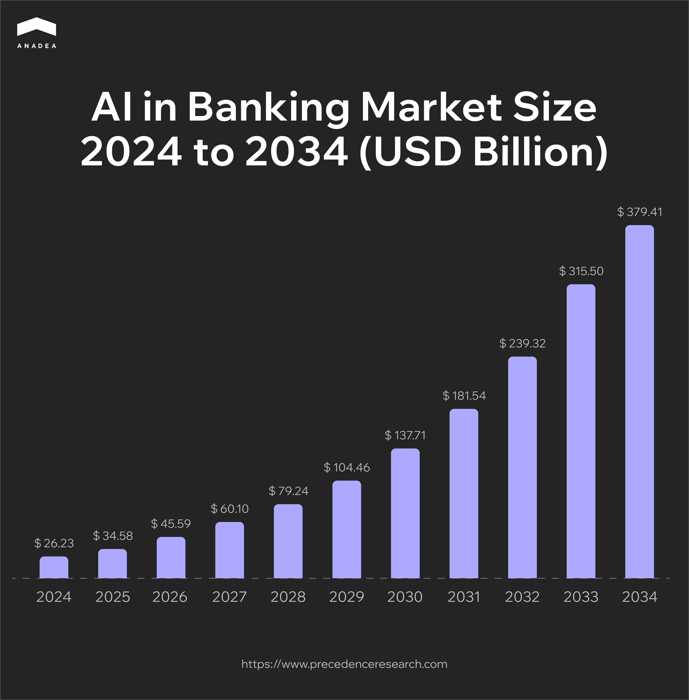
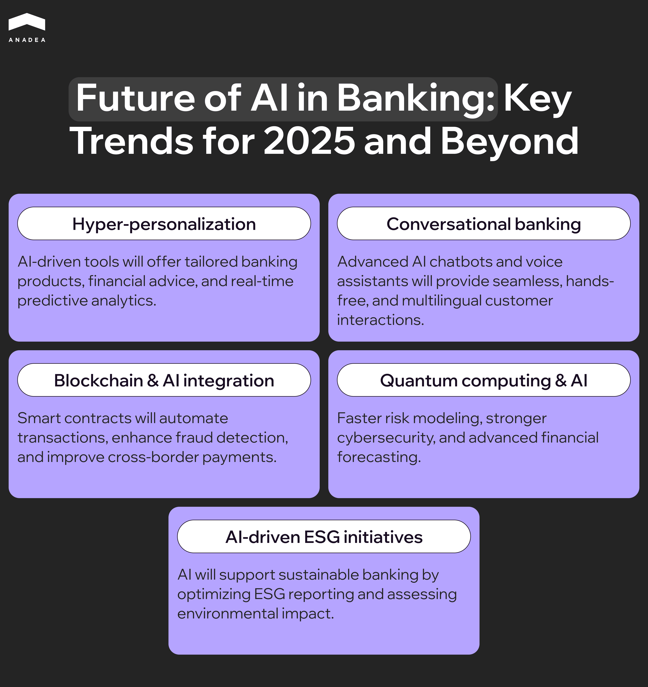

Today it has become obvious that AI is not just a buzzword or a modern trend. Artificial intelligence can bring real changes to different sectors. And a lot of businesses across many industries have already started implementing [AI solutions](https://anadea.info/services/ai-software-development) that can fully transform the way they used to work before. One of the domains that can greatly benefit from the introduction of this technology is banking.

Already today there are some common use cases of AI in banking and finance. But what is even more important is that there are clear prospects for the development of such solutions in the future. In this article, we are going to talk about the present and the future of AI in banking. Apart from this, we will mention the most significant challenges that you should be aware of if you are considering the implementation of AI systems in this sector.

## Role of AI in banking: Quick overview

In 2024, the size of the global AI in banking market reached $26.23 billion. In 2025, it is estimated at [$34.58 billion](https://www.precedenceresearch.com/artificial-intelligence-in-banking-market). By 2034, it is projected to hit the mark of around $379.41 billion. It means that the market will be expanding with a CAGR of 30.63% within the period from 2025 to 2034.

### What factors are driving the market growth?

* ***Tech integration across industries***. AI adoption is accelerating due to increasing technological integration across various sectors, including automotive, manufacturing, and healthcare. Banking and finance are also among the sectors that are actively implementing tech solutions in their processes.
* ***Productivity and operational enhancement***. Although banking used to be one of the most traditional industries that mainly relied on legacy approaches and solutions, today everything has changed. To improve efficiency, enhance a consumer-centric approach, and maintain tech relevance, banks need to integrate AI and ML into their operations. These technologies help them streamline their workflows, reduce operational costs, and stay afloat amid the growing competition.
* ***Cybersecurity and risk management***. The rising cases of cybercrime and financial fraud have increased the demand for AI-powered fraud detection and prevention solutions. Such tools demonstrate high efficiency in identifying alarming signs and suspicious activities even before they start posing real threats.
* ***Demand for personalized banking services***. Today personalized customer experiences across various industries, including banking, are gradually becoming a standard. To deliver such experiences, financial institutions need to find the right approach to processing big volumes of data. And that’s exactly what AI tools can offer them.

According to the report published in 2024, more than [72%](https://www.pymnts.com/tracker_posts/is-ai-the-master-key-to-bankings-next-era/) of finance leaders stated that they had already started using AI. 

As for the exact use cases and areas of application, we can observe the following situation:

* 64% of financial institutions rely on AI for fraud detection;
* 64% for risk management;
* 57% for investment management;
* 52% for automation.

42% of bank executives admitted that they view AI as a promising technology for automating customer onboarding. Meanwhile, 25% of respondents revealed plans and ideas related to applying AI to ensure better customer experiences.

Moreover, already at the end of 2023, Ernst & Young posted its 2023 Financial Services GenAI Survey that demonstrated that [99%](https://www.ey.com/en_us/newsroom/2023/12/ey-survey-ai-adoption-among-financial-services) of the financial services companies had implemented AI in some manner. What is interesting here is that all respondents were either already using, or planning to use generative AI (GenAI).

Capital One, JPMorgan Chase, and the Royal Bank of Canada are AI adoption leaders among banks in the Americas and Europe. 

Such wide implementation of this technology at different financial institutions, including the most prominent banks in the world, can be a sign of a very bright future of AI in banking. Nevertheless, before proceeding to discuss what can happen in the industry in the years to come, let’s focus on the current achievements and progress.

## The most common AI applications in banking

To better understand how artificial intelligence is used in this industry, it will be helpful to analyze how banks can utilize this technology to address the needs of their employees and customers.

### Fraud detection and prevention

As recent research revealed, this is one of the most popular AI applications in banking. AI algorithms analyze transaction patterns in real time to detect unusual or suspicious activities, flagging potential fraud. For example, solutions of this type can identify such deviations from normal behavior as unexpected large transactions or unusual login locations.

Apart from this, systems powered by AI can efficiently predict potential fraud risks. Their predictions are based on the analysis of historical data and ongoing industry trends related to fraudulent activities.

### Customer service 

AI-powered chatbots and virtual assistants can handle customer inquiries, provide account information, and assist with transactions 24/7. This is possible thanks to natural language processing (NLP). This technology lets AI understand customer queries made in natural human language and process them. As a result, chatbots can provide accurate and context-aware responses.

It’s necessary to highlight that the use of AI in customer services helps banks not only reduce the time needed for processing inquiries but also make interaction with customers more personalized. Chatbots can offer personalized recommendations and support based on customer data and past communication.

Apart from that, artificial intelligence can be used to analyze customer interactions. This helps to gauge sentiment and identify dissatisfied customers. With such data at hand, banks can address issues proactively.

### Credit scoring and risk assessment

AI can greatly change a traditional approach to credit scoring. In addition to analyzing some basic data like personal and employment information, AI can also use non-traditional data sources. For instance, it can also take into account social media activity and utility payments to assess creditworthiness. This possibility is especially valuable for individuals with limited credit history.

Banks can also rely on machine learning models to predict the likelihood of loan defaults. To provide such insights and enable more accurate risk assessment, ML can analyze a wide range of personal and social factors.

Moreover, advanced AI systems can be applied for loan approval automation. Of course, right now it is too early to speak about complex cases (here, human participation is a must). However, in some standard situations with predefined criteria, AI can quickly analyze applicant data and make loan decisions.

### Personalized banking and financial advice

The capability of AI to personalize customer experiences is valuable not only for increasing the quality of support service. It can also greatly enhance banks’ recommendation systems. AI analyzes customer data to provide personalized offers and financial products, like credit cards, loans, or investment opportunities.

Robo-advisors are an example of AI in investment banking. They can deliver personalized investment tips. These tips are created automatically based on customer goals, risk tolerance, and market conditions.

One more use case of AI in banking and finance from this category is spending analysis. AI tools can identify and analyze customer spending patterns, as well as offer insights and recommendations for better financial management.

### Automation and operational efficiency

This application is directly related not to the interaction with customers but to inner workflows. Nevertheless, it still has a great impact on customer experience. The better inner processes are organized, the better the quality of services can be.

AI plays a crucial role in process automation. It can perform a wide range of routine tasks such as data entry, document verification, and compliance checks. This helps to reduce operational costs, increase the speed of performance, minimize the number of errors, and improve efficiency.

AI-powered optical character recognition and NLP can extract and process information from documents. This is highly valuable for speeding up processes like loan applications and account openings.

Moreover, AI can optimize internal workflows by predicting bottlenecks and suggesting improvements.

### Customer insights and marketing

The next application of AI in banking and finance is quite common for many other industries as well. As artificial intelligence can process big volumes of data, it can help banks to learn more about their customers. Such insights can become a robust foundation for building a comprehensive marketing strategy.

AI can analyze various data about customers to segment them into groups based on behavior, preferences, and demographics. Such segments are crucial for targeted marketing campaigns.

Apart from analyzing, AI can also predict customer behavior. For instance, it can detect the potential for cross-selling some extra services. With such predictions, banks can better tailor their marketing strategies to the needs of different customer groups.

### Voice banking

Voice-activated banking has already become a trend in the industry. AI-powered voice assistants allow customers to perform banking tasks like checking balances, using voice commands. First of all, that’s an important step toward inclusivity. Now, even people with different types of disabilities, can get secure access to remote banking services. Secondly, it can be also quite helpful for a wide audience. Such hands-free experiences can support multitasking. This technology can allow users to perform various banking tasks while driving, cooking, or doing many other things.

One more case where such technology is applied is voice recognition. It can be utilized as a secure and convenient alternative to traditional passwords to authenticate customers.

### Reporting and regulatory compliance

Banking is a highly regulated industry. It means that institutions need to adhere to strict laws, guidelines, and compliance requirements set by regulatory bodies. This ensures financial stability, consumer protection, and the prevention of fraud, money laundering, and other illicit activities. However, the regulatory space is quite dynamic. Rules and laws can change quite often. 

As a result, banks need to continuously track such updates and make sure that their activities remain compliant with the regulations. All this can be a very complicated task when performed without any supportive tools. And AI can become such a tool.

AI systems can analyze large volumes of transactions to identify patterns indicative of money laundering, which helps banks comply with regulatory AML requirements.

Moreover, AI is often used to automate the KYC process by verifying customer identities and cross-referencing data with global watchlists.

In addition to all this, AI can streamline the process of generating and submitting regulatory reports. With their help, banks can automate data collection and analysis, as well as the process of creating reports of various formats based on different requirements.



## Real-life examples of AI in banking and finance

Here’s how some of the most prominent banking institutions are using artificial intelligence in their operations in 2025.

### Nubank

Nubank is harnessing the cutting-edge technology through its real-time event AI dubbed Precog. This tool is aimed at enhancing customer service interactions. Precog leverages AI to anticipate customer needs in real time and can enable faster and more personalized support.

The idea behind the solution is to view all customer actions, like app clicks and transactions, as a language that can help to identify intents. By applying language model principles, Precog boosts Nubank’s ability to predict customer intent during service interactions by over 50%.

### Morgan Stanley

This case demonstrates an example of how AI in investment banking can work. The financial services corporation has introduced AI @ Morgan Stanley Assistant. It is designed for financial advisors and support staff and can provide quick access to over 100,000 research reports and documents.

The use of this AI assistant can streamline a lot of administrative and research tasks, including market inquiries, internal processes, and recommendations. As a result, it can free up advisors who will have more time to focus on their clients.

### NatWest

Cora is a 24/7 digital assistant introduced by NatWest. It is expertly trained to help the bank’s customers with all their banking needs, from downloading statements to resetting their online banking.

Cora was powered by Generative AI, which was introduced by the bank in cooperation with IBM and their Watsonx platform. This AI-powered tool can offer customers a conversational and personalized experience. It can access a wide range of secure information sources, and provide answers on products, services, and even career opportunities within the NatWest Group. 

## Benefits of AI in banking in 2025

Without any doubt, the introduction of AI in banking requires serious strategic planning and significant financial investments. But what is really important here is that thanks to the benefits such projects can ensure all the efforts will fully pay off.

Let’s have a closer look at the advantages that banks can leverage with the implementation of artificial intelligence in their processes.

### Enhanced customer experience

Artificial intelligence enables banks to offer highly personalized financial products and services tailored to individual customer needs, preferences, and behaviors. This approach can greatly drive loyalty and customer satisfaction. 

AI-powered chatbots and virtual assistants can provide round-the-clock customer support, handle inquiries, resolve issues, and offer financial advice practically instantly. Such results are not possible when banks rely exclusively on human employees. At the same time, when a chatbot detects that it can’t deal with the received question, it can redirect the inquiry to the relevant department. Experts will analyze the matter and join the conversation with a client as soon as possible.

Moreover, AI can ensure a consistent and seamless customer experience across various channels, including [mobile apps](https://anadea.info/blog/mobile-banking-app-development/), websites, and physical branches.

### Improved security

There are several use cases of AI in banking and finance aimed at increasing the security of transactions and the protection of customers’ data and funds. For example, as we mentioned above, advanced AI algorithms can analyze transaction patterns to identify anomalies and prevent fraudulent activities in real time.

By continuously monitoring for threats, AI helps banks strengthen their cybersecurity measures and predict potential vulnerabilities.

Apart from this, AI-driven biometric methods can significantly power the identification processes. This technology is commonly used in facial recognition and voice recognition tools. As a result, it contributes to the security enhancement, as well as the reduction of the identity theft risk.

### Advanced data analytics

Predictive analytics tools enable banks to predict customer behavior, market trends, and financial outcomes. With such tools, banks can achieve greater accuracy than in those cases when the whole work is fulfilled by human experts. By getting detailed insights, managers can make more informed decisions.

Customer insights can also help banks to better understand what people expect to get and offer them more targeted and relevant products and services.

But not only the accuracy of processing or speed of analyzing big volumes of data make AI a powerful tool for banks. AI can process and analyze data in real time. With this up-to-date information and insights, banks can respond quickly to all various market changes.

### Operational efficiency

AI can automate various repetitive and time-consuming tasks. This allows banks to optimize their teams and let their experts focus on more strategically important and creative tasks. Apart from this, AI tools help to optimize internal processes by predicting bottlenecks and improving resource allocation.

All together this contributes to the reduction of operational costs and elimination of extra expenses caused by inefficient workflows.

### Competitive advantage

Banks that adopt AI technologies these days are viewed as innovation leaders. This helps them to attract tech-savvy customers and gain a competitive edge in the market.

AI will help banks understand the needs of their customers faster and launch new products and services more quickly. The faster they respond to market demands, the more chances they have to stay ahead of competitors and improve customer satisfaction and retention.

## AI in banking: Challenges and ways to address them

With the entire range of benefits and use cases, the future of AI in banking looks promising. That’s why it comes as no surprise that a lot of financial institutions try to jump on the bandwagon with the introduction of their AI systems. Such projects offer immense potential. But they also come with significant challenges. Being aware of these challenges is crucial for banks to be ready to address them and mitigate the associated risks.

### Challenge 1. Bias and fairness in AI decisions

AI models (regardless of their exact type) are trained on data. The quality of this data is the major factor that influences the efficiency of the introduced tools. If training data includes bias, AI decisions will be based on them. Especially, such things can be observed in systems’ outputs related to loan approvals or credit assessments.

#### How to address this challenge?

* ***Bias detection***. Banks can introduce techniques to detect and mitigate biases in AI models. For example, to do it, it is possible to implement fairness-aware machine learning algorithms.
* ***Use of diverse data sets***. It is highly recommended to use diverse and representative data sets to train AI models. This will help to reduce the risk of discriminatory outcomes.
* ***Application of ethical guidelines***. Adherence to ethical guidelines for AI development and deployment can also contribute to the support of the required transparency and fairness.

### Challenge 2. Integration of AI solutions with AI systems

Many banks (even the leading ones) may still rely on legacy systems built more than a decade ago. That’s absolutely natural that such systems were not designed to integrate with modern AI technologies. Any trials to introduce new AI tools may lead to implementation challenges. Both legacy systems and new solutions may start functioning incorrectly or stop working at all due to their incompatibility or overload.

As a result, outdated infrastructure can either slow down or fully prevent AI adoption.

#### How to address this challenge?

* ***Legacy software modernization***. Legacy systems can be gradually modernized through the introduction of APIs and microservices architecture.
* ***Cooperation with fintech development companies***. Such partners can help banks to create AI solutions compatible with existing infrastructure. For example, at Anadea, we will always be ready to offer you our help with such tasks.
* ***Introduction of middleware***. Middleware can bridge the gap between legacy systems and AI platforms.

### Challenge 3. Black box problem

This issue is quite a pressing one across various domains. A lot of AI models, especially deep learning systems, operate as “black boxes”. It means that they just provide some output and users may have very little understanding (if any at all) of how this or that decision was made.

This lack of transparency and explainability can significantly reduce trust among customers and regulators.

#### How to address this challenge?

* ***Explainable AI (XAI) techniques***. It is recommended to introduce techniques like LIME (Local Interpretable Model-Agnostic Explanations) or SHAP (Shapley Additive Explanations) that can identify and rank the input variables that most significantly influence the predictions made by the AI model.
* ***Interpretable models***. Where it is possible, it is recommended to prioritize simpler explainable models, especially for critical decisions.
* ***Clear explanation to customers***. Bank employees should be trained to understand and explain AI outputs to customers. The more people know about how AI-driven decisions are made, the more trust they will have.

### Challenge 4. Data privacy and security

Banks have always dealt with highly sensitive customer data. But quite often, the introduction of digital tools and AI in particular requires access to even bigger amounts of personal and financial information. This raises concerns about possible data breaches, unauthorized access, and misuse of data.

#### How to address this challenge?

* ***Introduction of strong protection measures***. The implementation of robust encryption and cybersecurity measures helps to protect data.
* ***Adherence to data protection regulations***. On the one hand, the necessity to meet the requirements of regulations like GDPR, CCPA, and other local laws can be viewed as an extra challenge for banks. But on the other hand, when they organize their processes in accordance with the existing requirements, they can be sure that sensitive data is well protected and treated in the right way.
* ***Anonymization.*** Anonymization and pseudonymization techniques help to protect customer identities.
* ***Regular audits***. It is required to monitor AI systems to detect vulnerabilities and ensure compliance with security standards.

### Challenge 5. High implementation costs

The projects aimed at the introduction of AI in banking require significant investments. The development and deployment of AI solutions can be expensive. But apart from this, banks need to make serious investments in infrastructure and talent because it is crucial to have specialists with relevant expertise in the team.

That’s clear that not every bank, especially a small one, has a sufficient budget for such initiatives. But does it mean that the future of AI in banking belongs only to the industry giants? Definitely not. With the right approach and strategy, even smaller institutions have the possibility to join this AI game.

#### How to address this challenge?

* ***Introduction of small-scale pilot projects***. Start small! It will be a feasible idea to invest in smaller initiatives first to evaluate their ROI before scaling up.
* ***Cloud technologies***. We recommend you consider the launch of cloud-based AI solutions. They will help to reduce infrastructure costs.
* ***Right priorities***. At the beginning of your AI adoption, it will be sensible to focus on high-impact use cases like customer service to maximize ROI.

## Future of AI in banking: Key trends for 2025 and beyond

It is practically impossible to accurately predict what the future of AI in banking will look like in 5 years or in a decade. There are quite a lot of factors that may have impact on it. Nevertheless, we can detect the trends that are currently shaping this domain and have the strongest influence on its development.

* ***Hyper-personalization***. AI-driven personalization can greatly enhance customer experiences. Such tools can offer tailored banking products, financial advice, and investment recommendations. It is expected that banks will use not only historical data and patterns but also real-time behavioral analytics and predictive AI to anticipate customer needs.
* ***Conversational banking***. Already in the near future, there is a strong probability that AI-driven chatbots and virtual assistants will become more sophisticated. They will enable seamless, human-like interactions with customers in different formats, including online chats and voice calls. Voice-enabled banking assistants will provide fully hands-free banking experiences, while multilingual support will cater to diverse customer bases.
* ***Blockchain and AI integration***. The integration of AI with blockchain technology is expected to enhance transparency, security, and efficiency in banking operations. For example, AI-powered smart contracts can be utilized for automated and secure transactions. Blockchain immutable ledger will improve fraud detection and regulatory compliance. At the same time, blockchain will also ensure streamlined cross-border payments with reduced costs and processing times.
* ***Quantum computing and AI***. These technologies combined together will enable banks to solve complex problems at unprecedented speeds. They will enable faster risk modeling and portfolio optimization, stronger encryption and cybersecurity measures, as well as advanced fraud detection and financial forecasting.
* ***AI-driven ESG initiatives***. It is believed that banking institutions will greatly rely on AI to align with ESG (Environmental, Social, Governance) goals and promote sustainable banking practices. AI-powered analytics tools can process big volumes of data from various sources to assess the environmental impact of investments. This technology will help to develop more efficient approaches to the realization of ESG practices, as well as ensure enhanced reporting and transparency on ESG metrics. 

In one of the previously published blog posts, we talked about the role of AI in ESG investing. If you want to learn more about it, we recommend you follow this link to read this article.

## Wrapping up

AI is transforming the banking sector, changing the ways banks work, deliver their services, and interact with their customers. This transformation is driven by the ability of artificial intelligence to process vast amounts of data, automate complex tasks, and provide actionable insights.

As AI continues to evolve, banks can introduce more and more sophisticated solutions. But to ensure the promising future of AI in banking, they will need to focus on the right priorities. Today these priorities should be ethical AI use and transparency. They are crucial to build trust and reliability in their systems.

If you are considering the launch of an AI banking system and looking for a tech partner, at Anadea, we will be happy to offer you our services. We have strong expertise in working with artificial intelligence and building solutions for the financial space. Want to learn more? [Contact us](https://anadea.info/free-project-estimate) and share the ideas for your project. Project estimates will be provided for free.
