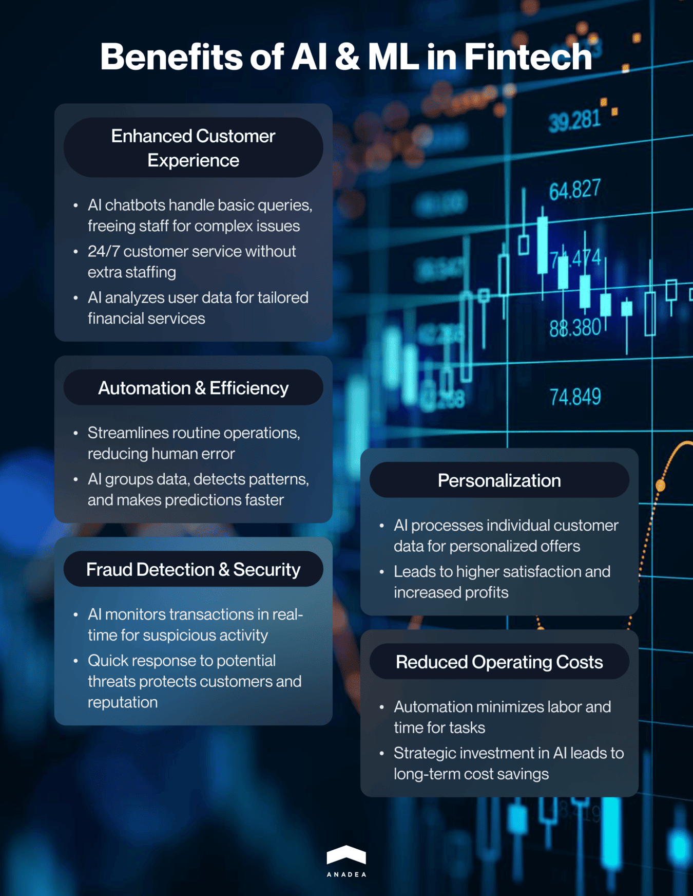

The financial industry has a long history. It has well-established processes, products, and services that stay practically unchanged for decades, if not centuries. However, the market itself is quite dynamic, and the traditional offerings seem to be irrelevant in the modern financial environment.

Fintech (financial technology) was born as a way to address the existing issues in the financial industry caused by its inflexibility and concentration on traditional approaches to building interaction between institutions and their customers. Fintech is based on the application of emerging technologies known as the "ABCD" of fintech: **Artificial Intelligence, blockchain, cloud computing,** and **big data**. Namely, these technologies are the backbone of this industry. In this article, we invite you to have a closer look at the use of AI in fintech and the range of new opportunities that you can leverage by introducing AI-powered functionality to your solutions.

## AI in fintech market: Statistics and current state overview

According to [analysts](https://www.marketresearchfuture.com/reports/ai-in-fintech-market-11756), the Artificial Intelligence fintech market size was around $9.6 billion in 2022, and in 2023, it is expected to reach the level of $11.2 billion. Though such figures may seem to be not very impressive, you need to have a look at long-term predictions to realize the potential of this niche. In 2032, the market size is expected to hit the mark of $39.1 billion which will indicate a CAGR of almost 17% over the period from 2023 to 2032.

What are the factors that boost this growth? Even in 2023, when the COVID-19 pandemic is already in the past, we still should take its impact into account while speaking about the creation of software powered by AI for fintech. When in 2020, the strictest lockdowns were introduced, it became clear that financial and banking institutions had to look for new ways to build interaction with customers.

However, for traditional organizations, it was rather challenging to change their infrastructure. And it was when fintech company got an additional chance to win their market share. The volumes of data and data transactions that fintech firms had to work with were continuously growing and AI tools became a good solution for dealing with them. Moreover, fraudsters and hackers also decided that they could use the existing vulnerabilities caused by the increased loads for their purposes. The risk of external attacks skyrocketed. And again, AI proved to be a good tool in fraud detection. Without any doubt, such factors should be viewed as a driving force for the expansion of Artificial Intelligence in fintech market.

## Benefits of using AI and ML in fintech

The implementation of AI-powered tools is one of the latest trends in <a href="https://anadea.info/blog/fintech-mobile-app-development" target="_blank">fintech app development</a>. But here it is vital to understand that the reasons behind this are hidden not in the "fashion" for such functionality but in the key advantages that AI brings to the fintech sector. Before we consider examples of using AI in fintech, we'd like to focus on the core benefits that will brightly demonstrate why so many companies today are interested in implementing AI and ML features into their newly created or already existing solutions.

### Better customer experience

Thanks to applications powered by AI for fintech, companies can ensure significantly better customer service. First of all, AI-powered chatbots developed for fintech firms can reduce overloads on their employees who will have more time to work with the most complex issues while all basic questions will be solved by AI. Moreover, thanks to artificial intelligence people are able to get the required information round the clock.

At the same time, companies do not need to hire a lot of extra specialists to process users' inquiries 24/7. Another important detail to be mentioned is the capability of AI in fintech market to analyze user data in order to allow managers to better understand what users want and expect to get. With valuable insights generated by Artificial Intelligence fintech tools, businesses can adjust their products and services to the most relevant market requirements.

### Higher automation and efficiency

Many years ago, all banking data and financial transactions were processed exclusively manually because various software tools didn't exist. In the 21st century, when we have so many tools at our disposal, it would be rather silly to ignore them. Fintech firms have a lot of opportunities to streamline and automate routine operations which will help not only to save the time of their employees but also to reduce risks of mistakes caused by a human factor. For example, Artificial Intelligence in fintech can be used for grouping various data, detecting patterns, making predictions, looking for the required information, etc. All these tasks, when performed manually, will take significantly more time than in those cases when you rely on ML and AI.

### Improved fraud detection and a higher level of security

While tech progress is moving forward, the same can be said about the achievements of hackers in the creation of more sophisticated approaches and tools. That's why when you are building a fintech solution, you need to pay special attention to its security. In case of any external attacks, not only your customers' funds and personal details will be at risk but also your business reputation and even the future of your company. The introduction of tools powered by AI for fintech can become an excellent idea. Artificial Intelligence is widely applied today for real-time transaction tracking. As a result, it can timely identify any suspicious activity and deviating trends which helps to quickly react to them and avoid serious consequences.

### Personalization

AI can analyze not only general market trends and evaluate further industry trends. It can be also used to process data on each customer, including general personal details, their interests, preferences, and needs, as well as time spent in different app sections, financial history, etc. Based on all this information, you can provide users of your solutions with highly personalized offers which will help you to achieve not only higher customer satisfaction but also higher profits.

### Lower operating costs

Process automation and facilitation are among the most important factors that can help you reduce the resources that are typically needed for performing this or that task. The implementation of any business solutions is associated with some investment (and in this case it doesn't matter whether we are talking about the development of a custom solution from scratch, enriching it with new features, or just using an off-the-shelf app with customized functionality). However, thanks to the possibility of optimizing your labor force and minimizing time investments in some processes, you can achieve excellent results in cutting down your expenses.

All these benefits are relevant for all the cases of using Artificial Intelligence in fintech but it is also important to keep in mind that there can be some unique, company- or app-specific advantages. We recommend you discuss them with your <a href="https://anadea.info/services/machine-learning-software-development" target="_blank">AI and ML software development team</a> in advance in order to make sure that you will get a solution that will bring the highest value to you and your clients. At Anadea, we always focus on these specific advantages while discussing project requirements as we believe that our task is to deliver solutions that will be fully tailored to customers' needs.

Talk to AI experts

## How is AI used in fintech?

Now, when you already have a good understanding of how AI fintech tools can enrich your business software, it's time to proceed to real-life use cases.

### Risk assessment and loan approval

For a fintech organization that offers loans, it is vital to have powerful tools for estimating the creditworthiness of its borrowers and identifying potential risks. If you do not have any software tools for doing that, it can be a very long process. Moreover, the results of your estimations can seriously differ from reality. But even in cases, when you have some traditional software tools, their effectiveness may be not sufficient. However, AI-powered solutions can help you to dive deep into a customer's financial history, personal information, employment status, etc. Thanks to the reliability ensured by AI, you will be able to avoid mistakes and make the right lending decisions that won't result in losses and other problems for your firm.

### Predictive analytics

For any business (and the fintech segment is not an exception), it is crucial to understand not only the ongoing needs of their customers but also to foresee the changes in the market requirements and have the possibility to adjust their services and products to them. However, the "guess game" is not what you need in this case. Instead of testing your intuition, it will be much more feasible to rely on advanced software. AI and ML solutions can evaluate customer data to provide you with predictions on their behavior and preferences. Moreover, such solutions also usually have functionality for customer segmentation. Based on their preferences and requirements, customers will be categorized which will help you better understand your target audience and its composition. All this is required for building the most relevant marketing strategy and maximizing your revenue.

### AML compliance

According to the [research](https://www.fatf-gafi.org/content/dam/fatf-gafi/guidance/Opportunities-Challenges-of-New-Technologies-for-AML-CFT.pdf) conducted by the Financial Action Task Force, the fintech market is associated with high money laundering, fraud, and financial crime risks. Any fintech company should make sure that its activities and software solutions used in its work are fully AML-compliant. Anti-money laundering activities are aimed at monitoring, reporting, and preventing any suspicious financial activities. AI algorithms can be applied to identify any activity patterns in financial operations that look suspicious and may be signs of illegal intentions.

### Virtual assistance and chatbots

As we've already mentioned above, the use of a chatbot can significantly enhance the quality of your customer support service and help you achieve higher loyalty and satisfaction of your clients. By timely getting all the required information about your services, products, and special offers, people are more likely to opt for your company instead of choosing one of your rivals. On our blog, we've already shared our recommendations on <a href="https://anadea.info/blog/chatbot-development" target="_blank">how to build a chatbot for your business</a>.

### Personalized investment and budget planning

Fintech firms can rely on AI as a very helpful tool in providing their customers with 100% personalized and highly efficient investment advice and financial plans. These recommendations will be based not only on some general market tendencies but also on the individual goals of customers, as well as their financial capacities, risk tolerance, expectations, etc.

### Data extraction tools

AI in fintech can greatly change the way companies work with data. Fintech organizations always need to deal with huge volumes of information and documents that are often presented in different formats. As a result, the employees need to spend a lot of time trying to convert files to the desired format and to get the information that is required, Artificial Intelligence can address this issue. It will be enough just to upload your files, indicate the necessary fields, and choose the desired formats for conversion. All the rest will be done by AI.

Of course, users usually need to verify the results provided by such software but all these efforts can't be even compared with those that are required in the case of manual processing of data. This functionality will be of great use for processing invoices, and financial statements as well as compliance processes and loan underwriting automation. If you want to learn more about this use case, please visit an article on <a href="https://www.tensorway.com/post/data-extraction-fintech" target="_blank">financial data extraction</a>.

### Paperwork automation

When it comes to any financial transactions, you always will face a lot of paperwork. Artificial Intelligence in fintech can help to streamline all the processes related to it, including verification of invoices and other documents, preparing some standard papers, as well as increasing the quality of documentation by avoiding mistakes and duplications.



## Future of AI and ML in fintech

Already now we can say that AI has managed to cement its position in the fintech market. It has demonstrated its power in improving the accuracy, speed, and effectiveness of many processes, while the reduced operating costs, enhanced customer loyalty, and better fraud detection have allowed firms to increase their profits.

But what are the most likely trends for further development of AI in fintech?

### Enhancement of reporting and regulatory compliance

While even today, a lot of efforts are invested in building tools that help to detect suspicious activities, it is expected that in the future such kind of software will become an industry standard. Moreover, thanks to NLP (natural language processing) functionality, this software will be able to interpret complex rules and regulations, ensure international regulatory compliance for businesses, and notify managers of any changes in laws.

### AI-powered algorithmic trading

While algorithmic trading applications can't be named in the row of the latest innovations, it is necessary to understand that the current state of AI tools does not allow us to fully rely on them. However, we can't deny the potential of this technology in this field. AI is able to process and efficiently analyze large datasets and identify patterns in real time. Thanks to AI, it is possible to create algorithms for trading in several markets and quickly introduce updates given the ongoing market changes. All this can revolutionize trading and allow traders to focus more on such tasks as managing portfolios and choosing new strategies while routing trading will be conducted automatically. And while AI tools are evolving, we can suppose that in the near future, it will be possible to leverage all the provided opportunities at a full scale.

### Customer authentication

The necessity to ensure account security is among the paramount responsibilities for fintech organizations and it is expected that AI will play a leading role in it. AI-powered authentication approaches can include not only rather popular voice and facial recognition features but also the identification of behavioral patterns (such as mouse movements or typing methods). If any significant differences are detected, a user will be asked to pass identity verification.

## Conclusion

Already today AI fintech solutions are not a rare thing. But given the entire range of benefits and new opportunities that they offer, it will be sensible to assume that in the future the adoption of artificial intelligence in fintech industry will continue.

AI helps to make fintech solutions much more reliable, secure and user-oriented. At the same time, thanks to this technology, companies can optimize their costs and streamline a lot of processes that today require too much time and effort.

If you are considering the possibility of launching an AI solution for the needs of your fintech business, you can always rely on us. At Anadea, we deeply understand the peculiarities of the fintech industry and have splendid expertise in building software products powered by artificial intelligence. Just share your ideas with us and let's discuss how our team can help you.

Get in touch
