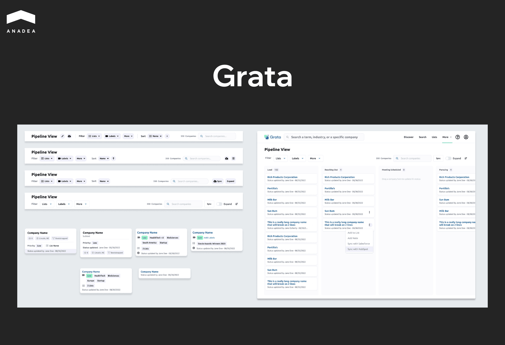

According to [Axial’s report](https://www.axial.net/forum/private-equity-deal-sourcing-playbook/), partners in private equity firms that rely on spend 30-40% of their time on sourcing activities instead of focusing on deal execution and portfolio management. These issues with time allocation are caused by the use of increasingly inefficient traditional sourcing methods that are based on spreadsheets and personal networks. Such a situation underscores the need for a transformation in deal sourcing strategies.

And AI is emerging as a powerful solution. It helps private equity teams significantly reduce the time required for detecting potential deals and finding investment opportunities that would otherwise be missed. But how does artificial intelligence make it possible? That’s what we are going to discuss in this article.

## AI in Private Equity Deal Sourcing: Quick Overview

AI deal sourcing refers to the use of AI-driven tools and methods to enhance and streamline the process of finding, qualifying, and prioritizing investment opportunities.

Here’s where AI tools can help private equity professionals:

* **Data collection**. AI solutions can efficiently aggregate information about different companies from structured databases, websites, and filings. The most advanced AI tools can also work with unstructured sources like news or social media.
* **Market mapping**. Artificial intelligence models can quickly build a landscape of players within the chosen sectors.
* **Company similarity analysis**. Such tools can quickly identify lookalike businesses based on predefined criteria (size, growth pace, business model, revenue, etc.).
* **Qualification**. You can apply AI for deal sourcing to filter companies against benchmarks or deal parameters.
* **Prioritization**. AI-driven software can rank opportunities based on various investment signals such as growth, momentum, hiring trends, or strategic fit.
* **Outreach preparation**. Deal teams can use AI to prepare for conversations. Artificial intelligence can gather and summarize the most relevant context about a company and its leadership. As a result, teams have tailored talking points that resonate with their current priorities.

However, there are cases where AI is not helpful. For example, despite its rich capabilities, AI can’t replace deep sector expertise. Private equity firms still need to rely on human knowledge and critical thinking to craft investment theses. While AI can surface patterns and trends, sector specialists understand nuances (such as regulatory shifts or cultural dynamics) that go beyond data points.

Though AI deal sourcing software can help organize data and flag potential risks, it can’t act as a full substitute for comprehensive diligence processes. Such tasks as assessing management quality, validating financials, or stress-testing assumptions still require human analysis and direct interaction.

Moreover, it’s crucial to ensure that sourcing decisions remain transparent and explainable. If an AI deal sourcing tool recommends a target company without a clear clarification of the reasons behind this decision, firms risk bias and compliance issues. This case is also known as a “black box” problem.

Given all this, the most effective use of AI is as an augmentation, but not as a replacement for human judgment. And in the next section of our article, we will take a closer look at the use cases that demonstrate how AI can enhance traditional methods in deal sourcing.

## AI for Deal Sourcing vs Traditional Approaches

Traditionally, deal sourcing has been a highly manual process. Specialists have relied heavily on networks, referrals, and repetitive research. AI brings automation to every stage of the sourcing funnel. We invite you to consider how this process can be changed with AI compared to traditional methods.

### Thesis Development

In traditional methods, companies can rely solely on human sector experience, thematic brainstorming, and analyst research. Though the importance of all this shouldn’t be underestimated, AI can significantly enhance this stage by processing large-scale structured and unstructured datasets. 

For instance, natural language processing (NLP) models can extract emerging industry trends and detect semantic signals across millions of documents. Meanwhile, graph analytics can identify relationships between companies, investors, and market participants.

Specialists can use these insights to make better-grounded conclusions. 

### Market Mapping

Analysts used to manually build lists of companies from databases and conferences. It is a very time-consuming and error-prone task.

With automated mapping, deal teams can significantly more quickly identify players across niches and geographies. Moreover, thanks to real-time analytics, it is possible to cover even the newest companies and data that are often missed by static databases.

### Universe Build

When specialists use only traditional approaches, lists of potential targets remain limited to known databases and referrals.

Meanwhile, when AI is used for universe generation, it relies on multiple structured and unstructured sources. As a result, AI tools for private equity deal sourcing can create a much broader, constantly refreshed set of businesses that are worth being considered by investors.

### Data Enrichment

Analysts spend hours collecting information one piece at a time, step-by-step. For example, at first, they need to take financial data from filings. Then, they need to check a company’s  LinkedIn account to find the info on headcount. After that, they need to scan press releases for growth signs. Due to the complexity of this process, it is very simple to skip important data.

With AI, enrichment becomes automated and far more comprehensive. AI deal sourcing tools can add firmographics, technographics, hiring trends, sentiment analysis, and market signals at scale.

### Scoring

In traditional systems, investment opportunities are prioritized by manual filters and subjective judgment.

AI-driven systems often rely on predictive scoring models:

* Supervised machine learning models are used to evaluate companies against investment thesis criteria.
* Feature engineering incorporates financial ratios, growth signals, management quality, and market sentiment.
* Ranking algorithms produce a dynamic pipeline that reflects the likelihood of deal success.

Thanks to such tools, scoring becomes objective and more accurate.

### Signal Monitoring

When deal teams need to monitor the market manually, this process is usually episodic. As a rule, it is performed on a quarterly basis, and specialists need to check available industry news at once.

AI deal sourcing software makes it possible to implement continuous tracking of signals like leadership hires, funding rounds, and regulatory changes. Moreover, teams can get alerts and valuable updates in real time.

### Business Development Queue

Deal teams typically maintain a static list of target companies and cycle through them on a fixed schedule. Outreach is often driven by internal timelines, without taking into account important signs that a company is actively growing or is ready to engage.

AI creates a dynamic, prioritized queue. Targets move up or down in real time based on signals such as recent funding, executive changes, expansion announcements, or shifts in hiring patterns. 

### Outreach

Cold outreach relies on generic templates and manual research.

Artificial intelligence helps personalize this step. AI-driven outreach is supported by contextual insights (recent moves, executive interests, or company milestones). Thanks to this, the engagement with private equity firms becomes more relevant for businesses.

### Feedback Loop

In most firms that apply only traditional approaches, feedback on sourcing effectiveness is limited and backward-looking. Teams may review which outreach efforts worked and which didn’t. But usually, it happens only after months have passed. 

With AI, every interaction becomes a data point. This technology allows developers to integrate a continuous learning feedback loop:

* Such tools capture interaction data from emails, calls, meetings, and deal outcomes.
* Predictive models identify which signals correlate most strongly with successful deals.
* Closed-loop learning refines scoring and signal interpretation over time.

Thanks to this, AI-driven systems help enhance future sourcing accuracy.

## AI Deal Sourcing: Private Equity Data to Prepare

At Anadea, we have been building [custom AI solutions](https://anadea.info/services/ai-software-development) for more than 6 years, and we have always been repeating to our clients that high-quality data is the foundation of any AI-driven system.

That’s why, before deploying AI models, private equity firms need to ensure they have a solid, reliable data set.

What information should it integrate?

### Internal Data

Your firm’s own history is one of the most important assets for AI. Structured and unstructured records provide a training ground for models. Here’s what you should use for training:

* CRM data and call notes;
* Past deal data (both successes and failures);
* NDA archives and diligence files;
* Pipeline disqualification reasons (why deals were passed).

### External Data

Third-party and public information will expand the sourcing universe. Among the possible sources you can use:

* Company registries and industry directories;
* Data from trade associations (membership lists and sector activity);
* Job postings and patents;
* Regulatory filings (US SEC, EU registries, etc.);
* News and press releases;
* Company websites.

### Alternative Data

Beyond traditional sources, AI models can efficiently work with alternative datasets. Such data can be helpful for exploring hidden investment opportunities that may not be obvious to the human eye.

* Technographics (what tools or platforms companies use);
* Hiring velocity;
* Web traffic patterns;
* Pricing pages and product catalogs (shifts in business model or monetization strategy);
* App store activity (downloads, ratings, etc.);
* Review sites and forums;
* Government contracts.

### Data Hygiene

Apart from the quantity of data sources, you should also ensure their quality. Here’s when strong data governance should enter the game. Based on our practical experience in AI model training and deployment, we recommend you:

* Make sure that one company has one profile. Any information about it shouldn’t be spread across messy datasets.
* Remove redundant or conflicting records.
* Track where each data point came from to preserve trust and auditability.
* Regularly refresh datasets so insights reflect reality.

Data governance is an important part of broader efforts aimed at ensuring that data remains accurate and usable across the organization. To see how it connects with the smooth functioning of intelligent systems, you can read a comprehensive guide on [AI orchestration](https://anadea.info/blog/what-is-ai-orchestration/) on our blog.

## Examples of AI Tools for Private Equity Deal Sourcing 

The use of AI in private equity deal sourcing has a lot of benefits, which explains the growing number of such tools in the market. Let’s take a closer look at some of the most popular options today.

### Inven

Inven is an AI-native deal sourcing platform founded in 2022 in Helsinki, Finland, by former consultants from McKinsey and BCG. It is designed for private equity firms, investment banks, M&A teams, consultants, and VCs. It helps them analyze and connect with acquisition targets and companies in the private markets.

The platform is powered by a massive dataset, which covers 21+ million companies globally, especially in the lower-middle to middle market.

According to the information on the [Inven website](https://www.inven.ai/info/deal-sourcing), users of its platform can leverage 70-80% efficiency improvements (versus manual searches), better coverage (30% more companies found compared to other similar solutions), and a 300% increase in qualified targets and buyers.

### Grata

This AI-powered platform was built for dealmakers who want to source, monitor, and evaluate private companies (particularly in the middle market). It combines proprietary and public data, offers advanced search, contact information, and CRM integrations to help firms find opportunities.

It provides access to millions of executive or owner contacts that are essential for outreach. With the available tools, users can easily connect and engage with decision-makers.

In addition to this, the Grata platform is useful for mapping out market trends, monitoring deal activity, and observing how companies cluster around features or business models. It is vital for developing or validating investment theses.

### PitchBook

PitchBook is known as one of the most reliable platforms that provides comprehensive data on private companies, investors, deals, funds, and related entities. It combines structured financial data, deal metadata, company profiles, and market intelligence. All this helps investment professionals identify and track potential opportunities.

Users can search with many filters (like industry vertical, revenue, funding history, geography, etc.). The platform also supports alerts and notifications when companies meet criteria or when key events happen.

In 2023, PitchBook introduced a new product called [VC Exit Predictor](https://techcrunch.com/2023/03/20/pitchbooks-new-tool-uses-ai-to-predict-which-startups-will-successfully-exit/). It uses a proprietary machine learning model trained on PitchBook’s own historical data to estimate the probability that a venture-backed startup will successfully exit (via acquisition or IPO), remain private, or fail. 

In back-tests on past companies with known outcomes, including Blockchain.com and Revolut, the tool achieved an average accuracy of 74% in its predictions.

## AI Deal Sourcing Software: Build or Buy?

One of the biggest strategic questions is whether to build a custom platform powered by AI for deal sourcing or buy an existing solution. Each option has its peculiarities.

Solutions like PitchBook or Grata offer immediate access to broad databases and AI-driven workflows. You need to purchase a subscription (which will cost less than developing a platform from scratch), and you can start using it. 

However, out-of-the-box platforms may not fully align with your investment thesis or workflow. Moreover, competitors that use the same tool may see similar opportunities. As a result, your investment strategy will lack exclusivity.

Given all this, custom AI software development often becomes a good alternative. And here’s why:

* [Custom AI agents](https://anadea.info/services/custom-ai-agent-development) and platforms can be designed around your firm’s exact sourcing strategy, sector focus, and proprietary deal criteria.
* Sensitive CRM notes, disqualification reasons, and diligence learnings stay fully in-house. And at the same time, your models will be trained on them to ensure the highest efficiency.
* A well-built custom tool can become a differentiator. You will be able to find potential deals that your competitors simply can’t see.



At Anadea, we have been delivering custom software solutions for private equity firms since 2009. Over this time, we have accumulated unique expertise in this domain. Today, we have an excellent understanding of all the related business processes and know how they can be enhanced and streamlined with the power of modern technologies.

As a technical and strategic partner to private equity funds, we help them optimize their workflows successfully. For example, with our custom solutions, they can reduce the time required for initial analysis of investment opportunities by 80% and increase the speed of team-driven preparation of investment pitches by 8 times.

## Final Word

An AI deal sourcing platform for private equity firms helps users identify high-potential opportunities faster and more accurately than traditional methods ever could. Human expertise remains critical for interpreting signals and performing due diligence. Meanwhile, AI acts as a powerful supportive tool. It turns raw data into insight and reduces wasted effort. Firms that embrace AI in their sourcing strategies can expand deal flow and gain a competitive edge in private markets.

If you are planning to launch such a tool for your business needs, at Anadea, we are always ready to become your reliable partner in this journey. We can join your project at any stage and help you implement even the most complicated ideas. [Contact us](https://anadea.info/free-project-estimate) and share your ideas with our experts!
