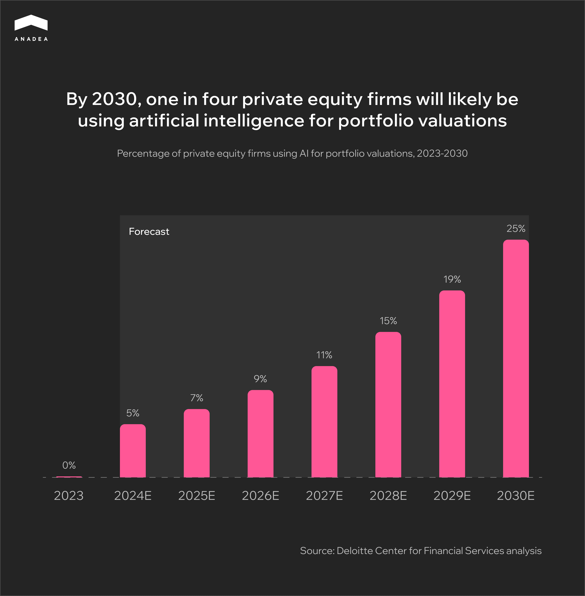
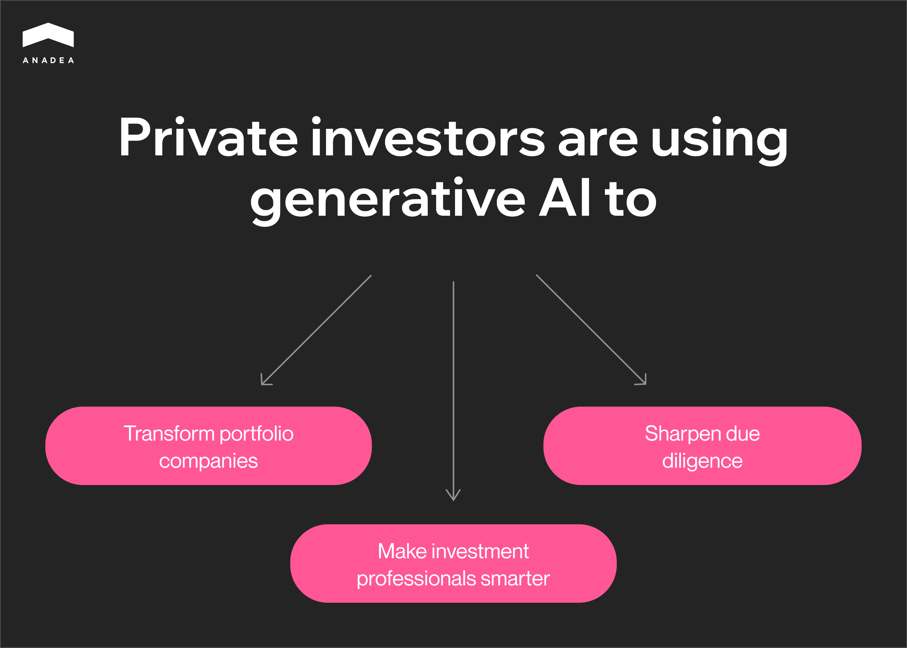

The rapid development of artificial intelligence draws corporations from numerous sectors to adopt the technology into their operations. It comes as no surprise, as the automation, predictive capabilities, and actionable insights derived from these models promise to transform business strategies.

AI for private equity delivers new possibilities for smarter investments and more profitable returns. Such tools can support professionals in making informed decisions, prioritizing high-value targets, defining the optimal times for exits, and much more. The difference between staying on the sidelines and welcoming the advancements of artificial intelligence can determine the competitiveness of a firm.

In our article, we will take a deep dive into how AI impacts private equity organizations, its key applications, compelling benefits, the implementation process, and the future of this technology in the investment industry. Let’s jump straight into exploring this nuanced subject.

## The Impact of AI on Private Equity and Investment Firms

Private equity (PE) firms tend to conduct business using traditional software and data analysis methods that often hold them back in effectively sourcing deals and maximizing their returns. With the onset of artificial intelligence technology, this habit is about to change, bringing unparalleled efficiency and data-driven insights to the forefront.

Currently, this development is showing a steady growth trajectory. While in 2023 less than 10% of companies were using this technology, Deloitte reports that by 2030 [one in four](https://www2.deloitte.com/us/en/insights/industry/financial-services/financial-services-industry-predictions/2024/private-markets-innovation-leveraging-ai-for-portfolio-management.html) private equity firms will be using AI for portfolio valuations and other related applications in the field.

So, what can artificial intelligence change for investors? In order to get to the bottom of this question, we first need to get on the same page about the core mechanisms behind this advancement.

***Generative AI*** for private equity is based on Large Language Models (LLMs) and can be the source of streamlining daily operations with high accuracy and precision. Such models leverage massive amounts of data to generate financial reports, earnings summaries, investment models, and more. Advanced systems can analyze market conditions and client preferences to identify attractive investment opportunities and structure optimal deals.

***Machine Learning (ML)*** excels in evaluating historical data, such as economic trends, financial statements, growth factors, etc., to create comprehensive performance predictions through predictive analytics. It’s also a critical tool for detecting anomalies in the data, which alleviates the need for manual examination during the due diligence process, where pinpointing discrepancies is crucial.

***Natural Language Processing (NLP)*** includes models that aim to understand and process human responses. Capabilities like semantic analysis can be of great help in gauging the public perception of a certain company through press releases, social media posts, and so on. Its generative abilities further aid in communicating with clients and negotiating optimal deals.

On the surface level, these AI algorithms accelerate data analysis processes, uncovering more beneficial opportunities and securing deals faster. But don’t just take our word for it, take [Blackstone](https://www.institutionalinvestor.com/article/2c5n7hypxbs38zj9xsutc/portfolio/how-blackstone-sprinted-ahead-of-its-peers-in-ai) as an example. This firm is one of the pioneers in implementing private equity AI. With a traditional approach, analysts would take at least two days to put together an investment model. Now, artificial intelligence tools create high-quality models while the bankers are still on the phone.

A general misconception regarding the use of AI in any industry is that it is going to replace human workers in favor of the automation this technology offers. However, the purpose of generative tools is to supplement irreplaceable experiences and insights that professionals bring to the table, enhancing informed decision-making and forecasts. Further in our article, we will explore how this is possible.

## Key Applications of AI in Private Equity and Investment Firms

The flexibility of artificial intelligence allows it to be implemented in a multitude of processes related to assessing market conditions, identifying risks, finding opportunities, building strategies, and even defining optimal exit times. This technology can become a powerful tool in areas like managing mundane operations and bringing innovation that drives a competitive edge.

When it comes to private equity organizations using AI, the scope of applications is extensive and can be tailored to address the specific needs of each company. On a broader scale, we want to overview the six most common use cases of this tech in the investment sector.

### Predictive Analytics

Predictive analytics capabilities powered by machine learning enable PE and investment firms to rely on probabilistic predictions instead of intuition. AI private equity tools can analyze extensive historical data related to market trends, fluctuations, economic indicators, and more. The extracted data allows the model to simulate realistic scenarios, helping specialists anticipate the performance of a specific asset.

NLP models can also evaluate sentiment through social media, financial reports, press releases, and other sources to gauge the public’s opinion regarding the direction the market is going. These insights can help firms make proactive decisions with the highest ROI and adjust their strategies dynamically to reflect possible shifts in the industry.

### Deal Sourcing

Artificial intelligence tools exceed traditional software for deal sourcing. They can process vast amounts of data and identify opportunities that most closely match your criteria. Such systems can evaluate multiple factors, such as performance indicators, public sentiment, and your firm’s personal preferences, such as location and growth trajectory, to determine candidates worthy of approaching.

AI-based programs take into consideration other nuances, including past deals and market benchmarks, to provide potential matches with more favorable propositions, thus saving precious time on manual investigation. As a result, private equity corporations can get a hold of better deals with unparalleled criteria precision and efficiency.

### Risk Assessment

ML models that are trained using unsupervised learning techniques shine in anomaly detection, which could become a cornerstone for identifying market patterns that pose potential risks. This type of AI for private equity can monitor market volatility in real time to detect subtle shifts that are likely to influence the portfolio negatively, helping firms mitigate financial losses.

In addition, such a system can stress-test distinct scenarios involving high-risk investments, economic fluctuations, and so on, helping companies prepare for various potential outcomes. AI tools can further monitor compliance regulations to alert PE organizations of changes and enable them to take preemptive measures before damages can occur.

### Portfolio Management

By leveraging [AI software development](https://anadea.info/services/ai-software-development), corporations can create cutting-edge systems that majorly optimize and automate workflows. In portfolio management specifically, artificial intelligence can oversee the companies’ key performance indicators (KPIs) and keep the PE firm updated on any worrisome developments, such as decreased sales. Advanced models can furthermore suggest improvement strategies based on market conditions and customer demands.

Streamlining routine tasks is also possible with AI-driven tools, letting it handle repetitive procedures like financial reporting, cash flow management, tracking ESG performance, etc. Ultimately, financial specialists could have more time to focus on strategic tasks, where human insight and experience are paramount.

### Due Diligence

Optimizing the due diligence process is essential for PE companies that want to accelerate deal cycles while simultaneously increasing the vigilance of reviews. Generative AI for private equity can take care of drafting contracts, filing regulatory and IP documentation, and much more. Algorithms can handle auditing companies for acquisition, such as reviewing financial statements for inconsistencies or indications of fraud.

Artificial intelligence can also help identify any operational bottlenecks and inefficiencies in target companies to draw comprehensive conclusions about their profitability. Sentiment analysis can further establish a holistic view of the corporation’s public perception through various media releases and pinpoint reputational risks associated with its acquisition.

### Exit Strategies

Just as AI can help recognize attractive buying opportunities, it can also help determine the right moments to exit investments. The algorithm’s abilities, such as predictive analysis and real-time market evaluation, allow it to recognize the most favorable exit times based on portfolio performance, economic conditions, and trends.

Additionally, the model can assist in the current portfolio valuation and coordinate strategies for profitable selling options. Advanced systems are capable of finding suitable buyers and acquisition partners based on mutual goals, as well as supplementing the negotiation process with key industry insights derived from ML and compelling tactics driven by NLP technology.

## Benefits of AI for Private Equity and Investment Firms

One of the main reasons why artificial intelligence is rapidly gaining traction and is widely being implemented in various fields lies in optimizing internal processes. The capabilities of this technology enable companies to transform how decisions are made, the accuracy of predictions, and the automation of repetitive tasks. Private equity and investment corporations are no exception.

Depending on the end goals of the client, AI-powered software can bring a multiplicity of benefits to the table and improve business outcomes. In general, we can outline five primary advantages of using such systems that revolutionize operations. Let’s get to the bottom of each.

### Data-Driven Decision-Making

In the investment sector, processing vast quantities of data to gauge insights and uncover new opportunities is essential for firms that strive to make informed decisions. With private equity AI, the software can analyze multifaceted data sets in a fraction of the time, tracking performance, as well as discovering patterns and trends that traditional analysis methods would otherwise miss.

In other areas, like [predictive analytics in real estate](https://anadea.info/blog/real-estate-investments-driving-revenue-with-predictive-analytics/), artificial intelligence tools allow specialists to glimpse into the future and prepare for the likely changes in the market before they occur. By evaluating historical data and previous economic indicators, PE companies can anticipate specific market conditions, which is especially valuable for investments where long-term projections play a key role.

### Enhanced Portfolio Performance

AI-driven programs can significantly boost the performance of a certain asset or portfolio. By monitoring KPIs in real-time, financial status, and market trends, private equity firms can make prompt adjustments to their investment strategies. Such systems can also autonomously make asset allocation decisions to reflect the best market conditions according to the firm’s goals and risk tolerance.

Portfolio performance is further enhanced through continuous assessment of risk factors, macro- and microeconomic disruptions, downturns, etc. In case these developments are detected, an AI system can alert stakeholders of potential financial losses and how to mitigate them before they become critical. As a result, integrating such algorithms promotes better risk management and higher investment returns.

### Lower Operational Costs

There might be a misconception that AI for private equity is only accessible to large firms, but the reality is that smaller corporations can greatly benefit from its integration into the workflow. Specifically, it can substantially lower operational costs associated with automating repetitive tasks and handling routine procedures.

PE companies can leverage artificial intelligence tools to streamline financial reporting, data entry, data analysis, and so on, minimizing expenses on more extensive teams to oversee mundane processes. Consequently, the team can focus on strategic and decision-making areas. AI is also helpful in reducing the rates of mistakes and eliminating chances of human error, which can lead to costly losses.

### Robust Fraud Detection

During the due diligence process, it’s vital to scrutinize every piece of information to avoid falling for fraudulent schemes. Machine learning becomes an integral part of this procedure, as it is trained to detect any anomalies in the data that would indicate discrepancies, red flags, and even possible fraud that may go unnoticed by manual investigation.

Such algorithms operate with high accuracy and continuously learn from previous experiences to enhance their performance in the future. Not to mention, the automation of due diligence saves significant amounts of time. Private equity organizations can better protect themselves from financial risks and association with harmful companies at this stage before any agreements are made.

### Increased Competitive Advantage

Looking at the listed benefits, one thing is clear as day: AI private equity tools yield a remarkable competitive edge to the firms that implement them. From enabling precision in the decision-making process and improving portfolio performance to streamlining due diligence and reducing overhead costs, artificial intelligence takes center stage in elevating investment companies.

PE firms can better position themselves in the market, offering faster and more profitable deal-making, superior information analysis and projections of future conditions, innovative investment strategies with data-driven assessments, and more. The talents of professionals on the team can also be better utilized, supported by actionable insights and automation of routine processes.



## Implementing AI in Private Equity and Investment Firms

Getting started with developing your custom AI tool is not a process to be taken lightly. Whether you want to [create an investment app](https://anadea.info/blog/how-to-create-an-investment-app-guide-2025/) or software tailored to private equity needs, it’s paramount to pick a development company with extensive knowledge in the field. At Anadea, we have over 20 years of experience and build bespoke AI solutions that bring maximum value to clients.

We broke down the end-to-end development process into five main steps to help you understand how it unfolds. By overviewing each stage, you will get a sense of how artificial intelligence for PE firms is created from start to finish.

### Step 1: Set clear goals for the AI tool

This stage is normally called “Discovery”, where the client and the development provider discuss the everyday processes of the firm and the challenges it faces. Depending on the specific areas the client wants to improve, the specialists can conceptualize AI for private equity and address designated problems.

As you know by now, artificial intelligence can target a variety of operations, so defining precise expectations is vital. You can request a solution to tackle deal sourcing, portfolio optimization, risk assessment, and more.

When the project goals are mapped out, the development team will suggest solutions for the custom AI software, begin scoping the plan, establish the estimated project timeline, and assemble the specialists.

### Step 2: Select the right AI model

Once you have settled on the type of artificial intelligence solution for your firm, it will be easier to identify the right kind of model for the task. Different AI models are responsible for distinct processes that can be automated within the private equity sector.

For instance, in machine learning, an algorithm like random forests can help rank investment opportunities by value. On the other hand, Recurrent Neural Networks (RNNs) are suitable for long-term financial forecasting, while NLP is ideal for sentiment analysis during the due diligence process.

Discussing with your team which AI model is the most fitting for the tasks you have set in your project will help identify the right course of action and ensure smooth development.

### Step 3: Data collection and preprocessing

The next stage is one of the more challenging parts of creating private equity AI, as it involves collecting and preprocessing a sizable amount of data. Professionals often attribute poor data quality and scarcity as the primary reasons why building AI solutions is complicated, which is why this phase is critical.

The development specialists will gather data from various sources, such as financial statements, economic benchmarks, investor reports, press releases, and more, to put together a comprehensive dataset.

Then, the team will need to clean up the collected data by handling missing values, normalizing scales, removing duplicates, etc. Feature engineering comes next, with developers selecting specific variables for the model to operate on. Once the data is prepared, it will serve as a basis for training.

### Step 4: Train and test the model

The intricate process of training and evaluating the AI model involves several unique processes. First, the data is split into three categories: the training set, the validation set, and the testing set. The last category is generally the smallest since it’s used to assess how the model performs on previously unseen data.

Optimization is another critical process that involves tuning hyperparameters to improve accuracy. Depending on the model type, different methods can be employed. For example, a Bayesian optimization technique uses a probabilistic method to identify the most suitable parameters.

The metrics that the AI is evaluated on differ depending on the tasks set before it. Sharpe and Sortino ratios are applied to predictive models. Classification models are tested on metrics like accuracy, precision, and recall.

### Step 5: Deployment and maintenance

When the generative AI for private equity is trained and properly evaluated, the final solution is ready for deployment. Here, clients can choose whether they want a cloud-based or on-premise program. In the first option, the solution is hosted on platforms like AWS and can be easily integrated into existing workflows, but can pose security challenges.

The second option entails deploying the software into a production environment that runs on in-house servers. In such a case, data is protected and confidential, but requires dedicated technical specialists to maintain the infrastructure.

Regardless of which option you decide upon, ongoing monitoring becomes essential to oversee the performance of the AI software, such as prediction accuracy and response times. Eventually, you may introduce any updates or retraining if needed.

## The Future of AI in Private Equity and Investment Firms

Artificial intelligence is advancing by leaps and bounds. Just a few years ago, it was still a novel concept that only a fraction of global corporations were adopting. Now, there is no doubt that AI is here to stay and the number of companies turning their attention to this technology is growing.

When it comes to private equity funds, the adoption trajectory is on the slower side. PEI survey reveals that [24%](https://www.privateequityinternational.com/three-key-trends-in-ai-and-private-equity/) of firms in this sector have not implemented AI-driven tools, because they don’t fully trust them yet and find that the technology is still in its early days.

It’s a fair assessment since the capabilities of artificial intelligence in the PE industry are only beginning to emerge and evolve as a game-changer. We can say for certain that, in the upcoming years, the integration of machine learning and NLP for investment strategies will continue to develop, offering increased accuracy and trustworthiness.

Another current barrier to adoption is the lack of proper knowledge about how to use such tools and the value they bring to private equity businesses. As this understanding grows, the popularity of AI will steadily increase. So, what are trends we can expect to see in the future? Below, we will highlight the three most prominent ones.

### New Level of Automation

Some of the common use cases of AI for private equity are characterized by an unparalleled level of automation. The number of routine processes within PE takes a toll on the deal lifecycle speed, starting from sourcing attractive opportunities to executing agreements. Artificial intelligence programs can automate repetitive tasks and compliance checks considerably, accelerating the overall lifecycle.

By leveraging [fintech software development](https://anadea.info/solutions/fintech-software-development), private equity firms can streamline back-office procedures and ease the administrative workload. In addition, the introduction of AI agents can drive autonomous decision-making without human intervention. These agents are goal-oriented programs that self-execute tasks when the optimal conditions have been met. It’s also worth mentioning that the technology is still in its early form.

### In-Depth ESG Analysis

The Environmental, Social, and Governance (ESG) principle is gaining traction, driving more PE funds to evaluate companies based on their environmentally sustainable practices and social responsibility. However, firms that want to engage with responsible investing currently struggle with getting the full picture, as traditional ESG scores rely on self-reported data, which may be inconsistent.

AI-driven tools can access a wider variety of data and provide a more in-depth analysis of the company’s performance. NLP technology can tackle sentiment analysis through public media, anomalies in corporate behavior through disputes and violations, etc. ML can evaluate environmental footprint through simulations and external data, greenwashing through misleading claims, and much more.

### Enhanced Cybersecurity

As the number of data breaches and cyber attacks continues to rise annually, generative AI for private equity offers another angle of protection from potentially devastating financial losses. Such systems are equipped with real-time threat monitoring, identifying risk factors like unauthorized access and behavioral abnormalities.

Artificial intelligence can also simulate penetration tests to detect any vulnerabilities within the software and suggest protective measures before any real attacks occur. On the other hand, AI-powered blockchain solutions deliver highly secure transactions and immutable record-keeping, which is especially valuable in the sector that is shaped by large-scale investments.

Overall, these three trends will likely define how AI-driven tools in private equity evolve in the near future.

## Conclusion: AI as a Game-Changer for Investment Firms

The race to implement cutting-edge technologies into business workflows is as prevalent as ever. Artificial intelligence stands at the forefront of this advancement, providing actionable insights and optimizing labor-heavy operations. Some industry giants are already reaping the benefits of incorporating innovation, while other PE firms are only beginning to embrace the change.

The competitive advantage brought by AI private equity is hard to overlook. Improved portfolio management and risk assessment, streamlined deal sourcing and due diligence, optimal exit strategies, and predictive analytics — all of these opportunities are within reach. A vital part of the success also lies in the choice of a development provider that has relevant industry expertise and a proven track record of delivering impactful projects.

If you would like to get started on your AI solution, be sure to [contact us](https://anadea.info/free-project-estimate). We bring over two decades of professional experience and are always ready to consult you on how to turn your vision into a reality. Our seasoned specialists at Anadea will devise the optimal plan and define our next steps together to maximize your investments.
