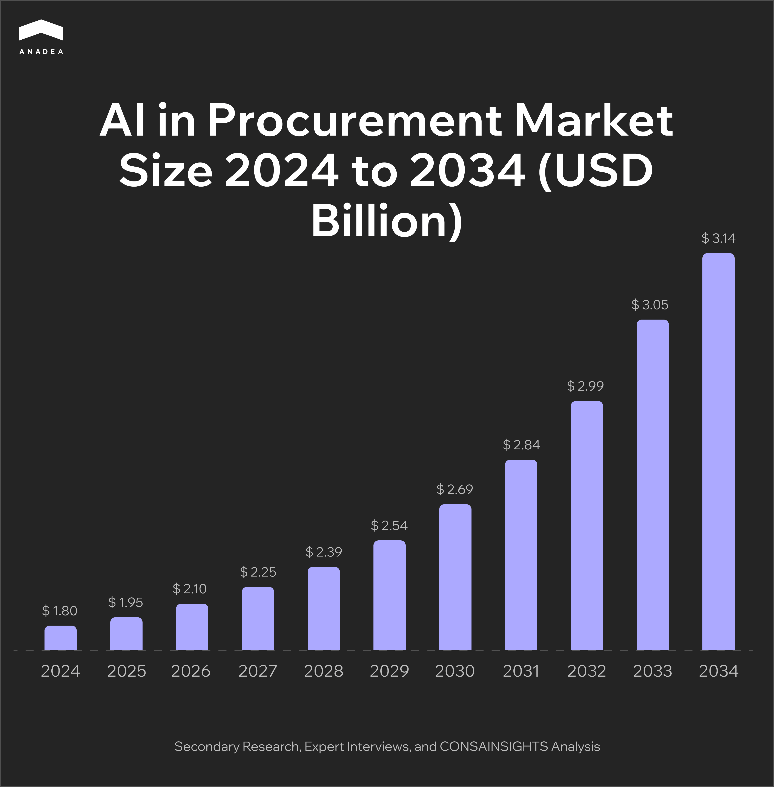
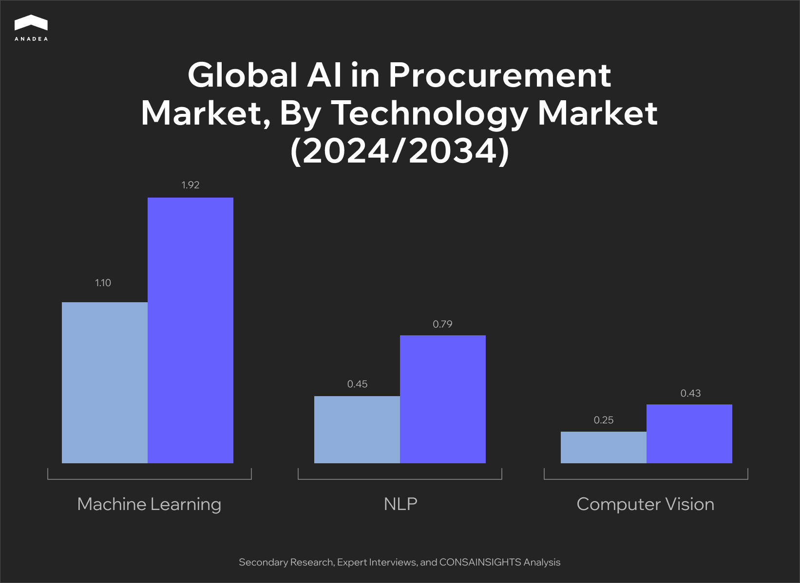
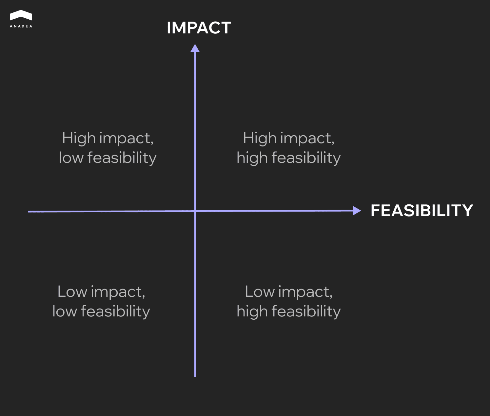

For many decades, procurement teams have been struggling with time-consuming manual processes, repetitive tasks, and errors in data. Such inefficiencies significantly slow down procurement cycles, as well as lead to increased costs and compliance risks. This is where AI can bring tangible value. As it was revealed by [Deloitte](https://www.deloitte.com/cz-sk/en/services/consulting/services/procurement-operations.html), digital tools can decrease order approval time by 50% and reduce purchasing costs by up to 20%. Such changes can improve the overall operational efficiency.

The use of AI in procurement is aimed at making all related processes, like sourcing, purchasing, supplier management, and contract management, more efficient and strategic. In this guide, we will talk about the key capabilities of artificial intelligence that procurement teams can leverage. Moreover, we will share our practical tips on how to make the introduction of AI tools as seamless as possible.

## AI in Procurement: Current Landscape

According to the [Cons & Insights report](https://www.consainsights.com/reports/ai-in-procurement-market-size-market), the AI in procurement market size stood at $1.8 billion in 2024. If the positive tendencies in the market growth persist, by 2033, it can hit $3.4 billion.

Machine learning, natural language processing, and computer vision are the core technologies that power AI procurement processes. ML dominated the market in 2024, with a share of $1.1 billion. It is also expected to keep its leader position in the long term, as in 2033, its share is projected to be valued at $1.92 billion.

## Key Capabilities of AI to Be Used in Procurement

Now, let’s consider how AI technologies can be used based on their capabilities. We suggest defining the following categories.

* **Classification**. This capability can be applied to automatically categorize purchases across indirect and direct categories, standardize supplier master data across ERPs, resolve duplicates, and map to external taxonomies. For instance, Pentair, a water treatment company, implemented an AI-driven analytics platform to enhance its procurement performance. This solution helped consolidate data from different sources and analyze spend across different regions and systems. As a result, the company achieved [90% accuracy](https://ai.business/case-studies/how-ai-enhanced-the-procurement-system-of-a-global-leader-in-water-treatment/) in spend classification. 
* **Generation (creating text, insights, or documents)**. Generative AI in procurement can create reports and audit summaries, prepare RFx drafts with standardized templates, and write outreach messages.
* **Forecasting (predicting future outcomes based on patterns)**. AI tools can provide accurate predictions. For instance, they can calculate future order volumes to improve inventory planning and supplier negotiations or detect early-warning signals in supply chain disruptions.
* **Optimization (finding the best combination of outcomes)**. AI can use algorithms to determine the best way to balance cost, supplier capacity, risk, and sustainability commitments.
* **Anomaly detection (spotting outliers and potential risks)**. AI models can identify irregularities in invoice data, flag purchases outside approved contracts or suppliers (maverick spend), as well as detect supplier performance issues.

## Latest Trends in AI-driven Solutions for Procurement

As we have described the most valuable capabilities in procurement, it’s time to mention the most common types of AI-powered tools and systems that are currently implemented in this domain.

* **Predictive analytics**. Such tools use historical, transactional, and external data to anticipate future demand, risks, and inventory needs. For example, commodity procurement teams can integrate macro signals into cost forecasts to improve budget accuracy.
* **AI-powered contract management**. NLP models can process thousands of contracts to extract the required data, like key obligations (payment terms, ESG commitments, etc.) or expiry dates. Automation of such processes can not only enable staff to focus more on strategic tasks but also reduce mistakes caused by the human factor.
* **ML tools in procurement**. Machine learning technology powers the “procurement intelligence”. ML models can be used for autotagging spend and suppliers to ensure better source strategies. Apart from this, reinforcement learning (one of the ML methods) can be used to train AI agents based on the interaction with an environment through trial and error. 
* **Computer vision in document processing and QA**. Such tools can automate accounts payable (AP) by extracting data from invoices, purchase orders, or delivery notes, even if they are handwritten. Moreover, computer vision models can check goods upon arrival from suppliers.
* **AI-driven supplier knowledge graphs**. These connected data models link supplier-related entities (contracts, invoices, risk reports, ESG data, logistics routes, sub-tier suppliers) into a network. AI enhances the use of the models by automating entity resolution, relationship discovery, and insight generation.
* **Guided procurement tools**. AI-driven solutions of this type help employees and stakeholders navigate the procurement process. End-users are not expected to understand complex procurement rules. Such tools can guide them through every step and ensure the right actions and buying decisions with minimal effort.
* **AI agents in procurement**. These are autonomous or semi-autonomous software solutions powered by AI, ML, NLP, and other related technologies. They are used to analyze data, make recommendations, and automate tasks across the procurement lifecycle.



## Benefits of Using AI in Procurement 

When you are preparing to use solutions powered by AI in procurement, you should clearly understand the value that they can bring. We invite you to explore the benefits of this technology and the parameters that will help you estimate the outcomes.

### Cost Reduction

In traditional processes, procurement heavily relies on supplier data and manual analysis. Due to this, companies may miss the opportunities to save their budgets. At the same time, AI cost insights cover thousands of items and provide valuable data that often goes unnoticed to the human eye. 

AI can detect duplicate or unnecessary purchase requests, analyze product specifications, and offer alternatives.

### Increased Efficiency

Procurement processes are often slowed down by administrative bottlenecks, manual reviews, and poor system integration. AI enables faster cycle times and higher throughput with fewer touches. 

Generative AI in procurement can be applied to automate the process of creating RFx documentation, supplier summaries, risk assessments, and recommendations.

AI agents can also validate requisitions and auto-code invoices, as well as triage mismatches and escalate only where it is impossible to avoid human judgment.

### High-Quality of Decisions

AI is used to augment judgment with predictive insights.

ML models anticipate demand spikes and supply constraints to increase the accuracy of forecasts. For example, NLP tools can scan news, filings, and ESG data for detecting any signs of potential issues in cooperation with suppliers. At the same time, the same insights can be applied for ranking sourcing events or suppliers by potential value.

### Risk and Compliance

The regulatory space is very dynamic. Manual compliance checks can be quite inconsistent and also slow. This can lead to fines and other penalties from regulators.

AI strengthens compliance and ensures wider and deeper coverage. It is possible thanks to continuous scans of contracts, suppliers, and transactions.

AI can check whether suppliers are not included in sanctions and whether they provide their ESG reports, as well as detect non-standard clauses or missing contract obligations.

In addition to this, ML models can detect unusual patterns in invoices or supplier activities that can be signs of fraud.

<table>

<thead>

<tr>

<th>

<strong>Aspect</strong>

</th>

<th>

<strong>KPIs to Track</strong>

</th>

</tr>

</thead>

<tbody>

<tr>

<td>

Cost reduction

</td>

<td>

Price variance vs. market benchmark (how much your company overpays relative to the market);

Realized savings vs. negotiated savings;

AI coverage breadth (percentage of total activities where AI tools are applied)

</td>

</tr>

<tr>

<td>

Increased efficiency

</td>

<td>

Average RFx cycle time (measured in days reduced);

First-pass match rate (process order and invoice match accuracy);

Exception rate (the percentage of transactions that cannot be processed automatically due to errors or missing data) and its reduction

</td>

</tr>

<tr>

<td>

High-quality of decisions

</td>

<td>

Forecast accuracy;

Early-warning lead time (days before disruption vs. average response time);

False positive/false negative rates in risk detection;

Win rate in sourcing events (success ratio vs. historical average)

</td>

</tr>

<tr>

<td>

Risk and compliance

</td>

<td>

Percentage of spend under automated compliance monitoring;

Reduction in audit findings (including their number and severity);

Percentage of suppliers screened for ESG and sanctions risks;

Time to resolve compliance alerts

</td>

</tr>

</tbody>

</table>

## How to Implement Procurement Intelligence

AI in procurement is much bigger than just automation. It’s about augmenting human decision-making and reshaping roles in the related processes for ensuring strategic impact. That’s why implementation of this technology requires not only development efforts but also solid preparation and change management.

At Anadea, we have been helping companies from different industries implement AI in their processes since 2019. Over this period, we have accumulated rich practical experience and a deep understanding of the peculiarities of AI-driven process transformation. Based on our knowledge and skills in [custom software development](https://anadea.info/services/custom-software-development), we have prepared a step-by-step practical guide that can become a backbone for your project.

### Step 1. Assess Your Business Readiness

Before introducing AI, ML, or deep learning in procurement, it’s essential to analyze the existing environment. Your data and your processes should be well prepared for the introduction of AI systems. Otherwise, your investments in AI procurement software won’t bring the expected results. And instead of addressing your pain points, it may create new bottlenecks.

* Conduct a data audit (check its sources, coverage, diversity, and reliability).
* Create a process heatmap and identify the most error-prone, high-value, or repetitive tasks.
* Prepare a legal and security checklist (make sure that your data processing approaches are compliant with the relevant regulations and analyze the efficiency of your cybersecurity.

### Step 2. Prioritize Use Cases

Trying to change everything at once and implement AI in all possible use cases is not only expensive but also inefficient. Instead, you should focus on small pilots. We recommend you prioritize quick wins and scalable applications.

To detect such cases, you can rely on a 2x2 matrix. By identifying the potential impact and the required efforts and visualizing them, you will easily find those opportunities that should be used first.

Quite often, companies start with such tasks as automated spend classification or exception handling, as well as contract extraction.

Only when such tools prove their efficiency, you can consider expansion into predictive analytics and generative AI applications.

### Step 3. Choose Your Approach: Ready-to-Use or Custom Solutions

When you define what tools you want to deploy, you need to decide on whether you will adopt vendor solutions or develop custom products.

There are arguments in favor of both approaches. For example, the introduction of ready-made tools is usually faster and cheaper than the development of your own. 

Nevertheless, only custom solutions will be fully tailored to your needs and adjusted to the specificity of your tasks. Moreover, they can be smoothly embedded into your workflows, while in the case of vendor tools, you may face integration complexity.



### Step 4. Drive Changes through Effective Management

AI adoption results in significant changes for all stakeholders, and first of all, for your employees. People should be ready for the introduction of new tools and should clearly understand how they can leverage the highest value of new solutions.

* Engage stakeholders, including suppliers, finance, and legal departments, early to avoid resistance.
* Clearly explain the role of AI and changes in the traditional workflows. Demonstrate how AI augments (not replaces) staff.
* Develop a library of standardized prompts for GenAI tools to avoid misuse.
* Train teams to understand AI outputs and introduce “trust but verify” practices.
* Update KPIs to encourage AI use, reward efficiency gains, and innovation in applying AI.

### Step 5. Run Pilots and Scale Gradually

Pilots are crucial for proving the value of your solutions before their expansion. Here’s how you should analyze your projects:

* Efficiency (cycle time reduction in performing various tasks, like invoice matching or purchase order approvals);
* Financial results (measurable cost savings);
* Accuracy (percentage of correctly outputs);
* Adoption (number of active AI users and automated processes).

When you are satisfied with the results of pilots and no adjustments are needed, you can proceed to new AI use cases.

## Challenges of AI Procurement Software Implementation

The use of AI in sourcing, contract management, and other procurement-related processes unlocks a lot of new opportunities for businesses. However, the adoption of this technology requires careful attention to different aspects like software integration and risk governance. Let’s take a closer look at the most common pitfalls of introducing artificial intelligence and machine learning in procurement and the ways to address them.

### Data Quality

For the correct and efficient functioning of AI tools, diverse high-quality data is a must. Nevertheless, procurement data often exists in silos, has a fragmented taxonomy and duplicate or missing supplier identifiers.

To address this issue, you can introduce a canonical data schema and supplier ID mastering. These steps will help create a single source of truth across systems.

### Integration with Legacy Systems

Today, many companies still rely on outdated ERP and procurement systems. A lot of solutions of this kind were designed long before the mainstream adoption of AI tools. As a result, they are not ready to interact with modern AI tools.

For scalable integration, you can utilize APIs and event streams. 

### AI Model Reliability

Hallucination of AI models (situations when AI fabricates false information that is false but presents it as if it were true) and biased outputs are quite common issues, which require continuous monitoring and supervision.

Model tracking and bias detection techniques are designed to mitigate such risks. We also recommend using model cards to document limitations and performance metrics.

### Resistance to Change

Procurement leaders and other stakeholders may distrust AI-driven recommendations. It is often related to the fear of losing control or being replaced by AI tools in decision-making processes.

You need to clearly demonstrate the value of AI systems to stakeholders before shifting governance. It is possible to do so by launching an AI system in shadow mode first, in parallel to existing processes.

### Balance Between Automation and Human Judgment

Over-automation can lead to the replacement of careful decision-making. The most serious risks are associated with strategic decisions and sensitive supplier negotiations or approvals.

It will be helpful to implement tiered approval workflows and ensure explainability for AI recommendations.

## Conclusion

AI in procurement delivers significant opportunities. But its efficient implementation will require specific efforts from your side. Apart from the reliable AI procurement software, you will also need to prepare high-quality data, change management strategies, and governance policies. 

Moreover, it’s vital to avoid overreliance on technologies and keep the right balance between automation and human judgment. Only in this case, you will achieve the highest efficiency of your AI-driven workflows.

Need professional help at any stage of your AI project? [Contact our team](https://anadea.info/free-project-estimate), and we will find the right way to solve your tasks.
