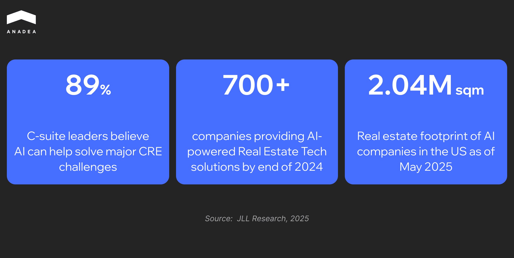
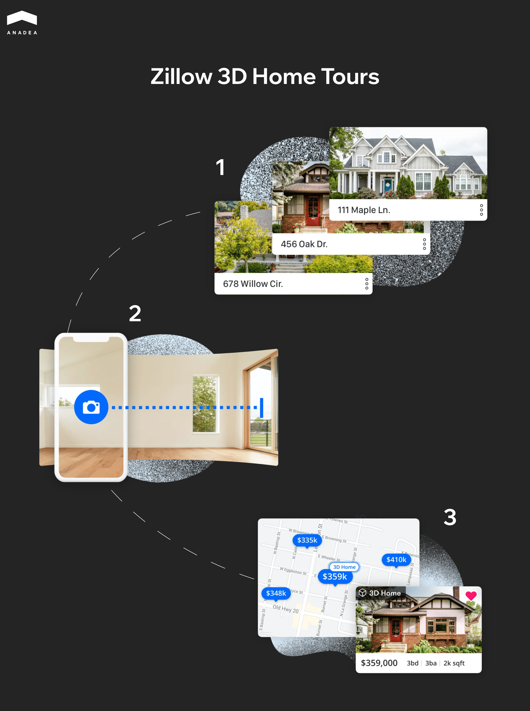
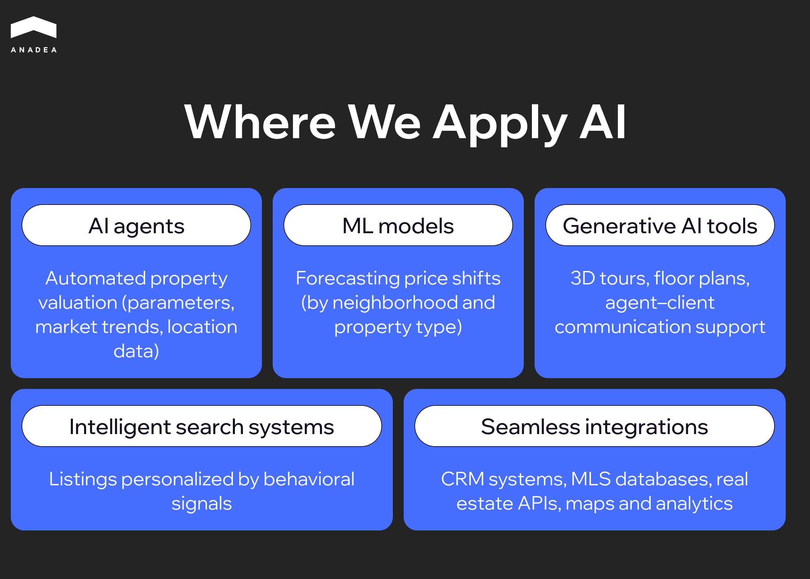

According to an [OpenAI study published in March 2023](https://openai.com/index/gpts-are-gpts/), 80% of U.S. workers will experience a significant impact of artificial intelligence on their daily tasks. This is exactly why many people fear that AI will eventually take away their jobs and means of living.

But hold on. We’ve seen this before. In 1589, [Queen Elizabeth I of England refused to grant a patent](https://www.wsj.com/articles/workers-fear-not-the-robot-apocalypse-1504631505) for the mechanical knitting machine, fearing it would put hand knitters out of work. Today, it’s widely acknowledged that mechanical knitting machines spearheaded the first industrial revolution, driving explosive economic growth and even fueling the expansion of the housing market.

So, is artificial intelligence a friend or foe? I’d argue there’s little to fear. With automation and AI expected to handle part of the workload, global labor productivity is projected to grow so significantly that world GDP could [rise by 14% by 2030](https://www.pwc.com/gx/en/issues/analytics/assets/pwc-ai-analysis-sizing-the-prize-report.pdf).

Which brings us to today’s topic: artificial intelligence in real estate. This is one of the industries where AI integration is moving at full speed. For example, in 2022, the value of AI in real estate was estimated at around $163 billion. By 2023, this figure had already reached about [$226 billion, reflecting an annual growth rate of over 37%](https://www.thebusinessresearchcompany.com/report/ai-in-real-estate-global-market-report).

So, sit back and get comfortable – over the next 10 minutes, you’ll discover everything you need to know about AI in real estate industry.

## How AI is Used in the Real Estate Industry?

Artificial intelligence in real estate is a technology that genuinely impacts industry processes. It's not just about automating routine tasks, but about a deeper level: more accurate valuation models, market forecasting, risk management, and enhanced customer interaction. Market professionals are beginning to use AI as a decision-making tool, reducing errors and decreasing reliance on subjective assessments.

### Predictive Analytics for Valuation

The use of AI for real estate investment extends beyond traditional property valuation approaches. Modern models simultaneously analyze market transactions, macroeconomic data, and specific object characteristics. This enables more accurate valuations and the construction of dynamic scenarios for pricing or investment calculations. Crucially, the algorithms reduce the role of the human factor, where emotions or biases often come into play.

### Lead Scoring and Buyer Matching

Platforms like [CoreLogic OneHome ](https://builtin.com/artificial-intelligence/ai-real-estate#:~:text=CoreLogic%E2%80%99s%20OneHome,States%20and%20Canada)demonstrate how AI in real estate industry transforms client interaction: lead priority is automatically determined, buyers receive only relevant options, and agents focus on clients with the highest conversion probability. Additionally, integrated chatbots and virtual assistants handle initial communication, while CRM systems integrate with AI to automate broker tasks.

Such solutions are already setting new market standards, and even free AI tools for real estate agents are becoming an entry point for professionals looking to optimize workflows without significant investment. The next step will involve the development of agentic systems, digital twins of buildings, and predictive modeling, which will provide not only the automation of routine tasks but also a strategic impact on the profitability of real estate portfolios.

We also have practical experience in this area: we developed an AI-based CRM solution for one of the leading US real estate market players. The system automated lead processing, increased the accuracy of property matching, and allowed agents to focus on working with the most promising clients.



### Market Forecasting

AI algorithms can detect patterns in large datasets (from demographic shifts in neighborhoods to changes in business activity). This makes price and profitability forecasts more accurate than traditional analysis methods. For investors, this means less speculation and more data-driven decisions.

### Property Management and Maintenance

In managing large properties, preventive maintenance comes to the fore. Machine learning algorithms process data from sensors in [HVAC systems](https://www.epa.gov/iaq-schools/heating-ventilation-and-air-conditioning-systems-part-indoor-air-quality-design-tools), elevators, or energy units to detect equipment performance deviations at early stages. This allows for designing an optimal service schedule based on the asset's actual condition, rather than average statistical norms. As a result, repair costs are reduced, and the infrastructure's lifespan is extended.

Another development line is the automation of administrative processes. Collecting rent, sending reminders about lease renewals, or communicating with residents is now handled through integrated systems where AI doesn't just send template messages but personalises the tone of communication based on the history of interaction with the tenant. For owners of large portfolios, this means saving hundreds of work hours and achieving more controlled operational processes.

### Generative AI for Real Estate Marketing and Design

Generative AI opens up scenarios that classical analytics could not cover. According to estimates by the McKinsey Global Institute, its impact on the industry could range from $110 to $180 billion in generated value ([McKinsey](https://www.mckinsey.com/capabilities/mckinsey-digital/our-insights/the-economic-potential-of-generative-ai-the-next-productivity-frontier)). 

In marketing, this means: each property receives its own description, created in a style that matches the target audience, instead of copying standard formulations. Advertisements or brochures are generated automatically but take into account local trends and even the emotional triggers of a specific buyer segment.

In design, the examples are even more striking. Platforms like [TestFit](https://www.testfit.io/news/testfit-launches-groundbreaking-generative-design-for-better-building-optimization) combine data about plots, topography, and client requirements to generate several variants of 2D and 3D plans in real-time. This reduces the time required to prepare schematics from days or weeks to minutes, lowers the risk of errors in calculating areas or units, and allows developers to check the economic viability of different scenarios right from the start. Essentially, this shifts the focus: the architect and analyst are not drawing by hand but are evaluating and selecting the best-generated options.

### Virtual Tours and Real Estate Visualisation

The sales and rental market is rapidly transitioning to a digital-first contact model. Real estate AI tools like [Matterport](https://matterport.com/industries/real-estate) or [Zillow 3D ](https://www.zillow.com/z/3d-home/)have already become the standard: they allow the client to independently walk through a property, assess the layout and condition of the premises without a physical visit. This tool is particularly important for commercial deals or international investors who make decisions remotely.

Generative AI in real estate industry adds another layer: dynamic virtual furnishing and design scenarios. For example, an apartment can be visualised in various interior styles with the ability to change colours, textures, and lighting. This helps the client imagine how it could look to meet their needs. For the developer or agent, this means a shorter time on market for the property and a higher level of buyer engagement.

Learn how predictive analytics supports smarter decision-making and increases returns in real estate investments. Read “[Real Estate Investments: Driving Revenue with Predictive Analytics](https://anadea.info/blog/real-estate-investments-driving-revenue-with-predictive-analytics/)”.

## How AI is Shaping Urban Planning and Development

Cities face two major challenges: rapid population growth and climate instability. Traditional planning tools often fail to account for the volume of data needed for effective solutions. This is where artificial intelligence comes to the rescue: from analyzing traffic and energy consumption to creating digital twins and generative development scenarios.

### Amsterdam: Open Data for Practical Planning

The city collects and opens data on public spaces, buildings, transportation, the environment, and other resources through its [City Data platform](https://amsterdamsmartcity.com/updates/news/city-data-a-treasure-full-of-data-about-the-city). This allows planners and researchers to analyze urban behavior, track changes in transport or development, and test new policies based on up-to-date information.

### Helsinki: A Digital Twin with Broad Analytical Capabilities

The Helsinki 3D+ project created an accurate [3D model of the city](https://profwurzer.com/smart-city-helsinkis-virtual-city-pioneers-sustainable-urban-development/), integrating it with data on energy, climate, and urban infrastructure. This allows for testing how new construction will impact traffic, CO₂ emissions, or the need for green spaces. Additionally, a ["Mobility Twin"](https://testbed.hel.fi/wp-content/uploads/2025/01/digital-twin-for-mobilty-working-paper-v2-1124.pdf) is being developed, which integrates road infrastructure and traffic data to model future transport scenarios, including those for autonomous vehicle technologies.

### Up to 500 Cities with Digital Twins

According to [Reuters forecasts](https://www.reuters.com/sustainability/climate-energy/how-ai-is-arming-cities-battle-climate-resilience-2024-05-23/), over 500 cities worldwide will deploy AI-powered digital twins by 2025 (potentially saving $280 billion) to monitor climate risks, traffic, and environmental conditions. Amsterdam is already using these capabilities to balance its energy grid and manage surplus solar power.

### Delve: Generative Design for Planning

[The Delve tool from Sidewalk Labs](https://www.aecplustech.com/tools/delve) generates dozens of neighborhood development options, considering metrics like density, green space, sunlight exposure (insolation), and economics. This makes it possible to evaluate the consequences of different scenarios before making zoning changes, making the decision-making process transparent and evidence-based.

The widespread adoption of artificial intelligence around the world indicates that cities are beginning to make decisions based on data, not assumptions. This means fewer errors in zoning, faster responses to climate challenges, and more accurate predictions of the impact of new infrastructure solutions.

## Anadea and Real Estate

Anadea has been building [real estate software ](https://anadea.info/solutions/real-estate-software)since the early 2000s. We’re deeply embedded in the industry and understand how agencies, marketplaces, and developers operate—along with the challenges they face daily.

Our strength lies in delivering complex systems with smart automation, deep analytics, and tailored business logic. Only custom solutions designed around specific use cases. We work with agencies, listing platforms, developers, and real estate startups looking to scale through technology.

One of our most impactful collaborations is with [StreetEasy](https://anadea.info/projects/streeteasy), a major real estate platform serving New York City. We worked on the platform for several years and contributed to several critical improvements:

* Migrated search to Elasticsearch, boosting performance by 33x.
* Optimized result ranking logic, increasing CTR by 80%.
* Introduced new tools for agents, resulting in an 18% lift in lead conversion.
* Designed custom UI components for different user roles (agent, owner, renter).
* Built internal analytics to track user interactions with search results.
* Fully reworked the frontend architecture and added custom filtering, indexing, and caching mechanisms to support long-term growth.

You can also explore more real estate projects in our portfolio, such as [Agentfolio Mobile Apps ](https://anadea.info/projects/agentfolio-mobile-apps)and [ListingDoor](https://anadea.info/projects/listingdoor).

### What We Do in AI for Real Estate

Over more than 20 years in the IT business, we've learned how to build software that drives real results. Since 2019, our company has been making a bold move into the AI space. Our team continues to grow with experts in deep learning and machine learning and in 2025, agentic AI became the fastest-growing direction inside Anadea.

Here’s how we apply AI in commercial real estate:

* AI agents for automated property valuation based on object parameters, market trends, and location data.
* ML models that forecast price shifts across neighborhoods or property types.
* Intelligent search systems that personalize listings not just by filters, but by behavioral signals.
* Generative AI tools to create 3D tours, floor plans, or assist agents in communicating with clients.
* Seamless integrations with CRM systems, MLS databases, real estate APIs, maps, and analytics platforms.
* [Multiple listing service development](https://anadea.info/solutions/real-estate-software/mls) for real estate.



## What’s Next for AI in Real Estate?

The development of artificial intelligence technologies in real estate is transitioning from experimental applications to the strategic transformation of business models. The next phase is more about the integration of AI for real estate into key operational and financial processes. Expected trends include:

### Intelligent Agent Systems

Instead of standalone chatbots, comprehensive agent systems capable of automating entire business processes are entering the market: client qualification, viewing coordination, deal management, and contractor oversight. A key factor is secure implementation with human involvement at critical stages and clear regulations for data access.

### Generative Design and Planning

The use of generative models in development is gradually moving beyond visualization. Systems can create layout options considering building codes, budget constraints, energy efficiency, and projected ROI. Integration with BIM and engineering simulations will become a necessary standard.

### Digital Twins of Buildings and Portfolios

Combining data from IoT sensors, [BMS (Building Management Systems)](https://www.cim.io/blog/what-is-a-building-management-system), and financial metrics allows for the creation of digital copies of real estate assets. AI, based on these, will optimize resource consumption, predict technical failures, and form capital expenditure plans. Increased use of edge computing and privacy-enhancing technologies is expected.

### New Approaches to Valuation

Pricing models increasingly incorporate not only transaction history but also alternative data (population mobility, commercial activity, ESG factors, macroeconomic indicators). An important requirement from investors and banks will be algorithm explainability and the availability of scenario analysis.

### Multimodal Customer Services

Virtual tours will integrate conversational AI systems capable of providing real-time information about the neighborhood, maintenance costs, or potential rental income. Personalized "guide agents" are gradually becoming a standard in customer experience.

### Compliance and Due Diligence Automation

Real estate AI tools for processing legal documents, checking counterparties, and identifying risks reduce verification time and minimize the likelihood of errors. One of the key remaining challenges is avoiding algorithmic bias and ensuring decision transparency.

### Financial Innovations

Automating invoicing, managing escrow, and using smart contracts paves the way for new models of financial settlements in real estate. The mass adoption of such solutions will depend on the regulatory framework of specific jurisdictions.

### Data as a Strategic Asset

The focus of companies is shifting to high-quality data management: standardizing formats, implementing data contracts, and organizing pipelines for MLS, ERP, and IoT. Without structured and controlled data, scaling AI solutions will be limited.

### Transformation of Roles and Competencies

Real estate professionals are gradually shifting from operational routines to analytics and consulting. Demand is growing for new roles (data management specialists, MLOps/AgentOps, and AI risk managers). This requires systematic investment in staff training and upskilling.

Artificial intelligence in the real estate industry is entering a phase of systemic integration. A competitive advantage will go to companies that view AI not as a separate tool but as the operational foundation of their business: with a high-quality data base, clear processes, transparent algorithms, and a measurable impact on financial results.

## Conclusion

Integrating artificial intelligence into real estate it's a big step toward more efficient operations, stronger client relationships, and more resilient business models. Companies that already work with real-time data, automate decision-making, and embed AI into their daily operations are setting the pace for the industry.

At Anadea, we help teams move from ideas to real implementations. We design the right architecture, embedding AI into sales, property management, analytics, and service workflows.

If you're exploring how AI could fit into your real estate product or business, we're ready to talk.

[Get in touch](https://anadea.info/contacts) with us to discuss your idea or learn how our experience can support your next move.
