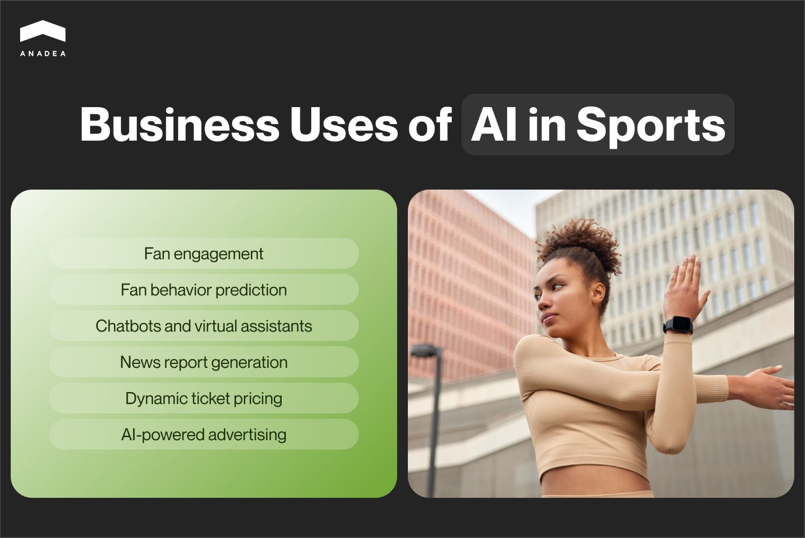
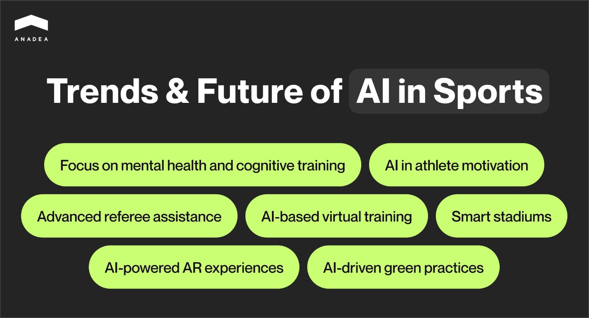

Today the use of artificial intelligence in different industries is more than just a modern trend. This technology can offer a lot of benefits and significantly broaden horizons for both businesses and customers. The sports industry is not an exception here. At the moment, we can observe its significant transformation under the influence of emerging technologies and that’s what we’d like to talk about in this article. We are going to focus on the role of AI in sports and highlight the changes that it brings to the industry.

## AI in sports industry: Key things you need to know

Artificial Intelligence is one of the most widely discussed technology these days. It can be successfully applied in many domains. This explains why the demand for professional [AI software development services](https://anadea.info/services/ai-software-development) is continuously growing. AI can automate a lot of routine tasks, streamline numerous processes, and increase their efficiency by bringing personalization and optimization.

In 2024, the AI market in the sports industry is at around $5.93 billion. By 2029, it is [expected](https://www.mordorintelligence.com/industry-reports/artificial-intelligence-market-in-sports) to achieve a size of $20.94 billion. This means that the market is projected to grow at an impressive CAGR of over 28% within the forecast period.

The growth of the industry is boosted by the increasing adoption of technology in sports. Moreover, with the continuous tech progress, it is quite logical to presuppose that the range of [sports software products](https://anadea.info/solutions/sports-app-development) and their use cases will widen.

To better understand why today so many businesses are ready to invest in the creation of such solutions, it’s necessary to consider the key benefits of AI in sports. The perks of the implementation of AI for sports are the following:

The use of AI in sports can transform various aspects. We offer you to take a closer look at different applications and AI in sports examples.

## Artificial intelligence in sports: Use cases

Let’s start with the applications that have a direct relation to sports activities. The primary goal of AI technology in sports is associated with the implementation of high-quality data collection, processing, and analysis. The work with huge volumes of data collected during training sessions and matches provides athletes and coaches with a completely new vision of the entire process. As a result, they have the possibility to adjust their efforts and in-game strategies to the ongoing situation and requirements.

How is AI used in sports?

### Performance optimization

AI analytics can efficiently process data from wearable sensors, GPS, and cameras. This helps to monitor athletes’ movements, speed, heart rate, and other important parameters. With these insights, coaches can introduce changes to training routines, which will prevent overexertion and maximize in-game performance.

### Strategy and game planning

AI/ML models can simulate different game scenarios. This allows teams to test and refine strategies before and during competitions. Moreover, AI can break down opponents’ tactics, as well as define their strengths and weaknesses. Thanks to this, coaches can develop better game plans.

### Injury prediction

Artificial intelligence can also analyze historical data, workload patterns, and physiological factors. This can be done to detect injury risks before they take place. For example, it can predict when a player is more prone to soft-tissue injuries because of overtraining or muscle fatigue. Coaches can stop training or adjust its intensity so that players remain within safe physical limits.

### Talent identification and recruitment

One of the benefits of AI in sports is that it can also be helpful for predicting player potential. AI models can work with large datasets from scouting reports, game footage, and player statistics to find the most promising athletes. This provides clubs with objective information for making data-driven decisions in talent recruiting.

### Match prediction

AI-driven models can analyze past performance, weather conditions, player injuries, and other factors to predict match outcomes. The results of such analysis can be used by teams for strategic planning and building in-game tactics.

### Team and player statistics

Artificial intelligence in sports can compare player statistics across seasons, leagues, and teams to assess performance in different environments. Moreover, AI can generate advanced metrics such as Expected Goals (xG) in soccer, Player Efficiency Ratings (PER) in basketball, and Win Probability.

### Personalized training plans

It’s an absolutely clear fact that all people are different and their needs are not the same as well. The same is true about athletes. To achieve high results, people should make different efforts and focus on various aspects. AI/ML tools in sports can introduce significant changes to the personal training of professional athletes. Training plans can be also enhanced with individual dieting programs that will be composed based on the needs of athletes and their schedules.

### Decision-making and refereeing

AI tools that can process images and videos are aimed at reducing human error in officiating. AI can assist in identifying fouls, rule violations, or boundary infractions during a match. As a result, referees can make more consistent and fair decisions.



## Business use of AI in sports industry

While talking about the role of AI for sports, it’s impossible not to mention the use cases related to the business processes and tasks in this domain.

### Fan engagement

Thanks to AI, sports clubs can provide fans with content that fully corresponds to their needs and interests. Personalized video highlights, news, and statistics can be shown to fans based on their preferences and viewing history.

### Fan behavior prediction

AI in sports can analyze such fan data as social media activity, purchasing habits, viewing preferences, etc. Based on this, such solutions can predict attendance trends, merchandise sales, and changes in the size of the fan community. This helps sports organizations strengthen their marketing strategies and make them more result-oriented.

### Chatbots and virtual assistants

AI-driven solutions can support fans in their interaction with sports organizations. For example, they can answer various questions online, as well as assist people in buying tickets or planning their trip to the stadium. All this greatly enhances the overall fan experience.

### News report generation

Already today, generative AI in sports journalism is not something completely new. AI algorithms can automatically generate match highlights and post-game analysis. As a result, broadcasters and media outlets can save time and still offer comprehensive coverage practically in real time.

### Dynamic ticket pricing

AI-powered systems can adjust ticket prices in real time. Such changes can be made based on demand, seating availability, weather, team performance, and historical data. This approach helps organizations maximize revenue. Peak demand allows them to price tickets higher. During low demand, they can lower prices to attract more fans.

### AI-powered advertising

Artificial intelligence can make advertising more engaging and more efficient, which can become a win-win strategy for both sports clubs and fans. For example, it makes it possible to place ads in real time and adjust messaging based on live match developments. Moreover, AI is one of the technologies that power programmatic advertising. This approach presupposes that algorithms can automatically buy and place digital ads on streaming platforms, social media, and different websites.

## AI in sports examples

Today many clubs and organizations around the world are adopting artificial intelligence in sports. Let’s take a look at some prominent examples.

### The NBA Global Scout mobile application

This AI-powered app has several major features. First of all, it allows players to upload videos that show how they perform various specific exercises to get an assessment of their skills. This helps them to define areas for improvement. Moreover, players from all over the world can showcase their talent and potentially be invited to join any of the NBA teams during their recruiting campaigns.

### IBM Power Index & Match Insights at Wimbledon and the US Open

These data analytics solutions by IBM rely on artificial intelligence to analyze players’ performance and make predictions for game results. These forecasts are based on a row of explainable win factors, such as previous win-loss ratio and win margin, rank differential, court surface, and injury status. Moreover, these AI algorithms also take into account fan sentiment collected from social media with the help of NLP technology. It is also applied to automatically generate fact sheets that are further provided to fans.

Image source: <a href="https://www.homecourt.ai/nbaglobalscout">homecourt.ai</a>

## AI in sports: Future trends to watch out for

Technologies are evolving very fast. Some solutions that are currently being used may have seemed fantastic even a decade ago. These days we can observe not only an increase in the interest in AI technology in general but also the growth of the investment in this sector. According to the [McKinsey Global Survey on AI](https://www.mckinsey.com/capabilities/quantumblack/our-insights/the-state-of-ai) conducted in 2024, AI adoption across organizations has jumped to 72%. Just compare, the same survey in 2023 showed that this figure didn’t reach 66% at that time. 67% of respondents admitted that they expect their companies to increase their investments in AI in the next three years. Analytical AI remains to be the most heavily invested type of solution.

From the perspective of tech advancements, the sports industry greatly follows the trends. Given this, we can presuppose that we will be able to observe a similar situation in this market. But how will the technology be changing? What new applications of AI in sports industry will be introduced? Here are a couple of predictions.

### Focus on mental health and cognitive training

Today AI is widely applied to analyze the physical state of athletes based on real-time parameters gathered by wearable devices during training sessions and matches. In the future, AI tools will increasingly focus on monitoring athletes’ mental health and cognitive performance. This is important to optimize not only the physical but also the mental aspects of the game.

### AI in the motivation of athletes

AI algorithms can monitor the changes in the emotional state of athletes. This can be done through various factors like social media sentiment, body language, and voice tone. This information will help sports psychologists provide better support and keep athletes’ motivation at the highest level.

### More advanced referee assistance

AI can assist referees in making instant, accurate decisions in fast-moving sports. As it is expected that the capabilities of video analysis will improve, the quality of real-time decision support will be enhanced as well. This will minimize human error in critical calls. Moreover, the next step of AI adoption in officiating will be its full automation.

### AI-based virtual training

It is predicted that teams and athletes will increasingly use AI tools for training purposes. AI in sports can simulate real-world game scenarios. As a result, players can practice strategy and decision-making in a virtual environment before stepping onto the field. What’s more, AI can serve as a virtual opponent. It can mimic the playing style and strategies of actual opponents. Thanks to this, the team can leverage more advanced preparation before important matches.

### AI-powered AR experiences

Sports clubs will be able to use AR tools to enhance fans’ viewing experience. Such solutions can be equipped with AI functionality. It will provide real-time stats, player information, and immersive content over live broadcasts or in the stadium itself.

### Smart stadiums

AI will be one of the leading technologies in the evolution of smart stadiums. It can optimize a wide range of aspects, including but not limited to crowd management, ticketing, lighting and temperature control, etc. It’s also vital to mention the potential contribution of this technology to the enhanced security at stadiums. AI-powered facial recognition and behavior analysis will enable real-time threat detection and response to potential safety issues.

### AI-driven green practices

This trend is among the top global tendencies in the business world. These days more and more companies highlight the importance of environmentally-friendly activities and projects. One of the first things that should be done is the reduction of the negative effect of their business processes on the world around us. AI can help sports organizations adopt more environmentally sustainable practices. For example, AI can optimize energy use during games and training sessions, reduce waste in concessions, and manage transportation logistics. All this is expected to minimize the environmental impact of sporting events.

## AI sports app development: How we can help you

Without any doubt, the creation and further launch of an AI-powered solution for the sports industry can be a very promising step today. Such applications can bring the efficiency of training efforts to a completely new level, and, consequently, can greatly improve the results of the teams and individual athletes who rely on such solutions.

Nevertheless, to get a high-quality software product that will meet all the modern standards, you need to cooperate with a professional development team. These specialists should deeply understand the ongoing needs of the sports industry and know the peculiarities of AI technologies. That’s exactly what we can offer at Anadea.

In our [portfolio](https://anadea.info/projects#sports), you can find a row of projects built for the sports industry. Moreover, over the years of work, we have successfully elaborated and implemented our own approach to [building AI software](https://anadea.info/blog/how-to-create-ai-software).

We can ensure the use of the latest technologies, outstanding quality of the final product, the most competitive pricing options, as well as efficient project management. We never stop learning and do our best to stay tuned with all the latest trends and innovations.

If you still have doubts about the feasibility of your idea for implementing artificial intelligence in sports, do not hesitate to contact us. We will analyze the concept of your future solution and find the best approach to the realization of your project. Leave an inquiry on our website and we will provide your project estimate for free!

Get in touch
