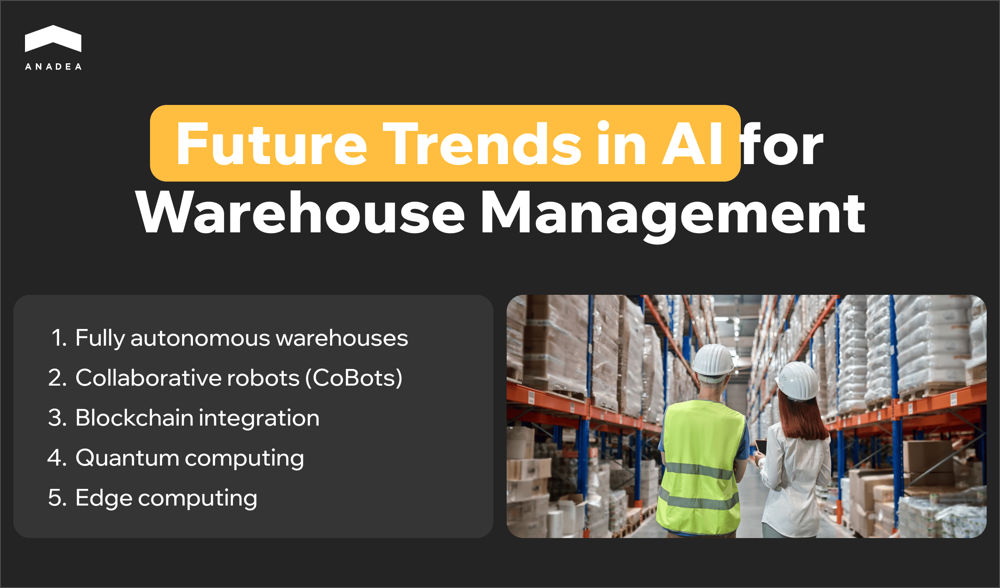

The [role of artificial intelligence](https://anadea.info/guides/the-impact-of-ai-on-business) across multiple business domains can’t be underestimated. Today it is one of the most widely discussed technologies. And it is not just about simple hype. The main thing is the value that it can bring to industries and the new opportunities that it opens. In this article, we are going to focus on one of the areas of its application and talk about AI in warehouse management.

## AI warehouse management: Quick market overview

To begin with, what does the use of AI in warehouse management include? It presupposes the application of artificial intelligence and related technologies to automate, optimize, and enhance the efficiency of multiple warehouse operations.

Advanced solutions powered by AI algorithms, machine learning, and data analytics help to transform traditional processes. They can streamline various tasks, enable real-time decision-making, and increase overall productivity.

AI in warehousing market size [achieved](https://www.gminsights.com/industry-analysis/ai-in-warehousing-market) a volume of $8.3 billion in 2023. However, according to experts, this figure will be significantly higher already in the near future. The projected CAGR for the period between 2024 and 2032 will be close to 27%. This means that by the end of this period, the market will be able to hit the level of over $70 billion. Its skyrocketing growth is greatly boosted by the pressing need for efficient automation and high performance of warehouse operations.

## Role of AI in warehouse automation

Let’s take a closer look at the most common use cases of AI in warehouse management.

### Inventory management and forecasting

Overstocking and stockouts are serious problems that can result in significant losses. Nevertheless, AI-driven algorithms can address these issues. They can detect demand patterns under the influence of different conditions and make accurate predictions. Just-in-time stock replenishment helps not only to save costs but also to enhance customer satisfaction.

### Predictive maintenance

AI can process huge volumes of equipment and machinery performance data. Based on the results of this analysis, it can detect signs that may indicate the necessity to conduct maintenance or repair any parts. Thanks to this, companies can timely invest in tech maintenance and avoid significant expenses related to serious machinery breakdowns in the future.

### Real-time inventory tracking

Computer vision systems accompanied by IoT sensors can monitor the movement of goods in real time. This reduces human error and increases inventory accuracy. Also, this can provide valuable insights for decision-making.

### Demand-driven layout and stock placement

It is possible to use AI algorithms to analyze historical picking data and demand patterns. This helps to optimize warehouse layout by positioning frequently required items closer to picking areas.

### Energy optimization

AI can also help to optimize the energy consumption in warehouses, and consequently, operational expenses. AI-powered systems can adjust lighting, heating, and other systems based on real-time usage and occupancy of the facilities.

### Labor management

AI-based systems can create work schedules following workload forecasts, worker availability, and specific skill sets. Moreover, in combination with wearable technology or sensors, AI can monitor workers’ physical conditions. This can be done to detect possible signs of stress, fatigue, or unsafe working practices.

### Quality control

Image recognition solutions are implemented to inspect goods for defects or damages during different stages of warehouse operations. For example, if any damages are detected at the moment of receiving, the system will send an alert. Based on this, managers will need to decide on the next steps of working with these items.

### Autonomous vehicles and robotics

Autonomous vehicles and robots can be used to automate many tasks, including picking, packing, sorting, and transporting goods within the warehousing facilities. This can greatly increase the accuracy and speed of such processes and optimize labor costs.

## Key benefits of AI in warehouse management

To understand how [artificial intelligence](https://anadea.info/blog/artificial-intelligence-pandoras-box-or-the-holy-grail/) and other related technologies are revolutionizing the industry, it is important to analyze the advantages that they bring. Namely, these positive changes are among the main reasons why businesses are continuously investing in such solutions. In this context, it’s interesting to mention that by 2025, the size of AI investments is [expected](https://www.goldmansachs.com/insights/articles/ai-investment-forecast-to-approach-200-billion-globally-by-2025.html) to approach $200 billion globally. And it will be sensible to presuppose that some part of these funds will be allocated to AI warehouse management projects.

Benefits of AI in warehouse operations:

* **Better efficiency**. Artificial intelligence helps to automate repetitive tasks. The use of such tools can boost productivity and minimize human errors.
* **Cost reduction.** AI-powered solutions play an important role in the optimization of inventory, space, and labor management. Such efforts help to avoid a lot of unnecessary expenses and losses. That’s why all this directly impacts cost savings.
* **Improved accuracy**. Real-time data monitoring and predictive analytics are important elements of artificial intelligence warehouse management. They improve inventory accuracy and demand forecasting.
* **Scalability**. Well-designed AI systems can quickly adapt to changing business needs. This enables businesses to be more agile and flexible in their operations.
* **Higher customer satisfaction.** AI can ensure faster order fulfillment, real-time inventory transparency, and fewer errors in shipping. As a result, customer satisfaction can get significantly higher.
* **Enhanced safety**. AI can be used to monitor real-time data from sensors, wearables, or cameras to detect potential threats to workers. For example, if a person is currently too close to automated equipment, the system will identify this case and issue an alert to avoid the risk of an accident.



## AI in warehouse management: Future trends

Though already today, some use cases of AI in warehouse automation look quite impressive, it is sensible to expect that in the future, we will see even more advanced solutions. Of course, for now, their development and implementation may be too expensive and challenging. Nevertheless, technology does not stay still. With all the achievements made in this sphere, many “unrealistic” plans can become a reality quite soon.

To be more prepared for changes in market needs and demands, it can be very helpful to consider the most promising future trends for AI in warehouse management.

### Fully autonomous warehouses

Today many warehouses have already implemented solutions for automating some of their multiple processes. But the future will see fully autonomous warehouses. In such systems, robots and AI-driven programs will manage absolutely all aspects of operations, from receiving goods to shipping. Robots will be able to navigate warehouse facilities independently, pick and move goods without getting predefined instructions. These systems will be able to learn and adapt to their surroundings. As a result, the need for human intervention will be drastically reduced.

### Collaborative robots (CoBots)

AI can be also used to establish seamless collaboration between human workers and robots. Robots will be responsible for repetitive and physically demanding tasks. At the same time, humans will have more time to focus on more complex decision-making processes. Collaborative robots will work alongside humans in a safe and productive environment.

### Blockchain integration

AI in warehouse management can be also efficiently powered by other emerging technologies. One such successful example of technology combination is the use of AI alongside blockchain. Blockchain technology can help enhance transparency and traceability in warehouse management. It can provide a secure, immutable record of every transaction and movement of goods. Meanwhile, AI can analyze and interpret this data to improve decision-making.

This combination of emerging technologies can also ensure end-to-end visibility across the supply chain. With such tools, it will be possible to track the movements of items in real time, as well as ensure compliance with regulations and quality standards.

### The use of quantum computing

It is expected that quantum computing will bring immense computational power to AI models. As a result, this combination will allow for more complex and faster optimization processes, including route planning and order sequencing. AI systems powered by quantum computing will provide solutions to many challenges that are currently computationally expensive. For example, such possibilities as large-scale multi-warehouse synchronization and optimization logistics routes with numerous variables will be available as well.

### Edge computing

Edge computing will bring AI decision-making closer to warehouse operations. Data will be successfully processed directly on local devices, instead of being sent to the cloud. This approach will improve response times for critical warehouse operations, including robotics control, equipment monitoring, and inventory tracking.

## How to implement AI warehouse management: Basic steps

A clear vision of the process is a very important condition of successful project realization. That’s why if you are thinking about the [development of AI software](https://anadea.info/blog/how-to-create-ai-software/) for your warehouse facilities, we recommend you start with detailed planning. You need to find the right approach and understand what tasks you have. Moreover, the sequence of these tasks is also highly important. Given this, we have prepared a short checklist for you that includes the main tasks that you shouldn’t forget about.

### 1. Analyze your warehouse operations and define key objectives

You need to evaluate your existing warehouse processes and identify pain points. This will help you understand which of these processes can be enhanced with AI. Maybe you will see some inefficiencies in inventory management or order picking. Or maybe you will understand that there are some issues related to labor management or equipment usage. Such things are very individual and may greatly differ at various facilities. There can’t be one-size-fits-all solutions. That’s why it’s necessary to pay attention to this step.

When you determine areas for improvement, you will need to set clear goals. What do you want to achieve with AI? Objectives can be different, from reducing costs to increasing throughput. The defined objectives will guide the entire AI implementation strategy.

### 2. Identify AI use cases

Based on your goals, you should find specific AI use cases for your project. We always recommend our customers start with low-risk areas and less critical operations such as automating inventory counts or integrating AI in demand forecasting.

### 3. Choose the right partner and technologies

It’s vital to work with professional developers who have relevant expertise. Very often for projects related to artificial intelligence warehouse management, companies prefer not to hire in-house developers but to work with expert specialists. At Anadea, we have outstanding experience in working with businesses from different domains and [building AI solutions](https://anadea.info/services/ai-software-development). We assist our clients at all the steps of the project realization and can help to opt for the right technologies based on the project’s needs.

### 4. Build the AI data infrastructure

It’s required to equip your warehouse with data-capturing devices like IoT sensors and barcode scanners. Such devices will collect data for your AI systems.

Another important task at this stage is setting up a centralized data platform or cloud infrastructure for consolidating data from various sources. It is also vital to establish data quality controls to ensure the accuracy, completeness, and timeliness of data. To produce reliable outcomes, AI systems should rely on high-quality data.

### 5. Train AI models

Based on your unique requirements, data scientists and AI specialists will develop algorithms and models that optimize operations. In some cases, custom development is not necessary as there are pre-trained AI models designed for common warehouse tasks. However, this approach may not always ensure the highest efficiency.

### 6. Conduct pilot tests

Before full-scale implementation, it is recommended to run pilot tests in specific warehouse areas. These tests will help fine-tune algorithms and workflows before going live across the entire warehouse.

### 7. Integrate AI with your existing systems

When everything is ready and you are satisfied with the results of the tests, you can integrate your AI tools with other solutions. It’s crucial to ensure real-time data sharing and communication between systems.

### 8. Train your employees

When your AI tools are introduced, you should provide thorough training for warehouse staff. People should clearly understand how to work with new solutions.

### 9. Monitor performance and continuously optimize your system

You should track such parameters of performance as order accuracy, picking speed, and overall throughput. If any issues are detected, it is necessary to think about the ways to address them.

As AI systems learn and adapt over time, it is also required to feed them with new data and adjust the algorithms for better performance.

## Final word

It can be too early to talk about the mass adoption of AI in warehouse management today. Nevertheless, the situation is changing. AI is being gradually introduced at different warehouses all over the world. One day AI automation can become a standard for the industry.

Though the use of artificial intelligence can bring a lot of benefits to warehouses, some managers still have doubts regarding the feasibility of such investments. If you are also not sure whether you should consider the implementation of AI, you can always turn to us to get professional [consultancy](https://anadea.info/services/consulting-and-audit).

But if you have already decided to power your warehouse facilities with AI and have an idea for a project, feel free to contact us and request cost estimates for free.

Get in touch
