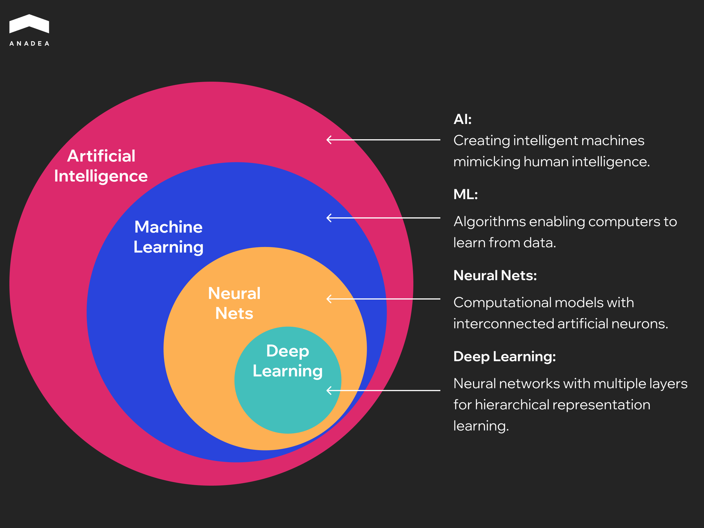
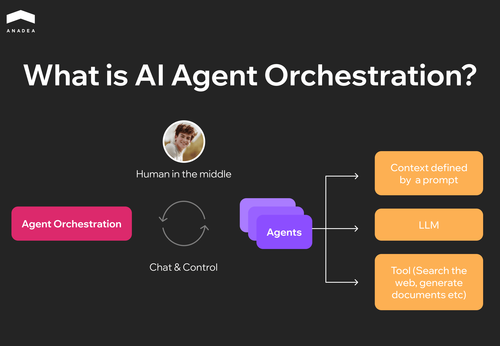

According to recent research by Harmonic, [an average organization is now using 254 AI-driven tools](https://www.harmonic.security/blog-posts/how-many-ai-tools-are-employees-using-more-than-you-think-and-often-with-personal-accounts). This proves that AI adoption is gaining momentum. But together with numerous positive changes, such a large number of AI apps can bring chaos in terms of governance and security. The more advanced the AI system you have, the higher your responsibility for managing it will be. Doing it manually requires a lot of resources, time, and effort, which increases costs and may lead to additional risks and challenges.

This is where AI orchestration plays a crucial role.

In this article, we are going to explain what AI orchestration is, why businesses need it, and how to implement it correctly. 

## What Is AI Orchestration?

AI orchestration is the coordinated management of multiple AI models, tools, and data pipelines to achieve a specific outcome. It ensures high-level coordination as it covers all levels of AI systems, including ML networks and non-ML components, such as LLMs, APIs, automation, and rule-based tools.

Instead of using just one LLM for any possible tasks, orchestration includes:

* **Choosing the right model or tool**. It is done based on the task’s requirements and helps ensure accuracy and relevance of outputs.
* **Managing workflows across systems**. Coordination of multi-step processes may span different models, APIs, and services. It is essential to achieve a cohesive outcome.
* **Handling context and state**. This allows the system to make goal-directed decisions across steps.
* **Enforcing governance and compliance**. The orchestration layer applies safety filters and audit controls to make sure that AI actions adhere to legal standards and ethical guidelines.



### Why Does AI Orchestration Matter?

As AI systems become more complex and mature these days, the significance of AI orchestration is gradually increasing.

Let’s take a closer look at the reasons behind it:

* **The growing number of AI tools in use**. Now, organizations often implement more than just one model. They use a combination of solutions. And it is crucial to ensure seamless interaction between all of them.
* **Shift to AI-driven actions and decisions**. If earlier, AI was mainly used for providing answers to users’ requests, now companies also rely on it to take action. AI agents can perform a lot of complex tasks that require step-by-step execution. For instance, they can coordinate cross-department workflows, manage customer support tickets, monitor, and flag compliance or regulatory issues. Orchestration is the backbone of building autonomous AI agents that can plan and decide.
* **Efficiency and cost**. The choice of the right tool at the right moment helps avoid expenses related to the use of unnecessary LLM calls. AI orchestration optimizes the costs and performance of AI systems.

## AI Orchestration and Other AI Management Technologies

AI orchestration is often compared with other existing technologies intended for managing AI tools, such as RPA (robotic process automation), MLOps pipeline scheduling, and integration platforms. However, all of them serve distinct purposes. Here are the major differences between them.

### AI Orchestration vs. RPA and Classic Workflow Automation

Classic workflow automation and RPA tools are intended for automating rule-based, repetitive tasks, like invoice processing or form filling. When it comes to unstructured data or unpredictability, they are inefficient.

At the same time, AI orchestration tools can coordinate complex, decision-heavy workflows. They dynamically route tasks and optimize resource allocation across multiple AI models. Thanks to this, they enable adaptive decision-making in heterogeneous AI environments.

#### Examples of Use Cases:

* RPA can be used to automate payroll data transfer between two systems.
* An AI orchestration platform can interact with multiple LLMs and APIs to process unstructured resumes and rank candidates to send shortlisted profiles to HR software.

### AI Orchestration vs. MLOps Pipeline Scheduling

MLOps tools are implemented to manage model training and deployment, as well as performance monitoring. They are focused on the model lifecycle. But they do not coordinate models and solutions in production workflows.

Meanwhile, AI orchestration goes significantly beyond model deployment.

#### Examples of Use Cases:

* MLOps frameworks can be applied to retrain models on new data. For example, it can be helpful for financial organizations that rely on fraud detection models and want to enhance their performance by retraining them every week with new transaction data.
* AI orchestration can simultaneously work with a fraud detection model, an LLM, and an API to trigger transaction holds in real time if any signs of threats are identified.

### AI Orchestration vs. Integration Platforms (iPaaS)

Integration platforms are built to connect apps and data sources through predefined connectors. They can handle mainly static and deterministic workflows with strict rules.

Orchestration adds reasoning and context-awareness. It means that AI orchestration platforms don’t follow any precise one-way scripts. They can decide in real time how to route tasks across systems.

#### Examples of Use Cases:

* Integration platforms can automatically add a lead to a Mailchimp list when a lead is created in Salesforce.
* AI orchestration tools can use an LLM to qualify the lead based on notes. They can check compliance rules and enrich themselves with external data. Only after that, they will decide whether to add it to Mailchimp or escalate to sales.

## What Is AI Agent Orchestration?

AI agent orchestration is the process of coordinating multiple specialized agents so they can collectively achieve a goal. Orchestration tools analyze different parts of tasks and assign them to the right agent that can cope with particular work better than others.

Orchestration serves as the central controller. It manages communication and coordination between agents that perform tasks based on its instructions. Within this cycle, a human provides oversight and guidance, and may participate in decision-making where necessary.

There are several patterns for how agents are coordinated. Agents should divide labor, route expertise, choose the best solutions, and provide the final result of their effort. The most common patterns are:

* **Planner and executor**. In this case, one agent creates a plan, and another agent executes the steps in order.
* **Router and specialist**. There is a central agent that needs to decide which specialist agent will handle a given request based on its type.
* **Debate and consensus**. Multiple agents generate competing answers. Then they vote to select the best outcome.

If you want to know how to build an AI agent to address your business needs, we covered the topic in our [comprehensive guide](https://anadea.info/blog/how-to-build-an-ai-agent/) on the blog.

The need for AI orchestration frameworks grows with the complexity of tasks and processes that your AI agents handle.

Agent orchestration is especially valuable for:

* Multi-step workflows (for example, when your agents need to research, create a draft, check facts, summarize the insights, and provide a report);
* Tool-rich systems (when agents need to call many APIs, databases, or external systems in a particular sequence);
* Non-deterministic tasks (where outcomes can vary and require reasoning or adaptation);
* Dependent processes (when the next steps rely on the success of earlier ones).

## Potential Risks and Pitfalls of AI Agent Orchestration

As you can see, the use of AI agent orchestration platforms opens a lot of new opportunities for businesses. But it also introduces operational risks that you need to anticipate and be ready to mitigate.

### Infinite Loops

Agents sometimes fall into cycles of re-planning or retrying tasks indefinitely. For example, a planning agent might keep revising its task list because it never considers the goal complete.

You should add explicit stopping conditions and maximum step limits. Moreover, it is recommended to introduce a fallback path. For instance, a task should be moved to a human if an agent hasn’t succeeded after three attempts.

### Tool Misuse

If guardrails for AI orchestration are weak, agents may call the wrong API or even corrupt critical data. An agent may mistakenly delete some files instead of updating them.

To address such issues, you need to define a strict permissions model (which will define the tools that agents can call under different conditions). Apart from this, input/output validation for each action will also help.

### Cost Blowups

A poorly designed orchestration loop can trigger excessive model calls or redundant API usage. This will inflate costs.

It’s vital to monitor token usage and API costs in real time and set rate limits.

### Unpredictability

Coordination of multiple autonomous agents increases the probability of unintended behavior. Two agents might disagree or generate conflicting instructions.

We recommend you introduce consensus mechanisms and always run simulations before deployment.

## How to Implement AI Orchestration: Step-by-Step Guide

When you are planning to introduce AI orchestration, you should have a clear plan for it. Based on our practical experience in AI development and deployment, we strongly recommend you start small. Don’t try to overhaul every system at once.

### Step 1. Identify 1-2 High-Friction Workflows

First of all, you need to identify those workflows that cause the most pain for users. These processes should have clear business value so that you will be able to measure the results.

### Step 2. Define Success Criteria

Before you proceed to any actions, you define targets or quality metrics (like accuracy or coverage) relevant to your industry and the specificity of workflows.

### Step 3. Prepare Data and Tools

It is essential to implement safe, controlled orchestration. That’s why you need to restrict the data sources, tools, and APIs that can be used by AI agents, as well as apply reduction rules for sensitive information. 

### Step 4: Build an Orchestrator

Simplicity is critical at this stage. Implement a thin orchestration layer that will be able to route tasks, evaluate such parameters as cost, latency, and quality, as well as provide fallback paths if the AI produces unreliable results. This approach gives you visibility into how the system behaves without introducing unnecessary complexity.

### Step 5. Run a Pilot in a Shadow Mode

Run the orchestrator in a shadow mode, which means that it should be done in parallel with your existing workflow without affecting live operations. It is recommended to do it without exposing results to end users first. This step will let you measure quality and latency under realistic conditions.

### Step 6: Strengthen the System

Add guardrails such as rate limits, retries, and circuit breakers. It’s important to do it even before scaling. These controls will keep the system stable and protect against runaway costs or expanding failures.

### Step 7: Scale

When you are satisfied with the results of your first stages of orchestration implementation, you can extend it to additional workflows. 



## Best AI Orchestration Tools

With the expansion of the AI industry, the number of AI orchestration tools is continuously growing. We invite you to explore some of the most reliable tools from different categories.

<table>

<thead>

<tr>

<th>

<strong>Type of tool</strong>

</th>

<th>

<strong>Tool</strong>

</th>

<th>

<strong>Description</strong>

</th>

</tr>

</thead>

<tbody>

<tr>

<td>

Workflow orchestrator

</td>

<td>

Apache Airflow

</td>

<td>

This open-source platform allows teams to programmatically define, schedule, and monitor workflows. It is a good option for handling task orchestration, dependency management, and scheduling across a wide range of external systems and tools.

</td>

</tr>

<tr>

<td>

Agent framework

</td>

<td>

LangGraph

</td>

<td>

It is an open-source framework for building and managing complex generative AI agent workflows. It offers tools and libraries that help teams design and optimize LLM-driven applications. Its graph-based architecture helps represent and manage the intricate relationships between agents and workflow components. Thanks to this, orchestration is more transparent and modular.

</td>

</tr>

<tr>

<td>

Data orchestration framework

</td>

<td>

LlamaIndex

</td>

<td>

This open-source data orchestration framework is used for creating LLM-powered applications. It streamlines context augmentation for generative AI by providing tools to easily implement retrieval-augmented generation (RAG) pipelines.

</td>

</tr>

<tr>

<td>

Runtime and async orchestration framework

</td>

<td>

Temporal

</td>

<td>

Temporal is an open-source orchestration engine built to manage, execute, and monitor workflows. It lets developers define workflows directly in code. By separating business logic from infrastructure concerns, Temporal allows teams to focus on building efficient workflows without diving deep into operational complexity.&nbsp;

</td>

</tr>

<tr>

<td>

Observability tool

</td>

<td>

Arize Phoenix

</td>

<td>

This open-source AI observability platform is designed for experimenting with and evaluating AI and LLM applications. It helps teams debug and monitor workflows. Moreover, it provides tools to assess performance and identify issues.

</td>

</tr>

<tr>

<td>

Guardrails and safety framework

</td>

<td>

Guardrails AI

</td>

<td>

This framework helps developers build reliable and safe AI applications. It focuses on two main functions: input/output guards (that monitor your application to detect and mitigate risks in AI inputs and outputs) and structured data generation (it enables LLMs to produce well-structured outputs).

</td>

</tr>

</tbody>

</table>

## Final Word

At Anadea, we have been building powerful AI solutions since 2019. Over this time, we have delivered and successfully deployed 9 custom AI agents for logistics, healthcare, retail, and other domains. We know how powerful such solutions can be, but at the same time, we are aware of the potential pitfalls of their implementation and the ways to mitigate risks.

As AI systems introduced at many organizations today are becoming more mature and sophisticated, we see the growing value of AI orchestration. Namely, well-thought-out orchestration is a foundation of multi-agent, multi-model AI that works safely and efficiently even in the most complex workflows.

If you need a consultation with seasoned AI experts or the help of a professional development team, [contact us](https://anadea.info/free-project-estimate) to discuss what we can offer you.
