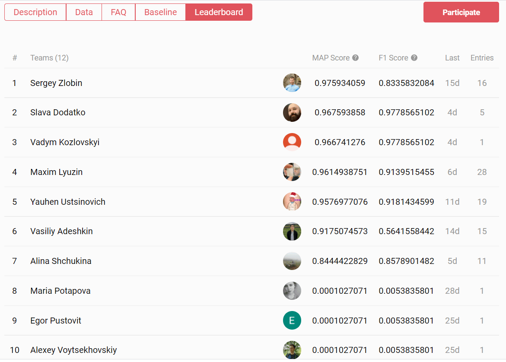

Recently, Our Deep Learning Team participated in a competition organized by Open Data Science community and took <a href="https://ods.ai/tracks/ml4sg-df2021/competitions/lacmus-cvc-soc2021/leaderboard" rel="nofollow" target="_blank">2nd place</a>! Congrats, guys!

## Project description and task definition

The task was to recognize and detect lost people in aerial images with the help of Neural Networks. It is a classical One Class Small Object Detection task.

Search and rescue teams are looking for missing people often using unmanned aerial vehicles for aerial photography. But analyzing photos needs human resources and time.

The project Lacmus helps Search & Rescue Squads to find people, who get lost, by analyzing photos from copters with Neural Networks. This project means a lot for rescuing lost people that are in danger and time plays against them.

## Impressions

> It was interesting to participate. In the process, a lot of code was written related to data markup. We also managed to implement a new promising approach while solving the task- during training, we use not a static set of pictures, but dynamically generate new images via cutting and resizing of random tiles, with the maximum preservation of the objects inside. We were surprised that existing augmentation libraries don't have similar functionality. This approach seems like an interesting solution.

— Slava Dodatko, co-founder and CEO of Anahoret.

> In order to solve the problem we tried different approaches and experimented with the latest one-stage objects detection models, in particular, with YoloX - one of the most advanced anchor-free models, which gave us the best score among all the models. At the time of the competition publicly available solution was still in early development - thus, we had to change lots of code and adapt it to our needs. We completely changed preprocessing and loading data into the model, which let us significantly speed up model training and achieve good results on time.

— Vadym Kozlovskyi
