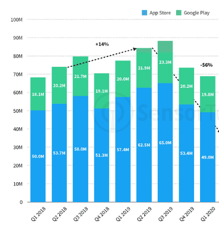
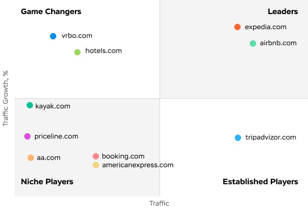
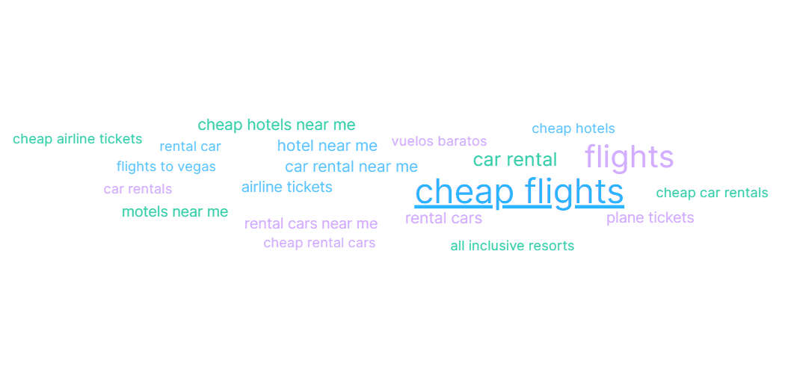
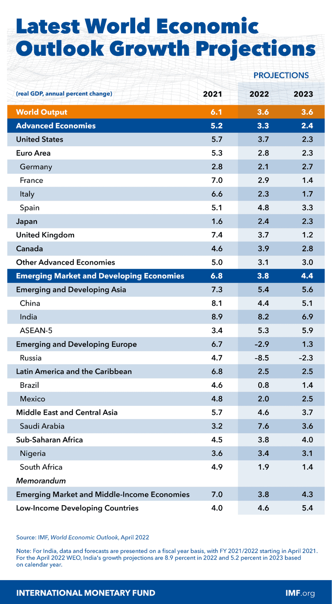

The travel and tourism industry is starting to recover from a COVID-19 outbreak, quarantine, and movement restrictions. The travel sector recovered over 50% of its gross revenue by the end of 2021 when compared to the pre-coronavirus numbers. This recovery is projected to reach 85% by the end of 2022, by Travelport.

Many countries opened borders to recover the state of affairs and catch waves of tourists heading on vacation. Or, as they say in the tourism industry - mid-season (March, April, May, October) and high season (June, July, August, September). Traditionally, __Q3 is the most fertile quarter__, which is also well seen on the bar chart below that reflects the number of downloads of top Travel category apps in Google Play and App Store in the USA by Sensortower.

So if you start to think about seeking help from a <a href="https://anadea.info/solutions/travel-app-development" target="_blank">travel app development company</a> to implement your idea, __it’s best to release it not later than 5-7 weeks before these peak seasons to return investments as soon as possible.__

## What do travelers need in your travel app or travel app ideas
By the way, do you know how long ahead most people plan their trips? About a half of surveyed US employees (2,076) __plan their vacation less than 6 weeks out__ despite the fact that the best summer fares from the U.S. to Europe can be found __five or six months ahead__, according to CheapAir.com. And, as you know, one of the most popular destinations for Americans is Europe. So, this is quite a curious thing for you to know.

Also, there is always space for maneuver to __improve your end-user experience, be it travel agencies or tourists__. For instance, the lion's share of travel agents claims buying and selling travel plans can be simplified. They want modernization of the user experience to boost online travel sales because currently, comparing too many options is challenging and becomes a roadblock, according to Travelport.

Obviously, there is a real potential to bring value and develop a travel app that covers end-users unmet needs. For example, a third of families think that searching for the best flights and making hotel room reservations is extremely time-consuming and 23% of them don’t enjoy booking trips (Travelport). Think of it - on average, travelers visit about 38 sites to decide on travel plans. So, __the core value of your travel app can be to ease the decision-making process__.

What else can we suggest to consider while developing a travel app? Let’s take a look at the user’s cloud of search queries and web services that cover their needs.

<small style="font-size: 14px">Source: Semrush</small>

You can see that these services are leaders in the search in the Travel & Tourism category in the USA: Tripadvisor, Airbnb, Expedia, Booking, Hotels, Vrbo, Kayak, Priceline. But many of the services are part of big company families, so we see that __the market is influenced by a limited number of market players despite the fact that users may think that there’s a great choice between options__.

<table>
 <tr>
  <th><b>Web service</b></th>
  <th><b>Group of companies</b></th>
 </tr>
 <tr>
  <td>Tripadvisor</td>
  <td>Tripadvisor, Inc</td>
 </tr>
 <tr>
  <td>Airbnb</td>
  <td>Airbnb, Inc</td>
 </tr>
 <tr>
  <td>Expedia</td>
  <td>Expedia Group</td>
 </tr>
 <tr>
  <td>Vrbo</td>
  <td>Expedia Group</td>
 </tr>
  <tr>
  <td>Hotels</td>
  <td>Expedia Group</td>
 </tr>
  <tr>
  <td>Booking</td>
  <td>Booking Holdings</td>
 </tr>
  <tr>
  <td>Kayak</td>
  <td>Booking Holdings</td>
 </tr>
  <tr>
  <td>Priceline</td>
  <td>Booking Holdings</td>
 </tr>
</table>

Now let's see what users search.

<small style="font-size: 14px">Source: Semrush</small>

As you see, there are many 'near me' requests, so it’s a great idea to add a __geolocation feature__ and connect the search to it to give value to your target audience. There’s also a demand for __car rental apps__ and different types of __sharing apps__, bike sharing apps, electric scooters, etc.

What else can you consider while creating your own travel app in terms of the audience and value?
First of all, it’s good to know what countries are the biggest spenders in the tourism industry and where they go for vacation. Traditionally, the __2 top spenders are China and USA__, among others we can name Germany, the United Kingdom, France, Australia, Russia, and Canada. While the top 10 destinations receive 40% of worldwide arrivals. These countries are France, Spain, the United States of America, China, Italy, Turkey, Mexico, Germany, Thailthe, and the United Kingdom (data of 2018). This gives us a hint that it’s better to target these markets and develop digital possibilities for these directions mostly to maximize the revenue.

## Travel and tourism industry trends
It’s not a secret that the growth of the world’s economy drives the growth of the Travel and Tourism industry. 2022 faced the negative influence of the events in Ukraine that slowed down the growth of the Gross Domestic Product all over the world. Still, at a smaller pace, it is still predicted to grow.

The growth of the economy and welfare, pent-up demand for travel after Сovid restrictions, and accumulated funds will certainly play their part. However, they may be also leveled out by inflation of the world’s currencies.

As we already said, the growth of the world’s economy opens new opportunities and people start to satisfy more sophisticated needs.



### Traveling with pets
In 2018, 37% of pet owners take their animals on their trips, compared to 19 percent about 10 years ago. Source: U.S. Travel Association. The most popular pets to travel with are dogs, and they make up 58% of pets traveling worldwide. 52% of surveyed owners said that they only stay at pet-friendly properties. 78% of owners and their four-legged friends are driving and flying together more now than ever before (2020-2021 statistics).

Still, there are gaps in the market facilities, many pet owners want traveling with pets to be easy. 27% of people said that they want to see more dog-friendly hotels and holiday parks. 16% would also like to see this in pubs.
15% would like to see more dog-friendly beaches, while 14% want more dog-friendly restaurants.

It means, this is a great niche to try. To _ease traveling with pets is the core value you can provide_.

### Domestic traveling
With global travel restrictions continuing, many travelers are looking for getaway destinations closer to home, and that’s unlikely to change anytime soon. Intent to travel domestically continues to rise, especially in Germany, Italy, Poland, Spain, Turkey, and the U.K.

On the plus side, all that homegrown business is helping to sustain many tourist destinations, and will continue to be a key recovery driver in the short to medium-term (source: thinkwithgoogle). What does it give? You can focus on __developing an app providing information about local facilities__.

### Mindful traveling
In the end of 2021 Booking unveiled the Mindful Travel badge. It allows users around the world to choose more sustainable housing options and get the information they want about the sustainable development approaches. It is adapted to the local characteristics of accommodation facilities. The purpose of the badge's launch is help users choose eco-friendly
accommodation options anywhere in the world.

Let's discuss your travel app idea

## Travel app types and features
Let’s take a look at what travel app types can be interesting for development.

__Travel journal.__ Users keep a journal of their travels - for themselves and to share the experience with others. Core features include multimedia and social sharing.

* __Find a travel buddy.__ Users connect with each other to travel together, plan and discuss their future trips. Core features include users profile, search, messages, calendar.
* __Plan a route and find cheap tickets.__ Without repeating the value, let’s say that core features are aggregation of cheap tickets of all kinds, map, and aggregation of cheap accommodation facilities.
* __Eco traveling.__ Help users travel eco-minded. Core features can be a map with goals to help ecology, eco-friendly shops, and community.

## Instead of conclusions
Let us remind you that it takes about __1-2 months to develop an MVP__ for a travel app. The cost can start __from 12-15K in dollars__. It’s a great idea to use such techniques as market research and <a href="https://anadea.info/guides" target="_blank">user persona</a> before starting development. We also recommend visiting the <a href="https://anadea.info/for-clients" target="_blank">client section</a> as well to get business insights, great tips from entrepreneurs, and inspiration.
