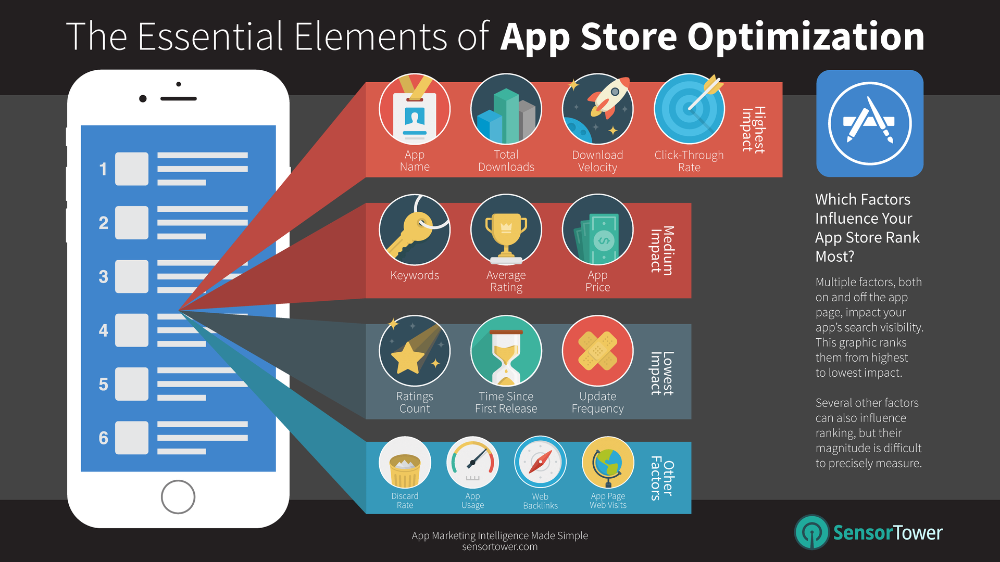
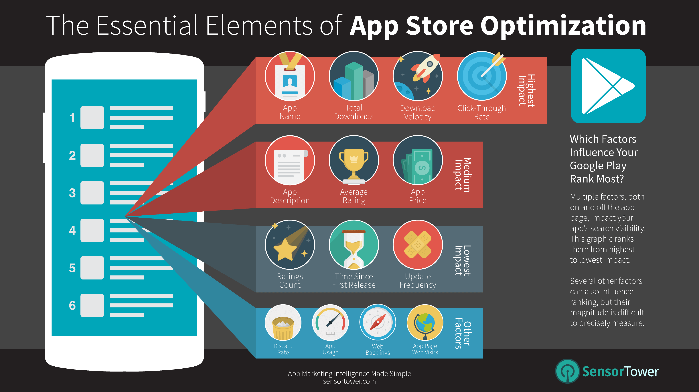

If you are looking for App store optimization tips, that probably means that you’ve successfully put your app in the App Store, Google Play, or both. If not, <a href="https://anadea.info/blog/how-to-put-your-app-in-the-app-store-or-google-play" target="_blank">check this article</a> and learn how to make it seamlessly. Same as in [web SEO services](https://anadea.info/services/seo-service), there are a few tricky things about ASO. Anyway, to rank high in app stores, you’ll need to work on the app’s meta, graphic content, alter them, do a lot of A/B tests to find the best combination of the keywords used by your target audience. The hard part in ASO is to place all the desired and relevant keywords into the meta that have the restriction by the length. Finding this balance to achieve maximum conversions may become a challenging task.

It goes without saying that you’ll need to watch the competitors in your target category, country, check ranks and history, reviews, strategize keyword selection and try to extract the insights of what brought them the success. And work on the product itself - constantly improving it from the user’s point of view and here you can ask for help from a <a href="https://anadea.info/services/mobile-development" target="_blank">mobile apps development company</a>.

So, to rank higher in the App Markets you should know the most important factors for each store. Let’s look at them closer.

<h2>Table of contents</h2>
<ol>
 <li><a href="#app-store">App Store</a>
  <ul>
   <li><a href="#app-store-title">Title</a></li>
   <li><a href="#app-store-subtitle">Sub-title</a></li>
   <li><a href="#app-store-keywords">Keywords</a></li>
   <li><a href="#app-store-graphic-content">Graphic content (icon, screenshots, video preview)</a></li>
   <li><a href="#app-store-reviews">Reviews and Rating</a></li>
   <li><a href="#app-store-promo-description">Promo text and Description</a></li>
  </ul>
 </li>
 <li><a href="#google_play">Google Play</a>
  <ul>
   <li><a href="#google-play-title">Title</a></li>
   <li><a href="#google-play-short-description">Short Description</a></li>
   <li><a href="#google-play-description">Description</a></li>
   <li><a href="#google-play-graphic-content">Graphic content (icon, screenshots, video preview)</a></li>
   <li><a href="#google-play-reviews">Reviews and Rating</a></li>
  </ul>
 </li>
</ol>

## App Store

### Title

**Include the most important keywords relevant to your app**. It means you need to use keywords with the highest search volume in the title, but also your app should close the demand of users. The MAX length of your title is 30 symbols. To find keywords for your app you can use <a href="https://sensortower.com/" rel="nofollow" target="_blank">SensorTower</a>.

### Sub-title

It should include **less important keywords** (keywords with lower search volume in the App Store) and its MAX length is 30 symbols too.

### Keywords

Fill in the keywords that would help to find your app. MAX length should be 100 symbols. Here could be the same keywords like in title or subtitle, but you should find the balance with keywords to get maximum downloads.

### Graphic content (icon, screenshots, video preview)

All these elements can affect the conversion rate of your app and also can affect your rank. Use A/B tests to find the best variant of icon, screenshots, and video content. All requirements for the graphic content you can find <a href="https://help.apple.com/app-store-connect/#/dev910472ff2" rel="nofollow" target="_blank"> here</a>.

### Reviews and Rating

All content of reviews is indexed in the App Store and it affects your positions.

### Promo text and Description

These elements are not taking part in raking in the App Store, though written appealing, they can affect the number of downloads.

All information about the app analytics you can find in <a href="https://developer.apple.com/app-store-connect/" rel="nofollow" target="_blank">App Store Connect</a>.

## Google Play

### Title

It should include the most important keywords relevant to your app. The MAX length of your title is 50 symbols.

### Short Description

It could include less important keywords and its MAX length is 80 symbols.

### Description

Unlike the App Store in Google Play, the description takes part in the ranking of the application. Max length is 4,000 characters. The most important keywords are used at the beginning of the description and the less important are placed at the end of the description. Look for long-tail and mid-tail keywords and attach them to the description. Try to <a href="https://support.google.com/googleplay/android-developer/answer/9898842#zippy=" rel="nofollow" target="_blank"> avoid the most common violations in metadata</a>.

### Graphic content (icon, screenshots, video preview)

All these elements can affect the conversion rate of your App and also can affect your rank. Use A/B tests to find the best variant of icon, screenshots, and video content. You can find requirements for graphic content<a href="https://support.google.com/googleplay/android-developer/answer/9866151?hl=en&visit_id=637538219534397564-2880302510&rd=1" rel="nofollow" target="_blank"> here</a>.

### Reviews and Rating
Reviews are also indexed in Google Play and it affects your positions.

All information about the app analytics you can find in<a href="https://developer.android.com/distribute/console" rel="nofollow" target="_blank"> Google Play Console</a>.

One of the most important factors in both marketplaces is the **number of downloads by keyword**. To find the best conversion rate by keywords it’s necessary to create A/B tests.

### Conclusion
To make long story short I have prepared the table with the most important parameters that can affect the ranking in market places:
<table border="1" width="100%">
<tbody>
<tr>
<td align="center"><b>Parametrs</b></td>
<td align="center"><b>Google Play</b></td>
<td align="center"><b>App Store</b></td>
</tr>
<tr>
<td align="center">Title</td>
<td align="center">50 symbols</td>
<td align="center">30 symbols</td>
</tr>
<tr>
<td align="center">Sub-title</td>
<td align="center">-</td>
<td align="center">30 symbols</td>
</tr>
<tr>
<td align="center">Keywords</td>
<td align="center">-</td>
<td align="center">100 symbols</td>
</tr>
<tr>
<td align="center">Review and Rating</td>
<td align="center">Indexing</td>
<td align="center">Indexing</td>
</tr>
<tr>
<td align="center">Short Description</td>
<td align="center">80 symbols</td>
<td align="center">-</td>
</tr>
<tr>
<td align="center">Description</td>
<td align="center">4000 symbols</td>
<td align="center">-</td>
</tr>
<tr>
<td align="center">Graphic Content</td>
<td rowspan="1" colspan="2" align="center" >Taking part in conversion rate</td>
</tr>
</tbody>
</table>
