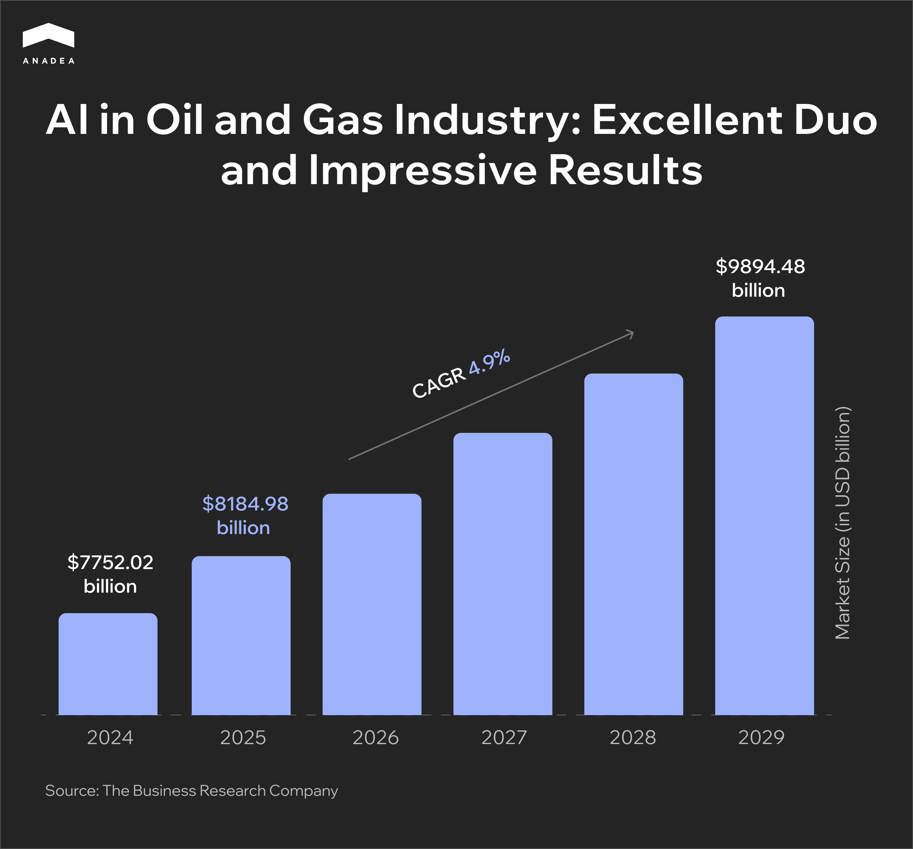
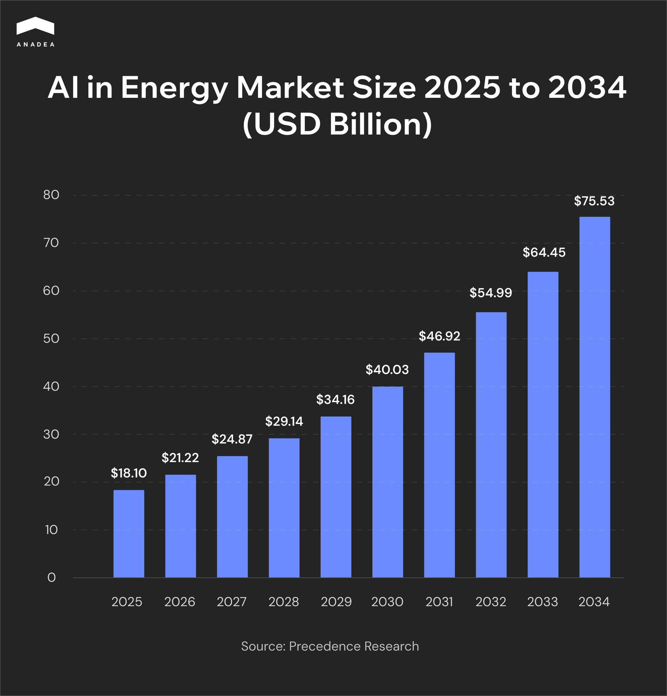

While AI is one of the trendiest and most innovative technologies today, the oil and gas industry is considered one of the most traditional markets, typically resistant to change. However, reality differs from common perception. In 2025, [emerging technologies](https://getglobalgroup.com/current-trends-shaping-the-upstream-oil-gas-industry-in-2025/), including AI, are being actively adopted by upstream companies. Around [70% of companies](https://wifitalents.com/ai-in-the-gas-industry-statistics/) in the oil and gas market use AI-powered tools for their exploration activities.

In this article, we invite you to explore the role of AI in the oil and gas industry, its real-life use cases, benefits, and the most promising future trends.

## Digitalization of the Oil and Gas Industry

Let's take a look at the growth trajectory of the global oil and gas market. In 2024, the market was valued at $7,752.02 billion. Now, experts believe that by 2029, the global gas and oil market will be able to grow up to [$9,894.48 billion](https://www.thebusinessresearchcompany.com/report/oil-and-gas-global-market-report), reflecting a steady 4.9% annual growth rate. These figures not only demonstrate the industry’s resilience in the global energy landscape but also reveal its potential to continue its investments in innovation to meet evolving market demands.

As well as many other spheres, the oil and gas industry is going through a stage of digital transformation. However, a lot of oil and gas companies still rely on obsolete operational models. This makes it pretty challenging for them to stay strong amid the current volatility of demand and prices.

In their digital transformation, [oil and gas companies](https://www.verifiedmarketreports.com/product/digital-transformation-in-the-oil-and-gas-market/) typically rely on cloud computing, the Internet of Things, Big Data, and, of course, artificial intelligence.

## AI in Oil and Gas: Industry Drivers & Market Trends

According to recent reports, [80% of executives ](https://gitnux.org/ai-in-the-oil-gas-industry-statistics/)at oil and gas companies view AI as the main technology in their digital transformation journeys. Around 65% of the organizations in this industry rely on artificial intelligence to strengthen their production and exploration. By getting access to real-time insights and powerful automation tools, they can increase efficiency and productivity.

Meanwhile, 68% of oil and gas businesses are investing in AI-powered initiatives for assessing the environmental impact of their activities. AI is becoming an essential in helping companies pursue net-zero and carbon neutrality goals. This technology enables real-time emissions tracking, carbon accounting, and predictive analytics for energy efficiency. As a result, it helps the industry in realization of its broader sustainability and green transformation efforts. 

All these new possibilities greatly boost the interest of oil and gas companies in the implementation of AI technologies.

As the oil and gas market is a part of a wider energy market, it’s worth having a look at the adoption of AI in this industry. It is expected that AI in the energy market will hit the mark of [$75.53 billion](https://www.precedenceresearch.com/ai-in-energy-market) by 2034, while in 2025, it equals $18.10 billion.

## AI for Oil and Gas: Its Role and Significance

Oil and gas companies all over the world are struggling to optimize and increase the efficiency of their exploration and production processes. And here is exactly what AI can provide. AI-powered business applications can be used for keeping digital records, automating the process of analyzing geological maps and data, as well as defining risks and potential problems like excessive or insufficient equipment use.

When it comes to [AI and machine learning services](https://anadea.info/services/machine-learning-software-development), the possibilities for businesses are practically limitless. The main task will be to choose an appropriate approach to addressing each issue or task with powerful and stably functioning software tools.

Thanks to AI in [oil and gas software development](https://anadea.info/solutions/oil-and-gas-software), companies can get access to valuable insights that were not available to them earlier. Based on the received data processed and generated by AI tools, oil and gas companies are able to make better-informed decisions and develop business strategies that will stay efficient in the long run.

Multimodal AI systems can process and interpret text, image, video, audio, and sensor data simultaneously. For example, such models can integrate seismic images, sensor logs, and engineer notes to give real-time asset health overviews.

Generative AI tools can be useful for streamlining the process of preparing technical documentation and compliance reports.

Another commonly applied type of solution is AI agents. These AI systems can act independently and automate multi-step workflows in logistics planning, drilling optimization, and facility inspections.

Moreover, AI plays a significant role in reducing maintenance costs of machines and equipment and avoiding (or minimizing) downtimes. All this is possible thanks to predictive maintenance software.

Today, in the gas and oil industry, AI and ML technologies can be applied to overcome a wide range of challenges that currently exist, including but not limited to:

* The necessity to process huge volumes of data;
* Increasing operational costs;
* Risks of equipment failure;
* Negative environmental footprint;
* Lowering efficiency of operations;
* Growing competition;
* Numerous administrative routine tasks;
* Unstable demand.

Of course, it is important to understand that just one app powered by AI for oil and gas industry can’t address all the existing issues. It should be a comprehensive system that will be built with the use of different advanced technologies and that will include various tools. Nevertheless, the significance of AI in the oil and gas market shouldn’t be underestimated as well as the potential of this technology.



## Artificial Intelligence Use Cases in Oil and Gas Industry

Let’s have a closer look at some of the most important use cases of artificial intelligence in oil and gas market today. They will help you better realize what these technologies can bring to the industry in general and your business in particular.

### AI-Powered Exploration and Drilling

The process of exploring new oil reserves is known to be quite expensive and time-consuming. However, AI can change the game for geologists and exploration teams by increasing the accuracy and efficiency of all the tasks related to discovering hydrocarbon resources. Here is how:

* **Advanced data analysis**. Artificial intelligence and machine learning in oil and gas sector can be used for analyzing huge volumes of data in different formats that typically include satellite images, seismic surveys, and geological data. ML algorithms detect patterns, anomalies, and potential hydrocarbon-rich zones with high precision.
* **Improved decision-making**. AI helps geologists identify promising drilling locations faster and more accurately than traditional methods.
* **Environmental benefits**. High-accuracy predictions help avoid unnecessary drilling and lower the environmental footprint.

### Asset Maintenance and Management

Thanks to AI-powered solutions, companies can change their approach to managing their assets, including equipment and machinery, reduce risks related to their functioning, and ensure higher reliability of their processes.

Earlier, equipment maintenance used to be either scheduled in advance or reactive (when something happened, companies had to address the issue). 

Oil and gas companies are increasingly adopting virtual replicas of physical assets. They are called digital twins and are integrated with IoT sensors. 

What can they ensure?

* **Real-time monitoring**. IoT sensors collect various data, including equipment performance and environmental conditions. Digital twins rely on this data to model the real-time behavior of pipelines, drilling rigs, etc.
* **Predictive maintenance and failure prevention**. Digital twins can detect early signs of malfunction to prevent costly breakdowns and improve maintenance scheduling.
* **Operational optimization**. Real-time models enable operators to fine-tune asset performance and reduce energy consumption.

### Production and Supply Chain Optimization

AI models can help oil and gas companies to better work with market data in order to predict demand, make production estimates, and adjust their processes to the ongoing needs of the market. AI provides businesses with the following possibilities:

* **Market-driven decision making**. AI can analyze diverse sources such as oil price fluctuations, global demand trends, and past drilling project data. This allows companies to accurately predict demand and adjust production.
* **Operational efficiency**. With reliable data at hand, companies can reduce downtimes, prevent overproduction, and ensure supply meets demand.
* **Strategic resource allocation**. The insights provided by AI tools help companies optimize the distribution of assets and adapt drilling schedules regionally.
* **AI-powered route planning**. ML algorithms can be helpful for finding the most convenient and optimal delivery routes based on real-time weather and traffic conditions. Thanks to this, it is possible to reduce expenses on transportation, save time, and decrease fuel consumption.

### Compliance and Safety

For companies working in the oil and gas industry, it is of crucial importance to meet regulatory requirements. 

Here is how the application of AI in oil and gas industry can enhance compliance and safety:

* **Automated compliance monitoring**. Regulations frequently change. AI automates the collection, monitoring, and analysis of legal and regulatory data.
* **Report generation**. GenAI tools can help companies significantly reduce the time needed for preparing security and compliance reports. By analyzing and processing big volumes of data in different formats, including images and video, multi-modal GenAI can deliver reports of various types.
* **AI-powered risk management**. ML models can analyze historical incident data and real-time operational inputs. They identify patterns and anomalies to detect potential risks or compliance violations.
* **Improved safety**. Drones and satellite imagery can be used to monitor pipelines, rigs, and remote sites for signs of leaks, land disturbances, and environmental hazards. When deviations from expected conditions are detected, AI systems can trigger real-time alerts.

### Decision-Making & Market Optimization with AI

Artificial intelligence allows companies to integrate real-time market signals into operational and financial planning. Thanks to this, businesses can:

* Implement dynamic adjustment of production schedules and drilling programs;
* Efficiently  balance capital expenditures (CAPEX) with operational expenditures (OPEX) based on current and forecasted conditions;
* Leverage accurate predictions of  commodity price trends;
* Enhance cash flow management and reduce financial risk;
* Make more cost-effective strategic decisions.

## AI for Oil and Gas: Real-life Cases

To better understand the role of AI in this industry, it will be a good idea to consider some real projects that have been realized by different companies working in the oil and gas market.

### ExxonMobil

One of the cases was the introduction of autonomous drilling in deep water by ExxonMobil. A proprietary drilling advisory system built by the company relies on the capabilities of AI to identify the most appropriate zones for drilling. Thanks to this automated system, ExxonMobil can increase drilling efficiency and safety as well as eliminate a lot of repetitive tasks for its staff. As a result, the company’s employees can concentrate on more creative and complex work.

It is also known that ExxonMobil uses AI tools for other aims, such as conducting oil analysis processes (as a part of its predictive maintenance program), for example. In one of the [reports](https://mobilserv.mobil.com/pdfs/mobil-serv-lubricant-analysis-success-story-1.pdf) provided by the company, it was stated that thanks to such a solution, they can reduce the time needed for manual sample collection by 66% which can lead to savings of $9,600 in labor costs per year.

### Shell

Shell is another industry leader that is open to innovations. The company has about 100 AI apps that are currently at different stages of development. For example, Shell relies on AI in asset performance optimization. 

The introduced solution can use the data received from hardware sensors to calculate the optimal parameters that will ensure safety and efficiency. This data can also be used by AI to reduce carbon emissions. The solution of this type is being applied at Shell’s Liquefied Natural Gas (LNG) facilities and helps to reduce CO2 emissions by 355 tons daily. It is interesting to mention that this can result in reductions of 130 kilotons per year, and this figure is equivalent to the effect of taking 28K vehicles off the roads in the US.

### Other Examples

In 2025, it is reported that Chevron is using [AI-powered drones ](https://percepto.co/percepto-leverages-ai-power-to-pilot-remote-inspections-at-chevron/)to monitor its shale sites in Texas and Colorado. In just three months of testing, the drones helped cut downtime from maintenance and repairs by alerting teams to issues like emissions leaks. Apart from this, the drones also reduced the need for workers to travel across the field for routine checks.

Devon Energy uses machine learning to monitor all its oil rigs across the US. According to the company’s report, the technology has boosted [drilling efficiency](https://www.reuters.com/business/energy/official-ceraweek-ai-leading-faster-cheaper-oil-production-executives-say-2025-03-14/) by 15%.

At the same time, BP relies on AI and the [Full Waveform Inversion (FWI)](https://www.bp.com/en/global/corporate/news-and-insights/press-releases/bp-takes-leap-forward-in-seismic-imaging-technology.html) technique to analyze seismic data from the Gulf of Mexico and other regions. To perform this task, the company needs 8-12 weeks, instead of the 6-12 months required previously. 

## Ethical Concerns of Using AI in the Oil and Gas Industry

The introduction of AI is widely accompanied by concerns related to fears that one day a lot of people will lose their jobs. Nevertheless, it is vital to see the real picture. Despite the fact that AI-powered tools are able to fulfill a lot of tasks that are traditionally performed by humans in the oil and gas industry, they still can’t function fully without any control and management conducted by people. The implementation of autonomous and semi-autonomous systems requires solid [governance efforts](https://www.tensorway.com/post/ai-agents-security-and-governance).

It is widely recommended to rely on AI only as a supportive tool while the majority of crucial decisions still should be made by people. We need to talk more about human-AI collaboration and the ways to build it instead of focusing on the risks of being fully replaced by robots.

The issue is that today a lot of companies and organizations are just not ready to adopt AI and other emerging technologies due to the lack of flexibility in their processes. That’s why, first of all, managers of such organizations should take care of some cultural shifts.

Risk-taking, experimentation, adaptability, and continuous learning should become the highest values and priorities for such companies. Traditional decision-making and rigid hierarchy prevent people from following the principles of agility and collaboration.

Before implementing any AI for oil and gas business, managers should clearly define areas where AI can be of great use and prepare the existing workflows and processes for the introduction of new solutions. Only when every team member clearly understands the role of new solutions in his or her work as well as in the functioning of the entire enterprise in general, it is possible to expect any positive outcomes of digitalization and AI adoption.

## Risks and Challenges of Introducing AI in the Oil and Gas Industry

The introduction of any new tech solution is closely related to some restrictions, pitfalls, and difficulties, especially when we are talking about big enterprise systems that deal with serious business and production processes. If you are thinking about building a solution powered by AI for oil and gas, we strongly recommend you consider the following list of potential challenges in advance.

### Financial Risks

Any software development project requires investments. That’s why, before allocating money for creating your oil and gas market intelligence tools, you need to make sure that your project will be feasible and will be able to increase your profits. 

One of the best ways to check the viability of an idea (in addition to market research) is to build an [MVP](https://anadea.info/guides/what-is-mvp). A minimum viable product will have only the basic features of your full-scale solution, but they will be enough for users to understand whether the solution can efficiently address the set tasks. The development of an MVP will help you to find out whether it’s worth investing in a full-scale product or whether your idea needs adjustments.

### Regulatory Compliance

The use of AI in various industries should be fully compliant with the existing regulations. As a rule, today, the majority of issues are related to data privacy and the ways of processing data. Here, it is necessary to study all the rules and rules that are in force in your jurisdiction, already at the stage of planning your solution, in order to build AI algorithms in accordance with all the restrictions.

### Over-reliance on AI

Without any doubt, already today, we can admit that developers have the possibility to build highly powerful solutions with rich functionality. 

However, it is necessary to understand that we can’t fully rely exclusively on AI. AI systems need to work with vast amounts of data accumulated from different sources. The formats and quality of data can differ, which may be a barrier to its analysis and integration. That’s why some errors in the work of AI systems are still possible (as well as in the work of humans). If you want to use the forecasts and reports prepared by AI for making serious business decisions, we recommend that you have alternative sources for checking information.

## Governance, Ethics, and Regulation

AI use in oil and gas raises ethical concerns around data privacy, bias, transparency, and job displacement. With the growing adoption of this technology, ensuring human oversight and accountability in AI-driven systems is critical.

To address these concerns, governments in different regions are working on the implementation of regulatory frameworks. 

For example, the application of artificial intelligence in the EU is regulated by the AI Act, which is the first comprehensive AI law in the world. It establishes obligations for users and providers of AI systems depending on the level of risk that such solutions introduce.

As for the US, different states have their own regulations. For example, the [Texas Responsible Artificial Intelligence Governance Act (TRAIGA) ](https://capitol.texas.gov/tlodocs/89R/analysis/html/HB00149S.htm)is the newest one in the country. It has been signed into law and will go into effect on January 1, 2026. It sets new rules for AI used in areas like biometrics, healthcare, behavior manipulation, and discrimination. For example, it prohibits the use of AI systems with the intent to manipulate human behavior in order to encourage self-harm, harm to another person, or criminal activity.

The act shares some features with the laws introduced in other states, such as Utah and California.

## Future Technology in Oil and Gas Industry

The forecasts for the use of AI in the oil and gas industry look quite optimistic at the moment. AI is already used for optimizing and automating operations, as well as getting data-driven insights and predictions. Given the already existing AI applications in the oil and gas industry, it will be sensible to expect that AI solutions will further lead the transformation of oil production and exploration.

It is also forecasted that in the coming years, there will be more AI-driven solutions aimed at supporting the industry’s sustainability.

What to expect?

* **Reduction of emissions**. AI can analyze the current level of emissions and send alerts in case of any deviations. Moreover, by monitoring the state of equipment (predictive maintenance), it is possible to prevent serious equipment failures that are often accompanied by increased levels of emissions.
* **Quantum computing for reservoir simulation.** The use of [quantum algorithms ](https://www.researchgate.net/publication/389694748_Seismic_inversion_using_hybrid_quantum_neural_networks)will help to achieve a new level in speed and accuracy for subsurface modeling and seismic analysis.
* **Blockchain for supply chain trust**. Blockchain ensures secure, traceable transactions, while smart contracts allow companies to automate trade.

## Final Word

Though AI is already being used by a row of companies working in the oil and gas sector, there is still a lot to be done before we can speak about the mass adoption of this technology in this industry. If you are planning to build your own solution powered by AI for oil and gas companies and are looking for a reliable software development partner, you can always contact us.

At Anadea, we have rich expertise in creating AI-powered software and are continuously enhancing our knowledge and skills by staying tuned with all the latest innovations in this space.

If you want to learn more about our services and terms of cooperation with our team, just share your requirements with us and get estimates for free.
