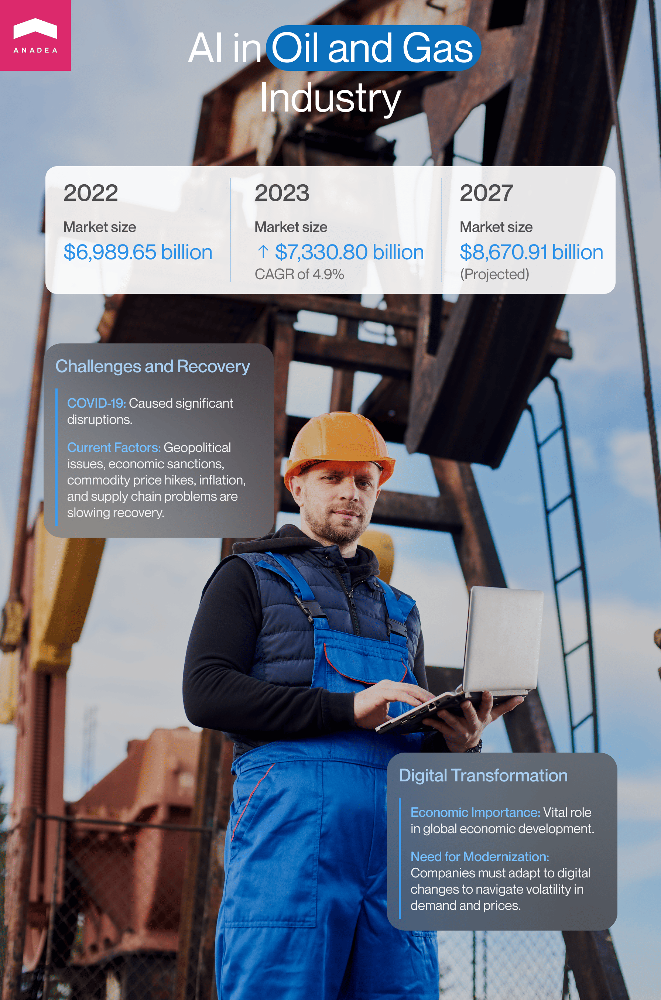
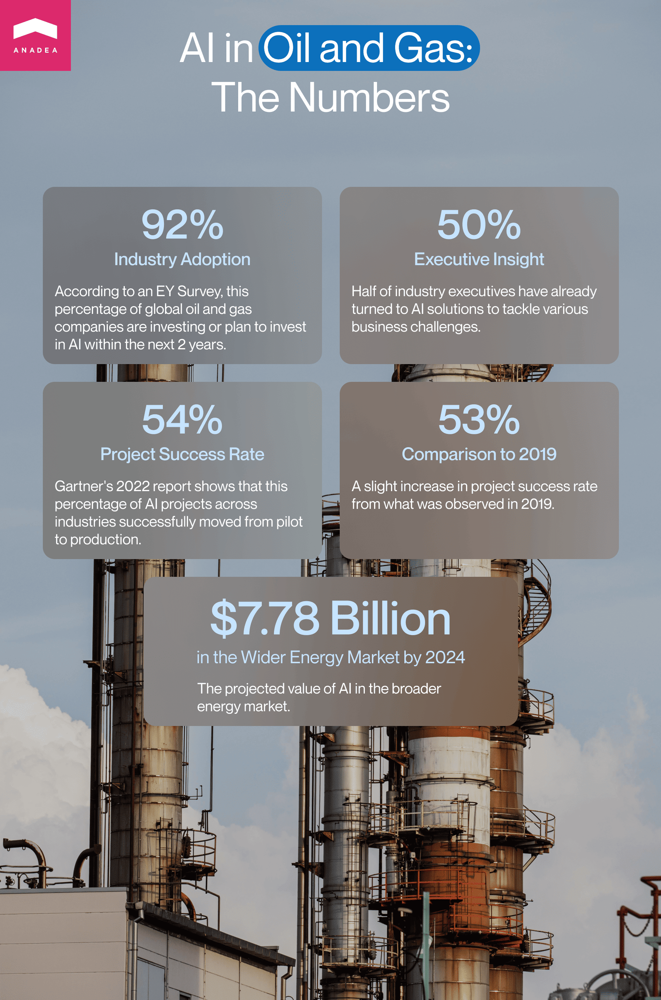
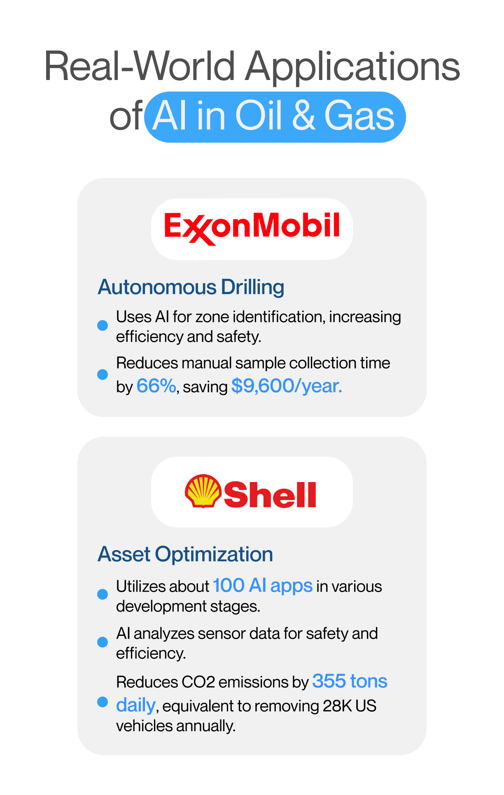
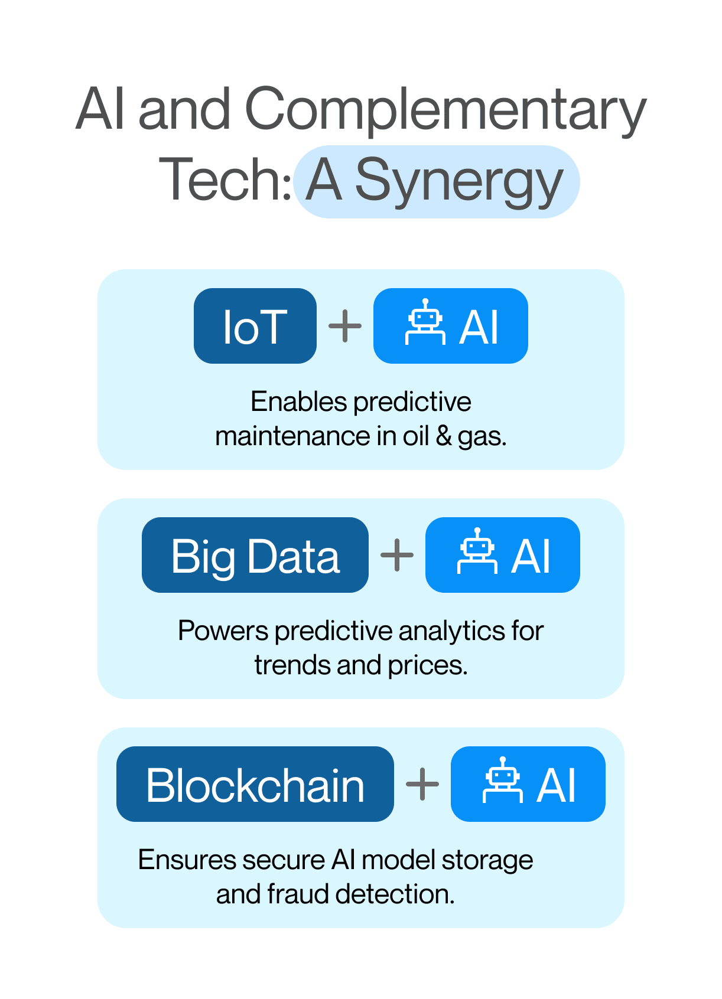

The use of advanced technologies like artificial intelligence, machine learning, VR/AR, and others is typically associated in our minds with startups working in emerging markets. However, it is not fully true. Modern technologies are gradually entering a lot of [industries](https://anadea.info/guides/the-impact-of-ai-on-business), including those that may seem to be too traditional and not susceptible to change, such as the oil and gas industry, for example. In this article, we are going to prove it by demonstrating how AI-powered systems can be used by enterprises and companies working in this market. Just keep reading if you want to know more about Artificial Intelligence use cases in oil and gas industry.

## Digitalization of the oil and gas industry

To begin with, let's have a look at the figures that can brightly describe the ongoing situation in the global oil and gas industry. In 2022, the [market size](https://www.thebusinessresearchcompany.com/report/oil-and-gas-global-market-report) was $6,989.65 billion. In 2023, it reached the level of $7,330.80 billion which indicated a CAGR of 4.9%. The industry was seriously disrupted by the consequences of the COVID-19 pandemic and even now when the pandemic is officially over, its recovery is moving quite slowly due to the current geopolitical situation, economic sanctions, increasing commodity prices, inflation in numerous countries, and issues related to the supply chain. Nevertheless, experts believe that by 2027, the global gas and oil market will be able to grow up to $8,670.91 billion.

As well as many other spheres, the oil and gas industry is going through the stage of digital transformation. The industry plays a very important role in the economic development of the world and now it should find ways to adjust its processes to the digital era. As a lot of oil and gas companies still rely on obsolete operational models, it is becoming more and more challenging for them to stay strong amid the current volatility of demand and prices.

Digitalization can bring the market enhanced productivity, operational efficiency, and safety at workplaces, as well as help to reduce carbon emissions and costs. Today, industry leaders openly [recognize](https://www.aramco.com/en/creating-value/technology-development/in-house-developed-technologies/digitalization) digitalization as a key driver of further growth of the market and its thriving. Among the core technologies that have the potential to support market stability and ensure its active expansion, companies typically name cloud computing, blockchain, data analytics, and, of course, artificial intelligence.

## AI in oil and gas: Figures

Artificial intelligence in oil and gas industry is widely named as a real game changer. AI systems can greatly change the way companies in the industry are working today, including but not limited to such functions as streamlining and facilitating many processes, for example, oil exploration, drilling, production, and organizing deliveries.

According to the survey conducted by Ernst & Young, 92% of oil and gas enterprises located in different corners of the world are already investing in artificial intelligence or have plans to do it in the next 2 years. 50% of executives of oil and gas companies admit that they have already turned to AI-powered solutions for overcoming various business challenges.

In 2022, consulting firm Gartner [found out](https://www.gartner.com/en/newsroom/press-releases/2022-08-22-gartner-survey-reveals-80-percent-of-executives-think-automation-can-be-applied-to-any-business-decision) that nearly 54% of AI projects across various industries were pushed to production after the pilot stage. This figure demonstrates a slight increase from what we could observe in 2019 when 53% of projects could make this way.

As the oil and gas market is a part of a wider energy market, it's worth having a look at the adoption of AI in this industry as well. It is [expected](https://www.statista.com/statistics/1175623/cagr-of-the-global-artificial-intelligence-energy-market/) that AI in the energy market will hit the mark of $7.78 billion in 2024.

## AI for oil and gas: Its role and significance

Oil and gas companies all over the world are struggling to optimize and increase the efficiency of their exploration and production processes. And here is exactly what AI can provide. AI-powered business applications can be used for keeping digital records, automating the process of analyzing geological maps and data, as well as defining risks and potential problems like excessive or not sufficient equipment use. In general, it's worth admitting that when it comes to AI and <a href="https://anadea.info/services/machine-learning-software-development" target="_blank">machine learning services</a>, the possibilities for businesses are practically limitless. The main task will be to choose an appropriate approach to addressing each issue or task with powerful and stably functioning software tools.

Thanks to AI in <a href="https://anadea.info/solutions/oil-and-gas-software" target="_blank">oil and gas software development</a>, companies can get access to valuable insights that were not available to them earlier. This data can be of great use for streamlining the processes and adjusting them to continuously changing conditions and realities. Based on the received data processed and generated by AI tools, oil and gas companies are able to make better-informed decisions and develop business strategies that will stay efficient in the long run.

Moreover, AI plays a significant role in reducing maintenance costs of machines and equipment and avoiding (or minimizing) downtimes. All this is possible thanks to predictive maintenance software.

Today in the gas and oil industry, AI and ML technologies can be applied to overcome a wide range of challenges that currently exist, including but not limited to:

* The necessity to process huge volumes of data;
* Increasing operational costs;
* Risks of equipment failure;
* Negative environmental footprint;
* Lowering efficiency of operations;
* Growing competition;
* Unstable demand.

Of course, it is important to understand that just one app powered by AI for oil and gas industry can't address all the existing issues. It should be a comprehensive system that will be built with the use of different advanced technologies and that will include various tools. Nevertheless, the significance of AI in oil and gas market shouldn't be underestimated as well as the potential of this technology.

## Artificial Intelligence use cases in oil and gas industry

Let's have a closer look at some of the most important AI and machine learning use cases in oil and gas market today. They will help you better realize what these technologies can bring to the industry in general and your business in particular.

### Exploration and drilling

The process of exploring new oil reserves is known to be quite expensive and time-consuming. However, AI can change the game for geologists and exploration teams by increasing the accuracy and efficiency of all the tasks related to discovering hydrocarbon resources. AI and ML can be used for analyzing huge volumes of data in different formats that typically include satellite images, seismic surveys, and geological data.

ML algorithms can process data, define existing patterns, identify deviations, and help specialists find potential locations of oil reservoirs with a higher level of accuracy. ML and AI-powered tools can analyze data from different resources and conduct complex processing procedures. By applying such systems in combination with (or instead of) traditional geological methods, companies can not only decrease operational costs and time required for such tasks but also minimize the environmental impact of their operations. How is it possible? Thanks to the high accuracy demonstrated by AI tools, you can avoid drilling areas with low potential.

### Predictive maintenance

This use case is relevant in a wide row of industries, including gas and oil. Thanks to AI-powered predictive maintenance solutions, companies can change their approach to managing their assets, including equipment and machinery, reduce risks related to their functioning, and ensure higher reliability of their processes. Earlier, before the introduction of Artificial Intelligence oil and gas solutions, equipment maintenance used to be either scheduled in advance or reactive (when something happened, companies had to address the issue).

As a result, companies faced unexpected tech problems or extra expenses on maintenance services when they were not required. Now, software powered by AI for oil and gas equipment can work with big volumes of data gathered by sensors, analyze maintenance records, and process real-time data with a view to predicting possible issues before they really happen.

### Production optimization

AI models can help oil and gas companies to better work with market data in order to predict demand, make production estimates, and adjust their processes to the ongoing needs of the market. As a result, it is possible to reduce downtimes, avoid overproduction, and make sure that the demand will be fully satisfied over the set period of time.

AI algorithms have the power that enables them to analyze data from multiple sources (for example, oil price changes, global demand, previous drilling project data, etc.). Based on the results of such analysis, AI-enriched apps can provide accurate predictions for changes in drilling demand in various regions. Having this data at hand, companies can change the allocation of their resources and introduce changes to their drilling operations. Thanks to this, the profitability of operations will reach its maximum levels while unnecessary downtimes will be eliminated.

### Supply chain management

AI in the oil and gas industry can also transform the way businesses manage their supply chain and bring cost-efficiency and general productivity to completely new levels. AI revolutionizes decision-making processes by providing managers with deep insights into supplier performance and historical cost fluctuations.

Moreover, AI-powered route planning and optimization tools have already proved their efficiency in the transportation industry and now can be applied in other related markets such as gas and oil. ML algorithms can be helpful for finding the most convenient and optimal delivery routes based on real-time weather and traffic conditions. Thanks to this, it is possible to reduce expenses on transportation, save time, and decrease fuel consumption.

### Safety and compliance

For companies working in the oil and gas industry, it is of crucial importance to meet regulatory requirements. However, rules and standards are regularly changed which represents a serious challenge for companies. To stay up-to-date with all the laws and regulations that are currently in force, companies need to process a lot of information. However, it is practically impossible if all the data should be processed manually. The application of AI in oil and gas industry can facilitate this task by making it possible to automate data collection and its further analysis.

ML algorithms can be also used in risk management and assessment which will be extremely important for ensuring the desired level of safety. Such solutions can process data on previous incidents and various operational issues in order to detect patterns and further analyze real-time conditions. If any deviations from the norm are detected, AI-powered systems can send notifications to allow managers to timely and adequately react to all situations.

### Data analytics

This use case is greatly related to all the above-mentioned ones. It is based on the capabilities of AI to process vast amounts of data, detect patterns, summarize and visualize information, and make accurate predictions. All these functions are of crucial importance in decision-making and strategic planning. Thanks to Artificial Intelligence oil and gas companies can optimize the processes of working with data and get valuable insights practically in real-time.

Talk to AI experts

## AI for oil and gas: Real-life cases

To better understand the role of AI in this industry, it will be a good idea to consider some real projects that have been realized by different companies working in the oil and gas market.

One of the cases was the introduction of autonomous drilling in deep water by ExxonMobil. A proprietary drilling advisory system built by the company relies on the capabilities of AI to identify the most appropriate zones for drilling. Thanks to this automated system, ExxonMobil can increase drilling efficiency and safety as well as eliminate a lot of repetitive tasks for its staff. As a result, the company's employees can concentrate on more creative and complex work.

It is also known that ExxonMobil uses AI tools for other aims such as conducting oil analysis processes (as a part of its predictive maintenance program), for example. In one of the [reports](https://mobilserv.mobil.com/pdfs/mobil-serv-lubricant-analysis-success-story-1.pdf) provided by the company, it was stated that thanks to such a solution, they can reduce the time needed for manual sample collection by 66% which can lead to savings of $9,600 in labor costs per year.

Shell is another industry leader that is open to innovations. Today the company has about 100 AI apps that are currently at different stages of development. For example, Shell relies on AI in asset performance optimization. The introduced solution can use the data received from hardware sensors for calculating the optimal parameters that will ensure safety and efficiency. This data can be also used by AI to reduce carbon emissions. The solution of this type is being applied at Shell's Liquefied natural gas (LNG) facilities and helps to reduce CO2 emissions by 355 tons daily. It is interesting to mention that this can result in reductions of 130 kilotons per year and this figure is equivalent to the effect of taking 28K vehicles off the roads in the US.

## Ethical concerns of using AI in the oil and gas industry

The introduction of AI is widely accompanied by concerns related to fears that one day a lot of people will lose their jobs. Nevertheless, it is vital to see the real picture. Despite the fact that AI-powered tools are able to fulfill a lot of tasks that are traditionally performed by humans in the oil and gas industry, they still can't function fully without any control and management conducted by people. Moreover, it is widely recommended to rely on AI only as a supportive tool while the majority of crucial decisions still should be made by people. We need to talk more about human-AI collaboration and the ways to build it instead of focusing on the risks of being fully replaced by robots.

The issue is that today a lot of companies and organizations are just not ready to adopt AI and other emerging technologies due to the lack of flexibility in their processes. That's why, first of all, managers of such organizations should take care of some cultural shifts.

Risk-taking, experimentation, adaptability, and continuous learning should become the highest values and priorities for such companies. Traditional decision-making and rigid hierarchy prevent people from following the principles of agility and collaboration.

Before implementing any AI for oil and gas business, managers should clearly define areas where AI can be of great use and prepare the existing workflows and processes for the introduction of new solutions. Only when every team member clearly understands the role of new solutions in his or her work as well as in the functioning of the entire enterprise in general, it is possible to expect any positive outcomes of digitalization and AI adoption.

## AI and complementary technologies

AI is a technology that has enormous potential for dealing with an extremely wide range of tasks across many industries. But it shouldn't be considered only in isolation. To achieve the highest results, AI and ML can be combined with other advanced technologies.

* **IoT**. The Internet of Things can unite a lot of objects that typically can't interact with each other into a common network. It becomes possible thanks to various smart devices and sensors that can gather, send, and transmit various types of data. This data can be also used by AI for better analyzing the situation and making the right decisions. Such popular use cases of AI in oil and gas industry as predictive maintenance are enabled thanks to the combination of the capabilities of AI and IoT.
* **Big Data.** The duo of Big Data and AI is a good example of synergy. AI needs to use massive volumes of data to learn and Big Data requires the analytical capabilities of AI. Namely, this duo makes it possible to leverage the benefits of predictive analytics which presupposes using data to predict future events, trends, price fluctuations, etc.
* **Blockchain**. AI and blockchain can be used together to achieve various goals. For example, blockchain can be applied to ensure the safe storage of AI models. Blockchain and AI can make payments in many industries more secure and efficient (while blockchain will provide the required infrastructure, AI will detect fraudulent patterns and activities). The technologies can be also used for powering decentralized marketplaces, building supply chain management tools, and ensuring transparency and traceability.

## Risks and challenges of introducing AI in the oil and gas industry

The introduction of any new tech solution is closely related to some restrictions, pitfalls, and difficulties, especially when we are talking about big enterprise systems that deal with serious business and production processes. If you are thinking about building a solution powered by AI for oil and gas, we strongly recommend you consider the following list of potential challenges in advance.

* **Financial risks.** Any software development project requires investments. That's why before allocating money for creating your AI system, you need to make sure that your project will be feasible and will be able to increase your profits. One of the best ways to check the viability of an idea (in addition to market research) is to build an [MVP](https://anadea.info/guides/what-is-mvp). A minimum viable product will have only the basic features of your full-scale solution but they will be enough for users to understand whether the solution can efficiently address the set tasks. The development of an MVP will help you to find out whether it's worth investing in a full-scale product or whether your idea needs adjustments.
* **Regulatory compliance.** The use of AI in various industries should be fully compliant with the existing regulations. As a rule, today, the majority of issues are related to data privacy and the ways of processing data. Here it is necessary to study all the rules and rules that are in force in your jurisdiction already at the stage of planning your solution in order to build AI algorithms in accordance with all the restrictions.
* **Over-reliance on AI**. Without any doubt, already today, we can admit that developers have the possibility to build highly powerful solutions with rich functionality. However, it is necessary to understand that we can't fully rely exclusively on AI. AI systems need to work with vast amounts of data accumulated from different sources. The formats and quality of data can differ which may be a barrier to its analysis and integration. That's why some errors in the work of AI systems are still possible (as well as in the work of humans). If you want to use the forecasts and reports prepared by AI for making serious business decisions, we recommend you have alternative sources for checking information.

## Future of AI oil and gas market

The forecasts for the use of AI in the oil and gas industry look quite optimistic at the moment. AI is already used for optimizing and automating operations, as well as getting data-driven insights and predictions. Given the already achieved results in this field, it will be sensible to expect that AI solutions will further lead the transformation of oil production and exploration as well as boost industry sustainability.

It is also forecasted that in the coming years, there will appear more AI-driven solutions aimed at supporting the industry's sustainability and its adherence not only to the needs of today's generation but also to the needs of future generations. All this presupposes making all the activities and processes more environmentally-friendly and AI can help with this task.

* **Reduction of emissions.** AI can analyze the current level of emissions and send alerts in case of any deviations. Moreover, by monitoring the state of equipment (predictive maintenance), it is possible to prevent serious equipment failures that are often accompanied by increased levels of emissions.
* **Higher energy efficiency.** By optimizing production processes and delivery routes, companies can avoid energy overuse.
* **Development of new technologies.** Thanks to AI-driven data analysis and detailed reports, companies can get valuable insights for the development of new processes and technologies that will have less negative environmental impact.

## Final word

Though AI is already being used by a row of companies working in the oil and gas sector, there is still a lot to be done before we can speak about the mass adoption of this technology in this industry. If you are planning to build your own solution powered by AI for oil and gas companies and are looking for a reliable software development partner, you can always contact us.

At Anadea, we have rich expertise in creating AI-powered software and are continuously enhancing our knowledge and skills by staying tuned with all the latest innovations in this space.

If you want to learn more about our services and terms of cooperation with our team, just share your requirements with us and get estimates for free.

Request a free quote
