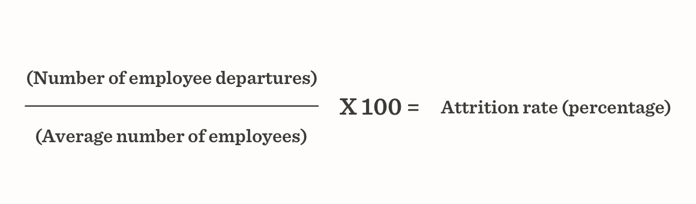

Among many things to keep in mind when choosing a company to outsource software development, an unobvious one is the __stability of team composition__, commonly expressed through __attrition rate__.

The attrition rate is the __rate at which employees leave the company__. Mathematically, it is the number of people who have quit divided by the average number of employees over a period of time, usually a month, expressed as a percentage. Here’s the formula:

Overall, there are four main types of attrition:
* __Voluntary__ — when employees leave the job. There can be a few scenarios: an employee retirement or relocation, change of job, etc.

* __Involuntary__ — when employees are fired from the workplace. This usually happens as a result of disciplinary action or misconduct, as well as job cuts.

* __Internal__ — when an employee is moving internally from one department to another in the company.

* __Demographic__ — when an employee from a specific demographic group (age, gender, race, disability) quits the job.

What can the prevailing type say about the company? The most concerning types of attrition are __voluntary__ and __demographic__ ones since they may be pointing out some structural problems in an outsourcer’s business. Voluntary attrition may highlight the flaws of how an outsourcer treats its employees, while demographic attrition could point out the toxicity of internal culture or issues in diversity management.

All these can eventually __affect the quality of products__ developed by the company as the churn of one single employee can significantly reduce the productivity of the entire team.

Let’s see why else you should consider the attrition rate when choosing an outsourcer.

## What’s Risky About High Attrition Rate
The attrition rate of around 10% can be called a good or a relatively low one. Still, keep in mind that it varies widely across industries, countries, and job types. Since the COVID-19 pandemic onset, the attrition rate in all fields has declined as fewer people considered a job change during this period. Luckily, it is not that much applied to the IT sector anymore for it is one of the most flexible and fastest-growing industries. And according to the LinkedIn <a href="https://www.linkedin.com/business/talent/blog/talent-strategy/industries-with-the-highest-turnover-rates" rel="nofollow" target="_blank">survey</a>, software businesses have an average attrition rate of 13.2%.

__Why is it important to know your outsourcer’s attrition rate?__ In case of a __high__ one, your product can experience delayed deadlines, lower productivity and quality of work, disruption of team dynamics, and lack of smooth communication. Meanwhile, a __low__ attrition rate is beneficial for both you and software engineers. Frequent filling in for employees who quit disrupts the work process and results in higher stress levels and burnout chances among specialists.

Another important question is __how do you learn the attrition rate__ as a company’s customer. You’ll hardly manage to collect enough data to calculate it yourselves, so here’s an alternative. If one or several of the following events are common for the company, chances are the attrition rate is quite high.

* Delays in the execution of projects and shifting costs can be due to a time-consuming search for a replacement for an employee.

* Loss of knowledge and less effective outsourcer’s performance may be a result of losing an experienced employee.

* Disruption of team dynamics and lower quality of work can indicate that an employee has quit recently.

* Lack of smooth communication with the customer and between team members may point out a high employee turnover.

About these, you can learn from reviews by previous customers on Clutch, a platform where each review is verified before publication.

## How to Avoid a Team with a High Attrition Rate
* Ask the Team Lead __how often changes in the team composition occur and if any team members are about to quit.__

* Find out about the approach used on the company’s projects, whether they have __fixed teams__ or teams are composed of whoever is not assigned to other projects. In the first case, you can be certain that the programmers know each other well and cooperate smoothly. In the second case, you can still get excellent software engineers, but no guarantees they match together.

* Compare the company's salary level and hourly rate with the market average - yes, money is still one of the main motivations for employees to stay at a company.

* Read through employee reviews on Glassdoor and other websites alike. Look for comments about workload, salaries, team dynamics, company culture, career growth opportunities, and employee-manager relationships.

## What About Us?
* 50% of employees have worked at Anadea for over 5 years.

* We assign for projects one of our 10 __formed teams__ of engineers who’ve completed 500+ projects together.

* Anadea has a recognized corporate culture aimed at engaging and retaining the best specialists in the industry.

Look forward to translating your idea into a profitable solution? <a href="https://anadea.info/services/web-development" target="_blank">Outsource web development</a> or <a href="https://anadea.info/services/mobile-development" target="_blank">mobile development</a> and enjoy your business success.
