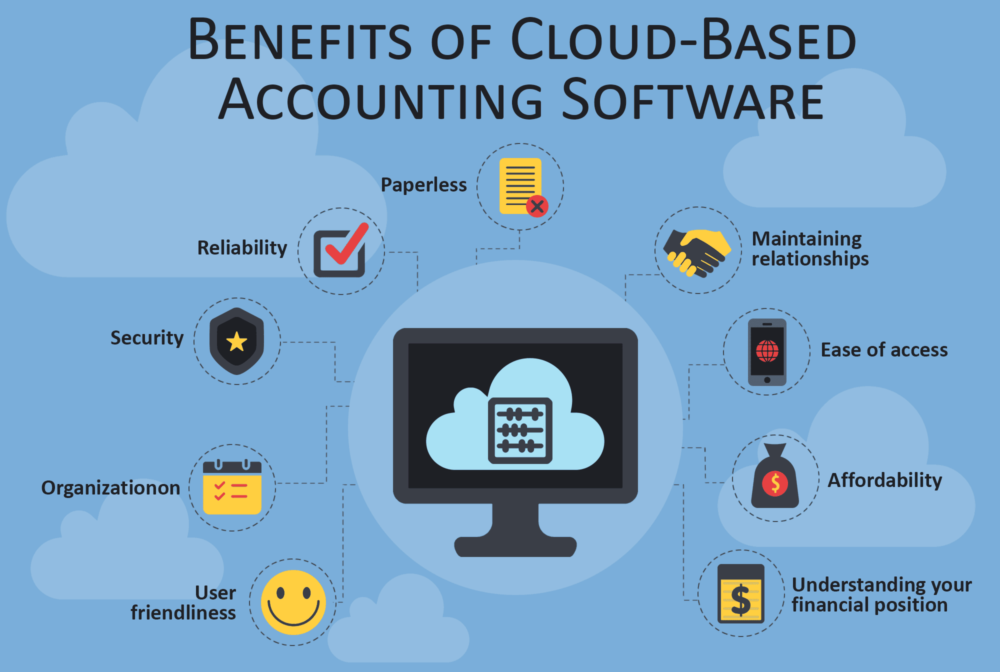

As a business owner, you are pretty much aware of the ongoing tech and business trends. It becomes essential to keep up with the latest technology developments and run the business smoothly — one of the areas that have noticed significant changes is the accounting and bookkeeping.

Although the accounting field still can be daunting, the technology has made it simpler and quicker by introducing cloud accounting software. It's a perfect option especially for small businesses who cannot afford hiring an expert accountant.

If you are still unsure about the benefits that cloud-based accounting software offers, in this blog, we have put together the advantages of this type of software in today's business environment. To find out more, keep scrolling!

## 1. User-friendly

If you are not familiar with the accounting methods and jargons, cloud accounting software makes everything easier to understand. It is specifically built with the thought of non-accountants in mind.

It sets up and manages the business accounting in an accurate manner, so that the business owner can know at a glance about the finance related matters of the company. Cloud accounting software also helps the business create targets to achieve.

It's a user-friendly software, due to which you don't necessarily need to sit down and learn about it.

## 2. Organization

The main benefit of having a cloud accounting software is that it keeps your finance updated and organized. Often when there is an immense amount of data, it becomes hardly manageable, only a skilled accountant can do it. However, when you have accounting software, you are able to find data easily when required.

Besides, there is a facility of keeping separate data for every department. Therefore, employees can easily find the information specific to their department, delete it, update the expenses and keep everything organized.

## 3. Security

Whether it is a small business or large business, the accounting information is always confidential. Therefore, safety is the biggest concern of business owners and they are always looking for a reliable accounting solution.

Here is where cloud accounting software plays crucial role. Given a choice between an excel spreadsheet or cloud-based software; one would definitely go for the latter option.

With cloud-based system, the information is not stored on the local computer. Instead, it is stored on the cloud server. Therefore, even if the hacker successfully intrudes into the system or crashes it down – there is no loss of data.

## 4. Reliability

In earlier times, the books and ledgers kept the essential data. When working with large amounts of data, the chances of human errors were high.

With cloud accounting software, you get clear and accurate data. There is less room to mistakes in calculation and human errors. Hence, the software provides reliability and consistency to the business.

## 5. No paper

If your accounting is paper-based, then there is a possibility that somebogy will get their hands on your data. It may contain a piece of sensitive information or perhaps a simple part of the transaction. Nevertheless, it is necessary to preserve privacy for accounting data.

In addition, with cloud-based accounting software, you go paperless which is good for the environment. All the information is on the cloud - this helps making it efficient and lets you stay posted with the finances.

## 6. Maintaining relationships

Running a business requires you to maintain a good relationship with the vendors, partners, and even opponents. Cloud accounting software keeps the data of unpaid bills and invoices. You can effortlessly find out where the payment is due, with whom and amount. On a positive note, the software also helps you in the most tedious task, and that is filing taxes.

## 7. Ease of access

Cloud accounting software provides you with structured information and statistics. Additionally, there is 24x7 security and robust algorithms installed which make it nearly impossible to hack.

The ultimate benefit of a cloud-based accounting solution is that you have ease of access. All you need is a reliable Internet connectivity and a suitable device. In whichever corner of the world you are, you can access your accounting data from your tablet, smartphone, or laptop.

## 8. Affordable

Everyone needs to think twice before investing into something because it is your hard-earned money. When it comes to handling your accounting, you may wonder if you need to hire an accountant or set up an accounting software system. The latter one is an affordable solution that renders you plenty of services. Depending on your budget, you can develop your own software fully tailored to your business needs, or use one of the available solutions. Check out different options and analyze which one is perfect for you. With the right accounting software, you can expand your business and use the facilities to the maximum.

## 9. Financial position

When you are a newbie into the industry, you may not be aware of the importance of the cash flow or how to stay in the know about the finances. Well, thanks to cloud-based accounting software you can keep track of the transactions and the financial position of your business. You can create your own budget and settle where and how much money to spend.
