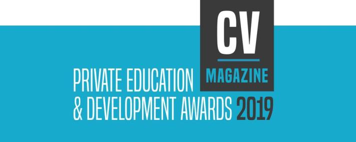

Anadea has been awarded Best Custom Education Software Development Company - Eastern Europe, 2019.

We are excited to announce that Anadea has been named a winner of the 2019 Private Education & Development Awards from Corporate Vision Magazine. Our company has been recognized as Best Custom Education Software Development Company - Eastern Europe.

The pace of technology-driven innovation in all sectors of our society is advancing rapidly. It is time for schools, universities and other education providers to embrace the digital change that can propel learning at all grade levels and prepare learners to meet the requirements of the new world. CV Magazine’s Private Education & Development Award aims to acknowledge companies that put their efforts into augmenting the education sector both quantitatively and qualitatively.

Image credit: CV magazine

Awards Coordinator Edward Faulkner noted:

> From early learning, to adult education, all who make quantitative and qualitative contributions to this vital sector are recognised through this awards programme. I am proud to offer all of my winners my congratulations and best wishes for the future.

Being a winner of the Best Custom Education Software Development Company - Eastern Europe award from Corporate Vision Magazine is an evidence of having achieved some really impressive results in the EdTech space. This award proves that Anadea follows the right way to meet the needs of our clients and delivers software solutions that help them address the challenges facing the education sector. We are honored that our dedication and effort have been recognized by Corporate Vision's expert team!

See the supplement and full list of winners on the awards page and the Private Education & Development Awards 2019 press release <a href="http://www.corporatevision-news.com/2019-the-private-education-development-awards-2019-press-release/" rel="nofollow" target="_blank">here</a>.

## About Anadea

Anadea is a custom [software development company](https://anadea.info/) with a solid know-how in creating web and mobile applications for the education sector. Through years in the IT business, we’ve gained extensive technical and business experience in [e-learning software development](https://anadea.info/solutions/e-learning-software-development).

Having an in-house team of experts in the fields of software engineering, design and quality assurance gives us the agility to adapt to the specific needs of your project and to ensure the delivery of high-quality software. We believe that every project requires a solution tailored specifically to the needs and requirements of the educators and learners for whom the application is being built.

We are committed to continuous innovation and advancement in our expertise to develop effective solutions for today's dynamic educational environment. Our clients appreciate our proactive approach to problem-solving, fine-tuned development process and ability to deliver software solutions that meet their expectations.

## About Corporate Vision Magazine

Corporate Vision is an online magazine created by a team of seasoned and passionate business professionals. CV Magazine seeks to keep readers abreast with the latest news, analysis and expert insight on the challenges in the corporate world. For more information visit <a href="https://www.corporatevision-news.com/" target="_blank">cv-magazine.com</a>.
