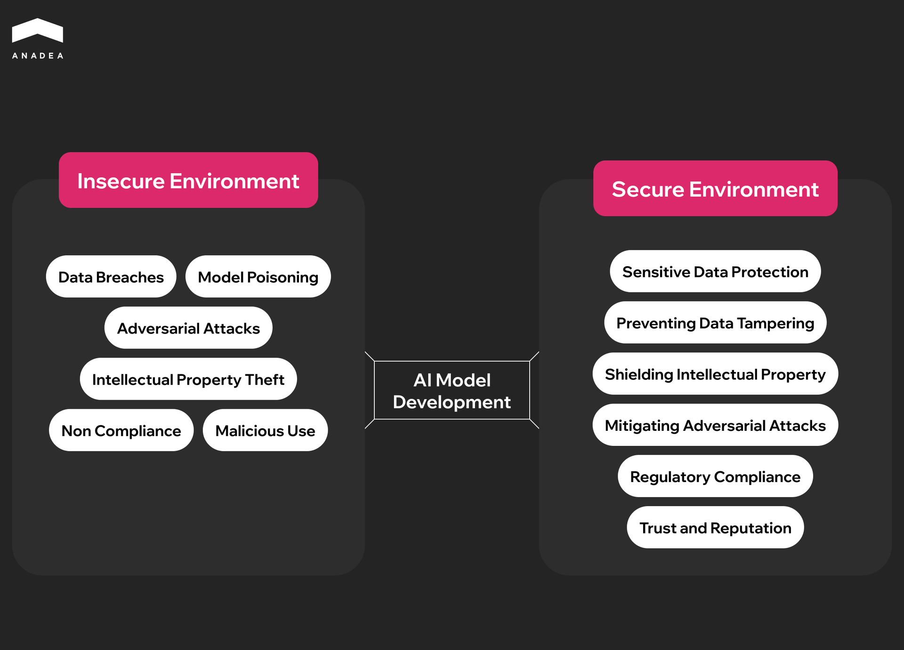
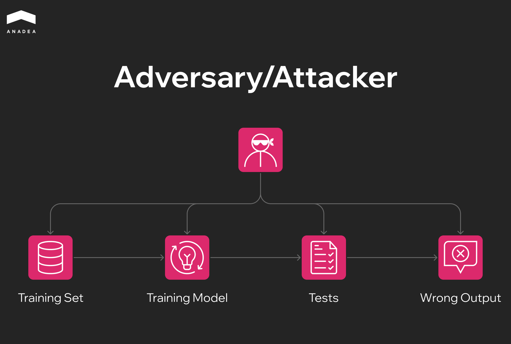

As [IBM's Cost of a Data Breach Report 2025](https://www.ibm.com/reports/data-breach) revealed, 13% of companies faced AI-related security breaches. 60% of these incidents led to data exposure. Meanwhile, approximately 30% led to operational disruption. The average global losses per data breach are close to $4.44 million. In the US, the average cost of a breach is $10.22 million. Such losses can be devastating for a company and may put its reputation and future at risk. Other risks of unprotected AI systems include regulatory non-compliance, malicious use of your tools, and model poisoning.

How to secure AI applications, safeguard your intellectual property, and prevent data tampering? We are going to provide an answer to this question in our article.

## What Makes AI Application Security Different from Traditional App Protection Measures?

Traditional approaches to app security were elaborated long before the mass adoption of AI. That's why all the measures are mainly focused on the protection of code and data from exploits. The range of the most common risks in this case includes injection attacks, privilege escalation, and API misuse. 

AI application security introduces a new layer of complexity. 

Non-AI solutions follow deterministic logic. Meanwhile, systems powered by artificial intelligence generate outputs based on data-driven inference. This opens the door to manipulation and unpredictable responses. 

Attackers can connect to different elements of the model training process, including data sets, models themselves, and tests. All their manipulations have a direct impact on the output.

Given this, the best ways to secure AI applications always cover the protection of models, data pipelines, and the interfaces that connect them.

### Key AI-Specific Threats and Vulnerabilities

Due to the peculiarities of AI systems, there are some risks that are unique to this type of software. The table below shows the most common of them.

<table>

<tbody>

<tr>

<td>

<strong>Threat</strong>

</td>

<td>

<strong>Description</strong>

</td>

<td>

<strong>Example</strong>

</td>

</tr>

<tr>

<td>

Prompt injection and jailbreaks

</td>

<td>

They include manipulations with prompts or instructions to override model safeguards or get access to restricted information.

</td>

<td>

Attackers may push a chatbot to reveal system prompts or confidential data.

</td>

</tr>

<tr>

<td>

Data poisoning

</td>

<td>

In this case, exploiters inject malicious or biased data into the training or fine-tuning process. Their goal is to alter model behavior.

</td>

<td>

A spammer can inject deceptive product reviews into an open dataset so that the model will misclassify legitimate content as spam or vice versa.

</td>

</tr>

<tr>

<td>

Model poisoning

</td>

<td>

Malicious actors can degrade model performance by corrupting its parameters. It often happens during updates or retraining.

</td>

<td>

A compromised contributor may upload manipulated model updates, which gradually degrade accuracy or change outputs.

</td>

</tr>

<tr>

<td>

Adversarial examples

</td>

<td>

The introduction of subtly altered inputs can trick the model into producing incorrect or harmful outputs.

</td>

<td>

Even slight changes in a stop sign image (like extra stickers or pixels) can cause a vision model to misinterpret it as a speed-limit sign. This can lead to dangerous outcomes in autonomous vehicles.

</td>

</tr>

<tr>

<td>

Model theft

</td>

<td>

This type of attack is based on reconstructing a proprietary model via repeated queries and output monitoring.

</td>

<td>

A competitor can send thousands of inputs to a commercial sentiment analysis API and collect the outputs. Based on this data, it will be possible to train a replica model that will mimic the behavior of the original one without paying for access.

</td>

</tr>

<tr>

<td>

Membership inference and model inversion

</td>

<td>

Adversaries try to infer whether specific records were used in training or reconstruct sensitive training data.

</td>

<td>

A healthcare AI model reveals subtle differences in output when it is asked about certain patients. This allows attackers to make a conclusion that those individuals.

</td>

</tr>

<tr>

<td>

Data exfiltration via prompts

</td>

<td>

Attackers use specifically crafted prompts to extract sensitive data.

</td>

<td>

A malicious user may ask an AI assistant to summarize previous conversation logs. As a result, AI may disclose private chat content or cached API keys.

</td>

</tr>

<tr>

<td>

Vector database poisoning

</td>

<td>

Attackers insert harmful embeddings or irrelevant content into a vector store used in RAG systems. It is done to manipulate context.

</td>

<td>

When poisoned vectors are added to a company knowledge base, they cause AI to retrieve misleading or malicious text when answering user queries.

</td>

</tr>

<tr>

<td>

API

</td>

<td>

Excessive API calls are applied to drain funds or disrupt service.

</td>

<td>

Bots may be used to flood a paid AI inference API with complex queries, which inflates operational costs and can cause service issues for legitimate users.

</td>

</tr>

<tr>

<td>

Plugin or tool abuse

</td>

<td>

Malicious users exploit external integrations or function calls to perform unauthorized actions.

</td>

<td>

A chatbot connected to a file system can be "convinced" to send files from the chosen folder and share confidential data.

</td>

</tr>

<tr>

<td>

Supply chain risk in models and datasets

</td>

<td>

Such risks originate from the use of third-party or pre-trained components that contain hidden vulnerabilities, malware, or biased content.

</td>

<td>

If a company integrates an open-source LLM that relies on a dataset with mislabeled and malicious content, the outputs can be biased.

</td>

</tr>

</tbody>

</table>

If you want to learn more about different types of AI-related vulnerabilities, read our comprehensive [guide on AI agent security](https://anadea.info/blog/how-secure-are-ai-agents/).

## Common Entry Points for AI Security Breaches

AI applications introduce different attack vectors. Most frequently, exploiters use the following entry points:

* User prompts and chat inputs (they provide direct access for injection and social engineering);
* RAG connectors and data pipelines (these system elements are vulnerable to data poisoning or exfiltration);
* Tool and function calls (exploiters may use them for unauthorized actions);
* Third-party or open-source models (they may bypass normal authentication and provide hackers with access to AI systems);
* CI/CD for ML workflows (it introduces risks of compromised model artifacts or credentials);
* Shadow AI usage (it means unapproved or unmanaged AI tools in enterprise environments).



## Best Ways to Secure AI Applications	

At Anadea, we have been working in [custom AI software development ](https://anadea.info/services/ai-software-development)for more than 6 years, and the security of AI applications has always been among the top priorities for us. We fully realize all the negative results that can be a consequence of a weak model, data, infrastructure, or access protection.

Let's take a closer look at the AI application security best practices that our developers rely on.

### Safeguarding Data Lifecycle

**Establish trustworthy data foundations**. Responsible data sourcing and user consent management are the core elements of AI security. It is recommended to apply data minimization principles and set up clear retention and deletion policies. These steps will help you prevent unnecessary exposure.

**Maintain dataset hygiene**. There are several approaches to ensuring the integrity and quality of your datasets. For instance, you should detect and redact PII (personally identifiable information), remove duplicates, and validate labels. Apart from this, it is necessary to conduct poisoning checks to prevent malicious data manipulation.

**Preserve privacy throughout the data pipeline**. You can use privacy-enhancing techniques, like anonymization or pseudonymization of sensitive data, differential privacy, and synthetic data generation. We recommend encrypting all data in transit and at rest, managing keys per tenant, and integrating them with a secure key management system (KMS).

**Control data during inference**. Input/output data loss prevention (DLP) tools, automatic redaction, and context scoping will be helpful to prevent sensitive data leaks at runtime.

### Strengthening Prompts and System Messages

**Build secure prompt structures**. You need to define clear system message hierarchies. Avoid hidden secrets in system prompts. Use explicit parameters to separate instructions from user content.

**Apply prompt security best practices**. For example, introduce the allow-lists for tools and content that are more preferable than the deny-lists. Enforce JSON/schema validation for structured outputs and separate user context from system logic.

**Use secure design patterns**. Patterns like few-shot prompts or clear role separation between user, system, and tools will help you reduce attack surfaces.

Moreover, regular prompt reviews and version control will ensure long-term resilience.

### Introducing RAG Security

Retrieval-augmented generation systems connect AI models to external knowledge sources, which introduce new vulnerabilities.

**Secure input and retrieval**. To do this, it is required to sanitize and tokenize user inputs, as well as apply metadata filtering and least-privilege queries.

**Protect vector databases**. Vector stores can be secured with authentication controls, network isolation, and poisoning detection.

**Validate retrieved information**. Reference verification and citation tracking will help you prevent misinformation.

**Monitor RAG telemetry**. It can be done with different metrics, such as:

* Retrieval precision and recall
* Injection detection rate
* Harmful content pass-through rate

### Protection of Models and Infrastructure

**Isolate models**. Run models in isolated environments with no direct public access to backend endpoints.

**Guarantee network and compute security**. It is helpful to use private networks and API gateways with strong controls. Additionally, you can perform runtime vulnerability scanning. These efforts will allow you to catch threats early,

**Protect operations**. To prevent denial-of-wallet, you can enforce rate limiting and surge controls. Meanwhile, caching strategies will help preserve privacy and tenant boundaries.

### Identity, Access, and Secrets Management

**Strengthen authentication and authorization**. Introduce RBAC (role-based access control) and ABAC (attribute-based access control) with least-privilege principles for users and services.

**Implement secure secret handling**. The deployment of managed identities and short-lived tokens, as well as keeping secrets out of prompts and source code, will contribute to this goal. It is also necessary to update credentials on a regular basis and store them in a vaulted environment.

**Adopt per-tenant encryption keys**. This move will eliminate cross-tenant data risk.

### Monitoring and Continuous Evaluation

**Track the performance of your AI-driven systems**. Focus on such metrics as:

* Prompt-injection attempt rate;
* Hallucination frequency;
* Sensitive data leakage rate;
* Tool error rate;
* Latency;
* Operational costs.

**Test your AI apps continuously**. You can use canary (specifically-designed) prompts to detect vulnerabilities and misbehavior and address them as early as possible. Maintain offline evaluation suites and introduce regression thresholds before model deployment.

## Final Word

Apart from AI development, our team also provides consulting services. When we discuss software security and any particular approach to it with our customers, we often hear a question, "Is it the best way to secure AI applications?". However, no single solution can address all security scenarios

As a rule, it is necessary to apply different combinations of best practices of AI applications to ensure your organization minimizes risks and protects sensitive information. It's vital to implement a comprehensive approach that will cover not only software itself, but also data pipelines, user interactions with AI, infrastructure, prompts, access, etc.

If you want to build a new secure AI app or you are looking for ways to protect your existing systems from the growing threats, at Anadea, we will always be ready to help you. [Tell us about your needs](https://anadea.info/free-project-estimate), and we will find the best possible way to address them.
