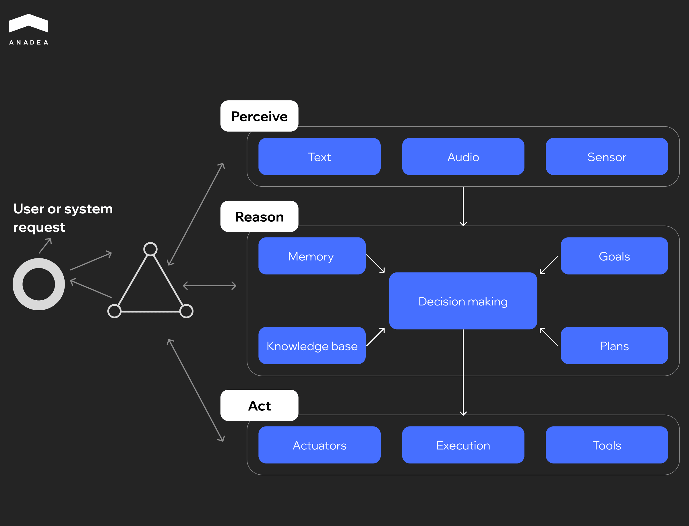

According to Salesforce research, [87% of healthcare professionals](https://www.salesforce.com/news/stories/healthcare-ai-agent-research/) need to stay late at work every week to finish all their paper duties. Such a situation negatively affects their job satisfaction and leads to a reduction in the time that they can spend with their patients. AI agents can be used to address such issues by automating documentation-related tasks. It is estimated that they can decrease administrative burdens by 39% for nurses and by 30% for doctors. And that represents just one of the many ways AI agents are transforming healthcare workflows.

In this article, we will talk about the most popular applications of such tools and share a list of the best AI agents for healthcare. 

## Healthcare AI Agents: Quick Overview

Before we proceed to the discussion of the best rated AI agents for healthcare, let’s briefly consider the peculiarities of these solutions.

Terms like AI agent, copilot, and chatbot are often used interchangeably. However, they represent different levels of intelligence and autonomy.

Chatbots are primarily rule-based or LLM-powered conversational systems. They are designed to deal with predefined tasks such as answering FAQs or scheduling appointments. They act within a fixed conversational flow.

Copilots function as assistive companions. They can analyze data or summarize information. But final decisions are made by a clinician or staff member.

AI agents are more advanced solutions. They can understand and respond to various real-time inputs, such as text, voice commands, sensor data, or patient monitoring signals, and act based on them. They are usually integrated with multiple systems (like EHRs or scheduling tools) and can interact with them to complete tasks with different levels of autonomy. For example, an AI agent in a hospital could analyze a patient’s vital signs in real time, alert clinicians in case of abnormalities, and automatically schedule follow-up tests.

Unlike chatbots, these solutions do not need a direct request from a user to perform an action. Want to learn more about the differences between these categories of AI-driven software? You can read a detailed [AI agent vs chatbot](https://anadea.info/blog/ai-agent-vs-chatbot/) comparison on our blog.

Modern AI agents can:

* **Perceive**. AI agents can collect and interpret inputs in different formats, including voice commands, text, or EHR data. This may involve speech recognition, NLP, or structured data extraction.
* **Reason**. The use of LLMs and rule-based systems enables AI to interpret context, apply logic, and generate an informed output.
* **Act**. AI can perform actions within integrated systems. For instance, it can write back to the EHR or draft medical orders.

The diagram below illustrates how a traditional AI agent operates and interacts with other components of AI systems.

The advancements in AI technologies allow developers to build autonomous systems, where AI agents can operate independently. It means that they can make and execute their own decisions without human intervention.

Nevertheless, when it comes to healthcare, most AI use cases should remain assistive (human-led) or semi-autonomous due to the ethical and regulatory implications of full autonomy. Human-in-the-loop checkpoints, where clinicians review and confirm each critical step, ensure accountability. They minimize risk and maintain patient safety. This approach also aligns with regulatory drivers such as the [EU AI Act](https://artificialintelligenceact.eu/) and the [US FDA guidance](https://www.fda.gov/medical-devices/software-medical-device-samd/artificial-intelligence-enabled-medical-devices) on AI/ML-based medical devices. All this is essential for responsible AI adoption in medicine.

## AI Agent for Healthcare: The Most Promising Use Cases

Healthcare AI agents have a huge potential to fully transform the industry. Their application can greatly improve operational efficiency and support clinicians in delivering better care. In this table, you can find healthcare operations and workflows that see the highest ROI from AI adoption. And we invite you to take a closer look at them.

<table>

<tbody>

<tr>

<td>

<strong>Use Case</strong>

</td>

<td>

<strong>Description</strong>

</td>

</tr>

<tr>

<td>

Clinical documentation

</td>

<td>

AI agents can capture, summarize, and organize clinical documents in real time, which significantly reduces the administrative burden on clinicians. As a result, they have more time for interaction with patients. This also decreases clinician burnout, as well as drives the efficiency of patient care and cost savings.

</td>

</tr>

<tr>

<td>

Patient access and communication

</td>

<td>

The use of AI agents helps enhance tasks like patient intake and scheduling, and triage. Automated guidance and support streamline workflows, eliminate bottlenecks from patient communication, and make it easier for people to access healthcare services.

</td>

</tr>

<tr>

<td>

Clinical decision support

</td>

<td>

AI agent healthcare solutions can efficiently analyze huge volumes of patient data and medical records. The obtained insights assist clinicians with treatment recommendations and risk evaluation, as well as follow-up coordination. Thanks to this, hospitals can improve care quality and minimize the risks of errors.

</td>

</tr>

<tr>

<td>

Prior authorization and utilization management automation

</td>

<td>

AI-driven tools can automate prior authorization workflows. Artificial intelligence can verify documentation and process approvals more efficiently than such tasks can be executed manually. This decreases administrative workload and shortens delays.

</td>

</tr>

<tr>

<td>

Revenue cycle support and medical coding

</td>

<td>

AI agents can help extract relevant data from medical records and manage claims. This streamlines billing and accelerates reimbursements, which contributes directly to financial efficiency.

</td>

</tr>

<tr>

<td>

Predictive analytics for population health

</td>

<td>

AI can analyze population-level data to identify high-risk patients and predict health trends. This enables hospitals to be better prepared for possible epidemics and infection outbreaks so that they can take proactive measures and allocate resources in a more feasible way.

</td>

</tr>

<tr>

<td>

Remote patient monitoring and chronic disease management

</td>

<td>

AI-driven systems can continuously monitor patient data from remote devices. If any early warning signs are detected, clinicians will be immediately notified. As a result, hospital readmissions can be significantly reduced.

</td>

</tr>

<tr>

<td>

Workflow optimization and resource allocation

</td>

<td>

AI agents can help optimize staffing and resource management in hospitals and clinics. As AI models can predict patient volume and operational needs, such solutions ensure efficient use of personnel and equipment.

</td>

</tr>

<tr>

<td>

Fraud detection and compliance monitoring

</td>

<td>

Hospitals and medical centers can introduce AI to detect anomalies in billing and clinical processes. This minimizes financial risk and enhances organizational integrity.

</td>

</tr>

</tbody>

</table>

## Best AI Agents for Healthcare: Real-life Examples

The number of healthcare AI solutions in the market is continuously growing, which may make the process of selecting the necessary one quite time-consuming. To facilitate this choice for you, we have prepared a list of the best rated AI agents for healthcare in several categories.

### Ambient Documentation Agents

DAX Copilot from Nuance + Microsoft is widely used in hospitals and large clinics. It is integrated into major EHR systems like Epic and Cerner and can help doctors transcribe patient visits and pre-populate documentation fields. Thanks to DAX, clinicians can [reduce documentation time by 50%](https://azuremarketplace.microsoft.com/en-uk/marketplace/apps/nuance_gskaff.dax_copilot_us?tab=overview).

Nabla has presented its AI copilot for recording consultations and assisting with post-visit note generation. It is suitable for smaller clinics or practices that prioritize data residency. Now, the company is working on the expansion into agentic AI. It is expected that its agents will be able to automate every task users may want to. For example, they will be able to initiate actions in the electronic health record and structure the documentation.

Interest in such solutions among investors demonstrates growing recognition of AI’s potential to transform healthcare. In June 2025, Crunchbase reported that Nabla had raised [$70 million in its Series C ](https://news.crunchbase.com/ai/nabla-ai-copilot-agents-healthcare-funding/)funding round for the development of its AI agents.

### Patient Access

Hyro provides conversational AI that can understand patient intent across multiple channels, including web, voice, and messaging. Such solutions are often used to reduce call center volume and improve self-service access. According to the information provided on the [Hyro website](https://www.hyro.ai/healthcare/), its AI voice agent for healthcare can handle or redirect more than 65% of incoming calls.

[PolyAI](https://poly.ai/industries/healthcare/) focuses on voice-first AI agents for contact centers for different domains, and healthcare is one of them. They are capable of handling complex patient interactions and conversational flows without human intervention.

### Revenue Cycle Management (RCM) and Medical Coding

[Notable Health](https://www.notablehealth.com/) specializes in automating repetitive RCM tasks. For example, you can use it to automate claim submission or eligibility checks. The company provides a platform to rapidly develop and deploy both pre-built and custom AI agents for healthcare organizations. Users can leverage a low-code interface to pre-configure workflows and tailor agents to specific operational needs without heavy engineering efforts.

Another solution from this category is [Fathom Medical Coding AI](https://fathomhealth.com/). It automates coding workflows, but at the same time, it maintains human-in-the-loop validation. Such agents are often used in hospitals to reduce manual labor.

### Triage and Voice Nurse Agents

In July 2025, Infermedica introduced its [pre-triage voice agent ](https://infermedica.com/blog/articles/when-ai-picks-up-pre-triage-voice-agent-for-call-centers)for healthcare call centers. It can conduct structured pre-triage assessments before a nurse takes the call. The agent combines LLMs, speech recognition, and speech synthesis with a probabilistic knowledge graph. As a result, it can ensure that clinical reasoning remains transparent and evidence-based. According to the company, standard triage takes 11-15 minutes per patient. Infermedica’s AI voice agent for healthcare can trim 3-4 minutes off each call by pre-gathering symptoms and essential patient details.

Another example of the best AI agents for healthcare is [Hippocratic AI](https://www.hippocraticai.com/). It provides advanced AI "voice nurses" that are powered by medical-grade language models. These solutions can assist clinicians in virtual consultations and remote monitoring.

## Should You Buy or Build an AI Agent for Healthcare?

With a wide range of ready-made agents, it seems that it is possible to find a suitable solution for every use case. Nevertheless, the development of custom AI agents remains a very popular option among medical organizations and hospitals. Both approaches have their pluses and minuses.

### Ready-to-Use AI Agents

When you buy an off-the-shelf AI agent solution from an established vendor, you can be sure that the solution will be rapidly deployed and will have built-in regulatory certifications and enterprise-grade support. However, the lack of customization can seriously limit the efficiency of your AI agent.

When to choose this option:

* You need to launch an AI agent healthcare solution quickly with minimal technical setup
* You require 24/7 vendor support.
* Your internal team doesn’t have the expertise to manage AI infrastructure.

### Custom Healthcare AI Agents

AI agent development offers deep customization and control over data governance, which is crucial in the highly regulated healthcare industry.

When to build a custom solution:

* You need to integrate AI into custom clinical workflows or proprietary systems.
* You can’t share sensitive information with third-party vendors.
* You have an in-house team (or a reliable tech partner) that can maintain model updates and infrastructure scaling

Though [custom AI agent development ](https://anadea.info/services/custom-ai-agent-development)requires bigger investments at the initial stages and longer deployment timelines, this approach can guarantee that your AI agents will be fully tailored to your specific needs and smoothly integrated into your tech ecosystem.



With more than two decades in custom software development, Anadea has deep healthcare domain knowledge and strong skills in building AI solutions. Our team specializes in creating compliant and secure solutions for healthcare and knows [how to build AI agents ](https://anadea.info/blog/how-to-build-an-ai-agent/)tailored to each client’s workflows. Over the years of work in the industry, we have successfully delivered 16+ AI solutions for global enterprises and 9+ custom AI agents for various use cases.

For us, it is crucial to create AI tools that will complement human expertise (not replace it) and will be helpful for both medical professionals and patients.

### Hybrid Approach

Given the benefits of both approaches, today, many organizations opt for a hybrid model. They combine vendor-provided AI solutions for common use cases and custom agents for specialized workflows.

Ready-made solutions are often chosen for patient triage, claims management, or other high-impact functions. These tools offer immediate time-to-value and ensure adherence to frameworks like HIPAA, GDPR, and SOC 2.

At the same time, custom agents and tools for workflow automation can be built for organization-specific processes, such as clinical data normalization or departmental analytics. For these applications, proprietary data systems and institutional knowledge are highly important.

## Compliance in Healthcare AI Agent Development

Hospitals and medical institutions work with patients’ sensitive data. That’s why healthcare is one of the most strictly regulated industries today. It doesn’t matter whether you want to use ready-made AI agents or you are planning to build your own tools, regulatory compliance should be a top priority for you.

It’s necessary to bear in mind that every region enforces its own frameworks:

* ***HIPAA (US)***. The Health Insurance Portability and Accountability Act protects patient health information and governs data sharing.
* ***GDPR (EU)***. The General Data Protection Regulation sets rules for personal data collection, consent, and processing.
* ***PIPEDA (Canada)***. The Personal Information Protection and Electronic Documents Act regulates private-sector data practices in healthcare.
* ***ISO/IEC 27001 and SOC 2***. These are global benchmarks for information security management.

Failure to comply with such standards can lead to severe financial penalties and reputational damage. This can result in loss of patient trust, which will be difficult to regain.

If you are considering the development of your own AI agent, it’s vital to find a development team that will take compliance as a core principle and won’t let you down in this aspect. 

## Wrapping Up

The market of AI agents for healthcare is rapidly expanding. Today, it offers solutions that streamline documentation, enhance patient access, optimize revenue cycle management, and support clinical decision-making.

At the same time, custom development remains a strategic choice. Healthcare providers can seamlessly integrate their tailored AI solutions into unique workflows, proprietary systems, and specific patient care workflows, as well as retain full control over data privacy and long-term scalability.

With our deep domain expertise and strong practical skills in AI development, at Anadea, we can deliver the best AI agent solutions for healthcare providers with different needs. Just [share your requirements](https://anadea.info/free-project-estimate) with us, and we will find the right approach to your project realization!
