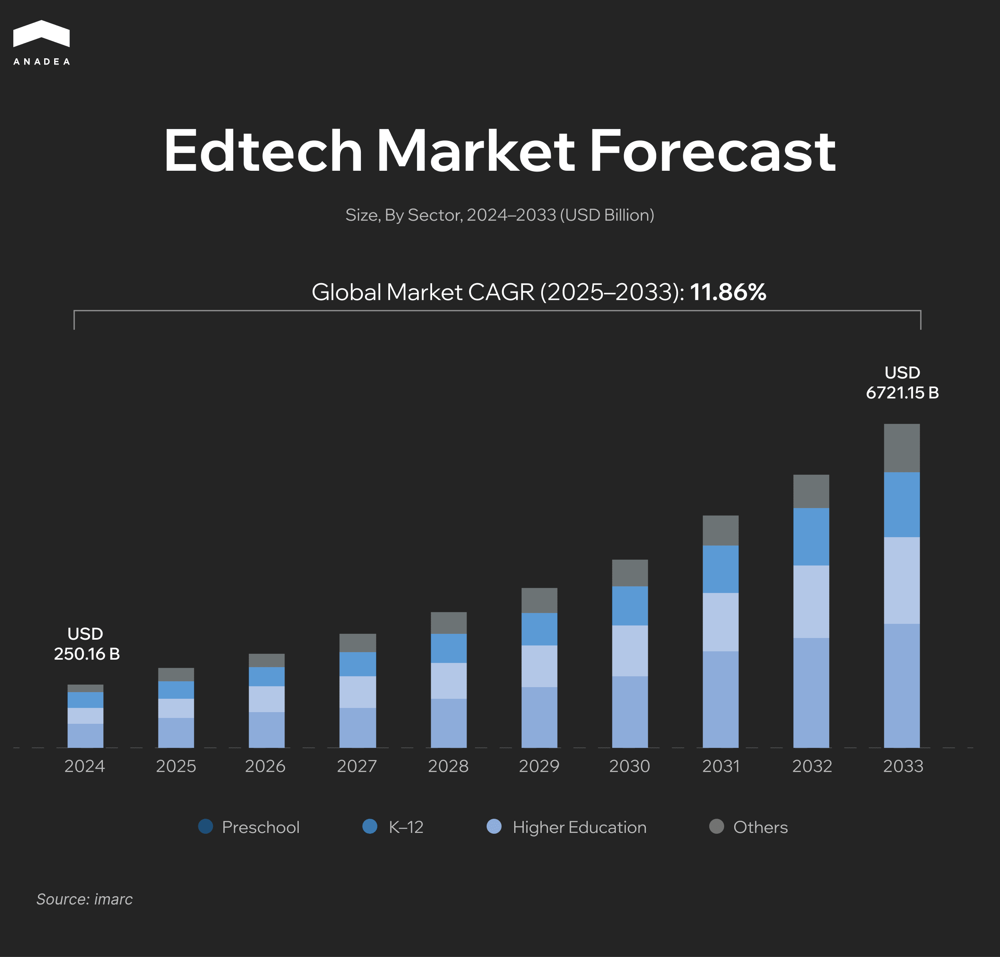
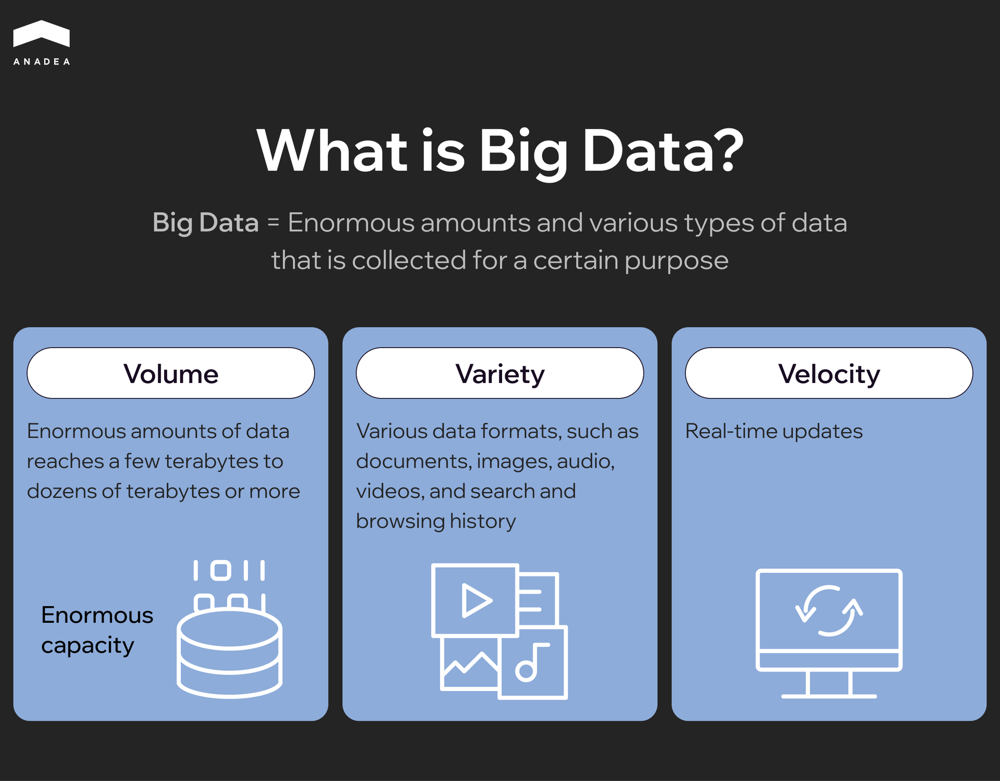

In 2024, the global edtech market size reached $250.16 billion. Now, experts predict that by 2033, this figure will increase to [$721.15 billion](https://www.imarcgroup.com/edtech-market), which reflects a CAGR of 11.86% during the forecast period (2025-2033). The market growth is driven by the continuously increasing demand for enhanced digital learning experiences, personalized tutoring solutions, and adaptive assessments.

Based on our practical experience in [e-learning software development](https://anadea.info/solutions/e-learning-software-development) and our deep understanding of the ongoing market trends, we see the increasing role of data in this field. The large-scale collection and intelligent analysis of diverse student and institutional data are a cornerstone of modern edtech systems. That’s why the demand for big data tools, supported by AI and other emerging technologies, that help perform such tasks is higher than ever.

In this article, we are going to talk about the use of big data in education, its benefits, real-life applications, and future trends.

## What Is Big Data in Education?

Big data in education is the collection, analysis, and application of vast volumes of educational data to enhance teaching, learning, and institutional decision-making. It helps teachers and administrators gain actionable insights into student interactions and academic records.

The key characteristics of big data in education include:

* **Volume**. There are huge amounts of data from different sources. Such data is continuously generated daily by students, teachers, and platforms.
* **Variety**. Data comes in various formats, including sensor data, test scores, forum posts, etc.
* **Velocity**. Today, new data is generated at high speed and should be processed in real time.
* **Veracity**. It is vital to estimate data quality and accuracy.
* **Value**. The key goal is to get actionable insights that will be further used to enhance the teaching and learning processes.

There are several types of big data analysis widely applied in education.

* **Descriptive analytics**. It answers the question “What happened?”. It summarizes historical data to provide insights into trends and patterns. For example, tools of this type help track students’ grades over time.
* **Diagnostic analytics**. The main question is “Why did it happen?”. With such systems, educational institutions can identify causes or correlations. For instance, they can analyze why some students perform better or worse in specific modules.
* **Predictive analytics**. Such tools are designed to answer the question “What may happen?”. Based on historical data and ML models, predictive analytics tools forecast future outcomes, like possible grades or course completion rates.
* **Prescriptive analytics**. With tools of this type, educational institutions can find answers to the question “What should we do about it?”. Such solutions provide actionable strategies and recommendations. They can be used for offering personalized study plans or for notifying tutors when students need targeted support.

### What Data Sources Are Used?

* **Learning management systems (LMS)**. Systems like Canvas LMS, Google Classroom, or custom solutions enable educators to monitor student activity, time on task, grades, and content engagement.
* **Student information systems (SIS)**. These systems typically store demographics, attendance, disciplinary records, course enrollments, and academic history.
* **Assessment and testing platforms**. These solutions cover standardized test results, formative/summative assessments, and other testing data.
* **Behavioral and engagement metrics**. Big data can also accumulate info from various e-learning apps, including but not limited to time spent per topic, peer collaboration, forum participation, etc.
* **IoT devices**. Today, smart classrooms can be equipped with biometric devices, classroom cameras, sensors, smart blackboards, and other connected devices. They can track presence, emotional engagement, or physical activity.
* **Surveys and feedback forms**. Educational institutions can also collect feedback directly from students to analyze their satisfaction and motivation levels.

### Traditional vs Data-driven Education

The emergence of big data in education has become a booster for the shift from traditional models to more dynamic and personalized learning environments.

In traditional education systems, decisions regarding instruction or student support are often based on teacher intuition and prior experience, or static historical data. The effectiveness of such an approach is high only in familiar contexts. When it comes to continuously changing needs, its results become less predictable.

Meanwhile, data-driven education relies on real-time insights and predictive analytics. 

This shift has become possible largely thanks to the development of AI and ML models. They can process vast volumes of educational data to uncover patterns, forecast student outcomes, and personalize instruction. 

AI-driven insights make learning more proactive. AI systems can anticipate student needs and help educators adapt the learning process and their support accordingly. 

With the continuously growing volumes of data that should be properly collected and processed, the significance of big data can’t be underestimated. With the proper analysis of historical data and real-time inputs, educators can better understand trends, existing challenges, and improvements that should be introduced.

## Benefits of Using Big Data in Education

The application of big data at different levels of education provides new opportunities and advantages for all participants in the learning process.

### Personalized Learning Experiences

Big data enables adaptive learning. It is possible thanks to analyzing student interaction patterns, including time spent on tasks, correctness of responses, and content preferences. Based on such analysis, algorithms adjust content difficulty and format to suit individual learners.

Adaptive learning platforms like Khan Academy and DreamBox Learning demonstrate a good example of how data can be used to tailor learning journeys to the needs of each person.

Personalized learning is key to enhanced engagement, retention, and more equitable learning opportunities for everyone.

### Early Intervention and Dropout Prevention

Educational institutions can rely on predictive analytics to identify early warning signs of academic disengagement. For example, low grades, skipped classes, late submissions of different tasks, or declining participation can be among the parameters under consideration.

It can be rather challenging for educators to detect such signs at early stages without the help of tech tools. Big data solutions can address this issue. 

Georgia State University is continuously monitoring around [800 risk factors](https://success.gsu.edu/approach/) for over 40,000 students every day. Thanks to this, the number of target support interventions based on the received alerts can reach 90,000 per year. For instance, if a person signs up for the wrong course, an adviser gets an alert and can contact this student already the next day. The number of such corrections was more than 2,000 within just one year. 

Thanks to such tracking systems, universities can not only minimize dropout rates but also reduce learning gaps. This helps students achieve success in the long term.

Improved Curriculum Design

Curriculum can be dynamically updated based on aggregated data from assessments, activity on learning platforms, and student surveys. Such data shows what content works best and what doesn’t, which allows for introducing valuable changes to programs.

Minerva University is one of those that offer flexible and continuously adjusting curricular frameworks. Learning programs are progressively personalized based on students’ achievements and specific educational goals. 

This approach to curriculum design is an important condition for better educational outcomes.

### Institutional Decision-Making

Administrators and educators can use dashboards and analytics tools to make decisions on enrollment trends, staffing, budgeting, etc. Such data-driven decisions can help reduce waste and optimize operations.

Today, there are quite a lot of institutions ([Arizona State University ](https://tech.asu.edu/features/asu-data-warehouse)is one of them) that accumulate data from learning management systems, financial tools, and student services to monitor key performance indicators and power strategic decisions.

Institutional decision-making allows organizations to achieve higher operational efficiency and agility, as well as ensure enhanced service delivery.

### Teacher Performance and Development Tracking

Big data tools help analyze various classroom-level metrics, such as student engagement, performance trends, and their feedback. All this is highly valuable to assess instructional impact. Thanks to this, it is possible to introduce targeted professional development and encourage a culture of continuous improvement.

For instance, the [University of Maryland](https://it.umd.edu/analytics/initiatives) utilizes analytics to detect the most result-oriented teaching strategies.

With performance tracking tools, educational institutions can make sure that their teaching approaches fully align with students’ needs and can significantly increase the effectiveness of the learning process.



## Real-World Use Cases of Big Data for Education

To better demonstrate how big data can be used in education, we will provide big data in education examples based on their target users.

### Big Data Applications in Education for Students

**Adaptive learning platforms**. Such platforms can analyze students’ responses in real-time to detect the right content difficulty and presentation style for each learner.

According to [research](https://www.evidenceforessa.org/program/dreambox-learning/), students who use the adaptive programs by DreamBox Learning for the recommended frequency demonstrate better results during various assessments, including the Measurement and Geometry subtest of the NWEA MAP, as well as the Number Knowledge Test in grades K-2 and 4-5. 

**Real-time feedback**. Big data systems can provide instant feedback by processing quiz results, engagement data, and behavioral signals in real time. This helps students better understand their progress before formal assessments.

A methodology for giving feedback via a quiz, dubbed [Pro-f-quiz](https://arxiv.org/abs/2305.15996), proved the value of feedback. 236 students took part in an experiment in which the feedback was provided through an online quiz. 85% of the students liked the approach. Moreover, all participants received higher grades than those students who didn’t participate in the program.

**Tailored study plans**. AI-driven platforms that work with big data can synthesize academic histories, learning preferences, and assessment data. Thanks to this, they can recommend individualized study schedules and goals.

Coursera is a well-known learning platform that collects and processes learner data to offer courses and deadlines based on users’ prior performance.

In 2023, the platform launched [Courser Coach](https://blog.coursera.org/coursera-coach-leveraging-genai-to-empower-learners/), an AI-powered learning assistant that can provide personalized support and guidance. It can help users choose the best learning programs and approaches based on their needs. It can offer clear explanations of educational materials, connect course content to professional scenarios, share feedback, and provide emotional support.

Apart from this, to make its courses available to learners from different countries, [Coursera relies on Generative AI ](https://blog.coursera.org/coursera-launches-ai-dubbed-courses-in-spanish-french-brazilian-portuguese-and-german/)to translate and dub video content. Now, more than 100 popular courses are available in four widely spoken languages (Spanish, German, French, and Brazilian Portuguese).

For more insights into how GenAI can be used, follow [this link](https://anadea.info/blog/gen-ai-applications-for-business/).

### Big Data Applications for Educators

**Early detection of struggling students**. Teachers can monitor real-time performance dashboards to identify students who fall behind and provide them with timely support.

Modern AI models demonstrate high efficiency in identifying at-risk students. For example, an experiment conducted on the data provided by the Moroccan Ministry of National Education achieved [88% accuracy](https://scale.stanford.edu/genai/repository/ai-based-identification-and-support-risk-students-case-study-moroccan-education) in the detection of students who needed support. The implemented framework incorporated historical data and was aimed at reducing student dropout.

**Content optimization**. Platforms powered by big data can track which learning materials are most effective within different student groups. With this information at hand, teachers can choose and structure content accordingly.

The Ministry of Education of Singapore realized an embedded [analytics program](https://unesdoc.unesco.org/ark:/48223/pf0000387744) across 10 schools. The system accumulated data from classrooms, digital textbooks, and assessments to enable teachers to get comprehensive insights into student progress and adjust learning materials accordingly. Schools that participated in the program registered a 15% greater improvement in PISA (Programme for International Student Assessment) scores than non-participating schools.

### Big Data Applications for Institutions

**Budget planning**. Data analytics help predict enrollment trends, facility needs, and financial planning.

For example, [IBM Planning Analytics](https://www.bufdg.ac.uk/the-bufdg-network/supporters/budgeting-solutions), powered by Watson AI, helps UK universities, including London South Bank University, automate budgeting, enrollment forecasting, staff allocation, and what-if scenario modeling. All this is performed via a unified planning system combining finance, HR, and operational data.

**Program effectiveness**. Institutions can evaluate student outcomes at each course or program. As a result, they can adapt or retire the underperforming ones. 

Purdue University has a row of learning analytics tools aimed at optimizing academic advising and course offerings. One of the latest additions is [Ellucian Smart Plan](https://www.purdue.edu/newsroom/2024/Q2/purdue-partners-with-ellucian-to-implement-leading-degree-audit-and-planning-solution-to-help-students-chart-their-academic-progress-career-goals/). It is an advanced degree audit and planning tool. It will help students and their advisors plan, track, and progress during the career preparation journey.

**Capacity management**. With big data tools that process real-time student flow data, administrators can better manage classroom sizes, faculty workload, and infrastructure needs. The real-life implementation of predictive analytics helped a public university [decrease scheduling conflicts](https://datacalculus.com/en/blog/higher-education/chief-information-officer/optimizing-course-scheduling-in-higher-education-a-cios-guide) by 20% and increase utilization of classrooms.

## Big Data in K–12 vs. Higher Education

The approaches and administrative processes at K–12 and higher education institutions greatly differ. The same is true about the use of big data technologies at schools and universities. What makes it different?

### Scale of Data

In K–12, big data systems work with smaller datasets. Typically, they are focused on grades, attendance, test scores, and behavioral records for each student. Data is usually rather uniform as it is based on standardized testing and a centralized curriculum across schools.

Meanwhile, in the case of big data analytics in higher education, these tools need to deal with larger datasets that include academic performance, financial aid, tuition payments, mental health records, and research productivity. Students typically have great autonomy, which leads to more diverse and complex data sources.

As higher education institutions deal with larger, more fragmented datasets, they need to implement more sophisticated storage and governance.

### Infrastructure

Many schools still have outdated IT systems and limited cloud storage capacity due to budget constraints.

At the same time, universities typically have the possibility to invest in enterprise-level IT systems, cloud analytics platforms, and other required software and hardware.

Given this, big data in higher education is more widely adopted than in K–12 institutions.

### Use Cases

K–12 schools usually rely on big data tools to analyze test scores and learning outcomes, monitor attendance, engagement, and behavior to flag students needing support.

For instance, Schoolzilla helps school leaders track and visualize key performance indicators, like attendance and test scores, in unified dashboards. Meanwhile, Socrative can provide instant feedback and reports based on student responses.

Big data and higher education are increasingly intertwined. And the range of use cases is continuously expanding. Universities often use data technologies to suggest course plans based on past performance, track faculty output, predict enrollment trends, and analyze graduate employment outcomes.

Higher education institutions can use the Starfish platform. It offers progress tracking and student engagement analytics to ensure good retention rates. Another solution is Ellucian. Its data and analytics tools allow universities to streamline their operations and enhance student outcomes via data-driven decision-making.

## Challenges and Ethical Concerns of Using Big Data in Education Industry

In the midst of all the opportunities and advantages it offers, big data also presents numerous challenges. And it is vital to stay aware of them in advance in order to be ready to address them.

### Data Privacy and Protection

The use of big data in education includes collecting and processing massive amounts of student data. This raises significant concerns around how this data is stored and shared, as students and parents are often unaware of that.

Moreover, many educational platforms outsource data storage or rely on the tools offered by external analytics providers. This increases the chance of breaches or misuse.

Meanwhile, governments from different corners of the world develop regulations that protect personal data.

In the European Union, it is the [General Data Protection Regulation (GDPR)](https://gdpr-info.eu/). It ensures the right to access, correct, and erase personal data, as well as supports informed consent, data minimization, and transparency on data usage.

In the US, the use of data in the education segment is regulated by the [Family Educational Rights and Privacy Act (FERPA)](http://studentprivacy.ed.gov/ferpa). It gives parents and students the right to inspect and correct education records. Apart from this, it introduces restrictions for how and when schools can disclose information to third parties.

### Algorithmic Bias and Inequity

When AI models are trained on biased assumptions or incomplete data, they can reinforce existing inequalities in their work. This can result in unfair decision-making in such aspects as admissions or grading.

For instance, in admission predictions, they may favor students from well-funded schools, while grading algorithms can penalize students whose learning paths differ from traditional plans.

### Cost and Infrastructure Gaps

The development and deployment of bid data tools require significant financial resources for modern cloud infrastructure, secure data storage, and post-launch monitoring and maintenance. 

Many educational institutions, especially in developing regions, often lack both of them. Apart from this, in some regions, schools and universities may face serious difficulties in hiring and retaining specialists who can provide technical support of such systems.

As a result, the digital divide between low-funded and wealthier institutions is growing.

### Teacher Readiness and Digital Skills

To use big data tools, educators should be able to interpret analytics and make data-informed decisions.

Nevertheless, many of them have not been trained in data literacy. As a result, they have difficulties in understanding analytical dashboards. This can result in a lack of trust.

For example, more than [80% of upper secondary school teachers](https://link.springer.com/article/10.1007/s10639-023-11772-y) in Switzerland can access digital platforms with analytics. But only 25% of professionals admit that they are positively confident in enhancing teaching with the help of data technologies.

Without proper training, data tools may be misused or misinterpreted, which limits their practical value.

Let’s briefly compare the benefits and risks of using big data in education.

`<table>`

`<thead>`

`<tr>`

`<th>`

`
Aspect
`

`</th>`

`<th>`

`
Benefits
`

`</th>`

`<th>`

`
Risks
`

`</th>`

`</tr>`

`</thead>`

`<tbody>`

`<tr>`

`<td>`

`
Personalization
`

`</td>`

`<td>`

`
Big data tools allow institutions to provide tailored learning paths and personalized content.&nbsp;
`

`</td>`

`<td>`

`
The use of personalized learning plans can lead to over-reliance on automated decisions without human oversight.
`

`</td>`

`</tr>`

`<tr>`

`<td>`

`
Efficiency for institutions
`

`</td>`

`<td>`

`
Big data helps streamline administrative and academic processes.
`

`</td>`

`<td>`

`
The implementation of data technologies requires significant investments and specific tech infrastructure.&nbsp;
`

`</td>`

`</tr>`

`<tr>`

`<td>`

`
Performance monitoring&nbsp;
`

`</td>`

`<td>`

`
Big data can provide real-time insights into student progress and learning gaps.
`

`</td>`

`<td>`

`
There is a risk of misinterpretation or misuse of performance data.
`

`</td>`

`</tr>`

`<tr>`

`<td>`

`
Predictive analytics&nbsp;
`

`</td>`

`<td>`

`
Such tools support early interventions and improved retention.
`

`</td>`

`<td>`

`
Inaccurate predictions may lead to unfair labeling.
`

`</td>`

`</tr>`

`</tbody>`

`</table>`

## Future Trends in Edtech and Big Data

The joint application of AI and big data in edtech is already proving effective across various areas of the educational landscape. Let’s take a closer look at the key trends that are expected to shape the industry in the near future.

### AI-Powered Hyper-Personalization

Personalization is one of the key trends in education today. As a result, we can observe the growing implementation of AI functionality across learning platforms. Thanks to this technology, these platforms can deliver content that can be adapted to students’ performance, behavior, and preferences in real-time. 

Personalized tutoring systems can significantly enhance student outcomes and boost engagement. According to research, student test scores are [increased by 15%](https://zipdo.co/ai-in-the-e-learning-industry-statistics/) on average with AI tutoring sessions. Meanwhile, almost 80% of students admit that with AI, it is easier for them to understand complex topics. 65% of learners say that they feel more confident when online platforms have AI-powered personalized support tools.



### Advanced Real-time Learning Analytics Dashboards

Dynamic analytics dashboards can provide educators and administrators with real-time insights into student engagement, progress, and risk factors.

Thanks to data-driven insights, schools will be able to offer better academic performance support and achieve higher retention rates.

Nearly [60% of universities](https://gitnux.org/ai-in-the-higher-education-industry-statistics/) have already incorporated AI-driven learning analytics to enhance student retention.

### Immersive Learning: Integration with AR/VR and Gamification

The role of AI/VR technologies in digital classrooms is expected to grow in the near future. Such tools can offer immersive simulations and experiential learning, which can greatly increase the efficiency of learning efforts.

Moreover, gamification elements can boost motivation ([80% of learners](https://zipdo.co/gamification-statistics/) confirmed this) and improve knowledge retention through offering interactive learning formats and goal-oriented challenges.

According to [80% of educators](https://teachng.com/publications/ar-in-education-statistics/), AR can increase engagement and enhance the learning process. At the same time, 70% of students say that they are interested in using AR-based tools for learning purposes.

### Predictive Models for Enrollment and Job Placement

The further integration of big data and AI is also reshaping how educational institutions plan for the future. Thanks to the analysis of vast datasets, institutions can generate accurate forecasts across key operational areas.

For example, AI models can identify long-term and seasonal enrollment patterns. This enables institutions to better plan resource allocation and faculty hiring.

Predictive analytics can help institutions better understand industry demand and adjust their programs to ensure alignment between education and employment.

A [2024 academic study](https://arxiv.org/abs/2407.17591) across 17 Indian states relied on predictive models to forecast student employability in engineering and IT programs.

## Final Thoughts

The transition from traditional education models to education powered by big data and AI represents a shift toward more student-centered and result-oriented teaching. By implementing big data tools, educational institutions can enhance learning outcomes and improve resource efficiency. But what is even more important, they can better prepare students for the realities of the modern world.

If you also want to introduce big data technologies into your learning solutions or build a big data-powered system from scratch, at Anadea, we are always ready to help you. Share your ideas to [get project estimates for free](https://anadea.info/free-project-estimate).
