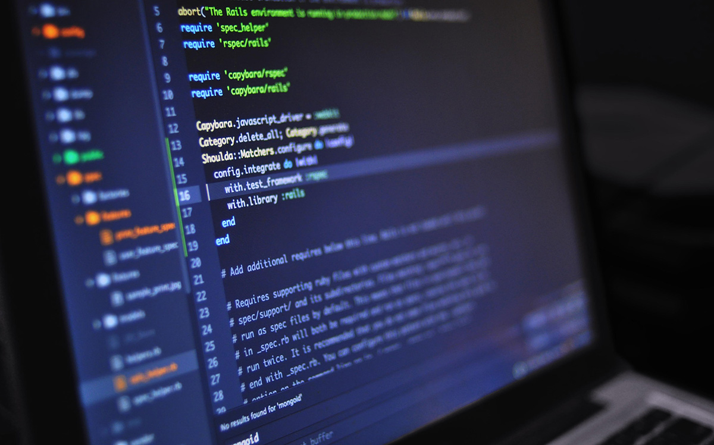

The <a href="https://www.forbes.com/sites/forbestechcouncil/2018/06/14/iot-for-economic-and-social-good-how-the-internet-of-things-makes-our-world-better/" target="_blank">Internet of Things</a> (IoT) and a new, faster web (known as Web 3.0) are here upon us, and as some wise old dude stated, we have no choice but to adapt or perish. One of the newer technologies related to the IoT is Big Data, which fundamentally involves the collection, analysis, and application of large volumes of data in various spheres.

In this article, the focus is on the use of Big Data in <a href="https://anadea.info/solutions/e-learning-software-development/m-learning">eLearning App Development</a> and the opportunities and realities it presents as well as the existing challenges and gaps in research that need to be addressed to enhance effectiveness. Here we go:

## Big Data opportunities in education

Looking at how different industries, most notably finance and business, have adopted and benefited from data analytics, we can see a similar future in the education sector. Here are four key opportunities that Big Data presents to education stakeholders.

### 1. Enhanced student performance

It's safe to say that the main aim of integrating Big Data, and any other [digital technology](https://anadea.info/blog/how-digital-technology-has-changed-modern-education) for that matter, in the education sector is to improve student performance. By collecting and analyzing data on, among other things, student behaviors in the classroom setting, their enthusiasm during classes and their interactions with teachers and fellow students, teachers and management will have a foundation from which to improve teaching and learning processes. They will also be able to point out factors affecting an individual student's performance and come up with effective solutions through analytics.

### 2. Credible grading

Big Data offers teachers a faster and more convenient way to mark and grade student essays, quizzes, and tests. If you attended a government college, you have probably witnessed or experienced a case of poorly marked tests, missing marks or delayed results. It's easy to blame this on the 'lazy' professors but thinking about it, they have hundreds of test papers from multiple classes to attend to, and they are not even sufficiently remunerated to begin with, which affects the quality of their marking. In Big Data, colleges and universities have a credible, reliable system to not only mark various papers but also swiftly release results, making things easier for everyone.

### 3. Holistic development

Over the years, there have been concerted efforts by government agencies, parents and other stakeholders towards holistic development of learners. The idea is to impart the future generation with additional skills from extra-curricular activities to add on to their academic competencies.

With Big Data, schools can track their students' performance across several disciplines both at an individual and collective level and benefit from [eLearning software development](https://anadea.info/solutions/e-learning-software-development) to assist in progress. Records of past performances help in predicting future performances and faced with potential failure, institutions can use Big Data analysis to make timely positive interventions that add value to their students' personal development.

### 4. Dynamic learning programs

With <a href="https://nces.ed.gov/fastfacts/display.asp?id=372" target="_blank">more than 20 million students</a> enrolling in US Colleges as at fall 2017, and the number increasing every year, colleges are finding it hard to keep up with the infrastructure requirements. With Big Data and other modern technologies, however, they can register thousands of students in structured online courses, known as Massive Open Online Courses in academic circles without having to build a single lecture hall. This reduces costs for both the students and schools, boosts performance and ensures greater access to education.

What's more, having well-managed analytics systems can help institutions to customize learning programs based on individual learners abilities and performance. Thus, slow learners can move at their own pace while the fast learners get ahead as opposed to the current situation where they all move in sync.

## Realities and challenges of Big Data in education

Indeed, Big Data analytics and related technologies such as Deep Learning, Cloud Computing and Supporting Vector Machines are the key to a more modern, more successful education model. Nonetheless, in the midst of all the opportunities and advantages it offers, Big Data also presents a bunch of challenges including:

### 1. Limited talent pool

As society becomes increasingly data-driven, the demand for skilled data experts continues to skyrocket across various sectors. The education sector is no exception, as the use of Big Data has the potential to transform the way students learn and teachers teach. However, the shortage of skilled data professionals remains a significant obstacle to the seamless adoption of this technology in schools. Unfortunately, only a handful of top colleges offer data science courses, and as a result, there are very few people with the necessary skills to ensure the successful integration of Big Data in the education sector. This shortage of skilled professionals presents a major challenge as it may prevent most schools from leveraging the full benefits of Big Data, thus locking out millions of students from the opportunities that it offers.

To bridge this gap, there is a pressing need for educational institutions to invest in developing data science courses and programs that will produce a new generation of data experts. This investment will not only provide students with the necessary skills to thrive in the data-driven economy but also equip educators with the tools needed to personalize instruction and enhance learning outcomes.

### 2. Scalability and storage issues

The collection and analysis of vast amounts of information have become increasingly important for businesses to gain insights and make informed decisions. However, as the volume of data continues to grow exponentially, the capacity of traditional Big Data machines to process and analyze it is often exceeded, resulting in crashes and slowdowns that can compromise the quality of analysis and the accuracy of resulting outcomes.

To address this issue, it is essential for top developers to develop more scalable processing and storage systems that can handle both current and future demands. These systems must be capable of efficiently managing massive amounts of data while minimizing the risk of performance issues. Moreover, they should also incorporate advanced analytical tools and algorithms that can rapidly extract insights and provide real-time feedback.

### 3. Data errors
Big Data, as the name suggests, deals with massive volumes of data. For instance, public institutions that cater to several thousand students must maintain multiple datasets across various categories to keep track of the entire student population. However, errors and mistakes such as data losses are not uncommon, particularly in cloud storage systems, and can be quite expensive to correct. In some cases, these errors may even necessitate completely new data, resulting in significant losses of time, money, and resources.

The challenges of managing large datasets are further compounded by the shortage of experts who can advise institutions on best practices and procedures. While the technology for managing Big Data has advanced significantly in recent years, it is still relatively new and complex, requiring specialized knowledge and expertise to ensure optimal outcomes. Therefore, public institutions must invest in developing their Big Data capabilities and expertise to navigate these challenges effectively. This may involve training and hiring professionals who are skilled in data management, implementing advanced data storage and processing systems, and leveraging data analytics tools to extract insights and drive better decision-making.

### 4. Data safety concerns

Data safety and integrity is arguably the biggest concern about Big Data to regulatory authorities and education stakeholders. For one, the existing security protocols are not well equipped to handle the large volumes of data involved in Big Data analytics. What's more, it is very expensive, not to mention difficult, to effectively manage the dynamic or continuously updating type of data the technology brings about. Hackers, therefore, have an easy time getting to datasets, particularly those stored in the cloud without data owners noticing.

Granted, academic data may not be as sensitive as financial or health data, but still, there is fear that hackers and malicious people may use the weak security systems of Big Data to gain access to volumes of student data. Fortunately, further research is ongoing in this aspect, and hopefully, it results in better, more reliable data protection methods.

## Conclusion

Big Data, although still in its infancy stages, has the potential to be a game-changer in the learning sector over the foreseeable future. It will result in smarter, more "complete" students who will undoubtedly have positive impacts on industries and the society at large. We believe that even with the challenges, Big Data and in extension, the Internet of Things, are the future of our existence, just like the World Wide Web was in the '80s.

What are your ideas about Big Data? Do you think it will improve the learning sector? Share your thoughts with us.
