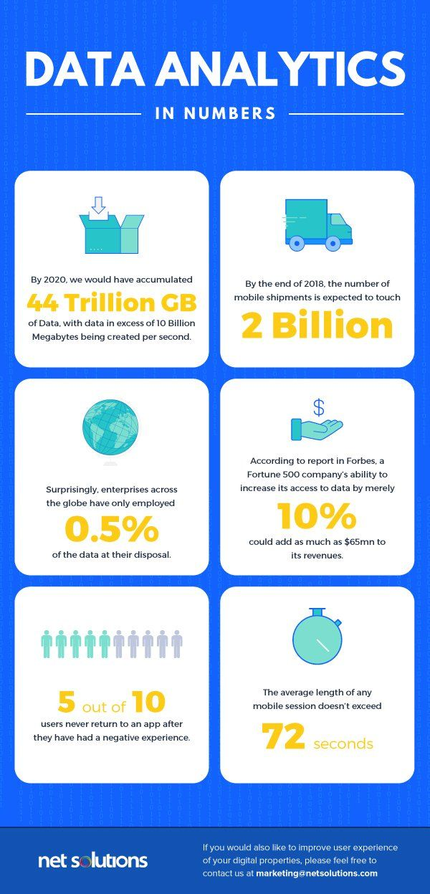
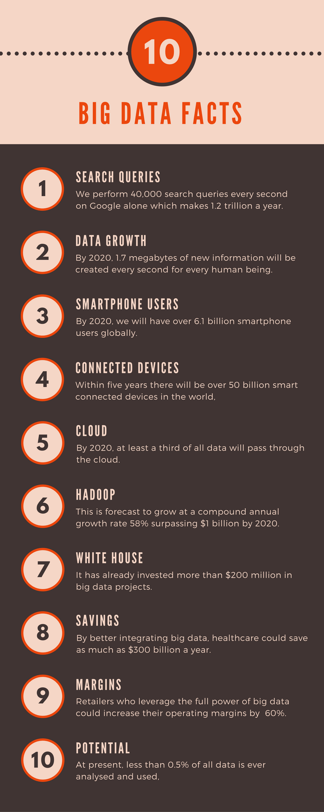

Smartphones and smart-devices have simplified our daily tasks manifolds. They have become an indispensable part of our lives. Today, we just cannot imagine a single day without these devices. We no longer need to head out for purchasing things or for searching a conveyance, we have apps that can help us with most of the imaginable things. We can book our favorite movies or meals at our favorite restaurants with just a few taps on our mobiles.

Today, the number of smartphone users around the world is nearly <a href="http://www.dataversity.net/big-data-analytics-right-tool-mobile-app-development/" rel="nofollow" target="_blank">4.77 billion</a>, a figure that shows the market for mobile apps is only splurging right now. Almost every major activity can be accomplished via mobile and mobile apps. So, businesses and organizations can no longer afford to ignore the relevance of mobiles when it comes to expanding their businesses. The higher the number of mobile users, the higher is the amount of data collected every minute. Now, the world generates <a href="https://rivery.io/blog/big-data-statistics-how-much-data-is-there-in-the-world/" target="_blank" rel="nofollow">2.5 quintillion bytes</a> per day - this is 1,000 petabytes!

If you are new to the concept of Big Data, there are numerous <a href="https://www.upgrad.com/big-data/" target="_blank">Big Data courses</a> to increase your knowledge on the subject!

The fundamental question that arises is: **How do you leverage and use such vast amount of data to develop good mobile apps providing value-added services?**

The answer is Big Data. It is clearly visible that the increased engagement and interactions with mobile applications are giving rise to such overwhelming amounts of data. This data holds tremendous potential to unravel hidden patterns in it with Big Data analytics. So, the relationship between mobile apps and Big Data is complementary - mobile apps generate massive amounts of data, and Big Data analytics provide powerful insights about the data that mobile app developers can use to improve their apps.

## How can Big Data enhance mobile app development and marketing?

Due to the ever-increasing number of mobile users, the mobile app market is expected to reach <a href="https://insidebigdata.com/2017/12/19/impact-big-data-mobile-app-development-businesses/" rel="nofollow" target="_blank">$189 billion</a> by 2020. Hence, a significant share of the future of digital technology depends on developing certified and stable mobile apps. Here's how Big Data can help transform mobile applications for the better!

### Enhance user experience

In the development of mobile apps, analyzing user experience is crucial for creating a successful product. By generating and analyzing real-time data, developers gain valuable insights into user behavior and preferences, providing a distinct picture of what potential customers are looking for in an app. Big Data analytics plays a pivotal role in this process, offering a comprehensive overview of user behavior and identifying the key areas that developers should focus on to optimize the user experience.

With the help of Big Data analytics and <a href="https://anadea.info/services/machine-learning-software-development" target="_blank">machine learning development</a>, software engineers gain a deeper understanding of their target audience. To create a successful app, it's essential to identify the pain points of the target audience. Amazon is an excellent example of a company that leverages the power of Big Data to enhance the overall customer experience. Through predictive analytics, Amazon creates personalized recommendations based on users' previous searches or purchases. Additionally, Amazon uses Big Data analytics to determine peak traffic times on their site and identify highly demanded products.

By analyzing data in real-time, app developers can continually enhance and add value to apps across various industries, including healthcare, finance, enterprise, shopping, gaming, education, and more. Big Data analytics enables developers to create customized solutions that address specific pain points and offer the best possible user experience. By leveraging these insights, developers can create apps that meet the needs of their target audience, resulting in increased engagement, retention, and ultimately, success.

### Expand the arena of mobile marketing

When it comes to mobile marketing, the implications of Big Data are enormous. According to Forbes, in businesses, customer analytics grabs the highest share with 48% use of Big Data cases, followed by operational analytics with 21% share, and the remaining 22% occupied by fraud control and compliance (12%) and R&D (10%). Big Data provides a competitive edge to organizations. With predictive analytics, they can identify the market segments with the most potential and the customer segments they should target and build their digital mobile marketing strategy accordingly.

### Push your boundaries - go international

For app developers seeking to target the global audience, Big Data is an excellent tool. To ensure that your mobile app offers unique solutions, you need to have a good knowledge of how consumers around the world are interacting and behaving with your app. And how will you gain such insight? With Big Data, of course. Big Data analytics will give you access to filtered consumer data categorized by location, age and gender demographic so that you can customize your app for particular user segments across the globe. This will further allow you to scale up your revenue by determining what type of messages, notifications, offers, and emails you need to forward to your customer segments to keep them engaged and loyal to your app.

<a href="http://www.ingrammicroadvisor.com/data-center/6-big-data-use-cases-in-retail" rel="nofollow" target="_blank">Target</a> has set a great example of using Big Data analytics to boost the sales of its pregnant women's product range.

Since mobile applications are essentially B2B players, they need to present a more refined, structured, and target specific utility case in front of their potential customers. Big Data analytics is an excellent tool to customize and curate mobile apps according to the consumer segment they cater to. Thus, the future of mobile applications is inevitably correlated to Big Data.
