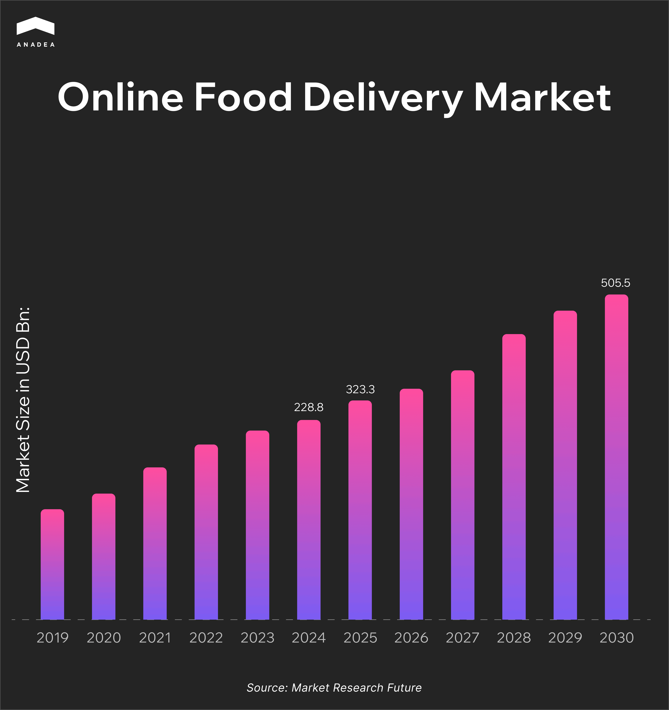
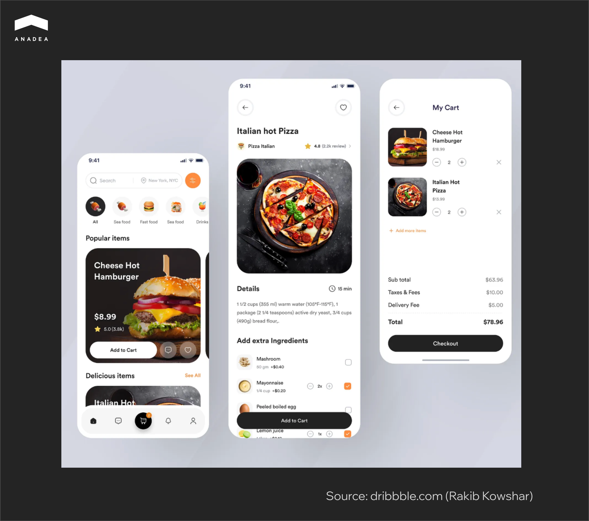

Hungry at midnight? You open the fridge only to find a lone sauce packet and a bottle of water. You don't have the energy to go to the store, and you're even lazier to cook. So, your hand instinctively reaches for your smartphone to order delivery. Sound familiar? Believe me, you're definitely not alone.

This is exactly why the mobile food ordering app market is growing at a staggering rate. The numbers speak for themselves: it was valued at [$288.8 billion in 2024](https://www.grandviewresearch.com/industry-analysis/online-food-delivery-market-report) and is projected to reach $323.3 billion in 2025, continuing its climb toward a massive $505.5 billion by 2030.

According to [recent studies](https://hoteltechreport.com/news/online-ordering-food-delivery-statistics), the vast majority of Americans (86%) have used a mobile app for food delivery. Moreover, more than half of the respondents (53%) consider delivery and curbside pickup services to be an essential part of their lifestyle. This proportion is even higher among Millennials, reaching 64%.

If digitalization has so powerfully burst into the food delivery sector, maybe it's time for you to consider creating your own food delivery app. In this article, we'll tell you how to create a food ordering app, step by step, from idea to launch.

## What is a Mobile Food Ordering App?

A food ordering app is a mobile application that simplifies the process of ordering food, allowing customers to choose dishes from a menu, place an order, and pay for it without the need to call or visit the establishment. Essentially, it's a digital bridge between a restaurant (or a chain of restaurants) and the end user. Such apps often include features like personalized recommendations, real-time delivery tracking, loyalty systems, and integration with various payment services.

It's important to understand that the term "food ordering app" encompasses several different business models. Some are created as proprietary mobile solutions for a single restaurant, others are large-scale marketplaces with hundreds of establishments, and some even handle their own logistics.

### Takeaway Ordering App Business Models

Food delivery apps can exist in several formats, and the chosen model determines how the service will operate and generate profit.

#### Restaurant-Only

In this case, the restaurant food ordering app is created for a single establishment or a chain. All orders and delivery are handled in-house. The restaurant receives income directly from sales, and the delivery cost can either be included in the price of the dishes or added as a fixed fee. This option is ideal for brands that want to strengthen customer loyalty.

#### Aggregator

An aggregator acts as a platform where users can see dozens or even hundreds of restaurants in one app. The ability to browse menus, prices, and reviews makes it easy to compare offers. Delivery can be handled by the restaurants themselves or through partners. The main source of profit for such platforms is commissions from restaurants (a percentage of each order) and fees for enhanced visibility in the catalog.

#### Delivery Service Provider

This is the most large-scale model. The platform not only provides access to various restaurants but also organizes its own delivery (with couriers, a tracking system, and customer support). Profit is generated from commissions, delivery fees, and often from premium user subscriptions that offer free delivery or discounts.

#### Hybrid

In some cases, companies combine different approaches. For example, part of the logistics is handled by their own couriers, and the rest by partners. The hybrid model offers more flexibility: it allows for a balance between service control and resource savings, adapting to the specifics of the market.

<table>

<thead>

<tr>

<th>

<strong>Type of App</strong>

</th>

<th>

<strong>Description</strong>

</th>

<th>

<strong>Use Cases</strong>

</th>

</tr>

</thead>

<tbody>

<tr>

<td>

Single-restaurant app

</td>

<td>

Developed for a single restaurant or chain. The app contains only that brand's menu and allows for delivery or pickup orders. It's a good tool for retaining loyal customers.

</td>

<td>

McDonald&rsquo;s, Domino&rsquo;s Pizza

</td>

</tr>

<tr>

<td>

Aggregator platform

</td>

<td>

A platform that brings together many restaurants in one app. Users can browse menus, prices, ratings, and reviews, while the service itself is typically not responsible for delivery.

</td>

<td>

Zomato, OpenTable

</td>

</tr>

<tr>

<td>

Delivery service app

</td>

<td>

The most comprehensive format: the app acts as a marketplace for restaurants and simultaneously operates its own delivery service. This is a convenient model for users, as all processes happen within a single platform.

</td>

<td>

Uber Eats, DoorDash, Glovo

</td>

</tr>

<tr>

<td>

Hybrid app

</td>

<td>

Combines different models. For example, an aggregator platform that also manages part of the logistics with its own couriers, while outsourcing the rest. Offers flexibility and scalability depending on the market.

</td>

<td>

Deliveroo (in some regions), Bolt Food

</td>

</tr>

</tbody>

</table>

In summary, the choice of business model directly depends on the goals. If a restaurant aims to strengthen its connection with customers, its own app is suitable. If the task is to scale quickly, it's better to consider the aggregator or delivery platform format. A hybrid model allows you to combine both approaches and leave room for development.



## Steps to Create a Custom Food Delivery App

Developing your own mobile food ordering app is a multi-stage process where each step determines the quality of the final product and its ability to compete in the market. We have compiled a list of key steps based on our own experience that you will need to follow to create a competitive product.

### Step 1: Conduct Market Research

The first step is to understand the market you are entering. Food delivery is no longer a novelty but an established and competitive segment with global giants (Uber Eats, DoorDash, Glovo) and local services already operating. If you simply copy their model, your chances of success will be slim. That’s why it’s important to start with in-depth analysis:

1. **Analyze top competitors**. Identify the features they offer, their value propositions, and their weaknesses. For example, one might have a large restaurant base but poor customer support, while another offers fast delivery but charges high commissions to restaurants.
2. **Study local demand**. Determine how often people use delivery services in your region and which food categories are most popular (fast food, healthy food, local cuisines).
3. **Understand customer priorities**. Figure out what is most important to your potential users. Which features do they value most: real-time courier tracking, cashless payments, promo codes, or cashback? This will help you identify a niche and develop a unique value proposition.

### Step 2: Define Your Business Model

The next step is to determine how your online food ordering application will operate and generate revenue. As discussed earlier, there are several primary business models in food delivery. Key considerations at this stage include:

* Identify revenue streams such as commissions, delivery fees, advertising, and subscriptions.
* Account for expenses related to couriers, customer support, and technical infrastructure.
* Ensure the chosen model matches your goals and resources.

Why is this critical? Because the choice of business model will influence the feature set, technology stack, and even marketing strategy. For example, if you opt for an aggregator model, you’ll need to focus on attracting restaurants rather than maintaining your own fleet of couriers.

### Step 3: Create a Feature List and Define the MVP

Before launching a food delivery app, it’s essential to compile a full list of features and determine which are necessary for the initial launch and which can be added later. Below is a list of functionalities commonly implemented in such projects:

<table>

<thead>

<tr>

<th>

<strong>For</strong>

</th>

<th>

<strong>Features</strong>

</th>

</tr>

</thead>

<tbody>

<tr>

<td>

Users

</td>

<td>

registration and profile, restaurant search, menu with photos, cart, online payment, push notifications, real-time courier tracking

</td>

</tr>

<tr>

<td>

Restaurants

</td>

<td>

menu and price management, order acceptance, promotion management, sales statistics

</td>

</tr>

<tr>

<td>

Couriers

</td>

<td>

map with routes, order acceptance, delivery status updates, delivery history

</td>

</tr>

<tr>

<td>

Administrators

</td>

<td>

admin panel, analytics (orders, revenue, user activity), restaurant and courier management

</td>

</tr>

</tbody>

</table>

It’s also worth mentioning the possibilities opened by artificial intelligence. [AI solutions development](https://anadea.info/services/ai-software-development) can personalize the user experience (recommending dishes and restaurants), optimize delivery routes, predict order arrival times, automatically detect suspicious transactions, and even support customers via chatbots. These features are not critical for an MVP but become crucial when scaling the product and making it competitive in the market.

After compiling the full list, it’s important to define the MVP (minimum viable product). This is the basic version of the app containing only the essential features needed for launch: restaurant selection, menu, cart, payment, and delivery. All advanced features can be added after receiving initial user feedback.

### Step 4: Choose a Technology Stack

Choosing the right technologies is key to ensuring the app is fast, stable, and scalable. In [mobile development](https://anadea.info/services/mobile-development), two main approaches are commonly used:

* **Native development**. Swift/SwiftUI for iOS, Kotlin/Jetpack Compose for Android. Provides the best native experience but requires two development teams.
* **Cross-platform development**. React Native, Flutter. Allows writing one codebase for both platforms, significantly reducing time and budget.



It’s also important to integrate payment services (Stripe, PayPal, Apple Pay, Google Pay), maps and routing (Google Maps API, Mapbox), and push notifications (Firebase Cloud Messaging).

We recommend checking out o[ur technology stack ](https://anadea.info/technologies)to see which tools we most frequently use and which solutions are best suited for food delivery projects. 

### Step 5: Wireframing and UI/UX Design

Once you have defined what your online food ordering application should do, the next step is to sketch its skeleton. This is called wireframing – draft layouts of future screens. They illustrate how the user will move from selecting a restaurant to confirming an order. No decorations, just logic and structure. This helps identify weaknesses early on: unnecessary clicks, confusing navigation, or unclear buttons.

Next comes UI/UX design. Here, it’s not just about making it look good but also about speed and simplicity. Food delivery is all about instant decisions: the user is hungry and wants to order within minutes. If they get lost in the menu or can’t find the payment button, you’ve lost a customer. So the guiding principle is: minimum effort, maximum clarity.

### Step 6: What Team to Hire

This is where business meets real choices. There are several paths:

* **In-house team**. This option is for those planning a long-term game and wanting full control. You set up a development department, invest in people, infrastructure, and processes. Pros: full control and deep involvement. Cons: high cost and slow start.
* **Freelancers**. Cheap and fast, but unreliable. A freelancer might disappear, abandon the project, or struggle with complex tasks. This option suits very simple MVPs but is not viable for a large-scale service.
* **Outsourcing company (our preferred option)**. Here, you get a ready-made team that has seen dozens of similar cases. You don’t need to understand technical details or build processes from scratch. You focus on business; we focus on technology. Pros: scalability (3 developers today, 10 tomorrow). For startups or mid-sized companies, there are practically no downsides.
* **Hybrid approach**. Keep some roles in-house (e.g., a product manager who knows your audience best) and outsource the technical work. This allows you to retain control while offloading technical challenges.

### ​Step 7: Testing

If you think development ends after writing the code, you are mistaken. Testing is a critically important phase. And it is not just about finding bugs. In fact, three key aspects need to be verified:

* **Usability**. Can the user place an order in 2-3 minutes without confusion? Is it clear where the cart is and how to add an item? Is it easy to find a favorite restaurant?
* **Security**. Payment processing is a high-risk area. You must guarantee data encryption, secure authentication, and protection against fraud. If a user loses money even once due to your app, they will leave forever.
* **Performance**. The app must withstand peak loads, for example, on Friday evenings when hundreds of users are ordering pizza simultaneously. Speed, server stability, and efficient order routing are crucial here.

### Step 8: App Launch

Publishing your app requires careful preparation to meet the specific guidelines of the App Store and Google Play. Key steps include preparing compelling metadata (app name, description, screenshots, and promotional video), setting up developer accounts, defining privacy policies, and ensuring the app complies with all technical and content requirements. A soft launch in a limited market is highly recommended to gather initial user feedback and identify potential issues before a full-scale release. 

### Step 9: Support and Scaling

Launching the app is just the beginning. Continuous support, regular updates, and feature enhancements are crucial to retain users and stay competitive. Monitoring performance metrics and user feedback will guide further improvements and necessary scaling efforts.



## What Time Does It Take to Build a Food Delivery App?

When you work with a trusted and experienced development company to build your food delivery app, the whole process should take up to 3 months, at the most conservative estimates. Of course, this depends on the complexity of the features you have requested, the number of amendments. Still, this is the realistic time frame of building a solid, reliable online food delivery application.

## How Much Does It Cost to Build a Food Delivery App?

To cover all the essentials and create a user-friendly interface, you should estimate the costs starting at $10,000 - $15,000 and [start with a minimum viable product (MVP)](https://anadea.info/guides/what-is-mvp). If you add extra features to your wishlist, this amount can increase but not significantly.

Although the cost of building a food delivery app is higher than that of a website, this is a good investment. Studies show that more than 85% of customers prefer to order their meals online using mobile apps and not websites.

## Conclusion

Technology is transforming the food industry, and food delivery is not an exception. As online food ordering is skyrocketing in popularity amidst global lockdowns, a demand for easy-to-use, quick and thoughtful online food ordering apps is only going to grow. It’s time for you too to disrupt the industry with a great food delivery app that makes eating at home effortless, easy, and convenient. And to start the process of getting your own prosperous food delivery business, make your first step – a [free project estimate](https://anadea.info/free-project-estimate).
