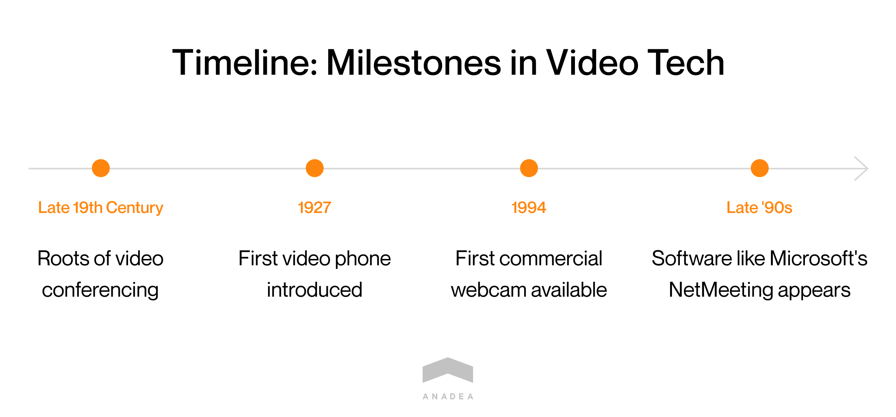
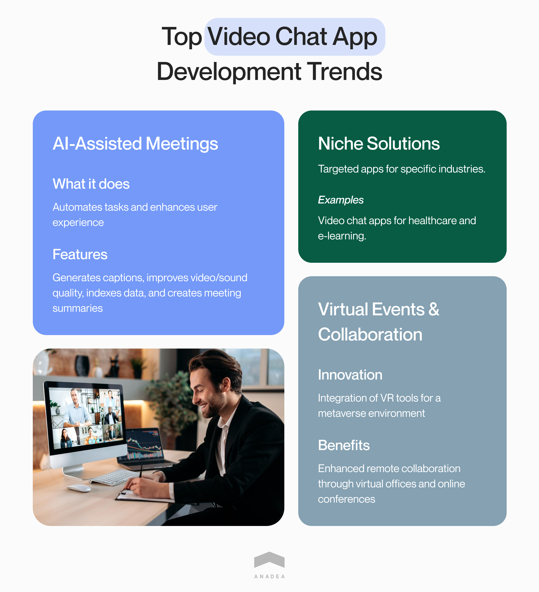
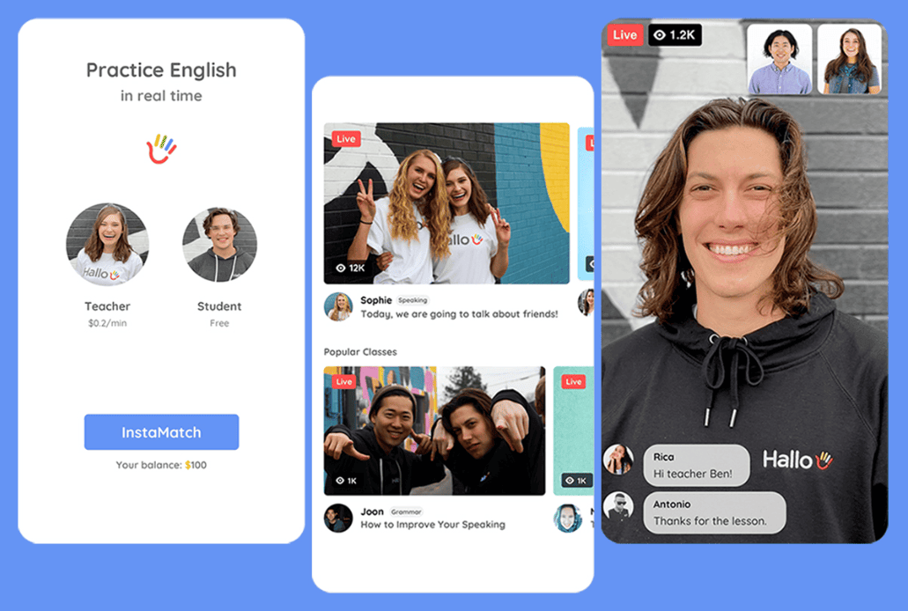
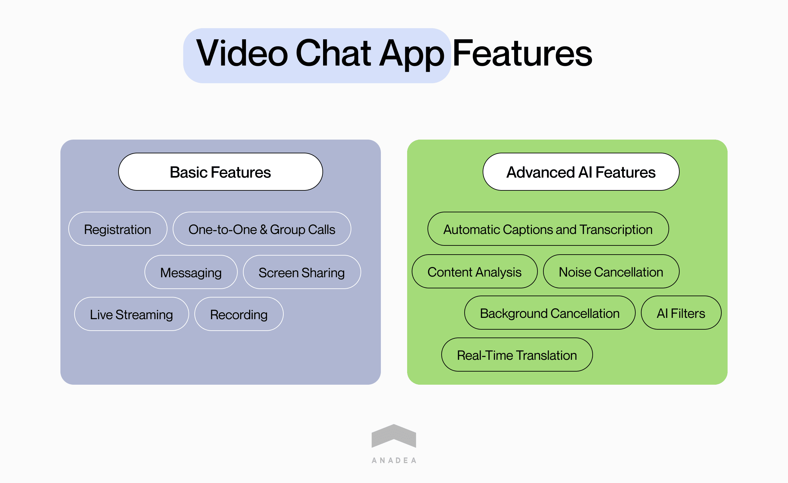
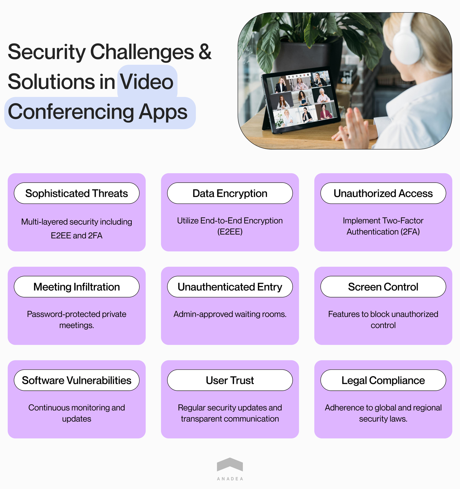

Decades ago businesses had a very limited set of tools and channels for communicating with their clients, partners, suppliers, and authorities. The interaction was based mainly on phone calls and paper letters but their deliveries could take weeks if not longer in the case of international communication. With the introduction of the internet, everything was changed. Now businesses rely on emails and chats while traditional post services now have a supportive role.

But there is one more technology that is widely used today. And it is **video conferencing**. A online video chat app allows you to discuss multi-million contracts with partners from another continent or organize a seminar for hundreds of experts from all over the world. Of course, it is only a small part of all the use cases of a video conferencing app. But what is even more important is that you can do all this without leaving your office (or even home).

Though the history of video conference technology took its roots at the end of the 19th century since then it has experienced a lot of changes. The first so-called video phone was presented in 1927 while the first commercial webcam became available in 1994. At the same time, the first modern video conferencing software like **[NetMeeting](https://news.microsoft.com/1996/05/29/microsoft-netmeeting-conferencing-software-provides-easy-voice-data-internet-communications-available-on-the-web-now/)** by Microsoft started to appear. It may seem that the concept of a webcam chatting program is as old as the world. But we want to prove that with the integration of AI in such apps, they have received a breath of fresh air and a new era has begun for them.

In this article, we will give specific steps to build a video chat app, explain the role that AI-powered cam chat apps currently play in the business world, mention must-have features of modern solutions of this type, and provide tips on how you can make money if you decide to build an online video chat app.

Get a consultation

## Brief market overview: Video calling app development

The size of the global video conferencing market was around $7 billion in 2022 and experts [predict](https://www.fortunebusinessinsights.com/industry-reports/video-conferencing-market-100293) that in 2023, it will reach $7.76 billion and will hit the mark of $17 billion by 2030. Though for the last 10-15 years, applications with video conferencing functionality like **Skype, Zoom, Microsoft Teams** and others have been in active use, the coronavirus pandemic additionally highlighted the demand for such solutions.

Thanks to cam chat apps, a lot of events, meetings, workshops, lessons, and face-to-face communication of other formats can be organized remotely. And even before and after the pandemic, the benefits of such applications are obvious. They help to optimize a lot of business processes, reduce the time and money that are typically required for attending offline events, and reach a wider audience simultaneously.

It is absolutely clear that such apps may have a bright future, especially if they evolve in accordance with general tech trends.

What are the most popular video chat app development trends at the current moment?

- **AI-assisted meetings.** The integration of AI tools is the key trend in building various solutions today and we will consider it in more detail in this article. The main idea behind developing AI-powered functionality when you want to make a video chat app is to facilitate and automate a lot of tasks and processes for users. Such tools are of great use in the business space. What can Artificial Intelligence do for you? It can generate captions, increase video and sound quality, index data, create summaries of meetings, and perform other helpful functions during video calls.

- **Niche solutions**. While the majority of video conferencing apps that are widely known today do not have any precise specialization and can be used in different business domains, the idea of building niche apps is gaining popularity. For example, you can make a video chat app for the healthcare industry or [e-learning](https://anadea.info/blog/elearning-trends-2019).

- **Support of virtual events and better collaboration.** One of the latest tendencies is the integration of VR tools that can help to create a metaverse environment for users. Next-gen webcam chat software can enhance remote collaboration via conducting online meetings and various conferences in so-called virtual offices.

There is such an opinion that to develop video chat app that everyone will like, you need just to define all the most popular and advanced features and build them for your solution. However, based on our rich practical experience, we can say that it is not true. Of course, it is very important to pay attention to the ongoing market trends, expectations, and demands. But it is also necessary to define your target audience, study the preferences of this group, and find the most appropriate ways to satisfy their requirements.

If you want to launch a webcam chatting program, you should decide whether your solution will be mainly targeted at individual or corporate users. The type of app will define not only the required functionality of your solution but also the marketing strategy that you will need to implement in the future.

Contact app developers

## Different approaches to video chat app development

When our customers turn to us with questions on how to make a video calling app, first of all, we always inform them that there are two main approaches to building such software. Let's consider each of them.

### Video calling app development from scratch

We'd like to highlight that for the realization of such a project, you will need to have a professional team by your side (it can be an in-house team or a software development company like Anadea). This approach requires time for planning and design, resources, particular skills, knowledge, and qualifications.

Nevertheless, this approach will allow you to create a fully unique solution that will be developed in absolute accordance with your requirements and will be 100% tailored to your needs. You can ensure any desired functionality, scalability, and flexibility. Well-known apps of this type like Zoom or Skype were developed from scratch.

If you choose this approach, we recommend you devote enough time to careful market analysis and planning. You have the possibility to deliver an app based on an idea that hasn't been presented in the market and you shouldn't miss this chance.

Discuss your idea

### Building software with video chat development tools

Today there is a wide range of no-code app builders and this option may look rather attractive at first glance. Such projects require significantly less investment in comparison to development from scratch which is rather simple to explain. Fewer experts will be involved in creating your product and the entire process will require less time.

Providers of such tools claim that they offer "one-size-fits-all" solutions that can be easily customized. Nevertheless, you should understand that in any case customization opportunities will be restricted as well as the range of integrations that you can make. When you choose this approach, you will greatly depend on vendors that will provide you with such tools. And it can become a serious pitfall.

But it's only up to you to decide which option you will prefer. Moreover, there are successful examples of building apps with such tools. **Agora** is one of the no-code app builders. It was chosen by companies from different domains, including education, gaming, retail, telehealth, and others.

### Video chat app development and AI: Amazing duo

Artificial intelligence is one of the most widely discussed technologies these days. AI tools can greatly enhance the functionality and performance of many solutions. For example, in one of our [articles](https://docs.google.com/document/d/1CXAkWRkxtriss_uNf1ZDrIobtXcjBRTkzfH1l9oHd4M/edit?usp=sharing), you can read about the benefits of AI-powered chatbots and find out what makes them better in comparison to those apps of this type that do not use ML models.

But as we've already mentioned, people started to use video conferencing apps significantly earlier than companies started to actively integrate AI into their software products. What new opportunities are ensured thanks to AI?

- **AI-based noise cancellation.** With this feature, the quality of calls and streams will be significantly higher which will have a positive impact on user experience. It is possible thanks to the automated separation of speech and muting background noise.

- **Captions and real-time language translation**. Thanks to this functionality, you can reach a very wide audience with your solution itself and video events conducted with its help. You can target your app at people from different countries as well as those users who have hearing disorders and who can't listen to audio formats.

- **Speech-to-text.** Note-taking during video conferences can be a challenging task but AI can do it for you. After the end of the conference, all participants can receive scripts.

- **Facial recognition and filters.** These tools are widely applied to provide new opportunities for users to make their environment more visually attractive and to ensure their privacy. Users can not only use filters but also replace or blur live video backgrounds.

- **Sentiment analysis for customer service applications.** Your AI-powered app will be able to understand and process natural language as well as identify subjective information in opinions voiced by your customers. It will help you to gather valuable insights into their real thoughts about your brand, products, and services. Further, you will be able to use this info to make better decisions regarding your business development and product enhancements.



## How to integrate AI in the right way?

1. **Choose the right AI technology and tools.** Together with your development team, you need to determine the right tech stack for your solution. Among other technologies, you will also need to choose the most suitable and easy-to-integrate AI tools. It can be, for example, Google Cloud AI Platform, Amazon Rekognition, Microsoft Azure Cognitive Services, or IBM Watson. They have a row of useful features like natural language processing, text analysis, and image and video analysis.

2. **Collect the required data and train ML models.** For training AI, you can use data collected by your company (for example, scripts of conversations conducted by your customer support team, emails, or messages) as well as publicly available data sets.

3. **Implement your app and test it.** When all the features of your app, including its AI functionality, are ready for launch, you can start the preparatory work for the app's release. We recommend you pay a lot of attention to the QA stage with a special focus on the final testing phase - User Acceptance Testing (UAT). It presupposes conducting tests in real-life situations and helps to find out whether everything functions correctly and the app can be made publicly available.

Contact AI experts

## How to create video chat app: Must-have features

Below you can find some examples of highly demanded features of video conferencing apps that may be used in your unique solution.

- **Registration**. The first task that any user will have is to create a personal account. And your task will be to simplify and streamline this process as much as possible. We recommend you ensure the possibility of signing up with the help of a Google account or accounts on social media.

- **One-to-one and group calls.** Voice and video calls are the key functionality of such an app and you need to ensure various options for users with different needs.

- **Messaging**. It will be also sensible to allow users to send text messages. Text chats can be available separately or/and during calls.

- **Screen sharing.** With the help of this tool, users will be able to illustrate their ideas by allowing others to see what documents, images, and files they open on their own devices.

- **Live streaming**. This feature is a good idea for a business app. It can become an excellent way to share thoughts and presentations with a wide audience.

- **Recording**. By building this functionality, you will provide users with the possibility to record and save a meeting to listen or watch it later or share it with those who couldn't attend it in real-time.

### Advanced AI features that will enhance user experience

- Video captions and transcription
- AI filters
- Noise cancellation
- Background cancellation
- Real-time translation into different languages
- Analysis of video call content

Request for proposal

## Security of your video chat solution

It is not a secret that hackers today are becoming smarter and their tools and methods are getting more sophisticated. Hackers and other bad actors are usually interested in getting access to users' personal or business data, as well as their financial details. But thanks to having rich expertise in [social media app development](https://anadea.info/solutions/social-media-app-development) and building various chat apps, we have elaborated our own approach to protecting such solutions.

Among the most important features that your video chat app development team can ensure, we need to mention **end-to-end encryption** (E2EE) and **two-factor authentication** (2FA). The E2EE method helps to guarantee that the data that is encrypted on the sender's device can be decrypted only on the side of its recipient.

As for F2A, it will help to protect access to the app. To open their accounts users will be asked not only to enter their passwords but also to provide one-time codes that they will get either via an SMS or via a voice call.

There are also some other ways that can help to protect video calls and live streams. Please bear them in mind while building your solution.

- Provide users with the possibility to make their online meetings private and protect them with passwords.
- Create a waiting room where participants will need to wait till an admin lets them in.
- Build a feature for blocking users from taking control of the screen.
- Regularly monitor the state of your app, address any vulnerabilities as soon as possible, and provide updates.

## How to make your own online video chat app that will bring you money?

Any video chat app development project will require investments from your side. However, it is obvious that after investing money in any product or service, businesses want to have the possibility to get revenue from it. That's why you should start thinking about the business model of your webcam chatting program already at the stage of planning your project as some of the monetization approaches may require the creation of additional functionality.

Below you can find a couple of ideas on how to earn money on your video chat app. Depending on the type of your solution, the exact tasks that it is used for, and its target audience, you can choose various options and combine different approaches.

1. **In-app ads.** This approach is a well-known and commonly used one. It is a rather straightforward and fast way to monetize software products and video chat applications are not an exception, especially those that are launched for a wide audience. People will have the possibility to use your app for free, however, ads will be shown to them. In this case, you should think about user experience. If ads are shown too often or if due to them, people can't the interface, it can become a problem.  As for your cooperation with advertisers, you can build it in accordance with different models. **CPM** (Cost per mile) presupposes that a brand will pay for showing its ad. **CPC** (Cost per click) ensures the possibility of getting money only if a user clicks on an ad. And if you opt for **CPA** (Cost per action), an advertiser will pay only if a user performs the desired action (for example, subscribes to a newsletter or registers on the website).

2. **Freemium**. This model includes providing your app for free but with some limitations. For example, you can restrict the duration of a video call or the number of people who can join a video call in a free version. But for those users who want to use the app without limitations, you can offer a subscription fee.

3. **Paid features.** In this case, you can offer the entire app's functionality for free but add some premium features like avatars or stickers that will be available to users who are ready to pay for their use.  All the above-mentioned methods are rather universal for applications of different types. We also allow you to have a look at some more specific ones for cam chat apps.

4. **Paid live streams.** You can provide experts, influencers, and entertainers with a powerful tool to create their live video content that will also become an additional revenue source for you. Thanks to attracting celebrities and top bloggers, you can boost the popularity of your app and user engagement.

5. **Pre-paid meetings and calls.** You can create video chat app that will be used by consultants, doctors, tutors, and other experts for their communication with clients and patients. In this case, you can make it possible for users to pay for such calls in advance via your platform and you can take a small fee for each transaction. To attract professionals, you can promote their services directly on your application. As a result, such a model will become a win-win game for all parties.

Get in touch

## Video chat app examples

Transitioning from understanding the financial aspects of creating a video chat application, it's also crucial to draw inspiration from existing market leaders. Let's quickly list applications that have successfully navigated the space between innovation and user satisfaction. These examples not only showcase the diverse functionalities that make a video chat app stand out but also offer insights into how these platforms have become integral to personal and professional communication globally.

### Zoom
Zoom became a cultural phenomenon, especially during the pandemic, facilitating not just business meetings but also virtual hangouts. Its robust feature set includes high-definition video conferencing, webinar hosting, and interactive tools such as screen sharing and virtual backgrounds. Its ease of use and scalability make it a go-to choice for both personal and professional communication.

### Skype
A forerunner in video communication, Skype has evolved beyond video calls to offer instant messaging, file transfers, and translation services. Its cross-platform availability makes it a versatile tool for users across the globe, maintaining its position as a staple in both personal and business communication.

### Microsoft Teams
Specifically designed for collaboration, Microsoft Teams integrates video conferencing with a suite of project management tools. It stands out for its comprehensive approach to teamwork, seamlessly blending chats, meetings, and file storage with the robust infrastructure of Microsoft 365.

### Google Meet
As part of Google's ecosystem, Google Meet offers simplicity and efficiency in video conferencing. It's characterized by its straightforward setup and the ability to integrate smoothly with other Google services, making it an effective tool for both spontaneous calls and scheduled meetings within the Google Workspace environment.

### FaceTime
Apple's proprietary video calling service, FaceTime, is known for its high-quality video chats. Originally exclusive to Apple devices, it has expanded its reach, allowing users to connect across platforms via web links, thereby enhancing its accessibility and utility among a broader audience.

### WhatsApp Video Calls
Utilizing the widespread adoption of WhatsApp for texting, its video call feature extends the app's functionality into personal video communication. It emphasizes ease of use and reliability, enabling users to transition seamlessly from messaging to video calls within the same interface.

### Signal
Prioritizing privacy and security, Signal provides end-to-end encrypted video calls, catering to users who seek confidential communication channels. Its commitment to security, without compromising on the quality of the call, makes it a preferred choice for those who value privacy above all.

## How to promote your video call app?

Judging by the list above, let's admit that today there are hundreds (and even thousands) of similar apps. But while some of them are continuously expanding their user base, others are struggling to survive. What are the reasons? Of course, quality, reliability, performance, and functionality should be always among the top priorities for everyone who wants to build video chat app. However, there is something more that matters. It is the right marketing strategy.

You need to find the correct approach to positioning your app and its promotion among the target audience.

- Create a blog or a landing page where you will tell readers about your app and tech news;
- Cooperate with influencers and industry leaders whose opinions are valuable for your potential users;
- Attend online and offline business events where you can tell your target audience about your product;
- Create teasers;
- Promote your video conferencing app on social media (Here you should make a wise decision and focus on those social media platforms that are used by your target audience. If you want to concentrate on business users, we highly recommend you consider LinkedIn as your key channel);
- Offer special bonuses for newly joint users (for example, a month of using paid features for free).

When you are planning to make a video chat app, you also need to study the peculiarities of **App Store Optimization** (ASO) which will ensure the visibility of your solution on marketplaces. In other words, it will help you to make your app look more appealing and interesting to those users who will first see it directly on an app store.

What are the most important aspects of ASO?

- App name and title
- Its icon
- A detailed and clear description with keywords
- Visually attractive screenshots
- Ratings and reviews
- Downloads
- Regular updates

While such aspects as description, screenshots, or updates will be the responsibility of your team, reviews should be written by users. But you have the possibility to encourage them to do it. For example, you can ask them to share their opinion on an app store after each call.

## Conclusion

In this article, we've provided basic information on how to build video chat app. However, we also strongly believe that all solutions, ideas, and projects are fully unique, which means that each of them will require an individual approach. If you are going to develop a video calling app and are looking for a professional who will be able to transform your ideas into a real project, our team will be happy to help you!

At Anadea, we have impressive expertise in building solutions of absolutely different types, and at the same time, we are open to innovations and new technologies. Our experts have a deep understanding of all the opportunities that AI can offer us today and they are always ready to use their knowledge to build the best solution for you!

Just share your ideas with us and we will provide a project estimate for free.

Request a free quote
