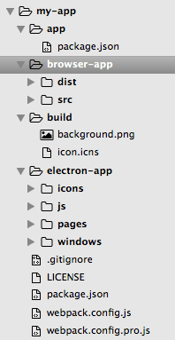
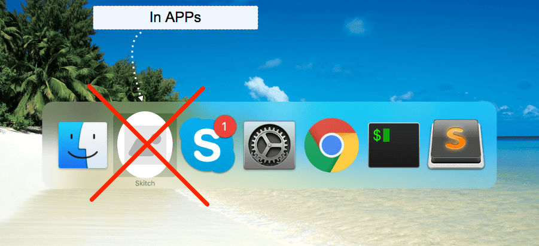

### Electron: if you can build a website, you can build a desktop app

Currently, in the <a href="https://anadea.info/services/web-development">custom web development services</a> we can do almost everything using HTML/CSS/JS. There are numerous libraries, frameworks, debugging and testing tools, articles, and training resources available for web application development. Additionally, StackOverflow provides quick access to answers and examples for many questions. For browsers, there are many extensions that can be used to follow, measure, and debug every aspect of a site, making it easier to create web applications quickly.

However, when it comes to building desktop applications, there are only a few libraries available that address GUI-related issues, such as _vxWidgets_, _QT_, and _Gtk_. While these libraries are sufficient, they may not be suitable for creating pixel-perfect or responsive designs, and redesigning them can be challenging.

Fortunately, Electron enables developers to harness the power of HTML, JS, and CSS to create native desktop applications.

> Electron is a relatively new library, developed by GitHub for Atom.io, that enables developers to leverage the power of web technologies and use them to develop desktop applications. How does it work? Well, Electron basically exposes a webkit environment through Chromium, the browser engine behind Google Chrome, and lets you write code to render your application.

__NOTE!__ The purpose of this article is not to introduce Electron. I will show how to create a simple application using Electron.

In this article I will explain:

1. How to implement a desktop application that contains a single HTML page.
2. Then, we will build an application that consists of three different windows (Main Window, About Window and Tray Window).
3. Next, I'll show you how to pack application into a `.DMG` archive. After unpacking this archive the app will work as a native app from the App Store.

For the final version of the project, I used the following technologies: *Electron*, *Electron Builder*, *React*, *Redux*, *Redux DevTools*, *Webpack*, *Rails-API*, and desktop features (*Notification* and *Update Tray*).

## Chapter 1: Structure of the app

First of all, make sure that you have already installed <a href="https://anadea.info/services/web-development/node-js-development">*NodeJs*</a> and *NPM*. In this example we will not use boilerplates for our app. Important notice: we will develop this electron desktop app only for Mac (setting up the app for *Linux* and *Windows* doesn't differ much but there are some tricky points).

### Structure of the project:

`electron-builder`, an npm package for building ready for distribution and "auto update" Electron apps, imposes some restrictions on the structure of the project:



1. `app` directory - only this directory is distributed with the real application. This directory also contains a separate `package.json` file. We will use this file to specify dependencies required for the app's operation. Besides, libraries from this file will be added to production version of the app (DMG file).
2. `build` directory - we will put `icon.icns` and `background.png` into this folder. These images will be used to customize the installation process for Mac platform.


3. `electron-app` directory - a directory for our electron app (electron setup files, HTML files with react-root element).
4. `browser-app` directory - a directory with our pure React app. We will divide this folder into two sub-folders: `dist` and `src`. Since we use `webpack`, we will apply `hot-reload`, `jsx`, etc., i.e. we will treat it like a common browser-based React application.

To begin, we need to update our `package.json` file:

```js
package.json
```

```js
{
 "name": "TimeTracker",
 "version": "0.0.1",
 "license": "MIT",
 "description": "App is based on Electron, React, Redux + Rails as a back end.",
 "author": "Dmytro Vasin <dmytro.vasin@gmail.com>",
 "scripts": {
  "electron": "electron ./electron-app/js/index.js",
 },
 "dependencies": {
  "electron-positioner": "^3.0.0",
 },
 "devDependencies": {
  "electron": "^1.3.4",
 }
}
```

And install two additional packages:

```js
npm install electron --save-dev
npm install electron-positioner --save-dev // Helps positioning your app windows.
```

Now we should run the next command to start our app:

```js
npm run electron
```

## Chapter 2: First desktop window

TODO:
1. Create the first window.
2. Add it to Tray.
3. Add a tray-like behavior to this window - we should hide it on blur, do not include it into Apps (Alt+Tab should not display it), do not display it in Dock.
4. Add an ability to close the app from this window.




Let's create file: `index.js` (entry point to our application).

```js
electron-app/js/index.js
```

```js
const electron = require('electron');
const {app, ipcMain} = electron;

// These are two custom classes that we created only for our comfort.
const TrayWindow = require('../windows/TrayWindow');
const TrayIcon = require('./TrayIcon');

let tray = null;
let trayIcon = null;

// We hide dock, because we do not want to show our app as common app. We want to display our app as a Tray-like app (like Dropbox, Skitch or ets).
app.dock.hide();

// This event will be emitted when Electron has finished initialization.
app.on('ready', function () {
 tray = new TrayWindow();
 trayIcon = new TrayIcon(tray.window);
})

// Custom event created to close the app from Tray Window.
// The ipcMain module is used to handle events from a renderer process (web page).

ipcMain.on('quit-app', function() {
 tray.window.close(); // Standart Event of the BrowserWindow object.
 app.quit(); // Standart event of the app - that will close our app.
});
```

```js
electron-app/windows/TrayWindow.js
```

```js
const path = require('path');
const { BrowserWindow } = require('electron');

class TrayWindow {
 constructor() {
  // Link to the HTML file that will render app window.
  let htmlPath = 'file://' + path.join(__dirname, '..') + '/pages/tray_page.html'

  // Creation of the new window.
  this.window = new BrowserWindow({
   show: false, // Initially, we should hide it, in such way we will remove blink-effect.
   height: 210,
   width: 225,
   frame: false, // This option will remove frame buttons. By default window has standart chrome header buttons (close, hide, minimize). We should change this option because we want to display our window like Tray Window not like common chrome-like window.
   backgroundColor: '#E4ECEF',
   resizable: false
  });

  this.window.loadURL(htmlPath);

  // Object BrowserWindow has a lot of standart events/
  // We will hide Tray Window on blur. To emulate standart behavior of the tray-like apps.
  this.window.on('blur', () => {
   this.window.hide();
  });
 }
}

module.exports = TrayWindow;
```

HTML file that we use to render TrayWindow:

```js
electron-app/pages/tray_page.html
```

```js
<!DOCTYPE html>
<html>
 <head>
  <script type='text/javascript'>
   // In such way we connect ipcRenderer to our page.
   window.ipcRenderer = require('electron').ipcRenderer;
   // The ipcRenderer module provides a few methods so you can send events from the render process (web page) to the main process.
  </script>
 </head>

 <!-- no-drag option makes our new window non-draggable -->
 <body style='-webkit-app-region: no-drag'>
  <button id='my-button'>X</button>

  <script type='text/javascript'>
   // On click we should send event to close window.
   document.getElementById("my-button").addEventListener("click", function (e) {
    ipcRenderer.send('quit-app');
   });
  </script>

 </body>
</html>
```

Add an icon of the app into `icons` folder. This icon will appear in the Tray.

```js
electron-app/icons/icon-22.png
```

```js
electron-app/js/TrayIcon.js
```

```js
const path = require('path');
const { BrowserWindow, Tray } = require('electron');
// Electron-positioner - npm package for positioning of the Tray Window. Our Tray Window should appear under the Tray icon.

const Positioner = require('electron-positioner');

class TrayIcon {
 constructor(trayWindow) {
  // Path to the app icon that will be displayed in the Tray (icon size: 22px)
  let iconPath = path.join(__dirname, '../icons/icon-22.png')

  this.trayIcon = new Tray(iconPath);
  this.trayIcon.setToolTip('Time Tracker'); // This tooltip will show up, when user hovers over our tray-icon.

  // By clicking on the icon we have to show TrayWindow and position it in the middle under the tray icon (initialy this window is hidden).

  this.trayIcon.on('click', (e, bounds) => {
   if ( trayWindow.isVisible() ) {
    trayWindow.hide();
   } else {
    let positioner = new Positioner(trayWindow);
    positioner.move('trayCenter', bounds)

    trayWindow.show();
   }
  });
 }
}

module.exports = TrayIcon;
```

Now we can launch our app:

```js
npm run electron
```

## Chapter 3: Dynamic tray

TODO:
1. Add dynamic changes to tray bar of the screen.

Let's add random words into the tray bar on button click.

We should add one more listener to HTML file:

```js
electron-app/pages/tray_page.html
```

```html
<!DOCTYPE html>
 ...
 <body style='-webkit-app-region: no-drag'>
  <button id='my-button'>X</button>
  <button id='my-second-button'>Set rundom!</button>

   <script type='text/javascript'>
   document.getElementById("my-button").addEventListener("click", function (e) {
    ipcRenderer.send('quit-app');
   });

   var textArray = ['First', 'Second', 'Third'];

   document.getElementById('my-second-button').addEventListener("click", function (e) {
    var randomIndex = Math.floor(Math.random() * textArray.length);
    var randomString = textArray[randomIndex];
    // On click we send event to Main Process (Index.js file) with a random string.
    ipcRenderer.send('update-title-tray-window-event', randomString);
   });
 </script>

 </body>
</html>
```

Add additional Event:

```js
electron-app/js/index.js
```

```js
ipcMain.on('update-title-tray-window-event', function(event, title) {
 trayIcon.updateTitle(title);
});
```

Now we should add `updateTitle` function that will update our tray bar:

```js
electron-app/js/TrayIcon.js
```

```js
class TrayIcon {
 constructor(trayWindow) {
  ...
 },

 updateTitle(title) {
  this.trayIcon.setTitle(title)
 }
}

module.exports = TrayIcon;
```

## Chapter 4: Mac notification

TODO:
1. Add `Windows Notification` caused by the app.
2. Add an ability to click on this notification.
3. When you click on this icon, it opens Tray Window.


> NOTE: In the development mode, icons of the app (that you can see in Dock panel) and icons of notifications (that you can see in Mac Notifications panel) will be set and displayed as Electron icons. But when you create/prebuild the app as production ready app or DMG file, all icons will change - our app will take icons from `/build/icon` folder.

Let's add one more button:

```js
electron-app/pages/tray_page.html
```

```js
<button id='notify'>Notify!</button>
```

And JS for it:

```js
electron-app/pages/tray_page.html
```

```js
document.getElementById("notify").addEventListener("click", function (e) {
 // Electron conveniently allows developers to send notifications with the HTML5 Notification API, using the currently running operating system’s native notification APIs to display it.

 let notif = new window.Notification( 'My First Notification', {
  body: 'Lorem ipsum dolor sit amet, consectetur adipisicing elit. Deleniti, maxime explicabo dolores tenetur'
 })

 // Also, we should add event handler for it. So, when user clicks on the notification our About window will show up.
 notif.onclick = function () {
  window.ipcRenderer.send('show-about-window-event')
 }
});
```

Add Event handler to the Main Process:

```js
electron-app/js/index.js
```

```js
ipcMain.on('show-about-window-event', function() {
 tray.window.show();
});
```

Now the app has the icon of the Electron. But after we create the real app the correct icon will be loaded as needed.

## Chapter 5: Second window (page)

TODO:

1. Create About Page.
2. Open another separate window (About Page) from the Tray Window.

To create a new page, we need to add the same initialization as we have for About Window to the Main Process (`index.js`).

```js
electron-app/js/index.js
```

```js
...
const AboutWindow = require('../windows/AboutWindow');
const TrayWindow = require('../windows/TrayWindow');

const TrayIcon = require('./TrayIcon');

...
let tray = null;
let trayIcon = null;
let about = null;
...

app.on('ready', function () {
 tray = new TrayWindow();
 about = new AboutWindow();

 trayIcon = new TrayIcon(tray.window);
})

ipcMain.on('quit-app', function() {
 ...
 about.window.close();
})

...
// Also, we should add new Event that will open a new window.
ipcMain.on('show-about-window-event', function() {
 about.window.show();
});
```

Let's create BrowserWindow. Initialization is the same as we already did for the Tray Window except a few small details:

```js
electron-app/windows/AboutWindow.js
```

```js
const path = require('path');
const { BrowserWindow } = require('electron');
// We will use the next module for apropriate positioning. We should display About page in the center of the screen.
const Positioner = require('electron-positioner');

class AboutWindow {
 constructor() {

  let htmlPath = 'file://' + path.join(__dirname, '..') + '/pages/about_page.html'

  this.window = new BrowserWindow({
   show: false,
   width: 300,
   height: 336,
   frame: false,
   backgroundColor: '#E4ECEF',
   // resizable: false
  })

  this.window.loadURL(htmlPath);

  // About Window will disappear in blur.
  this.window.on('blur', () => {
   this.window.hide();
  });

  // On show - we should display About Window in the center of the screen.
  this.window.on('show', () => {
   let positioner = new Positioner(this.window);
   positioner.move('center');
  });
 }
}

module.exports = AboutWindow;
```

Let's create HTML page for the About page:

```js
electron-app/pages/about_page.html
```

```html
<!DOCTYPE html>
<html>
 <head>
 </head>

 <body>
  <h1>ABOUT PAGE</h1>
 </body>
</html>
```

It remains to add a button for opening About Window to the Tray Window:

```html
<!DOCTYPE html>
<html>
 <head>
 ...
 </head>

 <body style='-webkit-app-region: no-drag'>
  ...
  <button id='about'>Open About</button>

  <script type='text/javascript'>
  ...
  document.getElementById("about").addEventListener("click", function (e) {
   ipcRenderer.send('show-about-window-event');
  });

 </script>
 </body>
</html>
```

Let's launch: `npm run electron`.

## Chapter 6: External link

TODO:
1. Open `External Link` from the About Window.

Let's add an ability to open external link in a default browser. All we need to do is to add one module:

```js
require('electron').shell
```

Also we should add a click handler. So, when user clicks on the link we take `href` of this element (in this particular case - `<a>` tag) and launch `shell.openExternal`.

```js
electron-app/pages/about_page.html
```

```html
<!DOCTYPE html>
<html>
 <head>
  <script type='text/javascript'>
   window.shell = require('electron').shell;
  </script>
 </head>

 <body>
  <h1>ABOUT PAGE</h1>
  <a id='open-external' href="https://github.com/DmytroVasin/">Open</button>

  <script type='text/javascript'>
   document.getElementById("open-external").addEventListener("click", function (e) {
    e.preventDefault();
    var remoteLink = this.getAttribute('href');
    shell.openExternal( remoteLink );
   });
  </script>
 </body>
</html>
```

That's all! We can launch `npm run electron` and check the result.

## Chapter 7: Custom windows action buttons

TODO:
1. Add an ability to close/hide/minimize/maximize our windows (pages).

Of course, you can simply use the standard buttons (behaviour) by adding the following line of code:

```js
electron-app/windows/AboutWindow.js
```

```js
...
this.window = new BrowserWindow({
 ...
 frame: true,
 ...
})
...
```

As a result, we will receive the next outcome:

However, this functionality does not suit us because it has a few drawbacks:
1. These keys are not very easy to customize.
2. We can't change design of these buttons.
3. We can't add an additional button or field (for example, a search field to the header).
4. The behavior of these keys is strictly declared. By clicking on the close button, we'll get `destroy` of the window (which is unacceptable in our case because, for more rapid opening, we will simply hide pages/windows).

Let's remove this line of code `frame: true` and do a custom implementation of these buttons:

We should add three new buttons and add three new events to them. Besides, let's add a `draggable` zone to emulate a default header.

```js
electron-app/pages/about_page.html
```

```html
<!DOCTYPE html>
<html>
 <head>
  <script type='text/javascript'>
   window.shell = require('electron').shell;
   // Add remote module - because we will use main process modules from the renderer process.
   window.remote = require('electron').remote;
  </script>
 </head>

 // Make this page fully undraggable.
 <body style='-webkit-app-region: no-drag'>
  <style type="text/css">
   #header {
    // Make only header is draggable
    -webkit-user-select: none;
    -webkit-app-region: drag;

    background-color: blue;
   }
  </style>

  <div id='header'>
   <button id='close'>X</button>
   <button id='hide'>-</button>
   <button id='maximize'><></button>
  </div>
  ...

  <script type='text/javascript'>
   ...
   document.getElementById("close").addEventListener("click", function (e) {
    // We are trying to emulate native behavior, so we should hide the window (we should hide it in doc-bar too).
    remote.app.dock.hide();
    // getCurrentWindow - Returns the BrowserWindow object to which this web page belongs.
    remote.getCurrentWindow().hide();
   });

   document.getElementById("hide").addEventListener("click", function (e) {
    // Emulate minimize to tray effect.
    remote.getCurrentWindow().minimize();
   });

   document.getElementById("maximize").addEventListener("click", function (e) {
    // Emulate maximize-minimize effect
    if (remote.getCurrentWindow().isMaximized()) {
     remote.getCurrentWindow().unmaximize();
    } else {
     remote.getCurrentWindow().maximize();
    }
   })
  </script>
 </body>
</html>
```

## Chapter 8: Navigation/Menu bar

TODO:
1. Create Menu bar.

As you may have noticed, when you open the About Window our Menu does not appear.

Let's create the Menu and add the following options: Copy, Paste, Open link (Github) and Open page About.

We will create our Menu only for the specific page (Main Page). We do not want to show Menu bar when the user opens Tray Window.

Let's create Main page (in the same way as About/Tray page):

```js
electron-app/js/index.js
```

```js
 ...
 const MainWindow = require('../windows/MainWindow');
 const menuTemplate = require('./menuTemplate');
 ...
 // Extract Menu module from electron
 const {app, ipcMain, Menu} = electron;
 ...
 let main = null;
 ...
 app.on('ready', function () {
  ...
  main = new MainWindow();
  // We will create menu based on template
  // menuTemplate - is just a function that returns array (that is just extracted into separate file)
  Menu.setApplicationMenu( Menu.buildFromTemplate( menuTemplate() ));
  ...
 })

 ipcMain.on('quit-app', function() {
  ...
  main.window.close();
 })

 // Let's add event that will open our main page (from Tray Window).
 ipcMain.on('show-main-window-event', function() {
  main.window.show();
  app.dock.show(); // Do not forget to show dock - because only with dock menu will appear.
 });
```

```js
electron-app/js/menuTemplate.js
```

```js
const electron = require('electron');

const {app, shell, ipcMain} = electron;

let menuTemplate = function() {
 return [
  {
   label: 'Application',
   submenu: [
    {
     label: 'Quit', accelerator: 'Command+Q',
     click: function () {
      app.quit() // This is a standart function to quit app.
     }
    }
   ]
  },
  {
   label: 'View',
   submenu: [
    {
     label: 'About App',
     click: function () {
      ipcMain.emit('show-about-window-event') // In such way we can trigger function in the main process.
     }
    },
    {
     label: 'Reload', accelerator: 'CmdOrCtrl+R',
     click: function (item, focusedWindow) {
      focusedWindow.reload(); // reload the page
     }
    }
   ]
  },
  {
   label: 'Edit',
   submenu: [
    { label: 'Undo', accelerator: 'CmdOrCtrl+Z', selector: 'undo:' },
    { label: 'Redo', accelerator: 'Shift+CmdOrCtrl+Z', selector: 'redo:' },
    { type: 'separator' },
    { label: 'Cut', accelerator: 'CmdOrCtrl+X', selector: 'cut:' },
    { label: 'Copy', accelerator: 'CmdOrCtrl+C', selector: 'copy:' },
    { label: 'Paste', accelerator: 'CmdOrCtrl+V', selector: 'paste:' },
    { label: 'Select All', accelerator: 'CmdOrCtrl+A', selector: 'selectAll:' }
   ]
  },
  {
   label: 'Help',
   submenu: [
    {
     label: 'View Licence',
     click: function() {
      shell.openExternal('https://github.com/DmytroVasin/TimeTracker/blob/master/LICENSE');
     }
    },
    { type: 'separator' },
    { label: 'Version 1.0.0-alpha.6', enabled: 'FALSE' }
   ]
  }
 ]
}

module.exports = menuTemplate
```

Let's add buttons for showing our Main page to the Tray Window:

```html
<!DOCTYPE html>
<html>
 <head>
 ...
 </head>

 <body>
  ...
  <button id='main'>Open Main</button>

  <script type='text/javascript'>
   ...
   document.getElementById("main").addEventListener("click", function (e) {
    ipcRenderer.send('show-main-window-event');
   });
  </script>
 </body>
</html>
```

MainWindow doesn't contain anything new:

```js
electron-app/windows/MainWindow.js
```

```js
const path = require('path');
const { BrowserWindow } = require('electron');

class MainWindow {
 constructor() {
  let htmlPath = 'file://' + path.join(__dirname, '..') + '/pages/main_page.html'

  this.window = new BrowserWindow({
   show: false,
   width: 400,
   height: 400,
   frame: false,
   minWidth: 800,
   minHeight: 600,
   backgroundColor: '#E4ECEF',
  })

  this.window.loadURL(htmlPath);
 }
}

module.exports = MainWindow;
```

```js
electron-app/pages/main_page.html
```

```html
<!DOCTYPE html>
<html>
 <head>
 </head>

 <body>
  MAIN APP PAGE
 </body>
</html>
```

Let's run `npm run electron` and we will see the next result:

Do not worry about icon (inside the dock bar) and name of the app (inside Menu). When we build our app as a packaged version they will be changed.

## Chapter 9: Debug

TODO:
1. Add Devtools
2. RactDevtools
3. ReduxDevtools

At this point, we have pages that contain `HTML/JS/CSS`. Now, we will connect `Chrome Debug tools`.

First of all, I will show you how to open `Devtools` on any page.

Let's add a key-binding to our app to open devtools (F12). We will put this key-binding into our Menu. Do not worry, Menu will work even if you hide it (or hide dock).

```js
electron-app/js/menuTemplate.js
```

```js
 ...
 {
  label: 'View',
  submenu: [
   {
    label: 'About App',
    click: function () {
     ipcMain.emit('show-about-window-event')
    }
   },
   {
    label: 'Toggle Developer Tools', accelerator: 'F12',
    click: function (item, focusedWindow) {
     focusedWindow.webContents.toggleDevTools();
    }
   },
   {
    label: 'Reload', accelerator: 'CmdOrCtrl+R',
    click: function (item, focusedWindow) {
     focusedWindow.reload();
    }
   }
  ]
 },
 ...
```

Now, when `F12` key is pressed Chrome devtools will show up on any active window.

However, what should we do when we want to use `React` or `Redux`? How can we add `RactDevtools`/`ReduxDevtools`? To use additional extensions, we should install:

`npm install electron-devtools-installer --save-dev` (my current version is '2.0.1')

This npm package will help us.

```js
package.json
```

```js
{
 "devDependencies": {
   "electron-devtools-installer": "^2.0.1",
 }
}
```

Then, we should update MainProcess file:

> "isDev" - was set in `pacakage.json`: `'electron': 'NODE_ENV=development electron ./electron-app/js/index.js'`

```js
electron-app/js/index.js
```

```js
const isDev = (process.env.NODE_ENV === 'development');

let installExtension = null;
if ( isDev ) {
 installExtension = require('electron-devtools-installer');
}

...
app.on('ready', function () {
 // If Now is dev env - let's call install extentions function:
 if ( isDev ) installExtentions();
 ...
})
...

// This is some kind of tricky way to install it, but this is caused by npm pacakage as this pacakage uses ES6 which we do not use for electron.

const installExtentions = function () {
 // If you use some unusual devtools ext. You should specify its ID here.
 installExtension['default']( installExtension['REDUX_DEVTOOLS'] )
 installExtension['default']( installExtension['REACT_DEVELOPER_TOOLS'] )
}
```

Also, do not forget to specify `resizable: true` option.

Then let's launch: `npm run electron`.

## Chapter 10: Package. Creation of DMG.

TODO:
1. Create `DMG` package.

Now we have to turn our code (files) into a `DMG` package so that everyone could download our app.

```js
package.json
```

```js
{
 "name": "TimeTracker",
 "version": "0.0.1",
 "license": "MIT",
 "description": "App is based on Electron, React, Redux + Rails as a back end.",
 "author": "Dmytro Vasin <dmytro.vasin@gmail.com>",
 "repository": {
  "type": "git",
  "url": "https://github.com/DmytroVasin/TimeTracker.git"
 },
 "scripts": {
  "electron": "NODE_ENV=development electron ./electron-app/js/index.js",
  "postinstall": "install-app-deps",
  "publish:electron": "cp -R electron-app/ app/electron-app/",
  "publish:osx": "build --x64",
  "publish:dist": "npm run publish:electron && npm run publish:osx"
 },
 "dependencies": {
  "electron-positioner": "^3.0.0",
  "webpack-node-externals": "^1.4.3"
 },
 "devDependencies": {
  "electron": "^1.3.6",
  "electron-builder": "^6.7.6",
  "electron-devtools-installer": "^2.0.1",
  "webpack": "^1.13.1"
 },
 "build": {
  "asar": false,
  "appId": "hr.creaticon.eatodo",
  "category": "public.app-category.productivity",
  "dmg": {
   "title": "Time Tracker Installation",
   "contents": [
    {
     "x": 410,
     "y": 125,
     "type": "link",
     "path": "/Applications"
    },
    {
     "x": 130,
     "y": 125,
     "type": "file"
    }
   ]
  }
 }
}
```

Let's go over several lines of code from this file:
1. `install-app-deps` - this line allows us to use several `pacakage.json` files.
2. `publish:electron` - this command simply copies files from root directory to `app/` (app directory should only contain files that should be in `dmg` package).
3. `publish:osx` - by this command we specify which platform/architecture our compiled app should be generated for.
4. `build` - this is a standard block of specification for `electron-packager` (to be more accurate this is a specification for `npm appdmg` package).
5. `asar` - this option is used to specify if we should pack (compress) our files.

Let's specify libs which are necessary for our app:

```js
app/package.json
```

```js
{
 "name": "TimeTracker",
 "version": "0.0.1",
 "license": "MIT",
 "description": "App is based on Electron, React, Redux + Rails as a back end.",
 "author": "Dmytro Vasin <dmytro.vasin@gmail.com>",
 "main": "electron-app/js/index.js",
 "dependencies": {
  "electron-positioner": "^3.0.0",
 }
}
```

Here is the most interesting line of code from this file:
1. `'main': 'electron-app/js/index.js'` - this line is entry point of our app.
2. `npm install` - launching this command will produce two folders `node_modules` in `root/` and `app/` directories.
3. Into `build/` directory, you should put two icons `icon.icns` and `background.png` for Mac. These files will be used by `electron-packager` to create custom `dmg` package:

```js
background.png ( 512/320 )
icon.icns ( 256/256 )
```

Run the next command: `npm run publish:dist`.

After executing it, `/dist` directory will appear in our root folder. In this directory you will find `.dmg` file for installing the app (there you will also find our totally working app).

As we have specified `asar: false` we can see all our source files inside the app.

## Chapter 11: Add React/Redux

TODO:
1. Wrap our app into React/Redux/Webpack/webpack-dev-server.

I will explain only basic (tricky) moments. I will not show you all react page because it will take too much time.

Key points:
1. All pages (Main, About, Tray) were wrapped up into `React`. About and Tray pages are very simple but I have already set up webpack and do not want to use pure JS on one page (about_page.html) and JSX on another (main_app_page.html).
2. Currently, to start development, you should launch two commands instead of one:
`npm run electron` - to launch electron app; `npm run browser` - to launch webpack in live-reloading mode.
3. For `electron-app`, I didn't use webpack because setting and launching webpack takes a lot of time and requires many lines of code.
4. Applying live-reloading for React/Redux led to the following: HTML files look a bit more complicated but now they contain only react-root element with compiled.js (live-reloading) file.
5. Also, Header component was reused on two different pages- Main page and About page.

### Window action buttons

Here are the updated commands to launch and build:

```js
package.json
```

```js
 ...
 "scripts": {
  "clean": "rm -rf app/electron-app/ && rm -rf app/browser-app/ && rm -rf dist/",
  "browser": "NODE_ENV=development webpack-dev-server --config webpack.config.js --hot --inline",
  "electron": "NODE_ENV=development electron ./electron-app/js/index.js",
  "postinstall": "install-app-deps",
  "publish:browser": "webpack --config webpack.config.pro.js",
  "publish:electron": "cp -R electron-app/ app/electron-app/",
  "publish:osx": "build --x64",
  "publish:dist": "npm run clean && npm run publish:browser && npm run publish:electron && npm run publish:osx"
 },
 ...
```

```js
electron-app/pages/about_page.html
```

```html
<!DOCTYPE html>
<html>
 <head>
  <script type='text/javascript'>
   window.remote = require('electron').remote;
   window.shell = require('electron').shell;
  </script>
 </head>

 <body>
  <div id='react-root'></div>


  <script>
   var bundlePath = '../../browser-app/dist/js/about.js';

   if (process.env.NODE_ENV === 'development') {
    bundlePath = 'http://localhost:8080/browser-app/dist/js/about.js';
   }

   var js_script = document.createElement('script');
   js_script.src = bundlePath;
   js_script.async = true;
   document.body.appendChild(js_script);
  </script>
 </body>
</html>
```

## Chapter 12: Links

Github links:

>Branch without React: `live-coding`

1. [Time Tracker App](https://github.com/DmytroVasin/TimeTracker) based on Electron
2. [Rails API](https://github.com/DmytroVasin/TimeTrakerAPI) that was used in final app

Keep reading our blog for more helpful tips!
