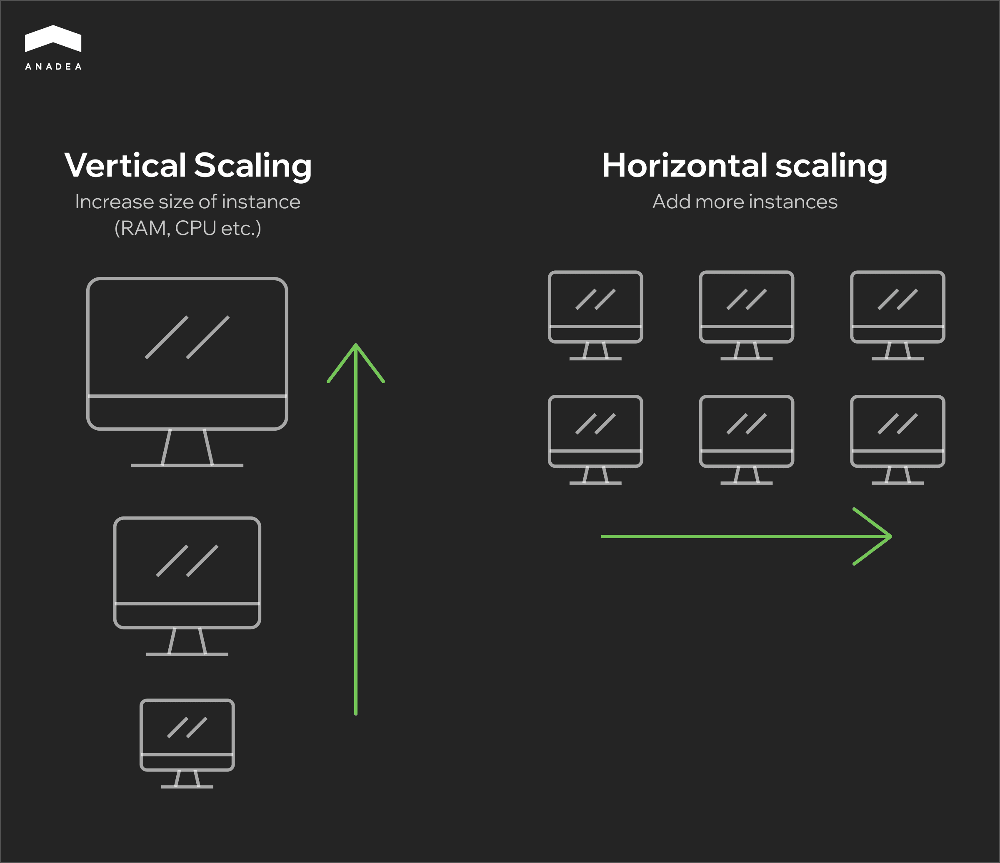
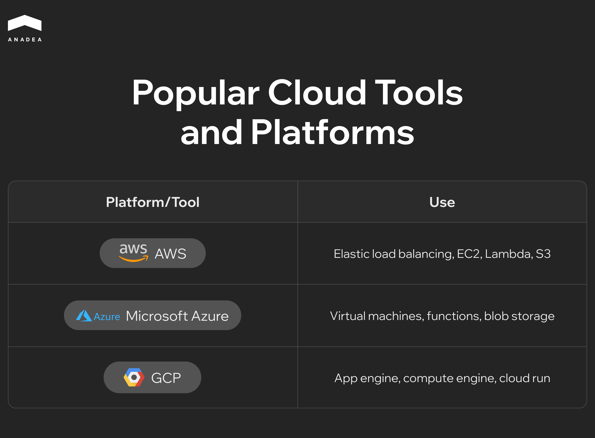
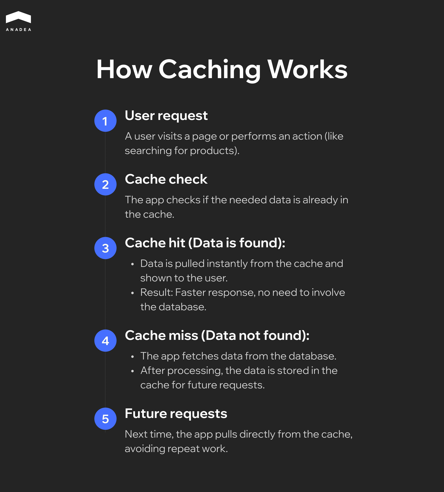

When a web application starts to grow, keeping it fast and stable isn’t as easy as it seems. By 2025, users won’t wait around – even the slightest slowdown can send them elsewhere. [Nearly 88% of users leave and don’t return](https://www.forbes.com/advisor/business/software/website-statistics/#sources_section:~:text=22.%2088%25%20of,and%20repeat%20visits.) after a bad experience.

On top of that, the [average person spends just 54 seconds on a page](https://www.forbes.com/advisor/business/software/website-statistics/#sources_section:~:text=19.%20The%20average,the%20user%20experience.). If your app isn’t ready to handle traffic spikes or new features, you might lose users before they even get a chance to engage.

This article answers what is scalable web application and outlines the key steps to ensure your app stays quick and dependable as traffic grows. Learn how to build scalable web applications that handle increasing demand with ease.

## What Is Scalable Web Application and Why It Matter

Scalability in [web development](https://anadea.info/services/web-development) is the ability of an application to handle an increasing number of users, data, and requests without compromising performance or reliability. In other words, it’s how well an app can grow and manage higher traffic or workloads by efficiently utilizing additional resources.

There are two main ways to achieve this. Vertical scaling means upgrading the existing server by adding more power (RAM, CPU). It’s simple but has limits. Horizontal scaling involves adding more servers to share the load, making it more reliable and flexible, but also more complex.

Most apps start with vertical scaling, but as demand grows, horizontal scaling becomes essential to keep performance steady.

When scalability is ignored, problems start to pile up quickly. Pages load slower, downtime becomes more frequent, and adding new features feels like trying to balance a house of cards. In today’s competitive market, where user patience is razor-thin, these issues can directly translate to lost opportunities.

### Why Scalability Can’t Be Overlooked

Understanding how to build scalable web applications is crucial for online businesses because scalability directly impacts customer satisfaction, retention, and revenue. Users today have no patience for laggy or unreliable apps. If an application struggles to perform under pressure, users will leave – often for good. More importantly, downtime or performance issues during critical moments, like product launches or sales events, can significantly harm a company’s reputation.

From a technical perspective, scalability does more than prevent outages. It provides a framework for continuous development and innovation. When an app scales effectively, developers can add new features, expand services, and manage higher traffic loads without worrying that these changes will destabilize the system. This kind of flexibility is invaluable for businesses looking to stay competitive in rapidly evolving markets.

### What Makes an Application Scalable?

Scalable applications are the result of thoughtful design and strategic decisions. While the exact implementation can vary depending on the app’s purpose and audience, certain principles hold true across the board:

#### Distributed Architecture

Instead of relying on a single server or resource, scalable apps distribute workloads across multiple machines or instances. This prevents bottlenecks and allows different parts of the system to expand independently.

#### Caching

By storing frequently requested data closer to the user, caching reduces the load on databases and speeds up response times. This is a simple but highly effective way to improve performance under heavy traffic.

#### Load Balancing 

Load balancers evenly distribute incoming traffic across multiple servers, preventing any one server from becoming overwhelmed. This is essential for maintaining stability during traffic surges.

#### Microservices 

Rather than functioning as a single, monolithic application, scalable systems are often broken into smaller, independent services that can scale individually. This allows specific components to handle increased demand without requiring the entire app to grow.

### When Should You Think About Scalability?

Scalability should be a consideration from the very beginning of development. Designing with scalability in mind simplifies growth down the line, making it easier to introduce new features or accommodate higher user numbers. However, for applications that are already live, scalability can still be addressed through incremental improvements.

Some effective strategies for improving scalability in existing applications include:

* *Migrating to the cloud* – Cloud providers offer flexible infrastructure that can scale up or down based on demand.
* *Implementing containerization* – Technologies like Docker and Kubernetes make it easier to manage and scale applications by breaking them into containers that can be deployed independently.
* *Decoupling services* – Transitioning to a microservices architecture allows teams to scale individual parts of an app without overhauling the entire system.

By building with scalability in mind, you create an app that can handle whatever comes next.

Curious about the future of mobile apps? Check out our article on <a href="https://anadea.info/blog/progressive-web-apps/">how progressive web applications are transforming the mobile industry </a> and what it means for your business.

## Choosing the Right Architecture: Monolith vs. Microservices

What is scalable web application architecture? The architecture you choose directly impacts performance and scalability. Discover how monolithic and microservices approaches shape your app’s ability to grow and handle increased traffic efficiently.

### Monolithic Architecture

A monolithic application is built as a single, unified unit. All components – from the user interface to the business logic and database interactions – are tightly integrated and run as one service. To build scalable web applications, it’s often better to break this structure into smaller, independent parts. This makes it easier to update, expand, and handle more users as your app grows.

Pros of monolithic architecture:

* *Simplicity*. Easier to develop, deploy, and manage in the early stages.
* *Performance*. Communication between components is faster since everything is housed within one process.
* *Ease of testing*. Testing the entire system can be done with fewer tools and less complexity.

Cons of monolithic architecture:

* *Scaling limitations*. Vertical scaling (adding more power to a single server) is often the only option, which can become expensive.
* *Deployment risks*. A single error can bring down the entire application.
* *Rigid structure*. Difficult to introduce new technologies or features without affecting the entire system.

### Microservices Architecture

In a microservices architecture, the application is divided into smaller, independent services. Each service handles a specific function and communicates with others through APIs.

Pros of microservices:

* *Scalability*. Each service can scale independently, allowing for more efficient use of resources.
* *Flexibility*. Teams can use different programming languages, frameworks, and technologies for different services.
* *Fault isolation*. A failure in one microservice doesn’t necessarily affect the entire application.

Cons of microservices:

* *Complexity*. Requires more effort to design, deploy, and manage multiple services.
* *Latency*. Communication between services over the network can introduce delays.
* *Testing challenges*. Testing the entire system requires coordination across multiple services.

### Comparison Table: Monolith vs. Microservices

<table>
<thead>
<tr>
<th>

Aspect

</th>
<th>

Monolithic Architecture

</th>
<th>

Microservices Architecture

</th>
</tr>
</thead>
<tbody>
<tr>
<td>

Scalability

</td>
<td>

Vertical scaling

</td>
<td>

Horizontal scaling by individual services

</td>
</tr>
<tr>
<td>

Deployment

</td>
<td>

Single deployment

</td>
<td>

Independent deployment per service

</td>
</tr>
<tr>
<td>

Fault tolerance

</td>
<td>

One failure affects the entire app

</td>
<td>

Failures are isolated to specific services

</td>
</tr>
<tr>
<td>

Development speed

</td>
<td>

Faster at the beginning

</td>
<td>

Slower initial setup, faster long-term growth

</td>
</tr>
<tr>
<td>

Technology stack

</td>
<td>

Unified across the app

</td>
<td>

Flexible per service

</td>
</tr>
<tr>
<td>

Maintenance

</td>
<td>

More challenging as the app grows

</td>
<td>

Easier to update and maintain specific parts

</td>
</tr>
<tr>
<td>

Cost

</td>
<td>

Lower initial cost

</td>
<td>

Higher initial cost but cost-effective long-term

</td>
</tr>
</tbody>
</table>

When learning how to build scalable web applications, starting with a monolithic architecture works well for smaller projects. But as the app grows and becomes more complex, switching to microservices can make scaling easier. A common approach is to begin with a monolith and gradually break it into microservices as the need for scalability increases. This way, you avoid unnecessary complexity early on while keeping future growth in mind.

Not sure where to start? Anadea offers <a href="https://anadea.info/services/consulting-and-audit">consulting and audits</a> to find issues and guide you on the best way to scale your app.

## Why the Cloud Is the Future of Scalability

Figuring out how to build scalable web applications used to be a hassle – adding servers when traffic spiked and wasting money when it dropped. With the cloud, that’s no longer a problem. It lets you scale up or down as needed, making everything faster, easier, and cheaper.

The biggest advantage of the cloud is how easily it adapts to your needs. When more users flood in, the cloud automatically scales up. When things quiet down, resources scale back – no manual work required. This elasticity means your app stays responsive, and you’re not wasting money on unused capacity.

Here’s why the cloud is the go-to solution for scalability:

* *Instant flexibility*. You can increase or decrease resources in real time without touching hardware.
* *Cost control*. You pay only for what you use, which eliminates the need for expensive upfront investments.
* *Global reach*. Cloud providers have data centers around the world, ensuring your app stays fast no matter where users are.
* *Built-in redundancy*. If one part of the system fails, the load shifts elsewhere, minimizing downtime.

### How the Cloud Handles Scaling

#### Step 1: Vertical Scaling (Scaling Up)

Adds more power (CPU, RAM) to your existing servers. It’s simple but limited – there’s only so much you can add before hitting a cap.

#### Step 2: Horizontal Scaling (Scaling Out)

Adds more servers to handle the load to build scalable web applications. This approach can scale infinitely and is perfect for apps with growing or fluctuating traffic.

#### Step 3: Auto-Scaling

Resources automatically expand or contract based on current traffic. Ideal for apps that experience sudden spikes – for example, during promotions or seasonal events.

#### Step 4: Serverless Computing

No need to manage servers at all. The cloud provider takes care of everything, and you’re billed only for actual usage. Great for small services or applications that don’t require constant operation.

### Cloud Tools That Make Scaling Easier

Several platforms and tools dominate the cloud space, making it easier to scale without constant oversight. Some of the most widely used include:

Cloud solutions ensure your scalable web application grows with your business while keeping costs under control and performance rock solid.

## Microservices and Containerization: Scaling Web Applications Effectively

Scaling a web application is no longer just about adding more servers. So, what is scalable web application today? It’s an app designed to grow easily without needing constant rebuilds. As user demands increase, businesses need smarter ways to expand. Microservices and containerization help by breaking apps into smaller parts that can scale independently, keeping everything running smoothly.

### Microservices: Scaling Piece by Piece

To build scalable web applications, microservices split the app into smaller services that handle specific tasks, like user accounts or payments. Each part runs independently and communicates through APIs, making it easier to grow and update without affecting the entire system.

How microservices help with scaling:

* *Selective scaling*. If one part of the application experiences high traffic (e.g., checkout during sales), you can scale just that service without affecting the rest of the app.
* *F*aster updates. Microservices can be updated or redeployed individually, reducing downtime and minimizing the risk of breaking the entire application.
* *Resilience*. If one service fails, it doesn’t crash the whole app. For example, if the notification service goes offline, checkout and payments continue to function.

Example:

Imagine running an online marketplace. The product catalog, search, and checkout each run as separate microservices. During a Black Friday event, the checkout service may need to scale significantly. Instead of scaling the whole app, additional instances of the checkout service can be deployed, ensuring a smooth customer experience without unnecessary resource consumption elsewhere.

### Containerization: Consistent and Fast Deployment

Containerization ensures that microservices – or even monolithic apps – run reliably across different environments. A container packages everything a service needs to run (code, runtime, dependencies) into a lightweight, portable unit. This guarantees the service behaves the same way whether it’s running on a developer’s laptop, a test server, or in production.

How containers support scalability:

* *Rapid deployment*. Containers start quickly, allowing applications to scale almost instantly during traffic surges.
* *Consistency*. Since containers include all dependencies, there are no "it works on my machine" issues – the app runs the same everywhere.
* *Resource efficiency*. Containers share the host operating system, making them far more lightweight than virtual machines. This means more services can run on the same infrastructure.
* *Isolation*. Containers keep services isolated, preventing conflicts between different parts of the application.

Example:

Let’s go back to the online marketplace. The checkout microservice can be packaged into a container. When traffic increases, Kubernetes (a container orchestration tool) can spin up more containers of that checkout service automatically. Once traffic decreases, it scales down, optimizing resource use.

### Why Microservices and Containers Work So Well Together

While microservices handle the architecture by breaking the app into smaller pieces, containers handle the deployment by packaging those pieces in a consistent, scalable way.

* Microservices allow selective scaling and faster development.
* Containers ensure those services can be deployed and run consistently anywhere.

Think of microservices as modular pieces of LEGO and containers as the box that holds them together. What is scalable web application in this context? It’s one where these pieces can be deployed anywhere, and the container ensures everything stays organized and ready to work. This keeps the app flexible and easy to scale.

#### Real-World Example: Streaming Services

Take [Netflix](https://www.netflix.com/) as an example. Their platform relies heavily on microservices – one for recommendations, another for video playback, and yet another for account management. Each service scales independently based on demand. Video playback services scale aggressively during peak hours, while account management might not need to scale as much. All of these microservices run in containers, ensuring seamless deployment across Netflix’s global infrastructure.

So, when to consider microservices and containers?

1. *Growing user base*. If your app is experiencing rapid growth, microservices allow you to scale parts of the app without unnecessary overhead.
2. *Complex applications*. If your app has many features that operate separately (like dashboards, messaging, or payments), microservices simplify scaling and updates.
3. *Frequent deployments*. If you push updates regularly, containers minimize deployment risks and ensure consistency.
4. *Fluctuating traffic*. Apps that experience unpredictable spikes in user activity (e.g., ticketing platforms or online retailers) benefit significantly from auto-scaling containerized services.

To build scalable web applications, microservices break the app into smaller parts that can grow on their own, and containerization makes sure they run smoothly anywhere. Together, they help your app handle more users and new features without unnecessary hassle.

## Caching: How It Keeps Your App Fast and Efficient

When web apps handle more users, they can slow down. What is scalable web application? Caching is one of the simplest and most effective ways to keep things running smoothly by reducing the need to repeatedly fetch the same data.

### How Caching Works 

Caching is like saving a copy of frequently used information in a quick-access spot. Instead of recalculating or fetching data from the database every time, the app retrieves it from the cache, significantly speeding things up.

Where cached data is stored?

* *Memory (RAM)*: Extremely fast but limited. Ideal for high-priority data (API calls, sessions).
* *Dedicated cache services*: Tools like Redis or Memcached are designed to handle large volumes of cached data efficiently.
* *Browser cache*: Static files (images, scripts) are saved directly in the user’s browser, speeding up page reloads.

Example:

Imagine an online store’s homepage. Without caching, every visitor triggers fresh database queries. With caching, the homepage data is saved after the first load and served instantly to the next visitors. This not only speeds up the site but also reduces server workload.

So, why caching is essential for scalability?

* *Faster load times*: Pages and data load instantly, even under heavy traffic.
* *Reduced server load*: Databases and backends handle fewer requests, freeing up resources.
* *Cost-effective*: By offloading repetitive tasks to the cache, you extend the life of existing infrastructure without expensive upgrades.
* *Better user experience*: Faster response times keep users engaged and less likely to leave.

Caching makes your app smarter by remembering frequently used data. This allows your application to stay fast, efficient, and ready to handle more users without overburdening your servers.

## Database Scaling: Best Practices and Choosing Between SQL and NoSQL

When thinking about how to build scalable web applications, scaling the database is key as your app grows. The best way to do it depends on your app’s workload and the architecture you’re using. Choosing the right approach early can save time and keep performance steady as traffic increases.

As already mentioned, *vertical scaling* means adding more power to your existing server – more CPU, RAM, or storage. It’s the simplest option but limited by hardware capacity. *Horizontal scaling (sharding)*, on the other hand, splits data across multiple servers, allowing for nearly unlimited growth. This approach is common for applications that handle large amounts of data or unpredictable traffic spikes.

Another important method is *replication*. By creating multiple copies of your database, you can distribute read requests, reducing the load on the main server. For write-heavy applications, this can improve performance significantly. To go even further, adding *caching* (using tools like [Redis](https://redis.io/) or [Memcached](https://memcached.org/)) stores frequently accessed data in memory, cutting down the need to hit the database at all. For large datasets, *partitioning* tables into smaller sections ensures faster queries by narrowing the amount of data scanned.

When choosing between SQL and NoSQL, the nature of your data plays a key role.

* SQL databases (PostgreSQL, MySQL) are great for structured data and applications where data integrity and complex relationships are crucial. They work well for financial apps, transactional systems, and reporting tools.
* NoSQL databases (MongoDB, Cassandra) shine in environments where data structures change frequently or scale rapidly. These are ideal for social networks, big data projects, and apps with large, distributed datasets.

If your app needs both structured and unstructured data, combining SQL and NoSQL solutions is often the best route. This hybrid approach lets you take advantage of SQL’s reliability while leveraging NoSQL’s flexibility for scale.

Thinking about developing a wellness app? Read our guide on <a href="https://anadea.info/blog/wellness-app-development/">how to create a wellness application</a> that stands out and leads the market.

## Future Trends in Scalability

Scalability is evolving beyond just handling more traffic – now it’s about making applications smarter, faster, and more efficient. As technology advances, the focus is shifting toward automation, distributed computing, and reducing operational complexity.

One of the biggest trends is *serverless architecture*. It allows applications to scale automatically without developers needing to manage the underlying infrastructure. Instead of provisioning servers or worrying about load balancing, cloud providers handle everything. This means your app can scale up instantly when traffic spikes and scale down during quieter times, cutting costs and reducing overhead.

Another growing trend is *edge computing* – moving processing power closer to users instead of relying on distant data centers. This reduces latency, speeds up response times, and ensures applications remain responsive even during heavy loads. For global apps, this means better performance for users no matter where they are.

*AI-driven scaling* is also gaining traction. Machine learning models can predict traffic surges and allocate resources ahead of time. Instead of reacting to problems as they arise, apps will be able to anticipate demand and stay ahead of performance bottlenecks.

A study titled “[Serverless Edge Computing — Where We Are and What Lies Ahead](https://ieeexplore.ieee.org/document/10122638)” highlights how serverless and edge computing are shaping the future of scalable applications. It emphasizes how combining these technologies helps applications handle larger workloads while remaining efficient and resilient.

Scalability is moving toward automation and decentralization. By embracing serverless computing, edge technologies, and AI-driven solutions, businesses can ensure their applications grow efficiently without unnecessary complexity.

## Conclusion

Scalable web applications are the foundation of growth and long-term success. By focusing on the right architecture, cloud solutions, and smart scaling strategies, your app can handle increasing traffic and new features without performance drops. If you’re ready to build or scale your application, let’s collaborate to create a solution that grows with your business.
