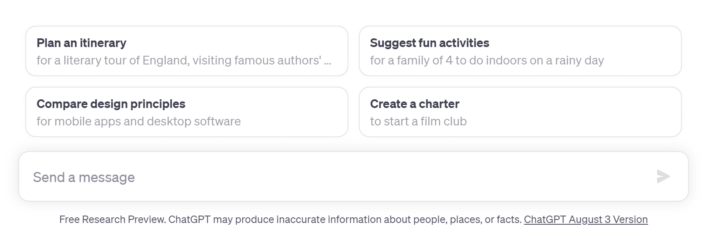
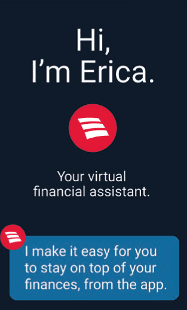

After the introduction of **ChatGPT** by OpenAI in November 2022, it may seem that absolutely anyone is talking about artificial intelligence today. But while some people are expressing their concerns about the risks of losing jobs because of AI, others are looking for ways to use the capacities of AI in their own interests. AI and ML are technologies that have enormous potential to change the world, including the business landscape. We strongly believe that modern companies shouldn't lose their chance to lead the market competition by using the new opportunities that advanced solutions can offer.

In this article, we offer you to dive deeper into the topic of chatbot development, have a look at the key tasks that you have if you want to build one, and consider some practical tips based on our experience.

## What is a chatbot?

Before proceeding directly to recommendations on how to create a chatbot, let's focus on basic information about this type of software.

In a very broad meaning, a chatbot can be defined as a computer program that is able to mimic a human way of leading conversations to address queries received from customers. As a rule, modern chatbots work online and rely on artificial intelligence. But it's crucial to understand that the first chatbots that were significantly less efficient and were not enriched with deep learning capacities were introduced decades ago.

The first chatbot that was ever developed was [ELIZA](https://en.wikipedia.org/wiki/ELIZA). It was introduced at MIT (Massachusetts Institute of Technology) in the mid-1960s. It was created with the aim of exploring ways to ensure communication between machines and humans and was able to simulate conversation by utilizing a substitution and pattern-matching methodology. As a result, users could leverage the illusion that the program understood them.

But technologies are constantly moving forward and today conversational AI-powered chatbots are more used in many industries as they are considered to be more efficient than rule-based apps.

## Why AI chatbots?

AI can really understand human language and learn from all the queries. Rule-based programs just have particular protocols and can react to set identifiers and keywords. AI-powered tools are able to generate unique responses based on the received questions, while rule-based chatbots can only provide those answers that were prepared beforehand. As a result, such answers may not fully correspond to user input. It all means that simple chatbots that do not have AI capacities can cope only with some simple queries and AI-powered solutions can better understand what customers expect from them.

All these factors, clearly indicate that thanks to AI and ML, you will be able to ensure significantly higher quality of customer service than with those apps that do not rely on such technologies.

Today, among the companies that turn to AI chatbot application development, there are a lot of e-commerce businesses, healthcare organizations, travel agencies, real estate firms, food delivery companies, banks, and many others.

The ROI for chatbot development projects is traditionally extremely high. According to some data, it can be over 1000%. And the explanation for such a tendency is quite simple. Customer support remains the key use case of such solutions in many industries. That's why the results of implementing such solutions are quite tangible and it is quite easy to estimate the economic gains.

Chatbots can help to offer excellent support services, quickly respond to all the questions related to the company's products (or services), and guide customers through the order-placing process. Here, it is interesting to mention that while some companies rely on all-purpose solutions, others prefer to implement [goal-oriented bots](https://www.tensorway.com/post/goal-oriented-bots) that are trained to cope with specific requests and tasks.

How can an AI chatbot, regardless of its exact type, help you to make money? There are several aspects where you can get revenue thanks to such a solution:

- Revenue generated from better customer service;
- Revenue from conversions;
- Revenue from high online ratings;
- Referrals provided by satisfied customers;
- Revenue from faster gaining new customers.

Other benefits of chatbots development that have a direct or indirect impact on your profits:

- The possibility to optimize the labor force;
- Employee time saving;
- Additional possibility to gather and process customer feedback;
- Detection of customer needs;
- More personalized approach to each client;
- Omnichannel support;
- The possibility to serve more customers simultaneously.

## What AI and ML technologies can offer

In general, the [role of artificial intelligence](https://anadea.info/guides/the-impact-of-ai-on-business) shouldn't be underrated today. Investments in this technology continuously climbing higher, as well as the demand for [AI development services](https://anadea.info/services/machine-learning-software-development). The global AI market size is currently at the level of around $200 billion. But it is [expected](https://www.statista.com/statistics/1365145/artificial-intelligence-market-size/) that by 2030, it will be over $1.8 trillion.

AI can be defined as a simulation of human intelligence processes by computer systems or other machines. It is a broader notion in comparison with ML as machine learning is considered to be one of the use cases of artificial intelligence. ML uses mathematical models of data to make it possible for a computer to continue learning without relying on any direct instructions. As a result, those systems that are enriched with ML functionality can learn and enhance their knowledge after their implementation, fully based on their real experience of interaction with users.

It means that if you are thinking about chatbot application development, we highly recommend you consider using AI and ML. In this case, you will get a more advanced solution that will be able not only to deeply understand what users expect from them but also to continue learning throughout its life cycle.

Natural language processing, or NLP, is another branch of AI that allows machines to understand what humans are telling them. Namely, thanks to NLP, modern chatbots can not just react to keywords but fully interpret each request from users. With this technology, chatbots can conduct human-like conversations which help clients to feel as if they were talking to a manager or assistant but not to a computer program.

Among the most popular questions that we receive from our customers are not only how to build a chatbot but also how to train it. For training it, you can use the data that your company has already collected. This data may include information about your customers, their needs, preferences, typical questions, way of leading a conversation, etc. Where can you find all this? You can use all the data collected from emails, messages, digital transcripts from the call center, and other sources.

There are also publicly available datasets that can be used for chatbot training. They are, for example, **Ubuntu Dialogue Corpus, Microsoft Research Social Media Conversation Corpus**, and **Chinese Treebank**.

And, with lots of hype over open-source **large language models** (LLMs), it is now very easy to build a chatbot using self-hosted network that is equal to ChatGPT. LLM-based bots can be powerful agents able to provide brilliant customer support, gather specific data about your customers or provide concierge-like services with levels of performance unimaginable even a couple of years ago.

### Chatbot software development: Preparatory work

It doesn't matter what exact type of app you are going to develop, to ensure the success of your project, you need to conduct good research before making any decisions. Namely, at this stage, you will get the knowledge that will help you to better understand how you can address users' needs and expectations in the most efficient way.

Before initiating chatbot development, you should clearly define your target audience and the goals that you want to meet with your solution:

- reduce load over your employees via automating communication with clients;
- generate leads;
- ensure 24/7 customer service;
- boost sales.

Based on this, you will be able to identify what data you will need to use for training

### Chatbot technology stack

There is a very important thing that you need to do if you want to build an efficient software solution that will demonstrate both excellent functionality and performance. You need to choose the correct tech stack.

A programming language is probably a core position to choose. According to various sources, today nearly 700 languages are used for creating different software. But which one will be the best choice in the case of chatbot app development?

- **Python** is one of the most popular languages used for these purposes. It is known to have a comparatively simple syntax and a wide range of libraries for NLP and ML-powered solutions.
- **Java** is also believed to be a good option for chatbots development. It allows multi-threading that can guarantee the excellent performance of your AI apps.
- **Ruby** is actively gaining popularity these days. It has excellent libraries for ML and NLP software solutions and supports dynamic programming. Thanks to these, developers can introduce changes to the code at runtime.
- **C++** can be also chosen for building user-friendly chatbots. However, in comparison to other programming languages on our list, it has a rather limited number of NLP and ML libraries which means that your solution will be mainly built from scratch. Using C++ in chatbot app development typically requires more time and skills from the side of programmers than other languages that we've mentioned.

When you are choosing your chatbot technology stack, you will also need to think about a framework that will be a good variant in your case. The use of frameworks can help to reduce the time and effort that should be invested in the development and deployment of your apps. As a rule, they include libraries, compilers, APIs, and toolsets that help you to build particular functionality.

We can offer you to consider the following ML frameworks for your projects:

- **TensorFlow**. It is a free and open-source ML platform that provides a rich choice of libraries, tools, and even community resources that can be useful for developers of chatbots. It provides numerous tools for consolidating and preprocessing data that can be of crucial importance for training and retraining your chatbot.
- **PyTorch**. It is a fully-featured ML framework that can be efficiently used for designing deep learning models for your chatbot. It is written in Python and relies on flexible GPU-accelerated libraries.
- **Keras**. It is interesting to mention that Keras was built on top of TensorFlow. This open-source framework was written in Python. Developers often choose it as it is rather easy and fast to implement and has a modular nature. This framework is applied for creating solutions for absolutely different business domains, including but not limited to customer support, e-commerce, and healthcare.

Today there are really a lot of options. But none of them is perfect. All of them have their pros and cons. That's why if you feel that you need the help of professionals in order to make the right choice, do not hesitate to find a tech partner that will be able to offer you consulting and development services. For example, at Anadea, we will be happy to support you at any step of your project realization and you can turn to us even with the most challenging tasks. Given our exclusive expertise in AI software development, we are sure that we will be able to help you.



## How to create a chatbot that will ensure an excellent user experience?

Very often, while talking about design, people speak only about aesthetics. Nevertheless, it's only one of the aspects. Of course, your chatbot should look modern and visually attractive. To ensure this, you will need to analyze market trends and have a look at similar solutions that are already implemented by other businesses. For example, at the current moment, simplicity and minimalism are among the key principles used for chatbots. Moreover, when you are launching a chatbot on your website, it will be a good idea to add some corporate-style details to it to ensure better brand recognition.

In chatbot development, it is also vital to pay attention to UX design and care about the way users feel while interacting with the solution. Below you can find a couple of tips on how to make sure that the communication with your chatbot will make the right impression on users and will bring the desired results.

### Ensure straightforward navigation

In other words, you should make the UI design as simple and clear as possible. You need to bear in mind that nobody wants to spend their time trying to learn how they should use various UI elements when they are planning to make an appointment with a doctor or book a room via your chatbot. Try to simplify every single step. For example, if you need to ask for an exact date, offer a calendar where users can just choose it instead of trying to understand in what format the date should be provided.

### Design conversation flows

A user should be naturally guided to their desired outcome. The conversation should be logically built and a user shouldn't be lost in it due to some unexpected and absolutely irrelevant messages received from a chatbot.

### Think about the wait time between messages

Some chatbots have a very obvious issue. They send too many messages and they do it too fast with no pauses. But people want to communicate at their own pace. After getting information from a chatbot, users may need time to process it. That's why your chatbots shouldn't just send 10 messages one-by-one with dozens of questions. Even for those people who read fast, some gap (of around 2-3 seconds) between messages is required.

### Offer input options for users

Of course, this tip can't be applicable to absolutely all communication scenarios. But at least, at the stage when a chatbot needs to gather some information about a user, it will be a good idea. For example, when a chatbot asks about the age. Very often, it will be enough to know only a particular range ("18-24", "25-34", "35-44", etc.). You can offer such options and a user will need just to make one click, instead of writing an answer. It can't be also a good idea if you help users to start a conversation with available options.

### Mind the specifics of your target audience

It is important to set the right tone for the conversations. Let's admit that when you have a chatbot app development project for a serious financial company or healthcare organization, it may be rather strange to use various jokes in communication with clients or patients. However, if you need to build a solution for an entertainment company, some sense of humor can be okay. The same is true about emojis which are quite popular these days. For less formal communication, for example, in the e-commerce or hospitality industry, your chatbot can use them to make the communication more human-like.

### Always have a plan for misunderstandings

Though today the majority of chatbots are powered by NLP and can understand practically everything, there can be cases (for example, if users send a random set of characters) that can't be interpreted by an app. In such situations, a chatbot should be able to tell a person why their query can't be processed and even help to express the idea in another way.

Actually, this list of UX tips can be significantly longer. We also recommend you try communicating with various chatbots that have been launched by different businesses (especially, in your niche) in order to make your own conclusions on their strengths and weaknesses and formulate your own principles for chatbot software development.

## Chatbot development process

When you already have a good understanding of the solution that you are going to build, it's time to plan and start the chatbot development process. Here, your team will deal with the functional components (NLP, ML, dialogue management, and knowledge base) of your solution.

Namely, ML and NLP will be the backbones of your solution. NLP is usually trained to understand what users say to it with such methods as Sentiment Analysis. ML is implemented via such techniques as decision trees, reinforcement learning, and neural networks.

The backend is the part of your solution that will unite all its functionality. It will receive requests, process them, and generate responses. Users can send requests of different types and your chatbot should be able to work with all of them in order to send suitable responses. You can also integrate various APIs, databases, and services based on the desired functionality of your chatbot.

Do not forget about optimizing and fine-tuning your AI model to ensure better performance of your solution. Fine-tuning is adapting pre-trained AI models to specific domains, tasks, or purposes. This means that pre-trained models should be continuously trained on new data. As a result, it will ensure that your model will follow the instructions better (for example, it will always provide responses in a given language or it will always convert users' queries into the desired format and share them with other systems). With fine-tuning, you will be also able to create a recognizable brand voice and tone, which will greatly enhance user experience.

## AI chatbot testing

At Anadea, we always attach a lot of importance to the testing stage. We highly believe that all the bugs should be fixed and all the vulnerabilities should be eliminated before users will have the possibility to find them. Chatbot application development projects are not an exception. We always run several types of tests when we are building such solutions and some of them are conducted already in parallel with development.

What types of tests are usually applied in chatbot development?

- **Unit tests.** These tests are focused on the smallest testable parts of your software (it can be a method, a code line, or a class). Such tests are conducted by developers or QA engineers during the development process.
- **Integration tests**. They help to evaluate the performance of chatbot components on a broader level in comparison to unit testing. It typically involves checking whether individual components of your app can function together as they are supposed to.
- **System tests.** These are third-level tests, they are applied by a QA team to find out how all the components interact with each other in the full app.
- **User acceptance tests**. This type of testing should be performed by clients or end-users. They will need to communicate with your chatbot to verify whether it fully meets their requirements and whether the solution can be released.

All these types of tests are standard for any software and are mainly intended for releasing bug-free and stably functioning solutions. But how to build a chatbot that will be exactly the app that users expect to get to achieve their highest satisfaction? Here's when **A/B tests** can be of great use.

This method involves showing a group of testers two or even more versions of your chatbot in order to find out which version will bring better results, including higher conversion rates. You can conduct such tests for choosing the most appropriate tone of conversation, formats of messages, and scenarios.

## How to go live with your chatbot

When your chatbot is successfully tested and you are fully satisfied with its capabilities, you need to deploy it on the selected platform following all the guidelines introduced by it. What are the most common options?

- You can launch your chatbot on your company's mobile app or web page.
- You can opt for popular messaging platforms like **WhatsApp, Telegram**, or **Messenger**.
- If your chatbot has a voice feature, it can be deployed on such platforms as **Google Assistant** or **Alexa**.

Your decision should be based on the preferences of your target audience, the technical peculiarities of integration with each platform, as well as the exact functionality of your chatbot.

For a successful chatbot's functioning, it's vital to regularly track its performance, provide maintenance and support services, update it, and improve it based on the customers' feedback. When you have a chatbot, it's absolutely easy to gather users' opinions. Your chatbot can just ask a user to share their thoughts after each conversation. We recommend you continuously train your chatbot with newly gathered data.

You shouldn't miss this opportunity in order to make your solution better and maximize the benefits of its implementation.

## AI chatbot implementation: Successful use cases

If you still haven't made up your mind about the necessity to build a chatbot for your business. We offer you to have a look at a couple of real-life examples that brightly demonstrate the benefits that such solutions can bring to your company.

**Bank of America** launched its chatbot **Erica** in 2018. In 2023, this AI-powered financial virtual assistant has already surpassed 1.5 billion interactions with bank clients. According to the information provided by the bank, Erica helped around 37 million people to solve their financial tasks.

With the growing adoption of modern technologies, people are more eager to interact with the bank's chatbot. In 2022, clients spent over 3 million hours communicating with Erica which indicates 31% growth year-over-year. The number of monthly engagements with Erica is 56 million.

**Aditya Bhasin**, Chief Technology & Information Officer, in his statement made in October 2022 explained:

Bank of America has invested $3 billion or more on new technology initiatives each year for over a decade, including significant investments in AI that allow us to deliver a seamless user experience and industry-leading personalization for our clients banking online or on their mobile devices.

It's interesting to mention that companies from absolutely different industries have already implemented various chatbots. The results demonstrated by these companies are excellent proof that chatbot development can be a good idea for every business.

**Amtrak**, the public transportation company, implemented the first version of their chatbot **Julie** more than 10 years ago. But later, they launched the **"Ask Julie"** service relying an on advanced AI chat platform. And what were the results, except for 800% ROI? Just in one year, the company managed to reduce customer service expenses by $1,000,000, the number of bookings jumped by 25%, and the chatbot was able to bring in 30% more revenue than any other means for making bookings.

In Q3-Q4 2023, it became known that a well-known food delivery giant **Uber Eats** is going to launch an [AI-powered chatbot](https://www.bloomberg.com/news/articles/2023-08-28/does-uber-eats-have-an-ai-chatbot-code-inside-the-app-suggests-it-s-on-the-way?sref=gni836kR) to enhance their customer services and increase profits. Though the details haven't been revealed, the new chatbot is expected to provide recommendations to users and help them to place orders faster. The company's competitor, **DoorDash**, is also said to be developing a similar solution. Such a trend is a clear indicator that AI-powered solutions will soon become an industry standard for food delivery platforms.

## How much time is required for chatbot app development?

To make sure that your development team will deliver a high-quality software solution, you need to set realistic deadlines. Some businesses believe that they should launch their apps or tools as soon as possible. However, we insist that quality is more important than time in this case, even though the speed of development also matters.

Usually, it is supposed that custom chatbot app development from scratch can take **from 2 to 6 months** depending on the exact type of chatbot that you are building as well as its complexity.

As a rule, for planning your team will spend from a couple of days to a couple of weeks. The design may take from 1 week to 1 month. For chatbot coding and training, in some cases, developers may need to have up to 12 weeks (if your solution is a rather simple one, less time will be required). And the implementation can take from several hours to several days.

The most realistic time frames of your project can be determined only after your development team analyzes your idea and your requirements.

## Is the use of chatbots correct from an ethical point of view?

You've probably already heard about various legal and ethical concerns related to the use of ChatGPT and other major language models. Some countries have even banned the use of ChatGPT but while the majority of them have done it because of their censorship laws or strict internal politics, the same decision taken by the Italian government had other roots. However, we should mention that the ban introduced by Italy was later lifted. But what were the reasons for its introduction? The decision was related to privacy issues, namely, the way the chatbot was working with Italian users' data.

And though ChatGPT is not blocked in Italy anymore, everyone who is interested in chatbot development should learn a lesson from this story. You should always take into account the regulatory compliance. If you have an ML-enriched app that continues learning from users or when it is required by the type of interaction, it may collect their personal data. But it should be done only after getting consent. This data should be stored and protected in a proper way. And what is even more important is that developers should make sure that a chatbot won't disclose any personal details of users.

### What are other possible issues?

Bias is among them. AI chatbots are trained on data. If this data contains bias, the same will be contained in the responses provided by your solutions. That's why developers should always train chatbots on representative and diverse data to avoid any discrimination or bias in their conversations with people.

When you use a chatbot in your communication with clients, they should be aware of that. Of course, you should do your best to provide human-like interaction but in any case, it is not a human being and it has limited abilities.

Chatbots should be accountable for their decisions and responses. If they make errors, they should be able to inform users about that.

And finally, if you launch a chatbot that will be responsible for customer services, it doesn't mean that it will fully replace human interaction. You should ask your development team to make it possible for a chatbot to recognize the necessity to provide human support and share the required resources for it.

## Final word

So, has our article inspired you to build a chatbot for your business? If you are already planning to develop such a solution, our experts will be always ready to help you with all the related tasks. But if you are still not sure about the feasibility of this project for your business, do not worry! Our team can deeply study your case in order to offer the best solution that will be perfectly tailored to your needs.

An AI-powered chatbot can become a powerful business tool and with the right approach to its development and implementation, you will be able to gain a row of competitive advantages on the market. Do not hesitate to contact us to learn more and get project estimates for free!

Request a free quote
