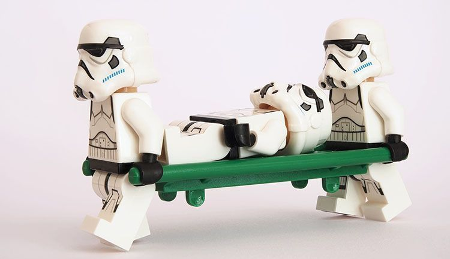
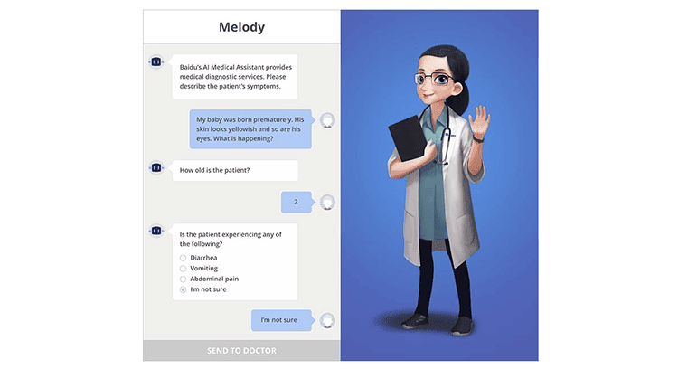

Modern medicine is technological medicine. [Health institutions are moving from analog to digital](https://anadea.info/blog/digital-healthcare-a-new-approach-to-care-coordination), mastering computer analysis and forecasting systems. Technologies in healthcare are not only the latest medical equipment but also industry-specific software that automates work processes.

One of the promising areas is the chatbot application in healthcare. It is projected that <a href="https://www.marketsandmarkets.com/Market-Reports/healthcare-chatbots-market-27837519.html" target="_blank"> the healthcare chatbots market</a> will reach $314.3 million by 2023 from $122 million in 2018. <a href="https://www.juniperresearch.com/press/chatbots-a-game-changer-for-banking-healthcare" target="_blank">Juniper Research</a> shows that chatbots enable healthcare to cut costs by $8 billion per annum by 2022.

Think of medical chatbots as virtual assistants for your clinic, hospital or medical center. They can be integrated into your site or app and they are often very effective in what they do. In order to understand how chatbots can be useful for your healthcare business, let's look at medical chat systems in detail.

## What is a healthcare chatbot?

A medical chatbot is a computer program that imitates human activity in a chat, maintains a dialogue with a user (a medical worker or a patient) selecting answers from databases and responding to specific sets of commands. The chatbot technology in healthcare aims to save time and avoid human errors.

The peculiarity of the technology is that it either learns itself on the basis of conversations with real people or pulls replies from a database of pre-programmed answers. Therefore we have 2 types of chatbots: simple chatbots and healthcare chatbots with machine learning.

In the case with simple medical chatbots, we just have to provide as many probable scenarios as possible for what a person can ask. With all possible scripts, a chatbot is capable of recognizing the request and making an appointment to see a physician, for example. If the patient has not used any of the registered keywords, then the chatbot will answer "Sorry, I did not understand".

The second approach to [healthcare chatbot development](https://anadea.info/solutions/medical-app-development) is based on learning. Smarter chatbots can analyze patient responses and ask clarifying questions based on them. Such AI chatbots in healthcare help speed up the collection of medical history by a doctor and even establish a preliminary diagnosis based on the patient's initial complaint, thereby increasing the quality and speed of medical care. However, artificial intelligence in a chatbot is optional, as bots are engaged in the automation of routine actions.

## How healthcare can use chatbots

* The first thing that comes to mind when we talk about chatbot for healthcare is improving the work of the front line of any clinic - registry. During the working day, a medical registrar has to answer the same questions by phone or personally. Thanks to an online chatbot available on your site or app 24/7, patients can make an appointment with the doctor they need right in the morning if they have the first symptoms in the late night without passing through the registry. The chatbot asks what doctor the patient wants to see, then offers available time and the patient confirms the time he needs. And all it happens in the chat.

* The next of healthcare chatbot use cases relates to an essential step in examining a patient - taking a medical history. The doctor asks the patient about childhood illnesses, allergies, prior surgical problems, etc. As a rule, in any disease, there is a number of subjective signs that the patient does not mention in his complaints. In this regard, it is necessary by detailed questioning of the patient to additionally identify those sensations that indicate painful deviations of the function of the whole organism and of individual systems. Each patient complaint must be detailed by a doctor. Here is where chatbots come in handy.

The bot collects medical history within minutes, that is faster than answering similar questions and writing down the answers. To be clear, the physician has the final say and the bot only helps to collect the necessary data and to process it. Therefore the intellectual system does not bear any risks for the patient, which is critically important in the field of medicine.

## Advantages of medical chatbots

Developed correctly, virtual assistants can be one of the best tools that you can use in your arsenal. Digital healthcare chatbot has a number of advantages both for doctors and patients.

The disease rarely happens on time, but the doctor is not a robot, he cannot physically be in touch around the clock. The "virtual health worker" at any time will hear complaints, perform a primary survey and tell the patient how to proceed at the first signs of the disease.

Chatbots can help medical centers to solve one of the most labor-intensive tasks - calling customers to confirm their visit to the physician. Chatbots allow you to automatically send a message to the client with a reminder of the time of the visit and, for example, three buttons "I will", "I can not be", "I do not know". After the client has pressed any of the buttons, the operator sees the answer and calls those who didn't confirm the visit.



Chatbots can be useful in healthcare marketing. Healthcare chatbot can ask patients about weight, height, age, diet, sleep, and other things. Then chatbot records variants of answers in "labels", which are the subject to thematic distribution. For example, a proposal with a course of treatment for hypertension will be sent only to users with excess weight over 40 years of age and a sedentary lifestyle, and a course of improving immunity only to users who have had an acute respiratory infection more than 3 times in the last six months.

It is often easier for people to tell a faceless bot about their health problems than to a real doctor. At the doctor's office, patients sometimes hide the truth about themselves, lie about how much and how often they drink and smoke, how they eat, what kind of drugs or supplements they take. Sometimes patients forget to say by chance and as a result, a doctor who does not receive accurate information about his patient risks setting up an incorrect and even dangerous treatment. And chatbots get a more detailed medical history from patients that helps in the victory over the disease.

## How to create a chatbot for healthcare?

At first, a conversation pathway should be designed. Such factors as relevance, tone, quantity, speed, and context should be kept in mind to ensure the chatbot’s conversation efficiency. If you are not sure what kind of content to include in your chatbot, start by thinking about what clients complain about most and build your solution around this pain point.

Secondly, the right user interface should be chosen. Make UI elements perform predictably, elements should be labeled and indicated to enhance usability, the layout should be designed to improve readability, numerous tasks on the same page should be avoided and design should be simple to navigate.

Next, HIPAA compliance should be added to set the standards for using, handling, and storing sensitive healthcare data. The act defines rules for the use of protected health information, which is all data that can be used to identify a patient. As a result, each person involved in the development of an AI assistant that has access to your PHI must be HIPAA compliant.

## What chatbots in healthcare are already in use

[Innovations in healthcare](https://anadea.info/blog/the-future-of-health-innovative-trends-in-medical-software-development-2019) take place faster and faster. Online consultations are popular, thereby chatbots are developing dynamically. Bots are created to perform routine work, to relieve doctors and save time for patients:

* The British chatbot, Babylon Health, is engaged in such a routine and is gradually gaining popularity among the citizens of London. 26 thousand patients have already used the chatbot services. The program successfully passed the Royal College GP exam, scoring 81% of the points. The average score among doctors is 72%.

Image source: <a href="https://www.babylonhealth.com/product/healthcheck" rel="nofollow" target="_blank">Babylon</a>

* The German ADA chatbot solution asks a lot of personalized questions, then assesses the patient's responses and reports the likelihood of a patient's disease, explaining which of the above symptoms affected the decision of the system. If necessary, the application connects the patient with a real doctor in a chat for consultation.

Image source: <a href="https://ada.com/" rel="nofollow" target="_blank">Ada</a>

* Chatbot Melody inside Baidu's medical app for doctors analyzes the symptoms and calculates to which of the six hundred thousand real doctors to send the patient. It asks questions and offers answers very meticulously. Thus, the necessary information is collected from the patients before the visit to a doctor.

Image source: <a href="https://www.topbots.com/project/chinese-baidu-bot-ai-doctor/" rel="nofollow" target="_blank">Topbots</a>

## Challenges of healthcare chatbots implementation

Medical chatbots can advise you at any time of the day. Patients talk about their health and describe the symptoms. The machine quickly processes the information and makes an appointment with a doctor. However, the algorithm of medical chatbots is not fully debugged. All patients talk about the symptoms of the same disease in different ways, and chatbots have problems handling responses. <a href="https://www.designrush.com/agency/software-development/healthcare" target="_blank">Healthcare software development companies</a> developing chatbots are constantly updating the vocabulary of the systems with new terms and extending the database of possible answers.

## Bottom line

Medicine is in constant development. Over the past 100 years, the science of saving human lives has taken a huge step forward. It learned how to deal with infectious diseases, developed ultrasound and MRI, mastered new means of surgical intervention. We no longer have smallpox, we have forgotten what plague is, we know how to transplant heart, we set up bionic prostheses for arms and legs printed on a 3D printer. Information technology is the driver of this development. The implementation of chatbot healthcare medical assistants is a very promising activity that will hopefully soon become a common part of patient care.
