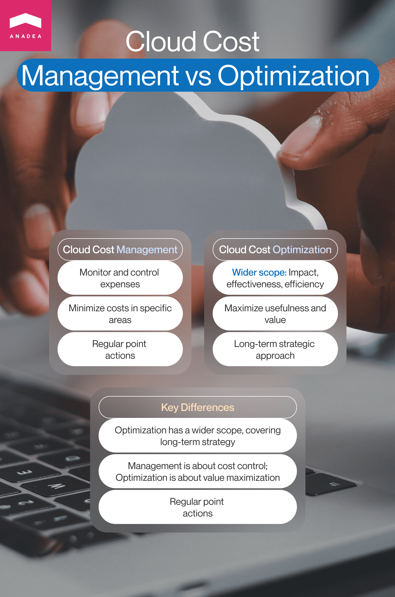

Cloud technologies are among those that shape the business software infrastructure today. Companies and organizations all over the world rely on cloud services and are gradually migrating their existing data and apps to the cloud. Today around 60% of all the global corporate data is [kept](https://explodingtopics.com/blog/cloud-computing-stats) in cloud storage. It is expected that by 2025, the volume of data stored in the cloud will reach 200 ZB.

Cloud providers get nearly $178 billion in revenue every year and this figure is gradually growing. According to Gartner, in 2023, global end-user spending on public cloud services will [reach](https://www.gartner.com/en/newsroom/press-releases/2023-04-19-gartner-forecasts-worldwide-public-cloud-end-user-spending-to-reach-nearly-600-billion-in-2023) the mark of over $597 billion. Just compare, in 2022, this figure was $491 billion.

<table>
  <thead>
    <tr>
      <th></th>
      <th>2022</th>
      <th>2023</th>
      <th>2024</th>
    </tr>
  </thead>
  <tbody>
    <tr>
      <td>Cloud Application Infrastructure Services (PaaS)</td>
      <td>111,976</td>
      <td>138,962</td>
      <td>170,355</td>
    </tr>
    <tr>
      <td>Cloud Application Services (SaaS)</td>
      <td>167,342</td>
      <td>197,288</td>
      <td>232,296</td>
    </tr>
    <tr>
      <td>Cloud Business Process Services (BPaaS)</td>
      <td>59,861</td>
      <td>65,240</td>
      <td>71,063</td>
    </tr>
    <tr>
      <td>Cloud Desktop-as-a-Service (DaaS)</td>
      <td>2,525</td>
      <td>3,122</td>
      <td>3,535</td>
    </tr>
    <tr>
      <td>Cloud Management and Security Services</td>
      <td>34,487</td>
      <td>42,401</td>
      <td>51,871</td>
    </tr>
    <tr>
      <td>Cloud System Infrastructure Services (IaaS)</td>
      <td>114,786</td>
      <td>150,310</td>
      <td>195,446</td>
    </tr>
    <tr>
      <td><b>Total Market</b></td>
      <td><b>490,977</b></td>
      <td><b>597,325</b></td>
      <td><b>724,566</b></td>
    </tr>
  </tbody>
</table>

BPaaS = business process as a service; IaaS = infrastructure as a service; PaaS = platform as a service; SaaS = software as a service 
Note: Totals may not add up due to rounding. 
Source: <a href="https://www.gartner.com/en/newsroom/press-releases/2023-04-19-gartner-forecasts-worldwide-public-cloud-end-user-spending-to-reach-nearly-600-billion-in-2023" target="_blank">Gartner</a> (April 2023)

The increasing expenses prove the ongoing adoption of cloud technologies. And Gartner analysts support this thesis. They estimate that by 2026, 75% of organizations will utilize clouds as the fundamental underlying platform for their business processes. However, the issue is that despite the fact that more and more organizations use cloud services (which should presuppose the reduction of their expenses on software infrastructure), a lot of them still allocate a significant part of their budgets to paying for cloud resources.

If you are not satisfied with the growing amounts that you see on the bills received from your cloud provider, this article is for you. In this blog post, we will share practical tips on how to reduce cloud costs without sacrificing even the most expensive services if they are really useful.

## Cloud cost optimization: What is it?

Anadea is known as tech partner that can not only develop various types of software but also provide [DevOps as a Service](https://anadea.info/services/server-administration-and-maintenance). That's why our customers can come to us with their pains and ask to find the most feasible solutions. Quite often we receive requests from those businesses that believe that they overpay for cloud services and want to optimize cloud costs. Without any doubt, in such cases, it won't be enough just to reject some services and continue working (it would be too easy and too inefficient!). It is always necessary to think about the possibility of taking such measures that will help to reduce expenses but keep all the necessary services.

That's when various cloud cost optimization approaches should be introduced. Let's start with some basic concepts. What do we mean when we mention cloud cost optimization efforts? They typically unite best practices, techniques, tools, and strategies that are aimed not only at reducing cloud costs but also at implementing the most cost-efficient ways to run your apps in the cloud and ensuring their highest business value.

Quite often the notion of **cloud cost management** is used as a full synonym of **cloud spend optimization**. However, it is not fully true. Cloud cost management strategies primarily presuppose monitoring and control of the expenses related to the use of cloud services by your company. They also include defining aspects where you can minimize costs, as well as introducing steps that help to increase cloud cost savings.

As for cloud cost optimization strategies, they usually cover a wider area of studying the impact, effectiveness, and efficiency of the cloud services that you rely on. Though the main goal is still to reduce costs associated with cloud services, these strategies are more about maximizing the usefulness of the applied services, their value, and feasibility. They also include eliminating excessive resource utilization and waste.

We won't exaggerate the role and significance of cloud cost optimization if we say that it is a more strategic approach that is based on the analysis of the long-term prospects and benefits of various cloud services. At the same time, cloud cost management refers to some regular point actions as prices of cloud services are updated from time to time while new service plans are introduced.

That's why we can make a conclusion that cloud infrastructure cost optimization is an approach that requires deep research and analysis of the state of the company's software solutions, as well as its ongoing business needs and requirements.

Get a consultation

## How to optimize cloud costs: Our workflow

When our clients ask us to find out how they can reduce the amounts that they need to pay to their cloud providers, our DevOps engineers have a lot of things to do as they will play a key role in cloud spend optimization projects (and especially at their first stages). In general, we should mention that DevOps experts can greatly help organizations create and improve their IT infrastructure, as well as streamline and automate a lot of business processes. If you want to learn more about the reasons why their participation is important for SaaS projects, we offer you to follow this [link](https://anadea.info/guides/why-devops-is-vital-for-saas).

Here is how our work with clients is usually organized.

### Step 1. Analysis of existing expenses

It is impossible to find the right approach to cloud cost optimization without a full understanding of the range of resources that you currently need to pay for. First of all, it is necessary to have a look at the cost or billing reports prepared by your cloud providers. Though such reports may be named in a different way depending on the cloud provider that you work with, the main content of such reports always stays the same. Thanks to them, you can see what services and resources you use and how much you need to pay for each of them.

It will be not enough just to look at the figures related to each service. It is also required to understand which services are used more frequently than others. There is little sense in starting to reduce cloud costs by optimizing the use of those services that you need really rarely. It's worth beginning with the most widely applied ones.

### Step 2. Detection of areas for improvement

When our DevOps experts have already defined those services the use of which has the strongest impact on your expenses, they need to see how they are used at the moment. As you may already know, cloud technologies allow businesses to leverage great scalability. However, to enjoy all the benefits of this scalability, it is crucial to treat it wisely and to expand the resources that you use only when you really have such a necessity.

Sometimes when companies have very ambitious plans for growth, they forget about the fact that with cloud platforms they do not need to pay in advance for the resources that they do not currently utilize. Some developers believe that it is better to add 2 or 3 times more resources than it is currently required to be well-prepared for further expansion. Nevertheless, when they make such decisions, it seems that they forget that additional resources lead to additional expenses.

It is a common practice to start running your app only on one server. When with time flow your user base and load grow, you will always have the possibility to begin using additional servers to ensure fault tolerance.

The evaluation of the used resources should be conducted in accordance with various metrics (yes, your cloud bill will be not the only source). It will be also required to analyze the utilization of the services, their capacity, availability, and performance.

As an outcome of this step, we need to define how resources are used and when they are used excessively.

### Step 3. <a href="https://anadea.info/services/code-review-service" target="_blank">Code review</a>

When it is already clear what can be improved, developers join the game. They need to understand how cloud solutions can be enhanced to help you optimize cloud costs.

One of the popular options is to migrate your monolithic apps to microservices. Such modernization may bring you a lot of benefits, such as making your solutions more tolerant of failures, more flexible, scalable, and simple to interact with. Moreover, microservices will ensure more optimal use of resources in comparison with a monolithic architecture.

Developers may also detect the need to rewrite some parts of code, replace them with new ones, or just delete those lines that do not have any value.

### Step 4. Analysis of the results

When the changes are introduced, we will need to estimate whether they have brought the desired results and whether your system still works as it is supposed to. At this step, it will also be possible to see whether your costs have been reduced as it was expected.

### Step 5. Detection of the next services for optimization

As we've mentioned above you should start your cloud cost optimization efforts with the most widely used services at your organization. When the work with the most popular one is over and you want to continue optimization, it will be high time to proceed to the second service on the list and repeat all the necessary steps.

Start with us

## Cloud cost optimization best practices

Over the years of working with cloud infrastructures, we've managed to detect the most common mistakes that organizations have in working with cloud services and elaborate a row of "golden rules" that will help you optimize your expenses.

### Strategic investment in resources

Cloud storage and computing resources are those aspects that require the highest investments. Do not try to acquire them just in case. Otherwise, you may be paying for the resources, you will never use. When the volume of your data grows, you will have the possibility to rent more storage space.

### Autoscaling

Autoscaling is a very good solution for many companies. This approach allows for dynamic adjustments of computing or storing resources on the cloud platform. When the load on your app grows, the resources will be automatically scaled. And you will pay only for resources that you really need.

### Financial commitments monitoring

Regularly review your expenses. You always should know what you are paying for. If you see that some services are rather costly, it may be sensible to use a cheaper alternative if it exists. Let's admit that not every business needs to have its own private certificate authority and can rely on a public CA for a safe connection.

### Avoiding unnecessary costs

Never pay for resources that you do not use. If you notice that you get bills for some services but you do not fully understand how these services are used by your organization, it's recommended to ask professionals for help as soon as possible. In our practice, we had a case when our client paid more than $500 monthly for storing the data on the cloud. But that data was related to the website that was already shut down and it could be easily deleted. Thanks to one simple action, the client could save over $500 every month.

## Conclusion

While cloud technologies can help businesses to save their expenses on software infrastructures, quite often irrational use of resources can lead to additional costs. Nevertheless, with the right approach to cloud spend optimization and the correctly chosen strategy, it is possible to avoid money waste and reduce the expenses on cloud services to a reasonable level.

If you have any issues or doubts related to your cloud infrastructure and the amounts that you pay to your cloud provider, please, do not hesitate to contact our team. At Anadea, we have rich experience in working with different types of cloud solutions and we know how to adjust them in order to make them relevant to the ongoing business conditions and the needs of your organizations. Thanks to the deep theoretical knowledge and rich practical skills, our DevOps engineers and developers will be able to cope with tasks of any complexity. Just contact us to get more detailed information about our services.

Get in touch
