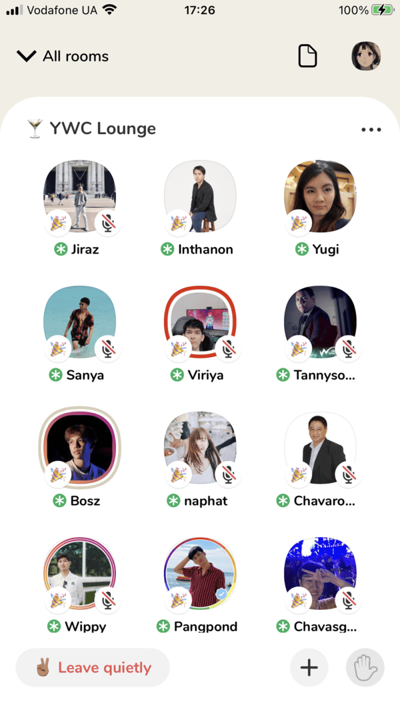

In the startup world, if you want to be a successful entrepreneur and create the next big app, you have to follow trends and explore success stories. The latest media explosion of Clubhouse app has drawn our attention and stuck us to the topic.

We are 100% sure that you’ve already browsed info about what Clubhouse is or even have got an invitation to use it, but for those who are on their way, we provide a sneak peek into the mystery of Clubhouse app. To make a long story short, Clubhouse is a <a href="https://anadea.info/solutions/social-media-app-development">social networking app</a> based on audio-chats that’s getting its popularity extremely rapidly.

So, what’s so special about this newcomer into a cohesive class of popular social networks like Instagram, Twitter, Snapchat? Let’s look at the phenomenon from the angle of recently registered Clubhouse users and as proficient social networks developers.

## What is the Clubhouse app?

Some time ago social networks were used for the purpose of communication and establishing connections between people. Shortly they became so popular that they started to grow in their amount and gain specific goals - showcase photos, establish professional connections, share short messages, etc. No wonder that the Clubhouse idea of conducting conversations among people with common interests or of one social circle in the format of live voice chat appeared to become so popular.

At first glance, Clubhouse looks like a simple application - nothing technically special. A user creates a profile, chooses interests, selects people to connect with, and viola! - starts the audio chat with others.

But as <a href="https://anadea.info/services/mobile-development">mobile apps developers</a>, we know how much technical magic is hiding behind the app to make it work on each step of the interaction with the app. We can claim it judging by these few screens that you do not even notice when registering in the application. Eventually, the app must perform stable with a big amount of users (up to 5 000) connected simultaneously - provide good sound quality, handle large amounts of data, ensure interaction between participants.

If you discard everything else, which, undoubtedly, ensures great success for the application (good promotion, buzz in mass media, etc.), you'll see that the thing described above, is the core of Clubhouse, along with searching by interests, and adding your contacts. Therefore, as in any of our projects, we start by defining the main features (killer features) without which Clubhouse wouldn’t be itself. Let's get a look at the technical backstage together.

## How clubhouse social app works

So, what makes Clubhouse special and singles it out? In general, it's a possibility to **arrange voice chats** directly with your contacts and share your interests.

After the registration you allow Clubhouse app **access to your contact list** and it suggests to follow your contacts that already joined this social network. Then you share your interests. In Clubhouse there are public “rooms” that are available for any user with the same interests. Clubhouse selects for you other members with whom you have the same interests even if a person is not among your contacts. You can also **join clubs by interests**.

You have several options - join an open room, start your own room, or create a closed room with people with whom you have a mutual connection. If you are a member of some clubs, you can create rooms for communication among its members. In rooms you can speak and listen. There are other features like notifications, calendar, etc. but the described above are the Clubhouse’s main thing.

## How to implement killer-features in MVP mode

**Integration of contacts from your list of contacts** is a common social mobile app feature. At the first launch, an app requests a user for access to the contact book. As soon as the user accepts, the data of the contacts is sent to the server. This information is compared with the other users’ data, and if there are matches by some values, the application returns to the user a suggestion to follow the contact. Just for fun, the other way we see this feature: Clubhouse asks for your geolocation and then suggests you to follow all your neighbors who are already there.

**Implementing voice chats in real-time** with the simultaneous presence of up to 5 000 people is another pair of shoes. The task of transferring audio to the server is quite non-trivial if done from scratch. It's not easy to make it work all over the world, you’ll need a distribution network of data servers, which is pricey.

An affordable and quick option is to choose an **existing back-end solution** that has already established itself on the market and is proven by years of utilization. Then choose the desired coverage and number of supported users. This option will cost you significantly less, up to $500-1000 per month. Such third-party services are reliable, and can support a lot of connections at the same time. For example, internet radio can be implemented based on them. Such services are integrated into your mobile app through SDK, a collection of libraries that are used to access it.

Testing is also an essential part of the development, especially **stress testing and load testing** to ensure that the app is not going to crash under crunch situations and can perform stable with the expected number of users.

## How long will it take and how much does it cost?

From the features mentioned above, we can see which screens have to be included in the MVP: registration, profile, access to contact list, subscriptions to interests, notifications, chat rooms, calendar, search. According to our experience, such functionality development requires approximately 13 weeks (12 for mobile development and 1 for backend development). Additionally to the development time must be included:

 about 10 hours of BA services and project coordination per week;
 about 6 weeks of quality assurance engineers work;
 and designers' hours - 2 weeks.

The cost of the app development depends on rates of the app development company you choose and the seniority of the specialists that are supposed to work on it. As the project budget is not the least part, it’s essential to find the best quality for the appropriate price and the guarantee of the final quality. It’s a great idea to <a href="https://clutch.co/profile/anadea">go to Clutch to preliminary assess the project cost</a>.

As an example estimate, let’s take this calculation, as one of the possible assumptions that you’d love to see these specialists on your project:

* **Business Analyst** - 10 h * rate per hour, $
* **Designer** – 80 h * rate per hour, $
* **Mobile developer** – 480 h * rate per hour, $
* **Backend developer** - 40 h* rate per hour, $
* **QA** – 240 h * rate per hour, $

So, sum these amounts up, and you’ll get the estimate in $, or to be more precise, the range from minimum to maximum. So, it comes out that the development of an app like Clubhouse will range from at minimum about $20 000 to no limit. This is quite a rough way of the preliminary assessment.

To be more realistic, it’s better to percept the estimated cost by the direct request to the development company, as very much depends on the team’s composition, seniority, some special conditions, etc. All the details and terms are always discussed individually. For example, you can request one more developer/tester/ BA, etc. to speed up the development. To make the cost assessment more true to life, just send the <a href="https://anadea.info/free-project-estimate"> request for proposal</a> to the vendor you like.

## Food for thought

It’s highly recommended that you as a client find a reliable outsourcing company that carries out development services fast and efficiently, without wasting your time and money to learn from their mistakes on your project. Insure yourself, find the<a href="https://clutch.co/profile/anadea#review-661251"> relevant project type and the verified client’s review</a>. It’s vitally important to check the vendor you chose is experienced in mobile social apps development, with the right team qualification and seniority.

The right strategy for a startup like Clubhouse is to release a market-ready MVP version and then add features, adjust design, rebuild some features with time - in a few words, advance as a product. By the way, Clubhouse doesn’t stop at the achieved success, they are ready to take the next step which is <a href="https://www.cnbc.com/2021/02/23/clubhouse-hires-android-developer-work-on-android-app-has-begun.html" rel=“nofollow”>the Android version <a/>development!
