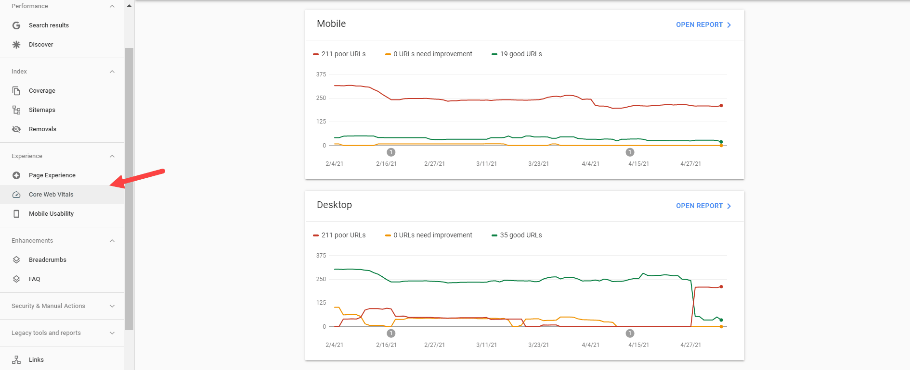

<h2>Contents</h2>
<ol>
 <li><a href="#introduction">Introduction</a></li>
 <li><a href="#gcwv">What are Google Core Web Vitals?</a></li>
 <li><a href="#importance">How important are Google's Core Web Vitals?</a></li>
 <li><a href="#metrics">Key Metrics of Google’s Core Web Vitals</a></li>
 <li><a href="#improvement">How to improve your Core Web Titals scores?</a></li>
 <li><a href="#conclusions">Conclusions</a></li>

</ol>

<a name="introduction"></a>

In May 2020 after Google’s update of the algorithm a lot of sites lost their positions and traffic, because they were not prepared.
To prepare your site for the Core Web Vitals update you need to improve it right now! To calculate all the changes you make with your site Google needs at least one month (if you have enough traffic there). And to make your site faster and better it takes a lot of time, so if you start now all actions will take at least 2 months and remember Google’s update is just around the corner. If you want to <a href="https://anadea.info/services/seo-service" >SEO optimize</a> your site, let's take a look at what Core Web Vitals are, how to measure them and where to find metrics, as well as some tips and free tools to improve your site's Core Web Vitals.

<a name="gcwv"></a>
## What are Core Web Vitals?

Core Web Vitals is the algorithm from Google that can calculate the main factors that could affect the user experience. Google has identified three main web vitals of user experience:

* Loading - Largest Contentful Paint (LCP)
* Interactivity - First Input Delay (FID)
* Visual stability - Cumulative Layout Shift (CLS)

These Core Web Vitals are a part of Google’s “User experience” score.You can find Core Web Vitals of your site in the Google Search Console. There you can find 2 reports: For Mobile and For Desktop.




If you want to find what kind of problem your pages have, then you should click on the “Open Report” and then you will see the problems with the score you need to improve.


<a name="importance"></a>
## How important are Google's Core Web Vitals?

### Now one of the most important factors of ranking in Google is user experience.

Google with all new updates of its algorithm makes this factor more and more important for ranking. And on 28 of May 2020 Google announced that they will use new factor for ranking “Page Experience”.
But what is Page Experience for Google? As we said before Core Web Vitals is a part of Page Experience and here are the other parts of PE:

* HTTPS protocol presence
* Mobile friendliness
* Lack of interstitial pop ups
* Lack of malware

But you should remember that **Core Web Vitals is the most important part of Page Experience**.

<a href="https://1.bp.blogspot.com/-cZvSfEG871E/Xs7lqHw77mI/AAAAAAAAEF4/BCRM01I7VMgplaofXcKpDRewHM3jwAkuwCLcBGAsYHQ/s1600/Search_Page_Experience_Graphic.webp" target="_blank" rel="noopener noreferrer">
 
</a>

And why is it important now? Because Google announced that the Page Experience factor will roll out in May 2021. However, now Google announces that you have some more time to prepare your website. “Page Experience” update will begin to roll out only in the middle of June and it will play the full role only in August 2021.

Of course you should remember that if you will get the best Core Web Vitals and Page Experience it will not give you 100% TOP positions in the search results. You should not forget about more than 200 other factors. =)

<a name="metrics"></a>
## Key Metrics of Google’s Core Web Vitals

What are the key metrics of CWV and how to improve them?

### Largest Contentful Paint (LCP)

LCP is time with what page will be loaded for real users. In other words it is a time from clicking a link to the moment when most of the content appears on the FIRST screen of the website. LCP is measured in seconds. LCP is about User Experience because it is a time from loading the page to the moment when users get the ability to interact with your site. To find this metric you can use <a href="https://developers.google.com/speed/pagespeed/insights/" rel="nofollow" target="_blank">Google PageSpeed Insights</a>. Example of LCP calculating


In this picture we can see that 31% of users have less than 2.5 sec load time, 21% have from 2.5 to 4 sec and 48% more than 4 sec.

The most common issues that can slow down your site:

* Slow server response times
* Render-blocking JavaScript and CSS
* Slow resource load times
* Client-side rendering

### First Input Delay (FID)

If your site has a good LCP the next step is to understand how much time is needed to interact with your site. So FID is how long it takes for something to happen on the page after you click (or other interaction). There are some examples of interactions:

* Clicking on option from a menu
* Clicking on a link in the site’s navigation
* Entering your email into a field
* Opening “burger” menu on the mobile phone

This metric you can check in the PageSpeed Insights too.


79% of users have FCP less than 100 msec, 16% have from ~300 msec and 5% have more than 300 msec.

Get some tips on how you can improve your FID:

* Minimize (or defer) JavaScript
* Remove any non-critical third-party scripts
* Use a browser cache

### Cumulative Layout Shift (CLS)

Cumulative Layout Shift (CLS) - it is a metric that shows how stable your page is after it is loaded. For example, if your page has an ad block, that appears after the page is loaded, then you will have high CLS.

<a href="https://web.dev/cls" rel="nofollow" target="_blank">To calculate the layout shift score</a>, the browser looks at the viewport size and the movement of unstable elements in the viewport between two rendered frames. The layout shift score is a product of multiplication of two measures of that movement: the impact fraction (measures how unstable elements impact the viewport area between two frames) and the distance fraction (measures the distance that unstable elements have moved, relative to the viewport). The lower CLS is, the better.

<a href="https://encrypted-tbn0.gstatic.com/images?q=tbn:ANd9GcSjbBRpM8ssA-cybQhDoNUkmAJnfSP0lYqN4w&usqp=CAU" target="_blank" rel="noopener noreferrer">
 
</a>

We were in the situation when we wanted to click on one element, but there appeared one more, so that page would get a very high CLS.

This metric you also can find in PageSpeed Insights.


In this situation we can see that 61% of users have good CLS less than 0.1, 13% have from 0.1 to 0.25, and 26% more than 0.25.

To improve your CLS you need to:

* Use set size attribute dimensions for any media
* Make sure ads elements have a reserved space
* Add new UI elements below the fold

<a name="improvement"></a>
## How to improve your Core Web Vitals scores?

Time you’ll spend to Influence your web vital scores and improve them will depend on the page content amount and abundance of JavaScript code on it. Here are some tips and free tools to refine them.

### Optimize your images

* <a href="https://jakearchibald.github.io/svgomg/" rel="nofollow" target="_blank">Optimization for images in svg format</a>
* <a href="https://tinypng.com/" rel="nofollow" target="_blank">Optimization for png, jpg, webP formats</a>
* Serve differently-sized versions of the same image with```<picture>``` or ``` ```.<a href="https://css-tricks.com/a-guide-to-the-responsive-images-syntax-in-html/" rel="nofollow" target="_blank">Check the guide here</a>.
* Use <a href="https://developers.google.com/speed/webp/download" rel="nofollow" target="_blank">WebP format</a> for content images.You should remember that WebP is not a replacement for JPEG and PNG images. It’s for browsers that can use it, but you should also keep JPEG and PNG for other browsers that can’t. For example, the webp format is not supported by Safari. To use it in production we have to <a href="https://css-tricks.com/using-webp-images/#using-webp-in-html" rel="nofollow" target="_blank"> add a png or jpg image as a fallback</a>.
```
<picture>
 <source srcset="img/webPImage.webp" type="image/webp">
 <source srcset="img/fallbackImageForSafari.jpg" type="image/jpeg">
 
</picture>
```
* Use for background <a href="https://www.blobmaker.app/" rel="nofollow" target="_blank"> blobs</a> or <a href="https://doodad.dev/pattern-generator/" rel="nofollow" target="_blank"> patterns</a>.
* Use native attribute loading=”lazy” for images. More about lazy loading find <a href="https://web.dev/browser-level-image-lazy-loading/" rel="nofollow" target="_blank"> here.</a>
* Leave the first mobile screen for text, without images.


### Preload Fonts

If your website doesn’t have font preloading, you might run into a situation when a browser is ready to load your site’s text, but it can’t because the font isn’t available yet because it needs to download the font before it can paint the text. <a href="https://wp-rocket.me/blog/font-preloading-best-practices/#:~:text=With%20font%20preloading%2C%20you%20can,waiting%20to%20load%20the%20font" rel="nofollow" target="_blank">Add to your website Font preloading</a>. It makes a user’s browser load important fonts early on so that the browser can start displaying text as soon as it’s ready, rather than potentially waiting to load the font.

### Advanced Options

You can use <a href="https://webpack.js.org/guides/getting-started/" rel="nofollow" target="_blank">Webpack</a> to optimize, modify JavaScripts, CSS and images, as well as simplify their cashing. Also there are cases when <a href="https://webpack.js.org/guides/code-splitting/" rel="nofollow" target="_blank">Code Splitting</a> may be effective, for instance, dealing with animation.


<a name="conclusions"></a>
## Conclusions

The relevance of the question how to optimize Core Web Vitals progresses day by day. Customers working practically in any domain, especially e-commerce, real estate, mass media, and a range of others that crucially depend on their visibility on the Internet, urgently search for this expertise and information. The earlier you start optimizing your website, the better. If you need website development with a focus on speed and performance or assistance and help with your website Core Web Vitals, feel free to contact us.
