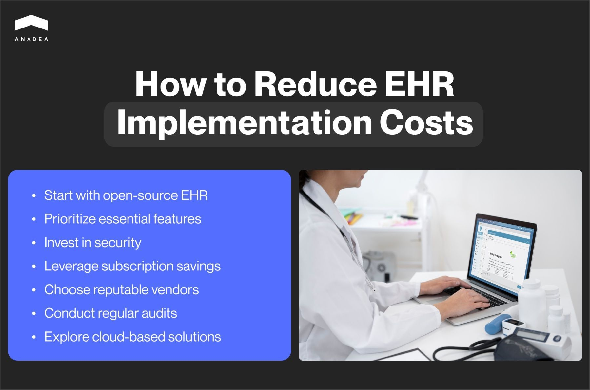
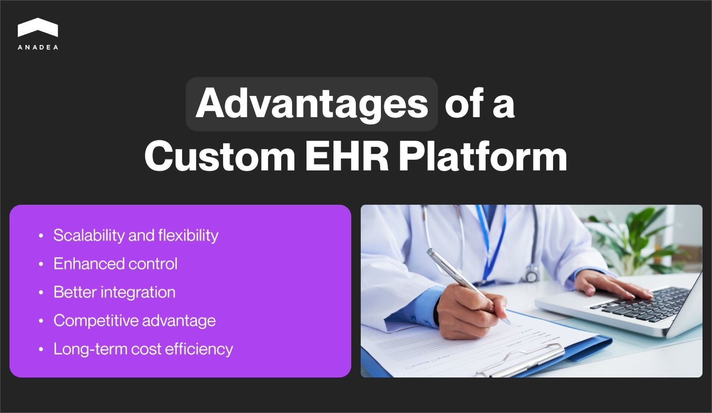
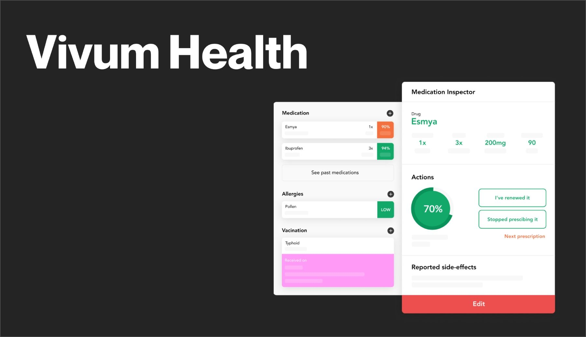
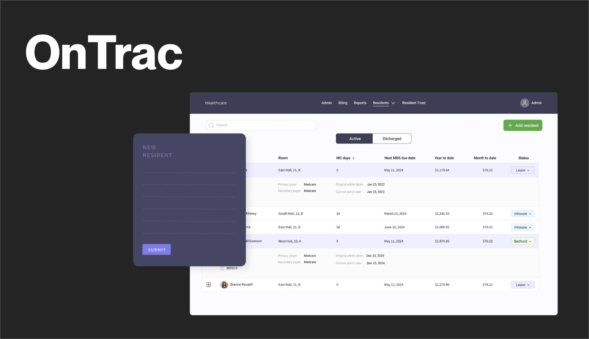

The implementation of any business software can become a serious investment. Nevertheless, when the solution is chosen carefully and successfully integrated into your wider digital ecosystem, such efforts will fully pay off. In this article, we will talk about the budget that you need to allocate to introduce an **electronic health record** system (EHR). We will also pay attention to the factors that influence the EHR software cost and explain how you can reduce the size of the required investment without sacrificing the quality of the final product.

## EHR implementation cost breakdown: Key components

When you are planning to implement an EHR system, you should estimate the budget for such a project. We’ve prepared a detailed cost breakdown that will help you understand what positions should be included in your expenses.

Initial costs:

* Software purchase, license fees, customization, or development costs;
* Hardware costs (servers, workstations, networking equipment);
* Implementation (system integration and data migration);
* Staff training.

Ongoing costs:

* Maintenance and support;
* Software updates;
* Monthly or annual fees (in the case of a subscription model);
* Data storage (cloud-based storage fees or maintenance of on-premises servers).

Indirect cost:

* Possible downtimes;
* Training for new staff or additional training sessions for employees after software updates.

## What factors influence EHR software cost?

Of course, there are a lot of factors that have impact the final cost of EHR. Nevertheless, let us focus at least on the most important ones.

1. **The size of your organization**. The cost of EHR implementation at a large hospital will be significantly higher than at a small facility. The bigger your organization is, the more complex the EHR system you may need. As a result, the cost will be higher.
2. **The complexity of integrations.** It is important to analyze the type and complexity of the solutions that you already have. Very complicated and time-consuming integrations will greatly change the total costs.
3. **Customizations**. Even when you decide to use a ready-made platform, it is highly likely that you may need to tailor its features to your needs. The more changes you will need to introduce, the more expensive they will turn out to be.
4. **Service provider.** This is probably the most obvious factor. You should think not only about the cost of the solution itself. You also need to take into account the cost of related services as their implementation, setting, and maintenance. Will you rely on your in-house team or will you outsource such services? Your decision may seriously influence the size of your expenses.

## Justification of EHR implementation

Looking at the EHR implementation cost breakdown, you may think that the investments will be too big. Yes, it may seem that the initial costs can be high. Nevertheless, the long-term financial and qualitative benefits often justify the investment.

Among the significant advantages that contribute to a positive ROI, we should mention the improved efficiency of many processes at medical facilities, better patient care, and compliance with regulations.

Let’s dive deeper into the topic of EHR implementation benefits:

* **Increased revenue.** With EHR software, it is possible to enhance the accuracy of billing. Thanks to this, your organization will be properly and timely reimbursed for the delivered services
* **Enhanced productivity**. EHR platforms enable organizations to successfully streamline many processes. As a result, their employees can demonstrate better productivity. This also has a positive impact on patient satisfaction.
* **Improved patient care and safety**. Doctors can easily get access to comprehensive patient data. This greatly enhances diagnosis and treatment. Moreover, with e-prescriptions, it is possible to minimize medication errors.
* **Regularity compliance.** EHRs help ensure compliance with local regulations, like HIPAA, and avoid penalties.
* **Cost savings.** The implementation of EHR can lead to a reduction in administrative costs. Mainly, this is achieved thanks to minimizing the use of paper documents and eliminating related costs (like expenses on printing).
* **Better job satisfaction**. The adoption of EHR systems also can have an impact on job satisfaction among staff of healthcare organizations. Thanks to automatization, the workload can be significantly reduced. Moreover, a lot of tasks can be fulfilled much faster.

The benefits of using an EHR system are undeniable. But to leverage them all, you should use a reliable solution that corresponds to the needs of your organization. Otherwise, the return on your investments will be rather questionable. That’s why the first thing that you should think about (even before the EHR cost) should be the relevance of this or that platform for your organization.

## How to reduce the cost of implementing EHR in hospital?

As you can see, the implementation of an EHR system can become a rather expensive initiative. Namely, financial constraints often prevent medical organizations from using digital solutions. However, some cost-saving strategies can help you optimize your expenses:

1. **Start your digital journey with an open-source EHR.** Sometimes this may be far not the best advice. Such solutions often have rather limited functionality. Moreover, the use of an open-source platform may still require some tech expertise because you may need to customize it. Nevertheless, sometimes hospitals can find a ready-made open-source option that perfectly addresses their needs.
2. **Choose only the most necessary features and products.** When you start analyzing offers from vendors, you will see that they offer various pricing plans. Very often these plans provide different sets of solutions. It is not feasible to opt for the most expensive plan “just in case”. We strongly recommend you attentively analyze your needs. As a rule, vendors allow users to upgrade their plans over time id something changes.
3. **Do not ignore the security.** On one hand, you may say that extra security measures will result in additional costs. But on the other hand, you should understand that data breaches will turn out to be more expensive. In order to avoid dealing with consequences, it's better to prevent such situations at all.
4. **Carefully analyze the terms of subscription-based models.** Quite often vendors provide reduced fees if you opt for an annual fee model instead of a monthly one. Though it may be more comfortable to pay once a month than once a year, you should also take into account the possibility of saving money.
5. **Cooperate only with top-rated vendors and developers.** Sometimes when companies want to reduce costs, they try to choose the cheapest options. Nevertheless, it’s important not to forget about a reasonable price-quality ratio. The reputation of a provider is a very important factor to bear in mind. When you are trying to save your money in such a way, the risks are too high.
6. **Conduct audits regularly.** You should periodically review your expenses on the EHR system to make sure that you do not overpay for something that you already don’t need.
7. **Explore cloud-based solutions.** The use of cloud-based platforms is a more feasible option than maintaining on-premises servers. Cloud resources usually ensure lower upfront costs and provide flexible pricing based on usage.



## Сost of EHR systems: The most popular platforms

The market for EHRs is continuously growing. In 2023, it [reached](https://www.towardshealthcare.com/insights/electronic-health-records-market-size) the size of $27.42 billion. Now, it is expected to achieve the mark of $41.87 billion by 2033. Such figures indicate a CAGR of 4.32% for the forecast period (2024-2033). Meanwhile, researchers mention that cloud-based solutions are gradually conquering their market share. In 2023, 48% of the EHR market was represented by cloud platforms.

Given all the advantages that EHR systems can offer to healthcare organizations, the demand for such platforms is climbing higher. The same is true about the number of ready-made solutions that are available today. Let’s compare offers of the most popular providers and EHR software prices.

### Practice Fusion

This cloud-based platform is tailored to the needs of independent practices. For example, it helps users save time with templates and patient charts that can be adapted to your requirements. Moreover, it has the necessary tools for efficient prescription management and seamless data exchange with pharmacies, laboratories, and imaging centers.

Pricing starts at $149 per provider per month. This option presupposes an unlimited number of non-signing staff licenses and 3 signing licenses. This amount also includes implementation, training, and customer support fees.

The platform provides a free 14-day trial period, which is very convenient for those who want to test its functionality.

### eClinicalWorks

eClinicalWorks is known as the major cloud-based EHR software in the US. According to its [website](https://www.eclinicalworks.com/about-us/), the company was founded in 1999 and today more than 180K doctors and nurse practitioners and 850K medical professionals all over the world rely on this system. It is an AI-powered EHR platform that can cover a wider range of IT needs that a healthcare provider may have. AI tools help to automate tasks, facilitate the note-taking process, improve scheduling, and enhance many other areas of clinical management.

Prices depend on the exact set of products and services that users will opt for. If you are interested in EHR software only, the monthly fee will be $449 per provider.

### RXNT

For more than 25 years, RXNT has been offering efficient software for medical practices. Among its products, we should mention a cloud-based feature-rich EHR system.

The cost of electronic health records when you use this software may vary. RXNT provides different product packages that allow hospitals and healthcare organizations to choose the most suitable ones. The prices start at $110 per month. There is also an option to pay not on a monthly but annual basis. In such a case, users can leverage a reduced price. All prices also include set-up, training, ongoing support, and upgrade fees.

## Is it worth developing a custom EHR system?

As we have already mentioned, today the market offers a wide range of ready-made solutions that can address the needs of various medical organizations.

Nevertheless, only a custom platform can be fully tailored to the needs and specifics of your processes and services.

A custom EHR platform can offer the following advantages:

* **Scalability** **and flexibility**. Custom solutions are designed to grow with your organization. They allow you to make any additions and modifications that you may need. For example, you can initially build an EHR system with a basic set of features. But later you can decide to equip it with powerful AI tools or any other functionality following the [latest tech trends](https://anadea.info/blog/the-future-of-health-innovative-trends-in-medical-software-development-2019). In the case of custom development, it will be possible.
* **Enhanced control**. You will be fully responsible for your platform, its security, and its functioning. You will have control over your data. This can be crucial for compliance and data management purposes. Moreover, with a custom platform, you can control EHR maintenance schedules to reduce downtimes and ensure the highest stability and performance of your solution.
* **Better integration**. Custom EHR systems can be developed in such a way that it will be possible to seamlessly integrate them with other existing systems. For example, you may need to integrate your solution with your billing or lab systems, or with some external solutions. Software integration will ensure better data sharing and interoperability with other healthcare providers and systems.
* **Competitive advantage**. With unique features that will be related to your organization’s strengths, you can differentiate yourself from competitors. Such custom tools will enhance patient care and satisfaction.
* **Long-term cost efficiency.** The initial custom EHR software cost is rather higher, as you need to invest in its development. However, custom EHRs do not incur recurring licensing fees that off-the-shelf solutions traditionally charge.

When is it recommended to build a custom EHR system? It can become the best choice for medical organizations that provide care in particular fields, offer a specific combination of services, or have plans for active expansion of their businesses. Moreover, if you want to avoid dependence on the vendor for updates, support, and compliance with regulations, custom development can also be a good option for you.

## How much do EHR systems cost? Custom development

Custom solutions look quite appealing. Nevertheless, before making a decision to initiate such a project, you need to clearly understand whether you have sufficient financial resources for this.

The cost of EHR systems that are built based on individual requirements can greatly vary. The reason for this is quite simple. All custom projects are different. That’s why their creation can require different skills and efforts. Moreover, it is very natural that the development of a simple platform will require less time than the development of an advanced system with multiple integrations.

What factors impact development costs?

* The complexity of your solution, the number of features;
* The number of desired integrations;
* The tech stack;
* The desired composition of the development team and the engagement model;
* Other specific requirements,

When developers estimate project costs, they apply a simple formula:

hours of work * hourly rate = cost

For example, the average development rate is $50. As a rule, the EHR implementation takes around **400-1000 hours of work**. This includes the stage of planning, active development, testing, and deployment of your solution.

Following our formula, we will get an amount of **$20K-$100K**.

However, here, we’ve taken a standard EHR implementation project. In reality, the final cost may turn out to be different. To get more precise estimates, you need to contact a development team and share your requirements. At Anadea, we can estimate the cost of EHR implementation for free.



### EHR maintenance cost

When you are planning to [build an EHR system](https://anadea.info/solutions/medical-app-development/emr-ehr-development), you should also take into account the cost of maintenance.

Software maintenance usually includes:

1. **Software updates and modernization**. It is crucial to make sure that your medical software is compliant with all relevant industry regulations and standards. Moreover, regular updates may be aimed at enhancing your platform with new features and addressing security vulnerabilities.
2. **Staff training**. The better your employees know how to work with an EHR system, the better results you can expect. All new specialists should have a training course, while the whole team should be informed about all the introduced updates. Such tasks also require time and resources.
3. **Tech support.** You should continuously monitor the tech state of your system. If any bugs are detected, they should be timely addressed, which will allow you to avoid disruptions in your services and minimize downtimes.
4. **Hardware upgrades**. From time to time, you may need to invest in hardware upgrades to make sure that your equipment corresponds to your ongoing software requirements. Modern hardware is important to guarantee the best performance of your system.

Of course, the EHR maintenance cost will be different for different systems. Such factors as the complexity of your solution and the size of the user base have a very significant impact.

Nevertheless, according to some studies, healthcare organizations should be ready to spend around 15%-25% of the initial costs annually. However, please, bear in mind that in the first year, the maintenance cost can be higher. This happens so because, at the initial stages, you need to fully adjust the platform to your processes. Moreover, your staff will need to learn the system.

## Our experience in EHR development and implementation

At Anadea, we have expertise in various business domains. Software solutions for the healthcare industry are one of the areas where we have the richest experience.

Today, our portfolio includes such a project as [Vivum Health](https://anadea.info/projects/vivum-health). It is a scalable medical data-sharing platform. It helps to ensure personalized stakeholder engagement, reduce the cost of patient care, and increase patient retention.

On this project, we worked with a London-based startup and were responsible for building the front-end part of the system.

The platform is equipped with such features as:

* Patient list with a summary and a detailed medical record for each person;
* Patient enrolment;
* Monitoring tool that allows doctors to track patients’ treatment process and symptoms in real-time;
* Treatment inspector for viewing next steps in treatment;
* Medication inspector for viewing prescriptions and updating them if necessary;
* “Inform your patient” feature for showing the details of treatment to patients.

The solution was successfully built and implemented. In 2018, it was awarded the Digital Health Innovation Prize.

If you want to learn more about our skills in building solutions for this domain, you can also read about the development of an electronic health record system dubbed [OnTrac Resident Manager](https://anadea.info/projects/on-trac). It was designed to address the needs of Skilled Nursing Facilities and Assisted Living Facilities.

Thanks to their solid expertise, our developers can cope with projects of any complexity. Our services go much beyond the creation of EHR systems with standard features. If you plan to power your [healthcare software with AI and ML](https://anadea.info/blog/machine-learning-in-healthcare) functionality, we will find the best solution.

Moreover, with us, you can be sure that the approved cost of EHR implementation will not exceed your budget.

Already have an idea for your future project? Just contact us to discuss the details!

Get in touch
