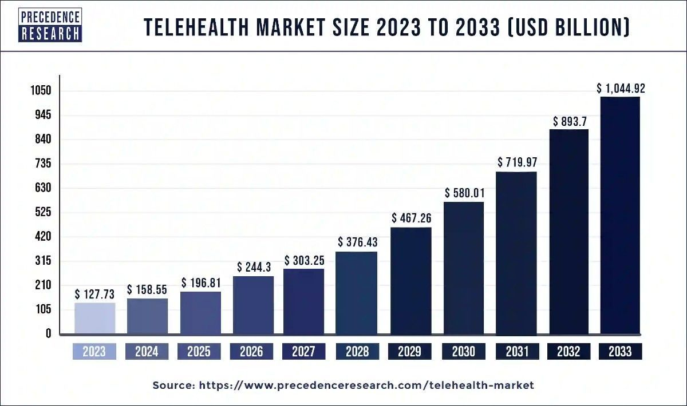

In 2024, over 116 million people [use](https://www.statista.com/topics/12106/telemedicine/) online doctor consultations all over the world. This figure looks impressive, especially if you compare it with the 57 million that were recorded in 2019. Given all the benefits and new opportunities that [telemedicine solutions](https://anadea.info/solutions/medical-app-development/telemedicine-development) offer, there aren’t any signs that this tendency will change in the near future. With the growing number of patients who rely on online services, the demand for [telehealth software](https://anadea.info/blog/telehealth-solutions-paving-new-ways-for-medical-communication) is growing as well. In this article, we are going to talk about the cost of telehealth implementation and explain what points you should consider before proceeding to the active development phase.

## Why integrate telemedicine and telehealth software?

First of all, let us briefly mention the difference between these two terms. Despite the fact that they are often used just as synonyms, it is not fully true. While telemedicine refers only to remote medical services, telehealth unites both medical and non-medical services (like apps for online conferences for doctors or digital solutions that can be used by medical students for educational purposes).

Though the world seems to have already practically forgotten about the COVID-19 pandemic, its influence on various markets is still rather strong. Namely, the coronavirus and all associated lockdowns highlighted the necessity to introduce reliable telemedicine solutions to address the existing demand for such services.

The market reacted rather fast. In Q2 2021, global investments in telehealth hit the mark of [$5 billion](https://www.cbinsights.com/research/report/telehealth-trends-q2-2021/) which reflected a 169% increase from Q2 2020. At that time investors started to actively support projects that offered virtual care, remote monitoring, [doctor appointment booking tools](https://anadea.info/blog/doctor-appointment-app-development), and telepharmacy services. In 2023, the sectors that [received](https://www.fiercehealthcare.com/finance/digital-health-health-it-funding-slumps-q2-2023-pitchbook-reports-say) the most funding were teletherapy and behavioral health, as well as care coordination and navigation.

According to analysts, in 2023, the global telehealth [market size](https://www.precedenceresearch.com/telehealth-market#:~:text=The%20global%20telehealth%20market%20size,forecast%20period%202024%20to%202033.) achieved $127.73 billion and it is forecasted that it will increase to $1.044 trillion by 2033. It means that it will grow at a CAGR of 23.31% within the period from 2024 to 2033.

All these figures brightly demonstrate that the market is expanding, which means that new projects still have chances to gain popularity and build a good user base. But what are the reasons for this growth? To answer this question, we should turn to the [benefits of telehealth solutions](https://anadea.info/blog/digital-healthcare-a-new-approach-to-care-coordination).

### Advantages of telehealth for patients

* Enhanced access to providers;
* Greater flexibility in scheduling visits;
* Lowered expenses;
* Reduced stress.

### Advantages of telehealth for providers

* Reduced no-show rates;
* Better established processes related to managing chronic conditions and post-hospitalization care;
* Enhanced productivity;
* Higher efficiency of patient management;
* Better infection control.

Hire telehealth developers

## Telemedicine platform development and implementation

Before starting to discuss telemedicine startup costs, we need to briefly touch on the topic of building such solutions. Traditionally, such projects have the following plan for their realization.

1. **Ideation and market study.** You should think about the core idea of your future solution and analyze the existing market needs and demands.
2. **Discussion of your requirements with a development team**. It’s very important to make sure that your idea and your expectations are clear to developers. When you share your requirements with the team, experts will be able to make calculations and provide you with an estimated cost of implementing telemedicine software according to your needs.
3. **Planning**. The team will plan the entire process, set the core milestones, and define the timelines for achieving each of them.
4. **Design and development**. At this step, the development team will transform your ideas into a real product with features that will address various users’ needs and interfaces that will make the interaction with your telemedicine solution as comfortable as possible. If you are planning to launch your own software solution, it will be useful to read our recommendations for its [UI/UX design](https://anadea.info/blog/5-ux-mistakes-to-avoid-when-designing-your-first-telemedicine-app).
5. **Testing**. Your development team will need to make sure that your app works without any interruptions and can cope with high loads. While some types of tests are conducted at the step of active development, it is also necessary to check the solution when everything is ready.
6. **Implementation**. Depending on the type of your solution, the development team may have different tasks at this stage. Nevertheless, the final goal of these efforts will be always the same - to prepare the environment and to make your telemedicine software product available to its target audience.
7. **Post-launch maintenance and support**. When your product is already released, the work on it should still go on. It is vital to monitor its performance, address any detected vulnerabilities, and introduce updates based on the changing needs of users and your business.

## How much does it cost to develop a telemedicine app?

As in the case of any other software, it is impossible to talk about the telehealth platform cost without analyzing the specificity of this project itself. Of course, it is possible to provide some very approximate figures. Let’s take an average software development hourly rate of $50 and 1500 working hours that a team can spend on building a telemedicine app. Using a simple formula, we will get a total of $75,000. But remember: this is an approximate number that shouldn’t be used as a reference. For a more personalized estimate tailored to your specific needs, please [request a free quote](https://anadea.info/free-project-estimate).

## What has an impact on telemedicine software cost?

Nevertheless, it won’t be correct to take this figure for evaluating your budget for the project realization, as there are a lot of factors that may have an impact on telemedicine startup costs.

For example, the development team always needs to take into account:

* the type of your app (will it be a web solution or an Android/iOS application?);
* the complexity of your solution;
* the technologies that will be used for creating your product;
* the number of features to be built;
* the number and peculiarities of the integrations with other systems that you want to have;
* the composition of the team that should be involved in your project;
* some other specific requirements that you may have.

In other words, some very simple apps with only basic features can be significantly cheaper than more advanced solutions.



## Hidden expenses to consider

Quite often companies that want to launch their projects and estimate the cost of telehealth implementation forget to take into account some important points. Yes, they may seem to be not so obvious, however, they can seriously change the final amount that should be paid.

* **License and regulatory compliance of your project.** Healthcare is one of the industries with the strictest rules and regulations. In different countries, fees for obtaining a license may vary, that’s why you need to find this out in advance to make the right calculations of your cost of telehealth services.
* **Integration of medical devices**. Very often the use of telemedicine solutions presupposes the necessity to set up connectivity with wearables or special medical devices. The integration of each type of device may cost around $5,000-$10,000.
* **Employee training**. If you are planning to introduce new software for remote patient monitoring or conducting consultations online, you should be ready to provide your employees with enough time to get accustomed to using it. Medical staff should clearly understand what features your solution has, how it is integrated with various devices, etc. Moreover, doctors should be ready to explain to patients some peculiarities of using an app. It will be great to find time for organizing tests of the entire process. For such training programs, you also will need to allocate some budget which could differ depending on the size of your team, the complexity of your solution, etc.
* **Telemedicine equipment.** Depending on the exact type of software that you want to integrate, you may need to purchase various devices and supportive items (like mountings) for implementing your solution. For example, if you are going to offer telemedicine services with video conferencing options, you should take care of the equipment that doctors will use. In this case, it may be required to buy cameras, microphones, headphones, or/and powerful laptops.

## Summing up: How much does it cost to implement telehealth projects?

When we are talking about the implementation of such projects (not only the development of a software solution), it is necessary to take into account a row of those expenses that may seem not so obvious at first glance.

For example, it is required to think about the amounts that you need for hardware, connectivity, IT infrastructure, regulatory compliance and administrative fees, etc. Moreover, you shouldn’t forget that the launch of your solution should be accompanied by a well-thought-out marketing campaign.

Precise figures will significantly vary, depending not only on the idea of your project but also on the jurisdiction where it will be launched. If you have difficulties in conducting such calculations, IT consultants can help you cope with this task.

### Cost-benefit analysis

In this article, we are discussing the cost of telehealth implementation, or in other words, the amount of money that you need to invest in your project. But what about profits? When will you be able to get any revenue?

Experts say that the breakeven point, at which total cost and total revenue will be equal, is expected within 1-3 years. But of course, there are a lot of variables that may have an impact on this time period. Among them, we should name the pace of your user base growth and the efficiency of your marketing efforts.

In general, the return on investment (ROI) for telemedicine projects is estimated as moderate to high for the initial year. And the long-term ROI is considered to be high which is explained by the scalability potential of such projects and the reduction of operational costs over time.

Moreover, when you launch a telemedicine project, it is worth considering various monetization strategies. Here are a couple of available opportunities:

1. Paid consultations;
2. Subscription models (for example, for medical providers who will offer their services on your platform or various plans for patients with free consultations);
3. In-app ads;
4. Additional services (medication delivery, e-prescriptions, etc.);
5. Sales of related products (medical devices, wellness items, supplements, etc),

In reality, the range of monetization options is much wider and it will greatly depend on the concept of your project.

## How to optimize the cost of implementing telemedicine software?

With our rich experience in developing different types of healthcare software, we have elaborated a row of simple rules that can help you reduce investments in such projects. What is even more important in this case is that cost optimization can be ensured without any negative impact on the quality of the final solution.

1. **Develop an MVP.** A minimum viable product is a version of your solution that has only basic features (and consequently, simple interfaces). These features should be enough for users to understand the concept of your product and its ability to address their existing needs. The launch of an MVP can help you gather the feedback of a target group. As a result, you can make conclusions on whether you need to implement any changes before investing in a full-scale solution. Somebody may say that MVP development leads to extra costs. In reality, this step will help you to test your idea fast and without serious financial risks.
2. **Work with a software development company.** If you are a startup founder and you are just starting your business journey, it won’t be feasible for you to hire an in-house project team. Many startups smartly have only 2-3 people on board. That’s why, to avoid expenses on hiring and further maintenance of a team of developers, you can work with a vendor.
3. **Plan your project realization properly.** The better you plan your project, the fewer unpleasant surprises and extra expenses you will have. A clear roadmap, risk mitigation strategies, and a comprehensive vision will help your team avoid any unexpected situations and be ready to get over possible challenges.

Request a free quote

## How to choose a healthcare software development company

Though the questions regarding the cost of implementing telemedicine solutions are very important, there is another crucial thing that you also need to think about. Who will build a telehealth solution for you? If you already have an in-house development team, the answer is absolutely obvious. If you are going to create such a team, the process will be similar to the process of hiring any other specialists. But what can you do if you do not want to employ in-house programmers?

The most popular and the most feasible solution in this case will be to establish cooperation with a software development company. In this case, you will avoid a huge number of various hiring and administrative tasks, as well as many responsibilities that employers traditionally bear. But at the same time, you will get a software product that will be built in full accordance with your requirements and expectations.

If you start googling, you will see that there are a lot of agencies that offer very similar services. And very often they have practically the same prices for their services. But can it mean that cooperation with each of them will bring you the same results? Definitely not. Despite similar rates or service descriptions on their web pages, companies may deliver solutions of absolutely different quality. Your task will be to find a team whose results won’t disappoint you and won’t lead to the extra cost of implementing telehealth software.

Below you can find a list of key points that we recommend you analyze before signing a contract with a vendor:

1. **Experience in the software development industry**. For serious projects (just like the launch of a telemedicine platform), you need to have a reliable team with well-established processes by your side. That’s why it’s better to choose a team with rich experience in working with different customers and different solutions.
2. **Flexibility of engagement models**. One of the key benefits of cooperating with a third-party service provider is the possibility of working with a development team in a format that will be convenient and sensible for you. For example, you can share your requirements regarding the necessary skills, as well as the number of work hours per day. If the available models of cooperation are not comfortable for you, it’s better to look for another company.
3. **Expertise in healthcare software development**. It is recommended to work with developers who have already created solutions for the healthcare sector. This market has a row of peculiarities and specific needs. It means that a team should know them all to develop a solution that you can seamlessly launch and make publicly available to end-users.
4. **Customer reviews**. It’s always sensible to check such platforms as Clutch or GoodFirms and to pay attention to high-rated companies. As a rule, when customers write reviews on such platforms they indicate not only some positive moments but also can describe all their concerns and difficulties in the framework of cooperation with a firm under consideration. Such reviews can help you better understand what pitfalls you can face. It will help you to make up your mind on whether you are ready to tolerate them or it will be better for you to look for another team.
5. **Telemedicine software cost**. It is vital to discuss the financial part in advance. As a rule, companies can provide you with estimates based on your requirements. For example, at Anadea, you can get a quote for free. To receive the approximate figures, just [send a request](https://anadea.info/free-project-estimate) to us via our website. You can contact several companies and compare the provided estimates in order to make the right decision. Nevertheless, though the cost of your project is a very important parameter, it shouldn’t be the only one that you will take into account.

## Conclusion

When it comes to telemedicine startup costs, nobody can name any precise figures without analyzing a huge number of factors. That’s why for estimating the required budget and understanding, whether you are ready to invest in the development of your solution at the given moment, you need to consider a lot of aspects.

Here, it is vital to bear in mind not only the peculiarities of your solution itself but also the concept of your project as a whole. For example, you will need to estimate your expenses on employee training and on buying hardware that should be integrated into your system. All this makes the cost estimation project much more time-consuming and difficult. However, with high-quality preliminary work done, you can be confident that you won’t need to freeze your project just because you have run out of money due to poor calculations.

If you are interested in working with a professional software development team with solid expertise in the healthcare domain, at Anadea, we will be always happy to provide you with our services. Want to learn more about our team, rates, and terms of cooperation? Do not hesitate to contact us.

Get in touch
