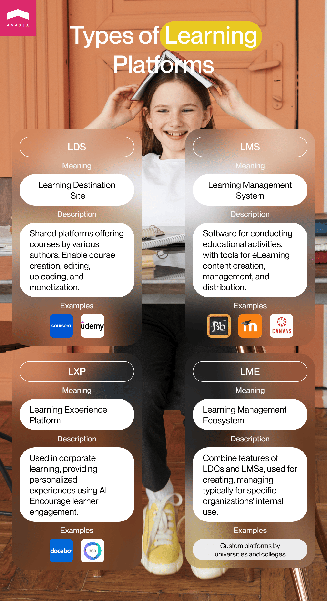

Books, blackboards, pens, and pencils…It is obvious that the majority of us will have such associations with schools and learning. Nevertheless, with time flow, everything is gradually changing. Of course, the state of education and the used methods greatly vary in different counties, nevertheless, the global digitalization trend is obvious. Modern students already do not need to spend long hours at libraries because they can get access to all the materials via online platforms. At the same time, books are not the only source of information and boring texts and rules are not the only formats to learn different things.

eLearning is here to revolutionize the industry. In this article, we'd like to focus on the benefits of such solutions, the best approaches to eLearning website development, and the key steps of this process. That's why this blog post will be interesting to everyone who is considering the possibility to create an online learning platform or application.

## Online learning: General overview

Today we can observe active growth in the online learning segment. Among one of the most serious boosters for the development of educational technologies (edtech) in general, we should mention the coronavirus pandemic. When the first COVID-19 wave came in the spring of 2020 and the majority of governments all over the world started introducing serious restrictive measures and lockdowns, it became obvious that our education system is not ready for fully remote learning processes. That's why schools and universities had a lot of work to do to adjust their working principles to a new reality.

Nevertheless, this situation has also clearly highlighted the necessity of reliable apps and platforms that could become a bridge between teachers and students and could make it possible to continue the learning process regardless of the physical location of all the participants. Given this fact, it is not surprising at all that the demand for <a href="https://anadea.info/solutions/e-learning-software-development" target="_blank">e-learning software development</a> services is stably high these days.

Meanwhile, there are some other factors such as total digitalization, tech literacy, and a high level of smartphone penetration, that clearly indicate that the introduction of online learning solutions is not just a modern trend but a necessity.

However, is it now a good time to build an elearning website or is this niche already fully occupied? Though at the moment, there are quite a lot of startups and companies that are introducing their solutions to the audience, the industry is expanding so quickly that the chances for new products to win their market share are still rather high.

According to <a href="https://www.statista.com/outlook/dmo/eservices/online-education/worldwide" target="_blank" rel="nofollow">experts</a>, the revenue in the online education market will hit the mark of $166.6 billion in 2023. Just compare. For example, in 2017, this figure was at the level of $65.61 billion. And looking at the predictions, we can say that the positive tendencies are here to stay. It is projected that the market volume will be around $238 billion by 2027 which shows that the CAGR within the period from 2023 to 2027 will be over 9%.

But why do more and more companies turn to e learning website development today? What are the reasons for the popularity of such software solutions? To answer these questions and to estimate the feasibility of your plans to build e learning website, we need to have a look at the advantages of online learning products and the new opportunities that they bring to users.

### Benefits of online learning platforms

1. **Flexibility and more freedom**. Even when due to some reasons a student needs to skip an online lesson, as a rule, all the materials will be available on the platform. As a result, a person will always have the possibility to study all the topics. Moreover, very often there is an option to choose the pace that will be convenient for each person. Such an approach helps to reduce stress and to increase the efficiency of learning.

2. **Higher motivation through gamification**. Motivation is probably one of the most important factors that have an impact on the quality of the gained knowledge. Motivated students learn faster and demonstrate better results. Despite the age of students, gamification elements (such as different rewards and rankings) may have a very positive impact. And when you are thinking about how to create an online learning platform, you can always add such features to your product.

3. **Improved collaboration and cooperation**. Though there is an opinion that due to online learning children can forget how to interact with others, it is far from being true. Online education processes can include various formats of tasks (like group projects) that will presuppose close communication between students. And these skills of virtual communication gained at school or university will allow young people to feel more comfortable when they start working as in the modern business world such skills are a must.

4. **Reduced costs**. When it comes to financial questions, online learning is a win-win game for both schools and students. Of course, e learning platform design and further maintenance will require investments. Moreover, not all courses are free of charge. Nevertheless, remote online education allows students and professors to avoid expenses on travel and sometimes accommodation. There is also no need to rent physical space and buy different materials like textbooks.

5. **Automation of working processes**. Thanks to the introduction of online learning platforms, educational institutions can greatly improve, streamline, and facilitate their inner tasks and processes. With such software solutions, they can better track a lot of things like student attendance, teachers' workload (if there are online lessons), the performance of students, their needs, etc. If you want to build eLearning website that will help you to better adjust your programs and courses to the needs of users, you can also introduce various AI-powered tools that will ensure high-quality analytics and data visualization that you can use for making decisions.

### The most popular online learning delivery models

When you want to create online learning platform, you need to decide on the method that you will use to share educational materials and proving new knowledge to students. We offer you to focus on the most widely applied ones and to analyze their strong and weak sides.

#### Video-based learning

As you can guess from the name of this method, such solutions offer users the possibility to get new information from videos. This is a good option for those who want to enjoy the great flexibility of the learning process. When a person has access to a series of videos, he or she can watch them at any time and from absolutely any corner of the world. The format of learning from videos can offer a combination of animation, graphics, and speaking. However, as a rule, it doesn't include real-time interaction between students and teachers.

According to various studies, our brain can process videos and images 60K times faster than texts. It means that we can learn more in a shorter period of time when the required materials are presented in the format of videos.

One of the brightest examples of a platform that works following this method is Udemy. The offered courses are available in the form of slides and pre-recorded videos that are accompanied by text assignments. Udemy was founded in 2010 and today it has over 50 million users.

Benefits of video-based learning:

- Flexibility for learners and teachers;
- High efficiency and speed of learning;
- Reduced operating costs.

Disadvantages of video-based learning:

- The feeling of isolation;
- Difficulties with focusing on the provided materials;
- No real-time answers to the questions.

#### One-on-one learning

Though many formats of online learning presuppose asynchronous communication, it is not the only option available. If you want to allow users to enjoy all the benefits of real-time communication between students and tutors, you can choose a one-on-one learning model. This approach includes providing students with the possibility to learn from teachers individually. In such a situation, the learning process is fully tailored to the personal needs of every student, his or her skills, needs, and comfortable pace of learning.

Very often this model is used for creating platforms for learning foreign languages with individual tutors. One of them is Verbling which was introduced to the audience in 2011. Today, it is possible to use it for learning more than 70 different languages from 10,000+ certified teachers.

**Benefits of one-on-one learning:**

- A highly individual approach;
- The possibility to find a teacher that will perfectly meet student's expectations;
- Real-time interaction between tutors and their students.

**Disadvantages of one-on-one learning:**

- A lack of spirit of competition (which may lead to a lack of motivation);
- Possible difficulties in creating a comfortable schedule with a tutor;
- A monotonous format of lessons (if a teacher doesn't apply enough creativity).

#### Group learning

This model is very similar to traditional learning in classrooms with the only serious difference. The learning process is organized online. As a rule, lessons are held at a set time and a teacher leads them. This format became very popular at different schools and colleges during the coronavirus pandemic when educational establishments were closed but it was necessary to continue the learning process.

Without any doubt, group learning has a lot of benefits, especially for children and teenagers who need to learn how to interact with other people, how to organize teamwork, how to delegate tasks, take responsibility for others, etc. In other words, this model is focused on building and supporting collaboration and developing interactions among all students within a group. Teachers can organize lessons of different formats including those that presuppose sharing ideas or working in pairs and small groups.

Very often for such group lessons, people use popular platforms like Zoom or GoogleMeet that are not industry-specific. But also there are special online learning platforms for group classes. One of them is TakeLessons which provides teachers with a wide range of possibilities for holding lessons.

**Benefits of group learning:**

- Development of collaborative skills;
- Real-time interaction with teachers and groupmates;
- Spirit of competition.

**Disadvantages of group learning:**

- A smaller focus on individual needs in comparison with individual lessons;
- Low flexibility.

Among other methods of delivering content we can also mention:

- Audio-based learning;
- Textual format;
- Downloadable materials;
- Interactive games and quizzes (<a href="https://anadea.info/projects/stav-online" target="_blank">Stav Online</a> developed by our team can be taken as a good example of this type);
- Blended learning (it combines different approaches and is based on the mixture of traditional in-person learning and eLearning).

## Types of online learning platforms

Given the popularity of e-learning platform development and the demand for such solutions from the side of different educational institutions, companies interested in high-quality corporate learning, and a wide audience of potential users, it is not surprising at all that the variety of these solutions is continuously expanding. Below you can find a list of the most highly demanded types of this kind of software product.

### Learning destination sites (LDS)

Such shared platforms offer access to courses prepared by different teachers and companies. As a rule, such websites provide authors of courses with access to a learning management system or authoring tools for creating, editing, and uploading their materials. Courses can be provided on a paid basis (which will allow authors to monetize their effort) or for free. There are niche websites for different industries as well as common platforms like Coursera or Udemy.

### Learning management system (LMS)

This software is used by companies and organizations for conducting training and educational activities. LMS platforms should provide the relevant functionality and tools for creating eLearning content, editing, updating, managing, and efficiently distributing it. Moodle, Blackboard Learn, and Canvas LMS are among popular examples of LMS.

### Learning experience platform (LXP)

Platforms of this type are usually used in corporate learning and provide highly personalized experiences to users. LXP software uses AI capacities to offer a learner-driven and agile approach to remote learning. Via this platform, users get access to the most relevant info from huge libraries with automatically updated content. Thanks to these solutions, it is possible to achieve a high level of user engagement as learners can actively participate in building their educational process. If you want to better understand what such solutions can offer you, you can get familiarized with the functionality of Docedo and 360Learning. On our website, you can also read more about <a href="https://anadea.info/solutions/e-learning-software-development/lxp" target="_blank">learning experience platform development</a>.

### Learning management ecosystems (LME)

These solutions combine the most important features of learning destination sites and learning management systems. It means that they can be used for creating and managing courses, as well as for getting access to them. What makes platforms of this type special is that they are typically launched for internal use of some particular organizations only. In other words, only employees, students, or members can get access to this software. For example, such LMEs can be launched by colleges or universities.

Create an eLearning platform

## Process of e-learning development: How to start?

Does the process of eLearning website development seriously differ from the creation of any other type of software? In general, this process usually remains practically the same. But there can be some small peculiarities that are worth being mentioned.

- **Find your unique idea**. When you have the plan to create a software product, you need to make sure that it will be positively welcomed by your target audience. First of all, you should clearly understand who will be potential users. Secondly, what tasks will they solve with your platform? Thirdly, what will make your platform unique? It is recommended to analyze the solutions that are already available in the market.

- **Choose a business model.** How are you going to make money on your platform? Will you cooperate with advertisers or offer a subscription-based model? Or maybe you will just offer some paid courses? In general, the choice of a business model will greatly depend on the exact type of your solution and your target audience. For example, if you want to build a solution for corporate learning that you will offer to your employees, it won't be very sensible to make any courses paid for them.

- **Establish cooperation with a development team**. When you have your own software development department this step won't be relevant in your case. For looking for an IT partner, you can use Google or any professional repository like Clutch or GoodFirms. Please, always pay attention to the reviews written by the clients of a firm under consideration.

- **Define the set of features and technologies to be used.** The exact set of features that your platform will have will be based on the type of your solution, the needs of your target audience, and the exact tasks that it should address. Of course, such features as admin, student, or teacher profiles are basic ones. But in accordance with your idea, you may need to create such functionality as automatically checked tasks and exercises, video library, AI recommendations, mini-games, rankings, online chats, etc. It will be a good idea to start with the development of an MVP to have the possibility to estimate the feasibility of your project without serious financial losses.

- **Proceed to e learning platform design, coding, and testing.** This step is mainly the responsibility of a development team. Nevertheless, as a rule, at this stage clients are allowed to control the process, and introduce the required changes in order to make sure that the final product will meet their expectations.

- **Test the viability of your idea**. When the first version of your product is ready, you can make it available to users (as a rule, at this step, it will be a limited group of users) who will start testing various features. It is necessary to gather and analyze their feedback for getting a good understanding of whether you've chosen the right idea.

- **Update and continuously improve your product**. Even if you see that users have positively welcomed your platform, it doesn't mean that you can fully relax. If you want your solution to be successful, you need to regularly update it and introduce improvements if you see that a lot of users need them.

## Cost of e-learning platform development

So, <a href="https://anadea.info/guides/educational-app-development-cost" target="_blank">how much does it cost to make an educational app</a> or an online learning platform? That's probably one of the most popular questions that we hear from our clients who are interested in building any kind of edtech software product.

As you probably know, when it comes to custom software development, there are no "one-size-fits-all" solutions and approaches. As a result, the costs, as well as the required technologies, tools, and resources, may seriously differ. When you are considering the eLearning platform development and want to plan your budget properly, we recommend you find a reliable company that will build this solution for you and ask to make estimates. Only after a careful and deep analysis of all your requirements and ideas, it will be possible to provide you with approximate figures.

In general, when you are going to create online learning platform, you need to take into account the following parameters that will be taken into account for choosing technologies and tools (and consequently, will affect the price of your project). They are:

- **The type of your solution**. Will it be a web platform or a mobile app? Or do you want to launch a website with a user-friendly mobile version?

- **The type of content**. Will you offer traditional educational materials, like texts, videos, images, and audio? Or do you want to combine them or offer something interactive? Who will have the possibility to add the content? Will users be allowed to edit the provided content or to share their own materials?

- **The learning process itself**. How do you want to organize the education processes? Will you hold online sessions or upload video lessons? Or maybe you plan to offer students access to some plain downloadable files that they can study in an offline regime? Do you want to launch any interactive assignments and provide automatic assignment assessments? How will the interaction between teachers and students be organized (online chats, voice calls, video calls, etc.)?

- **Additional functionality**. Do you want to add gamification elements? Will students be allowed to communicate with each other? Will any third-party services be integrated? Will you offer a subscription-based model?

Even if our list of questions seems to be rather impressive, you need to understand that it contains only the most basic questions related to e learning platform design and development. In reality, when you are beginning to build an eLearning website, you will need to answer even more questions that will allow your software development team to estimate the required resources and expenses.

Based on our experience, we can say that the development of an MVP of an online learning solution may take around 4-5 months and it will cost you up to $35,000. If you have a smaller project the realization of which will take around 2 months, its cost will be lower, around $20,000. But these figures are very approximate and they may change depending on your business needs and the peculiarities of your idea.

## Closing word

With the ongoing digitalization of all the spheres of our life, it is obvious that this trend will continue to greatly affect the education industry as well. As a result, the demand for online learning platforms and various types of eLearning apps will only increase in the nearest future.

If you have an eLearning website development project, we will be happy if you entrust us with it. Our developers have solid skills in working with the latest development tools and technologies and are able to cope even with the most challenging tasks. We know how to build an online learning platform and optimize the required resources and time. And thanks to our experience, we understand what users expect to get from such solutions. If you want to receive more detailed information about our services and approaches to work, do not hesitate to contact us and ask all your questions.

Discuss your project
