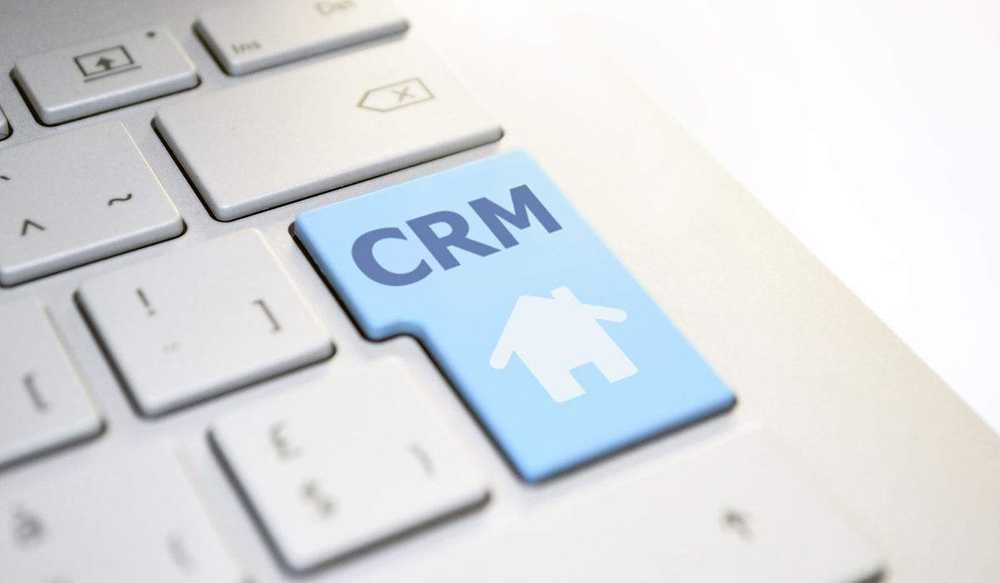

## What is CRM in real estate?

At the core of every business is the relationship a company has with its customers. As part of those relationships, it is invaluable if every who interacts with customers is on the same page and has access to the same information. A customer relationship management (CRM) system is an invaluable tool for managing those relationships.

The importance of CRM in real estate business is undeniable. Most customers are making the most significant purchase they will ever make. Big ticket purchases mean that those acting for the customer need to have a clear view of the details.

Every real estate customer has different needs, goals and dreams. It is the role of a real estate agent to build <a href="https://www.forbes.com/sites/forbesrealestatecouncil/2018/06/25/12-client-relationship-tips-that-will-help-your-real-estate-business-flourish/#2a859aaf385a" target="_blank">productive relationships with the customers</a> in order to find and secure a property that meets those goals and dreams, within the budget of individual customers. So when it comes to picking a CRM for real estate agents, should a firm go with an off-the-shelf or custom-built solution?

## Off-the-shelf vs. custom CRM: what this means for estate agents?

There are dozens of off-the-shelf CRM solutions on the market.

<a href="https://www.gartner.com/en/newsroom/press-releases/2018-04-10-gartner-says-crm-became-the-largest-software-market-in-2017-and-will-be-the-fastest-growing-software-market-in-2018" target="_blank">Gartner estimates</a> that the market is currently worth $39.5 billion, and it "will continue to take the lead of all software markets and be the fastest growing software market with a growth rate of 16%."

One of the most well-known is Salesforce. It is the market leader. It generates so much revenue that the company is currently building the tallest office complex in San Francisco. One of the reasons Salesforce generates so much revenue is that, although you can buy a license and start using it, most companies need to customize the software around their specific needs.

Customization is often essential for companies with processes and systems that have worked for them over a number of years. So when buying an off-the-shelf CRM, more often than not, it needs configuring around those processes and systems. Staff also need training. And then there are often legacy systems that need to be plugged in and tailored around internal workflows and processes.

SAP and Oracle are a couple of the other Enterprise-level market leaders in this sector. Companies face similar challenges when buying from them: a good deal soon looks expensive when customization and training are added into the mix.

Below the most expensive top-tier players are a whole host of Software as a Service (SaaS) CRM solitons. Some are free, with basic functionality. Others are inexpensive, with customization options that soon add up. With many of the newer ones, companies can have security concerns. New data protection regulations around the world put the blame squarely on the shoulders of the company that is responsible for client data, even if a third-party is holding onto it.

Instead of worrying about extra costs, the complexity of integration with other systems, training and security concerns, savvy forward-thinking agencies are investing in [custom-built real estate CRM solutions](https://anadea.info/solutions/real-estate-software).

## Why custom CRM for real estate is the way forward?

### 1. Tailored around your needs

As many companies find, off-the-shelf is only a reality if your company needs are exactly as per the vendors specifications. CRMs were not built for estate agents. Real estate is only one sector of many that CRMs can be configured for, which means that it's very likely that your CRM will need customization.

Invest in real estate CRM software wisely and make sure to consult with top real estate software developers to avoid common pitfalls. Start with your agencies internal processes and customer journey, then model a CRM around that. Have a CRM tailored around those needs, with the option to evolve and develop it further as your business grows.

### 2. Easier integrations

Along with customizations, integrations with other systems and software are one of the more expensive aspects of buying an off-the-shelf CRM. Again, save time and money at the start of this process. Ensure the CRM you get is already tailored to include those integrations from the start.

### 3. More cost effective

CRMs that are bought off-the-shelf often come with staff training packages (usually a half-day, minimum), which are expensive. Your staff are going to need less training if a CRM is already intuitively built around how they work, internal processes and systems they're already used to using. In the long run, a custom-built solution is more cost effective in every way, and a smart investment.

### 4. Less confusing for staff, more support

With a custom-built solution, you can make sure it's tailored around the needs of your real estate team and other departments.

Everyone who needs access should have input on the features. You can also ensure that your team has the support they need from the vendor. Instead of paying extra for 24/7 support, work with your project manager to make any changes that are needed down the road and access any extra help your team might need.

Related read: [How to Create a Custom Real Estate Website](https://anadea.info/blog/how-to-create-a-real-estate-web-platform)

## Real estate CRM: buy or build?

Off-the-shelf might seem a cheaper option. But in reality, CRMs are expensive and time consuming. A smarter investment is to custom-build from the start, creating the features and functionality that you know your team is going to need. Reduce long-term costs and enjoy a system that more closely resembles the way your team works and interacts with customers. Your customers will thank you for an improved and more efficient service, making it easier for them to pick your agency for their next real estate purchase.
