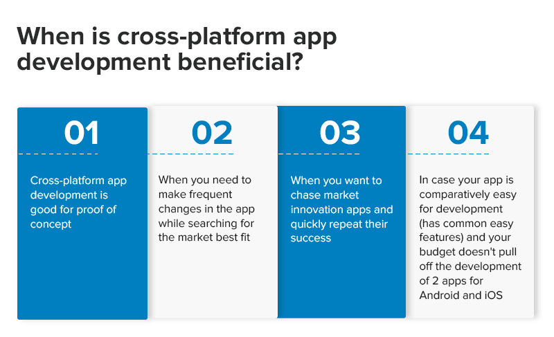
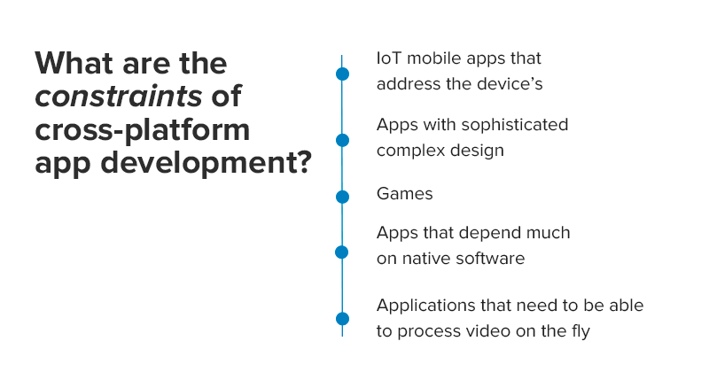
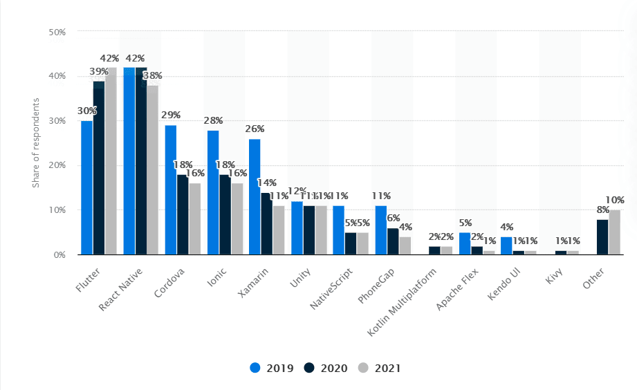

Often in our practice, we, as a cross-platform development company, face the following questions: Will cross-platform do for my business? What benefits will I get if I choose cross-platform app development? How much does it cost to develop a cross-platform app? On these, and other questions, you’ll find a solid answer as far as you read this article.

## When is cross platform mobile app development beneficial?
Often, cross-platform apps are chosen by startups and small businesses for low cost mobile app development. Also, there are other cases, when you should pay your attention to this option, when solving the dilemma - native app development or cross platform.

## What are the constraints of cross-platform app development?
Cross-platform app development may reduce development costs, provide shorter time-to-market, be easy to update and maintain, but it has got limitations in interface variety and has limited access to the whole range of operating systems and mobile hardware features. These things make cross-platform mobile app development unsuitable for such types of apps.

## Which programming language is the best for cross-platform?
According to Statista, software developers prefer using Flutter among other cross platform app development frameworks in the first place in 2021. This is easy to understand, as, from the engineers’ point of view, it possesses a range of useful things:

**Stability** - Because Flutter possesses its own rendering engine, the apps developed on it are not affected by any OS update. Their interface will still look the same way. One more aspect of Flutter’s stability is version compatibility.

**Architecture**
Business Logic Components architecture makes separation of the app’s user interface from the business logic easier, which makes UI independent from data.

**Easy UI**
Flutter’s kit includes a wide range of elements enough to build an app without any third-party libraries integration. Any UI element can be easily changed at any time.

From the customer’s perspective, it’s valued as a development technology that allows building mobile apps that work on different OSs. It comes out cheaper and gives the possibility to reach users of the most popular platforms - iOS and Android. Maintenance cost is also lower, compared to the situation of maintaining 2 native apps. Common codebase also results in quicker and cheaper testing. Still, it’s necessary to understand that cross-platform development in general, and Flutter, in particular, are not a silver bullet. Let’s consider cases when Flutter is ideal for your business or startup idea, and when it’s better to refrain from choosing this technology.

## Which is best: native or cross-platform development?

### When Flutter fits
Cross-platform development fits best for, for example, online stores, websites for tickets sale, news feeds such as Facebook or Instagram, sale of educational content by subscription, small things such as a to-do/shopping list. In general, the breadth of use burns down to these cases:

* When you want to target mobile users of both iOS and Android.
* **The project budget is small (as a bonus, below you’ll find the estimates for 2 real apps that our developers have built lately).**
* The functionality and interface of the application are not complicated and, in principle, it can be implemented as a web application with an adaptive layout for mobile phones, but you want, for example, to use push notifications.
* Application size and super high performance are not important.
The application does not use or is used to a minimum of the device’s features, such as Bluetooth, camera, sensors (temperature, pressure, gyroscope, etc.).

### When Flutter doesn't fit

In the cases, described below, Flutter is not suitable and it’s better to prefer native mobile app development (or will not be cheaper, or will lose the benefits of the native app):

* If it’s necessary to get the most out of your app’s performance for such applications as games, AR / VR apps.
* If you need an app of minimal size.
* In case your app is planned to address the mobile’s functions (already mentioned above).
* Applications with a complex interface and non-standard UI components.
Security-critical applications where data encryption or biometrics is used.

Here are some apps examples that don't go with Flutter: games, AR/VR applications, IoT applications (connect to TVs, watches, etc.), Internet banking, <a href="https://anadea.info/solutions/medical-app-development/telemedicine-development" target="_blank">telemedicine</a>, entertainment applications with a non-standard interface and a lot of animations, multimedia applications with video/image editing such as Snapchat.

## Cross-platform app development cost. How much does it cost to develop a cross-platform app?

And now here comes the promised bonus.

### Application for sport events

Users are able to gather their commands, to take part in different events and competitions. The mobile version of the platform is estimated to be written on Flutter and includes some features, particularly:

* login process;
* possibility to join command using specific code;
* home screen with standings, navigation bar and short info about the next match;
* screen with ladders and fixtures;
* screen with team management and a possibility to add new teammate;
* capability to change team;
* profile with all the necessary info (name, last name, phone number, email, etc.) with the capability to adjust it;
* lineup screen for defining command composition on the upcoming match;
project building and deployment in app stores.

All these features of the **Flutter part could be completed within 2,5-3 weeks. The budget is $4480 - $5440** (mind that only the Flutter development part is calculated, no backend, QA, the design included).

### Content aggregator app

The app aggregates all the info from different social media, RSS, etc. and creates a customizable feed for the end-user. The MVP version contains:

* Tutorial screen (swipeable instructions on the first launch of the app).
* Four navigable bottom tabs (three for different feed categories, one for useful links).
* Settings page (data sources for the feeds can be configured from here).
* A feed can contain posts with text, images, videos from different sources.
* Instagram-like video playing for feed video entries (autoplay, muted by default, after the first tap unmuted until restart of the app - the behavior can be configured on the settings screen).
* Filtering the feed by a specific data source.
* Sorting feed by different keys.
* Pull-down-to-refresh and “endless” feed loading.
* Post details page.
* Sharing the posts, sharing social media accounts of the authors of the posts.

The features can be implemented within ~ **4 weeks timespan with a budget $5800 - $6500** (mind that only the Flutter development part is calculated, no backend, QA, the design included).

## Final thoughts
As you can see, cross-platform apps are not a silver bullet for every business case, but they can be a perfect choice for small businesses and startups in terms of proof of concept, fast time-to-market, and lower development costs. Great apps like mobile stores, listings, to-do lists, schedulers, bookings, etc. can be created. So, if you have any questions or decide to develop a cross-platform app, feel free to contact us. We are <a href="https://www.topdevelopers.co/directory/mobile-app-development-companies" target="_blank">top mobile app development company</a> as recognized by TopDevelopers.co and we’d be happy to help you with your project.

Get in touch
